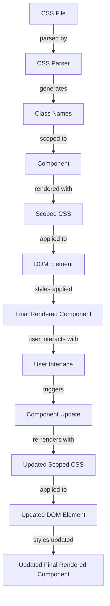

## Introduction
CSS Modules are a popular styling solution for React applications. They provide a way to write CSS that is scoped to a specific component, making it easier to manage and maintain large-scale applications. In this section, we will explore what CSS Modules are, why they matter, and their real-world relevance. 
> **Note:** CSS Modules are not a replacement for traditional CSS, but rather a way to enhance it with modular, component-based styling.

CSS Modules solve a common problem in React development: global namespace pollution. When using traditional CSS, styles are applied globally, which can lead to naming conflicts and unintended styling. CSS Modules address this issue by providing a way to write CSS that is isolated to a specific component. 
> **Warning:** Without CSS Modules, it's easy to end up with a tangled mess of global styles that are hard to maintain and debug.

In real-world applications, CSS Modules are used by companies like Facebook, Instagram, and Twitter to manage their complex, component-based user interfaces. They provide a way to scale styling efforts without sacrificing maintainability or performance.

## Core Concepts
To understand CSS Modules, it's essential to grasp some core concepts:

* **Modules**: A module is a self-contained piece of code that exports specific functionality or data. In the context of CSS Modules, a module is a CSS file that is scoped to a specific component.
* **Scoped CSS**: Scoped CSS refers to CSS that is applied only to a specific component or module, rather than globally.
* **Class names**: In CSS Modules, class names are generated automatically, making it easy to write CSS without worrying about naming conflicts.

Mental models for CSS Modules include thinking of each component as a self-contained unit with its own styling, rather than a collection of global styles. Key terminology includes "module," "scoped CSS," and "class names."

## How It Works Internally
CSS Modules work by using a combination of Webpack, CSS loaders, and a CSS parser. Here's a step-by-step breakdown of how it works internally:

1. **Webpack configuration**: Webpack is configured to use a CSS loader, such as `css-loader`, to process CSS files.
2. **CSS parsing**: The CSS parser reads the CSS file and generates a list of class names and their corresponding styles.
3. **Class name generation**: The CSS loader generates unique class names for each CSS module, ensuring that they do not conflict with other modules.
4. **Scoped CSS**: The CSS loader applies the scoped CSS to the component, using the generated class names.

> **Tip:** To optimize CSS Module performance, it's essential to use a CSS loader that supports tree shaking, which removes unused CSS from the final bundle.

## Code Examples
Here are three complete, runnable examples of CSS Modules in React:

### Example 1: Basic Usage
```javascript
// Greeter.css
.greeter {
  font-size: 24px;
  color: blue;
}
```

```javascript
// Greeter.js
import React from 'react';
import styles from './Greeter.css';

const Greeter = () => {
  return <h1 className={styles.greeter}>Hello, World!</h1>;
};

export default Greeter;
```

### Example 2: Real-world Pattern
```javascript
// Button.css
.button {
  background-color: #4CAF50;
  color: white;
  padding: 10px 20px;
  border: none;
  border-radius: 5px;
  cursor: pointer;
}

.button:hover {
  background-color: #3e8e41;
}
```

```javascript
// Button.js
import React from 'react';
import styles from './Button.css';

const Button = ({ children, onClick }) => {
  return (
    <button className={styles.button} onClick={onClick}>
      {children}
    </button>
  );
};

export default Button;
```

### Example 3: Advanced Usage
```javascript
// Card.css
.card {
  background-color: #f9f9f9;
  padding: 20px;
  border: 1px solid #ddd;
  border-radius: 10px;
  box-shadow: 0 0 10px rgba(0, 0, 0, 0.1);
}

.card:hover {
  box-shadow: 0 0 20px rgba(0, 0, 0, 0.2);
}
```

```javascript
// Card.js
import React from 'react';
import styles from './Card.css';

const Card = ({ children }) => {
  return <div className={styles.card}>{children}</div>;
};

export default Card;
```

## Visual Diagram

The diagram illustrates the process of how CSS Modules work, from parsing the CSS file to applying the scoped CSS to the component.

## Comparison
Here's a comparison table of different styling solutions for React:

| Approach | Time Complexity | Space Complexity | Pros | Cons | Best For |
| --- | --- | --- | --- | --- | --- |
| CSS Modules | O(1) | O(n) | Scoped CSS, easy to manage | Can be slower than global CSS | Large-scale applications, complex component-based UIs |
| Global CSS | O(1) | O(1) | Fast, easy to implement | Global namespace pollution, hard to manage | Small-scale applications, simple UIs |
| Inline Styles | O(1) | O(1) | Fast, easy to implement | Limited styling capabilities, hard to manage | Small-scale applications, simple UIs |
| Styled Components | O(1) | O(n) | Declarative styling, easy to manage | Can be slower than global CSS | Large-scale applications, complex component-based UIs |

> **Interview:** When asked about styling solutions for React, be sure to mention CSS Modules and their benefits, such as scoped CSS and easy management.

## Real-world Use Cases
Here are three real-world use cases for CSS Modules:

1. **Facebook**: Facebook uses CSS Modules to manage its complex, component-based user interface. With thousands of components, CSS Modules help Facebook developers keep their styles organized and maintainable.
2. **Instagram**: Instagram uses CSS Modules to style its web application. With a large team of developers, CSS Modules help ensure that styles are consistent and easy to manage.
3. **Twitter**: Twitter uses CSS Modules to style its web application. With a complex, component-based UI, CSS Modules help Twitter developers keep their styles organized and maintainable.

## Common Pitfalls
Here are four common pitfalls to watch out for when using CSS Modules:

1. **Namespace pollution**: Without CSS Modules, global namespace pollution can occur, leading to naming conflicts and unintended styling.
2. **Slow performance**: CSS Modules can be slower than global CSS due to the additional processing required to generate scoped CSS.
3. **Difficulty with debugging**: CSS Modules can make it harder to debug styling issues due to the generated class names and scoped CSS.
4. **Inconsistent styling**: Without a consistent naming convention, CSS Modules can lead to inconsistent styling across components.

> **Warning:** To avoid namespace pollution, always use CSS Modules or a similar styling solution to keep your styles scoped and organized.

## Interview Tips
Here are three common interview questions related to CSS Modules:

1. **What are CSS Modules, and how do they work?**: Be sure to explain the benefits of CSS Modules, such as scoped CSS and easy management.
2. **How do you handle styling in a large-scale React application?**: Mention CSS Modules and their benefits, as well as other styling solutions, such as global CSS and inline styles.
3. **What are some common pitfalls to watch out for when using CSS Modules?**: Be sure to mention namespace pollution, slow performance, difficulty with debugging, and inconsistent styling.

> **Tip:** When answering interview questions, be sure to provide specific examples and explain the trade-offs of different styling solutions.

## Key Takeaways
Here are ten key takeaways to remember about CSS Modules:

* **CSS Modules provide scoped CSS**: CSS Modules generate unique class names for each component, ensuring that styles are applied only to that component.
* **CSS Modules are easy to manage**: With CSS Modules, developers can keep their styles organized and maintainable, even in large-scale applications.
* **CSS Modules can be slower than global CSS**: Due to the additional processing required to generate scoped CSS, CSS Modules can be slower than global CSS.
* **CSS Modules make it harder to debug styling issues**: The generated class names and scoped CSS can make it harder to debug styling issues.
* **CSS Modules are suitable for large-scale applications**: With their ability to provide scoped CSS and easy management, CSS Modules are well-suited for large-scale applications.
* **CSS Modules are not a replacement for traditional CSS**: CSS Modules are a way to enhance traditional CSS with modular, component-based styling.
* **CSS Modules require a CSS loader**: To use CSS Modules, a CSS loader, such as `css-loader`, is required to process CSS files.
* **CSS Modules support tree shaking**: To optimize performance, CSS Modules support tree shaking, which removes unused CSS from the final bundle.
* **CSS Modules are widely adopted**: CSS Modules are widely adopted in the industry, with companies like Facebook, Instagram, and Twitter using them in their web applications.
* **CSS Modules have a small learning curve**: With their simple and intuitive syntax, CSS Modules have a small learning curve, making them easy to adopt and use.