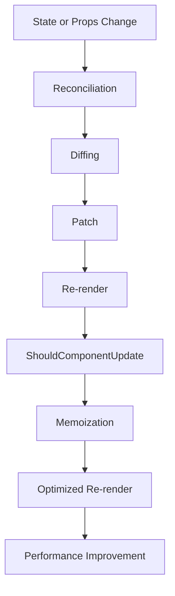

## Introduction
**Avoiding Unnecessary Re-renders** is a crucial concept in React development, as it directly impacts the performance and user experience of your application. In React, a re-render occurs when the state or props of a component change, causing the component to re-render and potentially leading to a chain reaction of re-renders throughout the component tree. While re-renders are a natural part of the React lifecycle, unnecessary re-renders can cause significant performance issues, such as slow rendering, high memory usage, and even crashes. In this article, we will delve into the world of avoiding unnecessary re-renders, exploring the core concepts, internal mechanics, and providing practical code examples to help you optimize your React applications.

## Core Concepts
To understand how to avoid unnecessary re-renders, it's essential to grasp the following core concepts:
* **Re-rendering**: The process of re-rendering a component when its state or props change.
* **State**: The internal state of a component, which can change over time.
* **Props**: Short for "properties," props are immutable values passed from a parent component to a child component.
* **Memoization**: A technique used to cache the results of expensive function calls and re-use them when the same inputs occur again.
* **ShouldComponentUpdate**: A lifecycle method in React that allows you to control whether a component should re-render or not.

> **Note:** Understanding the core concepts is crucial to optimizing React performance. Take the time to review and understand these concepts before proceeding.

## How It Works Internally
When a component's state or props change, React's reconciliation algorithm kicks in, determining which components need to be re-rendered. This process involves the following steps:
1. **State or Props Change**: A component's state or props change, triggering a re-render.
2. **Reconciliation**: React's reconciliation algorithm compares the old and new virtual DOM representations of the component tree.
3. **Diffing**: React calculates the differences between the old and new virtual DOM representations.
4. **Patch**: React applies the calculated differences to the actual DOM, updating the component tree.
5. **Re-render**: The updated component tree is re-rendered, and the process repeats if necessary.

> **Warning:** Unnecessary re-renders can lead to performance issues and slow rendering. Be mindful of the reconciliation algorithm and optimize your components accordingly.

## Code Examples
Here are three complete and runnable code examples demonstrating how to avoid unnecessary re-renders:
### Example 1: Basic Usage of `React.memo`
```javascript
import React, { useState } from 'react';

const Counter = React.memo(() => {
  const [count, setCount] = useState(0);

  return (
    <div>
      <p>Count: {count}</p>
      <button onClick={() => setCount(count + 1)}>Increment</button>
    </div>
  );
});

const App = () => {
  const [foo, setFoo] = useState('bar');

  return (
    <div>
      <Counter />
      <button onClick={() => setFoo('baz')}>Change Foo</button>
    </div>
  );
};
```
In this example, we use `React.memo` to memoize the `Counter` component, preventing unnecessary re-renders when the `App` component's state changes.

### Example 2: Using `shouldComponentUpdate` to Optimize Re-renders
```javascript
import React, { Component } from 'react';

class Counter extends Component {
  shouldComponentUpdate(nextProps, nextState) {
    return nextProps.count !== this.props.count;
  }

  render() {
    return (
      <div>
        <p>Count: {this.props.count}</p>
      </div>
    );
  }
}

class App extends Component {
  state = { count: 0 };

  render() {
    return (
      <div>
        <Counter count={this.state.count} />
        <button onClick={() => this.setState({ count: this.state.count + 1 })}>
          Increment
        </button>
      </div>
    );
  }
}
```
In this example, we override the `shouldComponentUpdate` method to control whether the `Counter` component should re-render based on the `count` prop.

### Example 3: Memoizing Expensive Function Calls with `useCallback`
```javascript
import React, { useState, useCallback } from 'react';

const expensiveFunction = () => {
  // Simulate an expensive function call
  for (let i = 0; i < 10000000; i++) {}
  return 'Result';
};

const App = () => {
  const [count, setCount] = useState(0);
  const memoizedFunction = useCallback(expensiveFunction, []);

  return (
    <div>
      <p>Count: {count}</p>
      <button onClick={() => setCount(count + 1)}>Increment</button>
      <p>{memoizedFunction()}</p>
    </div>
  );
};
```
In this example, we use `useCallback` to memoize the `expensiveFunction` call, preventing unnecessary re-renders when the `App` component's state changes.

## Visual Diagram

This diagram illustrates the process of avoiding unnecessary re-renders, from state or props changes to optimized re-renders.

> **Tip:** Use diagrams to visualize complex concepts and optimize your understanding of React performance.

## Comparison
| Approach | Time Complexity | Space Complexity | Pros | Cons | Best For |
| --- | --- | --- | --- | --- | --- |
| `React.memo` | O(1) | O(1) | Easy to use, effective for simple components | Limited control over re-renders | Small to medium-sized components |
| `shouldComponentUpdate` | O(1) | O(1) | Fine-grained control over re-renders | Can be complex to implement | Large, complex components |
| `useCallback` | O(1) | O(1) | Effective for memoizing function calls | Can be overused, leading to performance issues | Function calls with expensive computations |
| `useMemo` | O(1) | O(1) | Effective for memoizing values | Can be overused, leading to performance issues | Values with expensive computations |

## Real-world Use Cases
* **Facebook**: Uses React to build its complex, data-driven user interface, optimizing performance with `React.memo` and `shouldComponentUpdate`.
* **Instagram**: Employs React to power its web application, utilizing `useCallback` and `useMemo` to optimize function calls and values.
* **Dropbox**: Uses React to build its web application, leveraging `React.memo` and `shouldComponentUpdate` to optimize re-renders and improve performance.

> **Interview:** Be prepared to discuss real-world use cases and how you would optimize React performance in a production environment.

## Common Pitfalls
* **Overusing `React.memo`**: Can lead to performance issues if not used judiciously.
* **Incorrectly implementing `shouldComponentUpdate`**: Can cause unnecessary re-renders or prevent necessary re-renders.
* **Not using `useCallback` and `useMemo`**: Can lead to performance issues due to unnecessary function calls and value computations.
* **Not optimizing re-renders**: Can cause significant performance issues, slow rendering, and high memory usage.

> **Warning:** Be aware of common pitfalls and take steps to avoid them in your React applications.

## Interview Tips
* **What is the difference between `React.memo` and `shouldComponentUpdate`?**: Explain the differences between the two approaches and when to use each.
* **How do you optimize re-renders in a React application?**: Discuss the various techniques for optimizing re-renders, including `React.memo`, `shouldComponentUpdate`, `useCallback`, and `useMemo`.
* **What are some common pitfalls to avoid when optimizing React performance?**: Discuss common pitfalls, such as overusing `React.memo`, incorrectly implementing `shouldComponentUpdate`, and not using `useCallback` and `useMemo`.

## Key Takeaways
* **Understand the core concepts**: Grasp the fundamentals of React performance optimization, including re-renders, state, props, memoization, and `shouldComponentUpdate`.
* **Use `React.memo` judiciously**: Apply `React.memo` to simple components to prevent unnecessary re-renders.
* **Implement `shouldComponentUpdate` correctly**: Use `shouldComponentUpdate` to control re-renders in complex components.
* **Optimize function calls and values**: Utilize `useCallback` and `useMemo` to memoize expensive function calls and values.
* **Avoid common pitfalls**: Be aware of common pitfalls, such as overusing `React.memo`, incorrectly implementing `shouldComponentUpdate`, and not using `useCallback` and `useMemo`.
* **Test and measure performance**: Regularly test and measure the performance of your React applications to identify areas for optimization.
* **Stay up-to-date with best practices**: Continuously update your knowledge of React performance optimization best practices to ensure your applications remain performant and efficient.