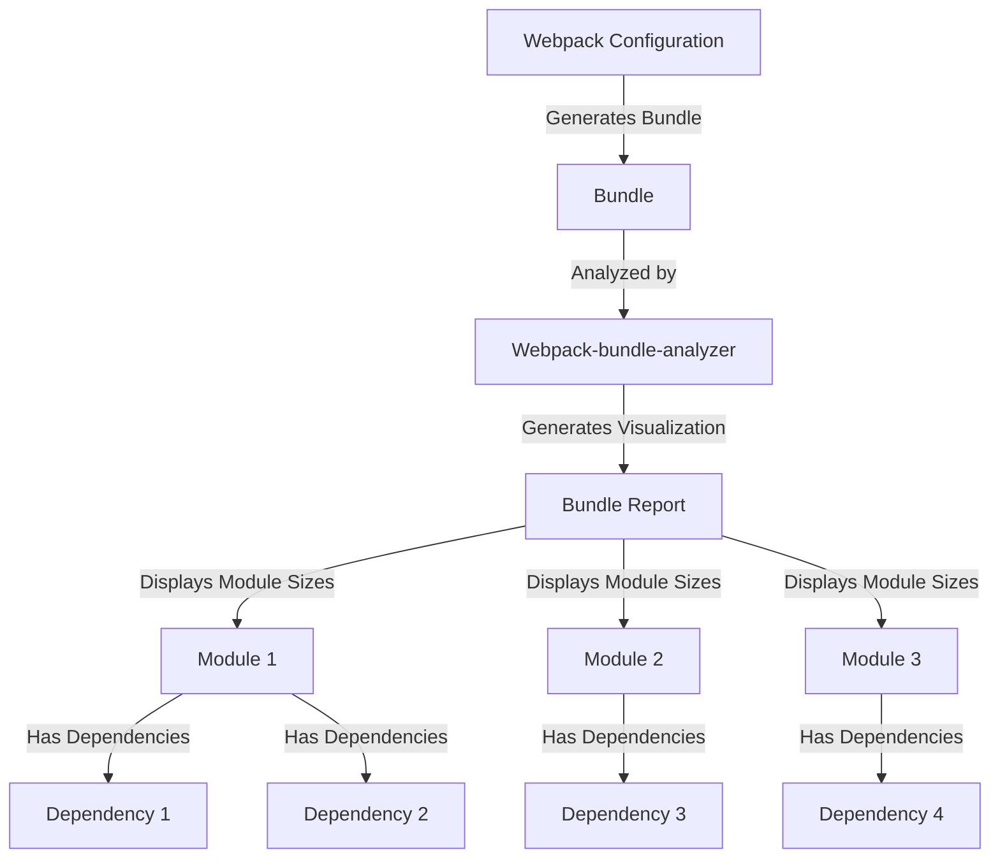

## Introduction
**Bundle analysis** is the process of examining and optimizing the size and structure of JavaScript bundles, which are crucial for web application performance. Webpack-bundle-analyzer is a popular tool for analyzing and visualizing bundle sizes, helping developers identify areas for optimization. In this section, we'll explore why bundle analysis matters, its real-world relevance, and why every React engineer needs to know about it.

In modern web development, JavaScript bundles can become large and complex, leading to slower page loads and decreased user engagement. By analyzing and optimizing bundle sizes, developers can improve application performance, reduce latency, and enhance overall user experience. Webpack-bundle-analyzer provides a detailed visualization of bundle contents, making it easier to identify large modules, duplicate code, and other optimization opportunities.

> **Note:** Bundle analysis is an essential step in ensuring web application performance, as it helps developers identify and address issues that can significantly impact user experience.

## Core Concepts
To understand bundle analysis, it's essential to grasp the following core concepts:

* **Bundle**: A collection of JavaScript files and their dependencies, bundled together for efficient loading.
* **Module**: A single JavaScript file or a group of files that are imported together.
* **Chunk**: A subset of modules that are loaded together, often used for code splitting.
* **Tree shaking**: The process of removing unused code from a bundle, reducing its size and improving performance.

> **Tip:** Understanding these concepts is crucial for effective bundle analysis and optimization.

## How It Works Internally
Webpack-bundle-analyzer works by analyzing the bundle's internal structure, including modules, chunks, and dependencies. Here's a step-by-step breakdown of the process:

1. **Bundle generation**: Webpack generates a bundle based on the application's code and configuration.
2. **Bundle analysis**: Webpack-bundle-analyzer analyzes the bundle, identifying modules, chunks, and dependencies.
3. **Visualization**: The analyzer generates a visualization of the bundle, displaying module sizes, dependencies, and other relevant information.

> **Warning:** Incorrectly configuring webpack-bundle-analyzer can lead to inaccurate or incomplete results, making it essential to follow best practices and documentation guidelines.

## Code Examples
Here are three complete and runnable code examples, demonstrating basic usage, real-world patterns, and advanced optimization techniques:

### Example 1: Basic Usage
```javascript
// webpack.config.js
const BundleAnalyzerPlugin = require('webpack-bundle-analyzer').BundleAnalyzerPlugin;

module.exports = {
  // ... other configurations ...
  plugins: [
    new BundleAnalyzerPlugin(),
  ],
};
```
This example demonstrates basic usage of webpack-bundle-analyzer, adding the plugin to the Webpack configuration.

### Example 2: Real-world Pattern
```javascript
// webpack.config.js
const BundleAnalyzerPlugin = require('webpack-bundle-analyzer').BundleAnalyzerPlugin;
const webpack = require('webpack');

module.exports = {
  // ... other configurations ...
  optimization: {
    splitChunks: {
      chunks: 'all',
      minSize: 10000,
      minChunks: 1,
      maxAsyncRequests: 30,
      maxInitialRequests: 30,
      enforceSizeThreshold: 50000,
    },
  },
  plugins: [
    new BundleAnalyzerPlugin({
      analyzerMode: 'static',
      reportFilename: 'bundle-report.html',
    }),
  ],
};
```
This example demonstrates a real-world pattern, using code splitting and optimization to reduce bundle sizes.

### Example 3: Advanced Optimization
```javascript
// webpack.config.js
const BundleAnalyzerPlugin = require('webpack-bundle-analyzer').BundleAnalyzerPlugin;
const webpack = require('webpack');

module.exports = {
  // ... other configurations ...
  optimization: {
    splitChunks: {
      chunks: 'all',
      minSize: 10000,
      minChunks: 1,
      maxAsyncRequests: 30,
      maxInitialRequests: 30,
      enforceSizeThreshold: 50000,
    },
    minimize: true,
    minimizer: [
      new webpack.optimize.UglifyJsPlugin({
        sourceMap: true,
      }),
    ],
  },
  plugins: [
    new BundleAnalyzerPlugin({
      analyzerMode: 'static',
      reportFilename: 'bundle-report.html',
    }),
  ],
};
```
This example demonstrates advanced optimization techniques, including code splitting, minimization, and tree shaking.

## Visual Diagram

This diagram illustrates the process of bundle analysis and visualization, showing how Webpack generates a bundle, which is then analyzed by webpack-bundle-analyzer, producing a detailed report of module sizes and dependencies.

> **Interview:** When asked about bundle analysis, be prepared to explain the process, including bundle generation, analysis, and visualization. Highlight the importance of optimization techniques, such as code splitting and minimization.

## Comparison
| Approach | Time Complexity | Space Complexity | Pros | Cons | Best For |
| --- | --- | --- | --- | --- | --- |
| Webpack-bundle-analyzer | O(n) | O(n) | Detailed visualization, easy to use | Limited customization options | Small to medium-sized applications |
| Bundlephobia | O(n) | O(n) | Simple, easy to use, supports multiple formats | Limited features, no visualization | Small applications, quick checks |
| Source Map Explorer | O(n) | O(n) | Detailed visualization, supports multiple formats | Steeper learning curve, requires configuration | Large, complex applications |
| Bundlestats | O(n) | O(n) | Simple, easy to use, supports multiple formats | Limited features, no visualization | Small applications, quick checks |

## Real-world Use Cases
Here are three real-world examples of companies using bundle analysis and optimization:

1. **Facebook**: Facebook uses a combination of Webpack and Rollup to optimize their JavaScript bundles, reducing page load times and improving user experience.
2. **Airbnb**: Airbnb uses Webpack-bundle-analyzer to analyze and optimize their bundles, identifying areas for improvement and reducing bundle sizes.
3. **Pinterest**: Pinterest uses a custom bundle optimization tool, which includes features such as code splitting and tree shaking, to reduce bundle sizes and improve page load times.

> **Tip:** When implementing bundle analysis and optimization, consider using a combination of tools and techniques to achieve the best results.

## Common Pitfalls
Here are four common mistakes to avoid when using bundle analysis and optimization:

1. **Incorrect configuration**: Failing to configure Webpack-bundle-analyzer correctly can lead to inaccurate or incomplete results.
2. **Insufficient optimization**: Not using optimization techniques such as code splitting and minimization can result in large, bloated bundles.
3. **Over-optimization**: Over-optimizing bundles can lead to decreased performance, as excessive minimization and compression can increase parsing and execution times.
4. **Ignoring dependencies**: Failing to consider dependencies when optimizing bundles can result in broken or incomplete code.

> **Warning:** Be cautious when using optimization techniques, as over-optimization can have negative consequences.

## Interview Tips
Here are three common interview questions related to bundle analysis and optimization, along with weak and strong answer examples:

1. **What is bundle analysis, and why is it important?**
	* Weak answer: "Bundle analysis is just about checking the size of your JavaScript files."
	* Strong answer: "Bundle analysis is the process of examining and optimizing the size and structure of JavaScript bundles, which is crucial for web application performance. It helps identify areas for improvement, reducing page load times and improving user experience."
2. **How do you optimize JavaScript bundles?**
	* Weak answer: "I just use a plugin to minimize my code."
	* Strong answer: "I use a combination of techniques, including code splitting, minimization, and tree shaking, to optimize my bundles. I also use tools like Webpack-bundle-analyzer to analyze and visualize my bundles, identifying areas for improvement."
3. **What are some common pitfalls to avoid when optimizing bundles?**
	* Weak answer: "I'm not sure, I just try to minimize my code as much as possible."
	* Strong answer: "Some common pitfalls to avoid include incorrect configuration, insufficient optimization, over-optimization, and ignoring dependencies. It's essential to strike a balance between optimization and performance, considering factors such as parsing and execution times."

## Key Takeaways
Here are ten key takeaways to remember:

* Bundle analysis is essential for web application performance.
* Webpack-bundle-analyzer is a powerful tool for analyzing and optimizing bundles.
* Code splitting, minimization, and tree shaking are effective optimization techniques.
* Incorrect configuration can lead to inaccurate or incomplete results.
* Over-optimization can decrease performance.
* Ignoring dependencies can result in broken or incomplete code.
* A combination of tools and techniques is often the best approach.
* Bundle analysis and optimization are ongoing processes, requiring regular monitoring and maintenance.
* Performance metrics such as page load times and user engagement are critical indicators of optimization success.
* A deep understanding of bundle analysis and optimization is essential for delivering high-performance web applications.

> **Note:** By following these key takeaways and best practices, developers can ensure effective bundle analysis and optimization, leading to improved web application performance and user experience.