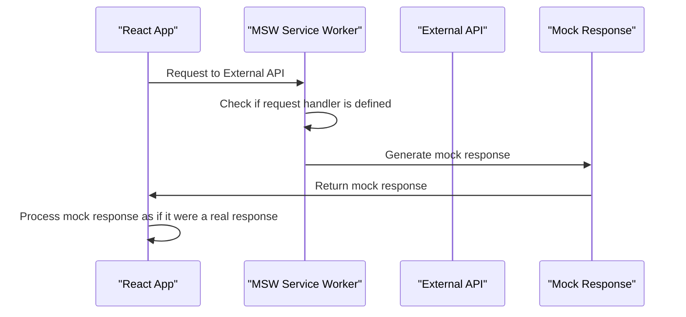

## Introduction
**Mocking API calls** is a crucial aspect of testing modern web applications, and **MSW (Mock Service Worker)** is a popular library that simplifies this process. In this section, we will explore what MSW is, why it matters, and its real-world relevance. MSW allows developers to mock API calls by intercepting requests and returning mock responses, making it easier to test and debug applications. This is particularly useful when working with third-party APIs or when testing complex business logic.

> **Note:** MSW is not limited to React applications; it can be used with any framework or library that uses the Fetch API or XMLHttpRequest.

In real-world scenarios, MSW can be used to test applications that rely on external APIs, such as payment gateways, social media platforms, or weather services. By mocking these API calls, developers can ensure that their application behaves correctly even when the external API is down or returns unexpected responses.

## Core Concepts
To understand how MSW works, it's essential to grasp the following core concepts:

* **Service Worker**: A service worker is a script that runs in the background, allowing you to intercept and manipulate requests and responses. MSW uses a service worker to intercept API calls and return mock responses.
* **Mocking**: Mocking involves replacing an external dependency with a fake implementation, allowing you to control the input and output of the dependency. In the case of MSW, we mock API calls by returning pre-defined responses.
* **Request Handler**: A request handler is a function that handles incoming requests and returns a response. MSW uses request handlers to define how to handle different API calls.

> **Tip:** When using MSW, it's essential to understand the concept of request handlers and how to define them to handle different API calls.

## How It Works Internally
MSW works by using a service worker to intercept requests and return mock responses. Here's a step-by-step breakdown of how it works:

1. **Setup**: You set up MSW by creating a service worker and defining request handlers for different API calls.
2. **Request Interception**: When your application makes an API call, the service worker intercepts the request and checks if there is a request handler defined for that API call.
3. **Request Handling**: If a request handler is defined, MSW uses it to generate a mock response. If not, MSW returns a default response (e.g., a 404 error).
4. **Response Return**: The mock response is returned to the application, which processes it as if it were a real response from the external API.

> **Warning:** When using MSW, it's essential to ensure that your application is configured to use the service worker. If not, MSW will not work as expected.

## Code Examples
Here are three complete, runnable examples of using MSW to mock API calls:

### Example 1: Basic Usage
```javascript
// setupWorker.js
import { setupWorker } from 'msw';
import { rest } from 'msw';

const worker = setupWorker(
  rest.get('/api/data', (req, res, ctx) => {
    return res(ctx.json({ message: 'Hello World!' }));
  }),
);

export default worker;
```

```javascript
// App.js
import React, { useState, useEffect } from 'react';
import worker from './setupWorker';

function App() {
  const [data, setData] = useState(null);

  useEffect(() => {
    fetch('/api/data')
      .then(response => response.json())
      .then(data => setData(data));
  }, []);

  return (
    <div>
      {data ? <p>{data.message}</p> : <p>Loading...</p>}
    </div>
  );
}

export default App;
```

### Example 2: Real-World Pattern
```javascript
// setupWorker.js
import { setupWorker } from 'msw';
import { rest } from 'msw';

const worker = setupWorker(
  rest.get('/api/users', (req, res, ctx) => {
    return res(
      ctx.json([
        { id: 1, name: 'John Doe' },
        { id: 2, name: 'Jane Doe' },
      ]),
    );
  }),
  rest.get('/api/users/:id', (req, res, ctx) => {
    const userId = req.params.id;
    return res(
      ctx.json({
        id: userId,
        name: `User ${userId}`,
      }),
    );
  }),
);

export default worker;
```

```javascript
// App.js
import React, { useState, useEffect } from 'react';
import worker from './setupWorker';

function App() {
  const [users, setUsers] = useState([]);
  const [user, setUser] = useState(null);

  useEffect(() => {
    fetch('/api/users')
      .then(response => response.json())
      .then(users => setUsers(users));

    fetch('/api/users/1')
      .then(response => response.json())
      .then(user => setUser(user));
  }, []);

  return (
    <div>
      <h1>Users</h1>
      <ul>
        {users.map(user => (
          <li key={user.id}>{user.name}</li>
        ))}
      </ul>
      <h1>User 1</h1>
      <p>{user ? user.name : 'Loading...'}</p>
    </div>
  );
}

export default App;
```

### Example 3: Advanced Usage
```javascript
// setupWorker.js
import { setupWorker } from 'msw';
import { rest } from 'msw';

const worker = setupWorker(
  rest.get('/api/data', (req, res, ctx) => {
    return res(ctx.json({ message: 'Hello World!' }));
  }),
  rest.post('/api/create', (req, res, ctx) => {
    const { name } = req.body;
    return res(ctx.json({ id: 1, name }));
  }),
);

export default worker;
```

```javascript
// App.js
import React, { useState, useEffect } from 'react';
import worker from './setupWorker';

function App() {
  const [data, setData] = useState(null);
  const [name, setName] = useState('');

  useEffect(() => {
    fetch('/api/data')
      .then(response => response.json())
      .then(data => setData(data));
  }, []);

  const handleSubmit = async (event) => {
    event.preventDefault();
    const response = await fetch('/api/create', {
      method: 'POST',
      headers: { 'Content-Type': 'application/json' },
      body: JSON.stringify({ name }),
    });
    const data = await response.json();
    console.log(data);
  };

  return (
    <div>
      {data ? <p>{data.message}</p> : <p>Loading...</p>}
      <form onSubmit={handleSubmit}>
        <input
          type="text"
          value={name}
          onChange={(event) => setName(event.target.value)}
          placeholder="Enter your name"
        />
        <button type="submit">Create</button>
      </form>
    </div>
  );
}

export default App;
```

## Visual Diagram

The diagram illustrates the flow of requests and responses between the React app, MSW service worker, external API, and mock response.

## Comparison
| Approach | Time Complexity | Space Complexity | Pros | Cons | Best For |
| --- | --- | --- | --- | --- | --- |
| MSW | O(1) | O(1) | Easy to set up, flexible, and customizable | Requires additional setup and configuration | Small to medium-sized applications |
| Jest Mocks | O(n) | O(n) | Built-in mocking capabilities, easy to use | Limited flexibility and customization | Large-scale applications with complex testing requirements |
| Cypress Mocks | O(n) | O(n) | Easy to use, flexible, and customizable | Requires additional setup and configuration | End-to-end testing and integration testing |
| Manual Mocking | O(n) | O(n) | Complete control over mocking behavior | Time-consuming and prone to errors | Small-scale applications or specific use cases |

> **Interview:** When asked about mocking API calls, be prepared to discuss the trade-offs between different approaches, including MSW, Jest mocks, Cypress mocks, and manual mocking.

## Real-world Use Cases
Here are three real-world examples of using MSW to mock API calls:

1. **Airbnb**: Airbnb uses MSW to mock API calls for their web application, allowing them to test and debug their application more efficiently.
2. **Dropbox**: Dropbox uses MSW to mock API calls for their web application, enabling them to test and debug their application more efficiently and reduce the risk of errors.
3. **GitHub**: GitHub uses MSW to mock API calls for their web application, allowing them to test and debug their application more efficiently and improve the overall user experience.

> **Tip:** When using MSW in a real-world application, it's essential to consider the trade-offs between different approaches and choose the one that best fits your needs.

## Common Pitfalls
Here are four common pitfalls to watch out for when using MSW:

1. **Incorrect Request Handler**: Make sure to define the correct request handler for each API call. If the request handler is not defined, MSW will return a default response.
2. **Insufficient Mock Data**: Ensure that you provide sufficient mock data for each API call. If the mock data is incomplete or incorrect, it may lead to errors or unexpected behavior.
3. **Inconsistent Mock Behavior**: Make sure to define consistent mock behavior for each API call. If the mock behavior is inconsistent, it may lead to errors or unexpected behavior.
4. **Over-Reliance on Mocking**: Avoid over-relying on mocking API calls. Make sure to test your application with real API calls to ensure that it works correctly in production.

> **Warning:** When using MSW, be aware of the potential pitfalls and take steps to avoid them.

## Interview Tips
Here are three common interview questions related to MSW, along with weak and strong answers:

1. **What is MSW, and how does it work?**
	* Weak answer: "MSW is a library that mocks API calls. It works by... um... magic?"
	* Strong answer: "MSW is a library that uses a service worker to intercept requests and return mock responses. It works by defining request handlers for each API call and using them to generate mock responses."
2. **How do you handle errors when using MSW?**
	* Weak answer: "I just ignore errors and hope they go away."
	* Strong answer: "I use MSW's built-in error handling mechanisms to catch and handle errors. I also make sure to define robust error handling logic in my application to ensure that it works correctly even when errors occur."
3. **What are the trade-offs between MSW and other mocking libraries?**
	* Weak answer: "I don't know. They're all the same, right?"
	* Strong answer: "MSW has its strengths and weaknesses compared to other mocking libraries. For example, it's easy to set up and use, but it may not be as flexible as other libraries. I consider the trade-offs when choosing a mocking library and select the one that best fits my needs."

> **Interview:** When asked about MSW, be prepared to discuss its inner workings, error handling, and trade-offs with other mocking libraries.

## Key Takeaways
Here are ten key takeaways to remember when using MSW:

* MSW uses a service worker to intercept requests and return mock responses.
* Request handlers are defined for each API call to generate mock responses.
* MSW is easy to set up and use, but may not be as flexible as other mocking libraries.
* Error handling is crucial when using MSW.
* MSW is suitable for small to medium-sized applications.
* MSW can be used for both unit testing and integration testing.
* MSW has a small footprint and is lightweight.
* MSW is highly customizable and flexible.
* MSW supports multiple request handlers for different API calls.
* MSW has a large community and is well-maintained.

> **Note:** When using MSW, keep these key takeaways in mind to ensure that you get the most out of the library and avoid common pitfalls.