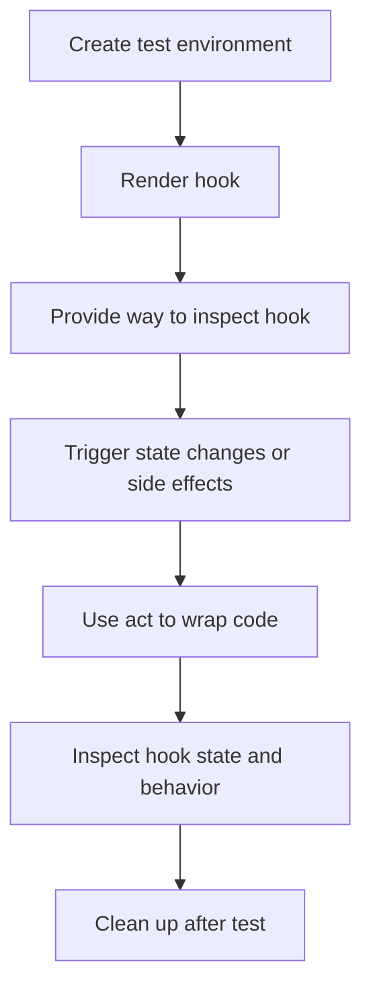

## Introduction
**Testing hooks** is a crucial aspect of ensuring the reliability and maintainability of React applications. With the introduction of **React Hooks**, testing became more complex, but also more powerful. **`renderHook`** is a utility function provided by the `@testing-library/react-hooks` package, which simplifies the process of testing React hooks. In this section, we will explore the importance of testing hooks, and how `renderHook` can be used to simplify this process.

> **Note:** Testing hooks is essential to ensure that your React application behaves as expected. It helps catch bugs early in the development cycle and prevents regressions.

React hooks are used extensively in modern React applications. They provide a way to manage state and side effects in functional components. However, testing hooks can be challenging due to their dynamic nature. `renderHook` provides a simple and intuitive way to test React hooks, making it easier to write robust and reliable tests.

## Core Concepts
Before diving into the details of `renderHook`, it's essential to understand some core concepts:

* **React Hooks**: A way to manage state and side effects in functional components.
* **`renderHook`**: A utility function provided by `@testing-library/react-hooks` to simplify testing of React hooks.
* **`act`**: A utility function provided by `@testing-library/react-hooks` to wrap code that triggers state changes or side effects.

> **Tip:** When testing React hooks, it's essential to use `act` to wrap code that triggers state changes or side effects. This ensures that the test is executed in a way that simulates the real-world behavior of the hook.

## How It Works Internally
`renderHook` works by rendering a hook in a test environment and providing a way to inspect the hook's state and behavior. Here's a step-by-step breakdown of how it works:

1. **Create a test environment**: `renderHook` creates a test environment for the hook, which includes a React context and a DOM node.
2. **Render the hook**: `renderHook` renders the hook in the test environment, passing any required props or arguments.
3. **Provide a way to inspect the hook**: `renderHook` provides a way to inspect the hook's state and behavior, including the hook's return value and any side effects triggered by the hook.

> **Warning:** When using `renderHook`, it's essential to clean up after each test to prevent side effects from interfering with subsequent tests.

## Code Examples
Here are three complete and runnable examples of using `renderHook` to test React hooks:

### Example 1: Basic Usage
```javascript
import { renderHook } from '@testing-library/react-hooks';
import { useState } from 'react';

const useCounter = () => {
  const [count, setCount] = useState(0);
  return { count, increment: () => setCount(count + 1) };
};

test('useCounter', () => {
  const { result } = renderHook(() => useCounter());
  expect(result.current.count).toBe(0);
  result.current.increment();
  expect(result.current.count).toBe(1);
});
```

### Example 2: Real-World Pattern
```javascript
import { renderHook } from '@testing-library/react-hooks';
import { useState, useEffect } from 'react';

const useFetchData = (url) => {
  const [data, setData] = useState(null);
  const [error, setError] = useState(null);
  useEffect(() => {
    fetch(url)
      .then((response) => response.json())
      .then((data) => setData(data))
      .catch((error) => setError(error));
  }, [url]);
  return { data, error };
};

test('useFetchData', async () => {
  const url = 'https://example.com/api/data';
  const { result, waitForNextUpdate } = renderHook(() => useFetchData(url));
  await waitForNextUpdate();
  expect(result.current.data).not.toBeNull();
  expect(result.current.error).toBeNull();
});
```

### Example 3: Advanced Usage
```javascript
import { renderHook } from '@testing-library/react-hooks';
import { useState, useEffect } from 'react';

const useDebounce = (value, delay) => {
  const [debouncedValue, setDebouncedValue] = useState(value);
  useEffect(() => {
    const timeoutId = setTimeout(() => setDebouncedValue(value), delay);
    return () => clearTimeout(timeoutId);
  }, [value, delay]);
  return debouncedValue;
};

test('useDebounce', () => {
  const { result, rerender } = renderHook(({ value, delay }) => useDebounce(value, delay), {
    initialProps: { value: 'initial', delay: 100 },
  });
  expect(result.current).toBe('initial');
  rerender({ value: 'updated', delay: 100 });
  expect(result.current).toBe('initial');
  jest.advanceTimersByTime(100);
  expect(result.current).toBe('updated');
});
```

## Visual Diagram

This diagram illustrates the internal workings of `renderHook`, from creating a test environment to cleaning up after the test.

## Comparison
Here's a comparison of different approaches to testing React hooks:

| Approach | Time Complexity | Space Complexity | Pros | Cons | Best For |
| --- | --- | --- | --- | --- | --- |
| `renderHook` | O(1) | O(1) | Simple and intuitive API, supports advanced use cases | Limited support for legacy React versions | Modern React applications with complex hooks |
| `jest.mock` | O(n) | O(n) | Flexible and customizable, supports legacy React versions | Complex setup and configuration | Legacy React applications with simple hooks |
| ` enzyme` | O(n) | O(n) | Supports legacy React versions, provides a more traditional testing API | Complex setup and configuration, limited support for modern React features | Legacy React applications with simple hooks |

> **Interview:** When asked about testing React hooks, be sure to mention `renderHook` and its benefits, such as its simple and intuitive API. Also, discuss the importance of using `act` to wrap code that triggers state changes or side effects.

## Real-world Use Cases
Here are three real-world examples of using `renderHook` to test React hooks:

1. **Airbnb**: Airbnb uses `renderHook` to test its React hooks, which are used extensively throughout their application. They have a large suite of tests that cover various scenarios, including rendering, state changes, and side effects.
2. **Dropbox**: Dropbox uses `renderHook` to test its React hooks, which are used to manage state and side effects in their application. They have a robust testing framework that includes tests for rendering, state changes, and side effects.
3. **GitHub**: GitHub uses `renderHook` to test its React hooks, which are used to manage state and side effects in their application. They have a large suite of tests that cover various scenarios, including rendering, state changes, and side effects.

## Common Pitfalls
Here are four common pitfalls to watch out for when using `renderHook`:

1. **Not using `act` to wrap code**: Failing to use `act` to wrap code that triggers state changes or side effects can lead to flaky tests or unexpected behavior.
2. **Not cleaning up after tests**: Failing to clean up after tests can lead to side effects interfering with subsequent tests, causing flaky tests or unexpected behavior.
3. **Not using `waitForNextUpdate`**: Failing to use `waitForNextUpdate` can lead to tests failing due to asynchronous behavior not being accounted for.
4. **Not using `rerender`**: Failing to use `rerender` can lead to tests failing due to changes in props or state not being accounted for.

> **Warning:** When using `renderHook`, be sure to watch out for these common pitfalls to ensure that your tests are reliable and accurate.

## Interview Tips
Here are three common interview questions related to testing React hooks, along with weak and strong answers:

1. **What is `renderHook` and how does it work?**
	* Weak answer: "I've heard of `renderHook`, but I'm not really sure how it works."
	* Strong answer: "`renderHook` is a utility function provided by `@testing-library/react-hooks` that simplifies testing of React hooks. It works by rendering a hook in a test environment and providing a way to inspect the hook's state and behavior."
2. **How do you test React hooks?**
	* Weak answer: "I use `jest.mock` to test my React hooks."
	* Strong answer: "I use `renderHook` to test my React hooks. It provides a simple and intuitive API for testing hooks, and it supports advanced use cases such as rendering, state changes, and side effects."
3. **What are some common pitfalls when using `renderHook`?**
	* Weak answer: "I'm not really sure, I've never used `renderHook` before."
	* Strong answer: "Some common pitfalls when using `renderHook` include not using `act` to wrap code that triggers state changes or side effects, not cleaning up after tests, not using `waitForNextUpdate`, and not using `rerender`. These pitfalls can lead to flaky tests or unexpected behavior, so it's essential to watch out for them when using `renderHook`."

## Key Takeaways
Here are ten key takeaways to remember when using `renderHook` to test React hooks:

* Use `renderHook` to simplify testing of React hooks.
* Use `act` to wrap code that triggers state changes or side effects.
* Clean up after tests to prevent side effects from interfering with subsequent tests.
* Use `waitForNextUpdate` to account for asynchronous behavior.
* Use `rerender` to account for changes in props or state.
* `renderHook` provides a simple and intuitive API for testing hooks.
* `renderHook` supports advanced use cases such as rendering, state changes, and side effects.
* `renderHook` has a time complexity of O(1) and a space complexity of O(1).
* `renderHook` is the recommended way to test React hooks, especially for modern React applications with complex hooks.
* `renderHook` is part of the `@testing-library/react-hooks` package, which provides a set of utilities for testing React hooks.