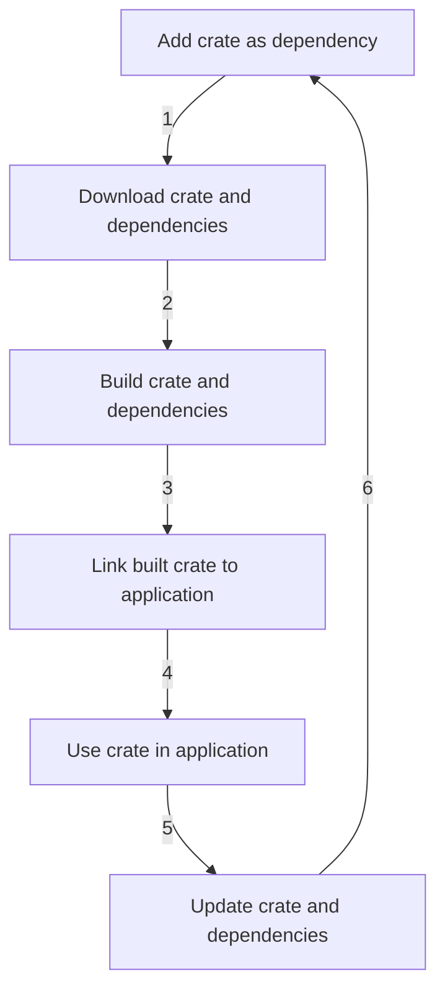

## Introduction
The **Rust** ecosystem is growing rapidly, with a large number of **crates** (Rust packages) available on **crates.io**, the official Rust package registry. This ecosystem provides a wide range of libraries and tools that make it easier to develop Rust applications. In this section, we will explore the benefits of the growing Rust ecosystem and how it can help developers build robust and efficient applications.

> **Note:** The Rust ecosystem is not just limited to the standard library, but also includes a vast number of community-maintained crates that provide additional functionality.

The Rust ecosystem is important because it provides a way for developers to share and reuse code, which can help to reduce development time and improve the overall quality of applications. With a growing ecosystem, developers can focus on building their applications, rather than spending time implementing common functionality from scratch.

## Core Concepts
To understand the benefits of the Rust ecosystem, it's essential to understand some core concepts:

* **Crates**: Rust packages that can be easily shared and reused.
* **crates.io**: The official Rust package registry, where crates are hosted and can be easily discovered and downloaded.
* **Cargo**: The Rust package manager, which makes it easy to manage dependencies and build Rust applications.

> **Tip:** When building a Rust application, it's a good idea to start by searching for existing crates that provide the functionality you need, rather than trying to implement it from scratch.

## How It Works Internally
When you add a crate as a dependency to your Rust project, Cargo will download the crate and its dependencies, and then build them. Here's a step-by-step overview of how it works:

1. You add a crate as a dependency to your `Cargo.toml` file.
2. Cargo downloads the crate and its dependencies from crates.io.
3. Cargo builds the crate and its dependencies.
4. The built crate is then linked to your application.

> **Warning:** When using crates, it's essential to keep your dependencies up to date to ensure you have the latest security patches and bug fixes.

## Code Examples
Here are three complete and runnable examples that demonstrate how to use crates in Rust:

### Example 1: Basic Usage
```rust
// Import the rand crate
extern crate rand;

use rand::Rng;

fn main() {
    // Generate a random number
    let random_number: u32 = rand::thread_rng().gen();
    println!("Random number: {}", random_number);
}
```

### Example 2: Real-World Pattern
```rust
// Import the serde_json crate
extern crate serde_json;

use serde_json::json;

fn main() {
    // Create a JSON object
    let json_object = json!({
        "name": "John",
        "age": 30,
    });

    // Print the JSON object
    println!("{}", json_object);
}
```

### Example 3: Advanced Usage
```rust
// Import the reqwest crate
extern crate reqwest;

use reqwest::blocking::get;

fn main() {
    // Make a GET request to a URL
    let res = get("https://www.example.com").unwrap();

    // Print the response status code
    println!("Status code: {}", res.status());
}
```

## Visual Diagram

This diagram illustrates the process of adding a crate as a dependency, downloading and building the crate and its dependencies, linking the built crate to the application, and then using the crate in the application.

## Comparison
Here's a comparison of different package managers and registries:

| Package Manager | Registry | Time Complexity | Space Complexity | Pros | Cons |
| --- | --- | --- | --- | --- | --- |
| Cargo | crates.io | O(n) | O(n) | Easy to use, fast, and secure | Limited support for older Rust versions |
| npm | npm registry | O(n) | O(n) | Large ecosystem, easy to use | Security concerns, slow |
| pip | PyPI | O(n) | O(n) | Easy to use, large ecosystem | Security concerns, slow |
| Maven | Maven Central | O(n) | O(n) | Large ecosystem, easy to use | Complex configuration, slow |

## Real-world Use Cases
Here are three real-world examples of companies that use Rust and the Rust ecosystem:

* **Dropbox**: Dropbox uses Rust to build its file synchronization system, which provides a fast and reliable way to synchronize files across multiple devices.
* **Mozilla**: Mozilla uses Rust to build its Firefox browser, which provides a fast and secure way to browse the web.
* **Microsoft**: Microsoft uses Rust to build its Azure IoT Edge, which provides a secure and reliable way to manage IoT devices.

## Common Pitfalls
Here are four common mistakes that developers make when using crates:

* **Not keeping dependencies up to date**: This can lead to security vulnerabilities and bugs in the application.
* **Not testing crates thoroughly**: This can lead to unexpected behavior and bugs in the application.
* **Not using the correct version of a crate**: This can lead to compatibility issues and bugs in the application.
* **Not following best practices for crate development**: This can lead to low-quality crates that are difficult to use and maintain.

> **Interview:** When interviewing for a Rust developer position, be prepared to answer questions about your experience with crates and the Rust ecosystem. Be sure to mention your experience with Cargo, crates.io, and popular crates like serde_json and reqwest.

## Interview Tips
Here are three common interview questions for Rust developers, along with weak and strong answers:

* **What is your experience with the Rust ecosystem?**
	+ Weak answer: "I've heard of it, but I've never used it."
	+ Strong answer: "I've used Cargo and crates.io to build several Rust applications. I'm familiar with popular crates like serde_json and reqwest."
* **How do you keep your dependencies up to date?**
	+ Weak answer: "I don't, I just use the latest version of the crate."
	+ Strong answer: "I use Cargo to keep my dependencies up to date. I regularly check for updates and update my dependencies to ensure I have the latest security patches and bug fixes."
* **What is your experience with crate development?**
	+ Weak answer: "I've never developed a crate before."
	+ Strong answer: "I've developed several crates, including a crate for working with JSON data. I'm familiar with best practices for crate development and have experience with testing and documentation."

## Key Takeaways
Here are six key takeaways from this section:

* The Rust ecosystem is growing rapidly, with a large number of crates available on crates.io.
* Cargo is the Rust package manager, which makes it easy to manage dependencies and build Rust applications.
* Crates can be easily shared and reused, which can help to reduce development time and improve the overall quality of applications.
* It's essential to keep dependencies up to date to ensure you have the latest security patches and bug fixes.
* The Rust ecosystem provides a wide range of libraries and tools that make it easier to develop Rust applications.
* When interviewing for a Rust developer position, be prepared to answer questions about your experience with crates and the Rust ecosystem.