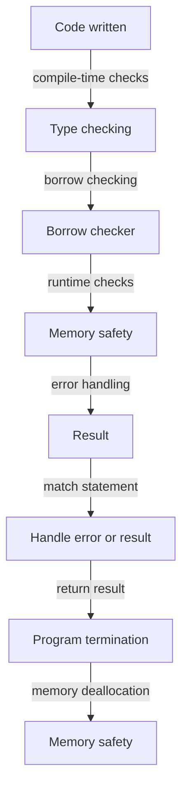

## Introduction
**Rust** is a systems programming language that prioritizes safety and performance. One of the key benefits of using **Rust** is the absence of **undefined behavior** in **Safe Rust**. **Undefined behavior** refers to situations where the language specification does not define the behavior of a program, often leading to crashes, security vulnerabilities, or unexpected results. In this section, we will explore why the absence of **undefined behavior** in **Safe Rust** matters, its real-world relevance, and why every engineer should care about this topic.

> **Note:** **Undefined behavior** is a major concern in systems programming, as it can lead to serious security vulnerabilities and crashes. **Rust**'s focus on safety and the absence of **undefined behavior** in **Safe Rust** make it an attractive choice for systems programming.

## Core Concepts
To understand the benefits of **Safe Rust**, we need to define some key concepts:

* **Safe Rust**: The subset of the **Rust** language that is guaranteed to be free of **undefined behavior**.
* **Undefined behavior**: A situation where the language specification does not define the behavior of a program.
* **Memory safety**: The guarantee that a program will not access or modify memory in an invalid way.

> **Tip:** **Rust**'s **borrow checker** is a key component of **Safe Rust**, ensuring that memory is accessed and modified safely.

## How It Works Internally
So, how does **Rust** achieve the absence of **undefined behavior** in **Safe Rust**? The answer lies in the language's design and its **borrow checker**. Here's a step-by-step breakdown:

1. **Memory layout**: **Rust**'s memory layout is designed to prevent **undefined behavior**. For example, **Rust**'s **Vec** type uses a contiguous block of memory to store its elements, ensuring that accessing an element out of bounds will result in a runtime error rather than **undefined behavior**.
2. **Borrow checker**: The **borrow checker** is responsible for ensuring that memory is accessed and modified safely. It does this by enforcing the following rules:
	* Each value in **Rust** has a single owner.
	* Values can be borrowed in one of two ways: **immutable** or **mutable**.
	* **Mutable** borrows can only occur when there are no other borrows of the same value.
3. **Compile-time checks**: **Rust**'s compiler performs a series of checks at compile-time to ensure that the code is safe. These checks include:
	* **Type checking**: Ensures that the types of variables and function arguments are correct.
	* **Borrow checking**: Ensures that the **borrow checker** rules are enforced.

> **Warning:** While **Safe Rust** is designed to prevent **undefined behavior**, it is still possible to write **Rust** code that uses **unsafe** blocks, which can introduce **undefined behavior**. Use **unsafe** blocks with caution and only when necessary.

## Code Examples
Here are three complete and runnable examples that demonstrate the benefits of **Safe Rust**:

### Example 1: Basic **Vec** usage
```rust
fn main() {
    let mut vec = Vec::new();
    vec.push(1);
    vec.push(2);
    vec.push(3);
    println!("{:?}", vec);
}
```
This example demonstrates the safe usage of **Rust**'s **Vec** type. The **Vec** type is designed to prevent **undefined behavior** by using a contiguous block of memory to store its elements.

### Example 2: **Borrow checker** in action
```rust
fn main() {
    let mut s = String::from("hello");
    let len = calculate_length(&s);
    println!("The length of '{}' is {}.", s, len);
}

fn calculate_length(s: &String) -> usize {
    s.len()
}
```
This example demonstrates the **borrow checker** in action. The **calculate_length** function takes a reference to a **String** as an argument, and the **borrow checker** ensures that the reference is valid and does not outlive the **String**.

### Example 3: **Error handling** with **Result**
```rust
fn main() {
    let result = divide(10, 2);
    match result {
        Ok(value) => println!("The result is {}", value),
        Err(error) => println!("An error occurred: {}", error),
    }
}

fn divide(a: i32, b: i32) -> Result<i32, String> {
    if b == 0 {
        Err(String::from("Cannot divide by zero!"))
    } else {
        Ok(a / b)
    }
}
```
This example demonstrates **error handling** with **Rust**'s **Result** type. The **divide** function returns a **Result** that is either **Ok** with the result of the division or **Err** with an error message. The **main** function uses a **match** statement to handle the **Result**.

## Visual Diagram

This diagram illustrates the flow of **Rust**'s safety features, from compile-time checks to runtime checks and error handling.

## Comparison
Here is a comparison of **Rust**'s safety features with those of other programming languages:
| Language | Memory Safety | Error Handling | Type System |
| --- | --- | --- | --- |
| **Rust** | **Safe Rust** ensures memory safety | **Result** type for error handling | Statically typed |
| **C** | No memory safety guarantees | Error codes for error handling | Statically typed |
| **C++** | No memory safety guarantees | Exceptions for error handling | Statically typed |
| **Java** | Garbage collection ensures memory safety | Exceptions for error handling | Statically typed |
| **Python** | Garbage collection ensures memory safety | Exceptions for error handling | Dynamically typed |

## Real-world Use Cases
Here are three real-world examples of **Rust**'s safety features in action:

* **Dropbox**: **Dropbox** uses **Rust** for its file synchronization engine, which requires high performance and reliability.
* **Firefox**: **Firefox** uses **Rust** for its rendering engine, which requires high performance and safety.
* **Amazon Web Services**: **Amazon Web Services** uses **Rust** for its **AWS Lambda** service, which requires high performance and reliability.

## Common Pitfalls
Here are four common pitfalls to avoid when using **Rust**:

* **Using **unsafe** blocks unnecessarily**: **Unsafe** blocks can introduce **undefined behavior**, so use them only when necessary.
* **Ignoring **borrow checker** errors**: The **borrow checker** is designed to prevent **undefined behavior**, so ignore its errors at your own peril.
* **Not handling errors properly**: **Rust**'s **Result** type is designed to handle errors, so use it properly to avoid crashes and unexpected behavior.
* **Not using **Safe Rust****: **Safe Rust** is designed to prevent **undefined behavior**, so use it whenever possible to ensure the safety of your code.

## Interview Tips
Here are three common interview questions related to **Rust**'s safety features, along with weak and strong answers:

* **What is **undefined behavior**, and how does **Rust** prevent it?**
	+ Weak answer: **Undefined behavior** is when a program does something unexpected, and **Rust** prevents it by using a **borrow checker**.
	+ Strong answer: **Undefined behavior** is when a program's behavior is not defined by the language specification, and **Rust** prevents it by using a combination of compile-time checks, runtime checks, and **Safe Rust**.
* **How does **Rust**'s **borrow checker** work?**
	+ Weak answer: The **borrow checker** checks that references are valid and do not outlive the values they point to.
	+ Strong answer: The **borrow checker** enforces a set of rules that ensure memory safety, including the rule that each value has a single owner, and values can be borrowed in one of two ways: **immutable** or **mutable**.
* **What is the difference between **Safe Rust** and **unsafe** **Rust**?**
	+ Weak answer: **Safe Rust** is the safe subset of the **Rust** language, and **unsafe** **Rust** is the subset that allows **undefined behavior**.
	+ Strong answer: **Safe Rust** is the subset of the **Rust** language that is guaranteed to be free of **undefined behavior**, and **unsafe** **Rust** is the subset that allows **undefined behavior** by using **unsafe** blocks and other features that bypass the **borrow checker**.

## Key Takeaways
Here are ten key takeaways about **Rust**'s safety features:

* **Rust**'s **Safe Rust** ensures memory safety and prevents **undefined behavior**.
* The **borrow checker** is a key component of **Safe Rust**.
* **Rust**'s type system is statically typed, which helps prevent **undefined behavior**.
* **Rust**'s **Result** type is designed to handle errors and prevent crashes.
* **Unsafe** blocks can introduce **undefined behavior**, so use them only when necessary.
* **Rust**'s **borrow checker** enforces a set of rules that ensure memory safety.
* **Rust**'s safety features are designed to prevent **undefined behavior**, not just detect it.
* **Rust**'s **Safe Rust** is the safe subset of the **Rust** language.
* **Rust**'s **unsafe** **Rust** is the subset that allows **undefined behavior**.
* **Rust**'s safety features are designed to make it easier to write safe and reliable code.