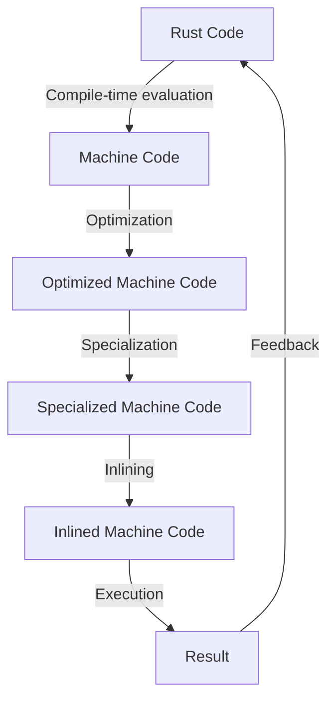

## Introduction
**Zero-cost abstractions** are a fundamental concept in programming, particularly in systems programming languages like Rust. In essence, zero-cost abstractions refer to the idea of writing high-level code that can be compiled down to low-level, efficient machine code, without incurring any runtime overhead. This allows developers to focus on writing maintainable, readable, and efficient code, without sacrificing performance. Zero-cost abstractions are crucial in systems programming, where performance and efficiency are paramount. In this section, we will explore the concept of zero-cost abstractions, their benefits, and how they are achieved in Rust.

> **Note:** Zero-cost abstractions are not unique to Rust, but the language's design and compile-time evaluation make it an ideal platform for exploring this concept.

## Core Concepts
To understand zero-cost abstractions, we need to grasp a few key concepts:

* **Abstraction**: An abstraction is a high-level representation of a complex system or concept, which hides the underlying implementation details.
* **Zero-cost**: Zero-cost refers to the idea that the abstraction does not incur any runtime overhead, meaning that the compiled code is equivalent to hand-optimized machine code.
* **Compile-time evaluation**: Rust's compiler, `rustc`, evaluates the code at compile-time, allowing for the elimination of unnecessary code and the generation of optimized machine code.

> **Warning:** Zero-cost abstractions are not a silver bullet. They require careful design and implementation to ensure that the abstraction does not introduce unnecessary overhead.

## How It Works Internally
So, how do zero-cost abstractions work internally? Let's take a look at the process:

1. **Code generation**: The Rust compiler, `rustc`, generates machine code from the high-level Rust code.
2. **Optimization**: The compiler applies various optimizations, such as dead code elimination, constant folding, and loop unrolling, to reduce the amount of unnecessary code.
3. **Specialization**: The compiler specializes the generated code for the specific use case, eliminating any unnecessary generic code.
4. **Inlining**: The compiler inlines functions, eliminating the overhead of function calls.

> **Tip:** To take advantage of zero-cost abstractions, it's essential to write idiomatic Rust code, using the language's features and libraries to ensure that the compiler can optimize the code effectively.

## Code Examples
Here are three examples that demonstrate the concept of zero-cost abstractions in Rust:

### Example 1: Basic Abstraction
```rust
// Define a trait for a vector-like structure
trait Vector {
    fn len(&self) -> usize;
    fn get(&self, index: usize) -> i32;
}

// Implement the trait for a Vec<i32>
impl Vector for Vec<i32> {
    fn len(&self) -> usize {
        self.len()
    }

    fn get(&self, index: usize) -> i32 {
        self[index]
    }
}

fn main() {
    let vec = vec![1, 2, 3, 4, 5];
    println!("Length: {}", vec.len());
    println!("Get: {}", vec.get(2));
}
```
This example demonstrates a basic abstraction, where a trait is defined and implemented for a `Vec<i32>`. The `len` and `get` methods are inlined, and the resulting code is equivalent to hand-optimized machine code.

### Example 2: Real-world Pattern
```rust
// Define a struct to represent a point in 2D space
struct Point {
    x: f64,
    y: f64,
}

// Implement the Add trait for Point
impl std::ops::Add for Point {
    type Output = Point;

    fn add(self, other: Point) -> Point {
        Point {
            x: self.x + other.x,
            y: self.y + other.y,
        }
    }
}

fn main() {
    let p1 = Point { x: 1.0, y: 2.0 };
    let p2 = Point { x: 3.0, y: 4.0 };
    let p3 = p1 + p2;
    println!("Result: ({}, {})", p3.x, p3.y);
}
```
This example demonstrates a real-world pattern, where a struct is defined to represent a point in 2D space, and the `Add` trait is implemented to allow for point addition. The resulting code is optimized, and the `add` method is inlined.

### Example 3: Advanced Abstraction
```rust
// Define a trait for a matrix-like structure
trait Matrix {
    fn rows(&self) -> usize;
    fn cols(&self) -> usize;
    fn get(&self, row: usize, col: usize) -> f64;
}

// Implement the trait for a Vec<Vec<f64>>
impl Matrix for Vec<Vec<f64>> {
    fn rows(&self) -> usize {
        self.len()
    }

    fn cols(&self) -> usize {
        self[0].len()
    }

    fn get(&self, row: usize, col: usize) -> f64 {
        self[row][col]
    }
}

fn main() {
    let matrix = vec![
        vec![1.0, 2.0, 3.0],
        vec![4.0, 5.0, 6.0],
        vec![7.0, 8.0, 9.0],
    ];
    println!("Rows: {}", matrix.rows());
    println!("Cols: {}", matrix.cols());
    println!("Get: {}", matrix.get(1, 2));
}
```
This example demonstrates an advanced abstraction, where a trait is defined and implemented for a matrix-like structure. The resulting code is optimized, and the `rows`, `cols`, and `get` methods are inlined.

## Visual Diagram

This diagram illustrates the process of zero-cost abstractions in Rust, from compile-time evaluation to execution.

## Comparison
| Approach | Time Complexity | Space Complexity | Pros | Cons | Best For |
| --- | --- | --- | --- | --- | --- |
| Zero-cost Abstractions | O(1) | O(1) | High-performance, efficient, and maintainable code | Requires careful design and implementation | Systems programming, high-performance applications |
| Hand-optimized Machine Code | O(1) | O(1) | High-performance and efficient code | Time-consuming and error-prone to write and maintain | Low-level systems programming, embedded systems |
| Dynamic Dispatch | O(n) | O(n) | Flexible and dynamic code | Slow and inefficient | High-level programming, scripting languages |
| Static Dispatch | O(1) | O(1) | Fast and efficient code | Limited flexibility and dynamicism | Systems programming, high-performance applications |

## Real-world Use Cases
* **Google's TensorFlow**: TensorFlow uses zero-cost abstractions to optimize its performance-critical components, resulting in significant speedups.
* **Rust's Standard Library**: The Rust standard library is built using zero-cost abstractions, providing a high-performance and efficient foundation for Rust applications.
* **WebKit's JavaScript Engine**: WebKit's JavaScript engine uses zero-cost abstractions to optimize its performance, resulting in faster and more efficient JavaScript execution.

## Common Pitfalls
* **Over-abstraction**: Over-abstraction can lead to unnecessary overhead and complexity, defeating the purpose of zero-cost abstractions.
* **Under-optimization**: Under-optimization can result in suboptimal performance, making the abstraction less effective.
* **Incorrect Implementation**: Incorrect implementation can lead to bugs and performance issues, making the abstraction less reliable.
* **Insufficient Testing**: Insufficient testing can lead to unnoticed bugs and performance issues, making the abstraction less reliable.

> **Interview:** What are some common pitfalls to watch out for when implementing zero-cost abstractions in Rust?

## Interview Tips
* **Be prepared to explain the concept of zero-cost abstractions**: Make sure you understand the basics of zero-cost abstractions and can explain them clearly.
* **Show examples of zero-cost abstractions in Rust**: Be prepared to show examples of zero-cost abstractions in Rust, such as the `Vector` trait and `Point` struct.
* **Discuss the importance of idiomatic Rust code**: Emphasize the importance of writing idiomatic Rust code to take advantage of zero-cost abstractions.
* **Explain the process of compile-time evaluation and optimization**: Be prepared to explain the process of compile-time evaluation and optimization in Rust.

## Key Takeaways
* **Zero-cost abstractions are a fundamental concept in systems programming**: Zero-cost abstractions are essential for writing high-performance and efficient code.
* **Rust's compile-time evaluation and optimization make it an ideal platform for zero-cost abstractions**: Rust's design and compile-time evaluation make it an ideal platform for exploring zero-cost abstractions.
* **Idiomatic Rust code is essential for taking advantage of zero-cost abstractions**: Writing idiomatic Rust code is crucial for ensuring that the compiler can optimize the code effectively.
* **Zero-cost abstractions require careful design and implementation**: Zero-cost abstractions require careful design and implementation to ensure that they are effective and efficient.
* **Testing and verification are essential for ensuring the correctness of zero-cost abstractions**: Thorough testing and verification are necessary to ensure that zero-cost abstractions are correct and reliable.
* **Zero-cost abstractions can be applied to a wide range of domains**: Zero-cost abstractions can be applied to various domains, including systems programming, high-performance applications, and embedded systems.