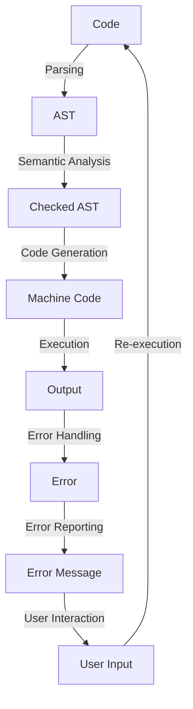

## Introduction
Rust is a systems programming language that prioritizes safety, performance, and concurrency. While it has gained significant traction in recent years, one of its major drawbacks is its relatively smaller ecosystem compared to other popular languages like Go, Python, and JavaScript. In this article, we will delve into the implications of Rust's smaller ecosystem, explore its core concepts, and discuss how it works internally. We will also examine code examples, visual diagrams, and compare Rust with other languages to provide a comprehensive understanding of its strengths and weaknesses.

Rust's smaller ecosystem is a significant concern for many developers, as it can limit the availability of libraries, frameworks, and tools. However, this also presents an opportunity for the Rust community to focus on building high-quality, well-maintained libraries that are tailored to the language's unique strengths. As a result, Rust has become a popular choice for systems programming, and its ecosystem is growing rapidly.

> **Note:** Rust's smaller ecosystem is not necessarily a bad thing. It allows the community to focus on building high-quality libraries and frameworks that are well-maintained and well-documented.

## Core Concepts
Rust's core concepts are centered around its ownership system, which ensures memory safety and prevents common errors like null pointer dereferences and data races. The language also features a strong focus on concurrency, with built-in support for parallelism and async/await.

* **Ownership:** Rust's ownership system is based on the concept of ownership and borrowing. Each value in Rust has an owner that is responsible for deallocating the value when it is no longer needed.
* **Borrowing:** Rust's borrowing system allows values to be borrowed in one of two ways: immutably or mutably. Immutable borrowing allows multiple borrows, while mutable borrowing allows only one borrow.
* **Concurrency:** Rust provides built-in support for concurrency through its async/await syntax and the `std::thread` module.

> **Tip:** Rust's ownership system can be challenging to learn at first, but it provides a high degree of memory safety and prevents common errors.

## How It Works Internally
Rust's compiler, `rustc`, uses a combination of the LLVM compiler infrastructure and the Rust standard library to compile Rust code into machine code. The compilation process involves several stages, including parsing, semantic analysis, and code generation.

1. **Parsing:** The `rustc` compiler parses the Rust source code into an abstract syntax tree (AST).
2. **Semantic Analysis:** The compiler performs semantic analysis on the AST to check for errors and ensure that the code is correct.
3. **Code Generation:** The compiler generates machine code from the AST using the LLVM compiler infrastructure.

> **Warning:** Rust's compilation process can be complex and error-prone. It is essential to understand the different stages of compilation to debug and optimize Rust code.

## Code Examples
Here are three complete, runnable examples of Rust code that demonstrate its core concepts:

### Example 1: Basic Ownership
```rust
// This example demonstrates basic ownership in Rust.
fn main() {
    let s = String::from("hello"); // s owns the string
    let len = calculate_length(&s); // len borrows s
    println!("The length of '{}' is {}.", s, len);
}

fn calculate_length(s: &String) -> usize {
    s.len()
}
```

### Example 2: Concurrency
```rust
// This example demonstrates concurrency in Rust using async/await.
use std::thread;
use std::time::Duration;

async fn sleep_and_print() {
    thread::sleep(Duration::from_millis(1000));
    println!("Hello from async!");
}

fn main() {
    let handle = thread::spawn(move || {
        sleep_and_print();
    });
    handle.join().unwrap();
}
```

### Example 3: Error Handling
```rust
// This example demonstrates error handling in Rust using Result and Option.
use std::fs::File;
use std::io::ErrorKind;

fn main() -> std::io::Result<()> {
    let f = File::open("hello.txt")?;
    Ok(())
}
```

> **Interview:** How would you handle errors in Rust? What is the difference between `Result` and `Option`?

## Visual Diagram

This diagram illustrates the Rust compilation process, from parsing to execution, and error handling.

## Comparison
The following table compares Rust with other popular programming languages:

| Language | Type System | Concurrency | Error Handling | Ecosystem |
| --- | --- | --- | --- | --- |
| Rust | Statically typed | Built-in async/await | Result and Option | Smaller |
| Go | Statically typed | Goroutines | Multiple return values | Medium |
| Python | Dynamically typed | Threads and async/await | Try-except blocks | Large |
| JavaScript | Dynamically typed | Async/await and callbacks | Try-catch blocks | Large |

> **Note:** Rust's smaller ecosystem is a trade-off for its strong focus on safety and performance.

## Real-world Use Cases
Rust is used in a variety of real-world applications, including:

* **Dropbox:** Dropbox uses Rust to build its file synchronization engine, which requires high performance and reliability.
* **Microsoft:** Microsoft uses Rust to build its Azure IoT Edge platform, which requires secure and reliable data processing.
* **Cloudflare:** Cloudflare uses Rust to build its web proxy and caching layer, which requires high performance and security.

## Common Pitfalls
Here are four common mistakes that Rust developers make:

* **Incorrect ownership:** Incorrectly assigning ownership of a value can lead to memory safety errors.
* **Unnecessary cloning:** Unnecessary cloning of values can lead to performance issues.
* **Incorrect error handling:** Incorrectly handling errors can lead to crashes or unexpected behavior.
* **Inconsistent coding style:** Inconsistent coding style can make code harder to read and maintain.

> **Warning:** Rust's ownership system can be challenging to learn, and incorrect ownership can lead to memory safety errors.

## Interview Tips
Here are three common interview questions for Rust developers:

* **What is the difference between `Result` and `Option`?**
	+ Weak answer: "They are both used for error handling."
	+ Strong answer: "Result is used for errors that can be recovered from, while Option is used for values that may or may not be present."
* **How do you handle concurrency in Rust?**
	+ Weak answer: "I use threads and async/await."
	+ Strong answer: "I use async/await and the `std::thread` module to handle concurrency, and I ensure that my code is thread-safe and uses synchronization primitives when necessary."
* **What is the purpose of the `std::borrow` module?**
	+ Weak answer: "It is used for borrowing values."
	+ Strong answer: "It is used to provide a way to borrow values in a way that is safe and efficient, and it provides a set of traits and functions for working with borrowed values."

## Key Takeaways
Here are ten key takeaways from this article:

* Rust's smaller ecosystem is a trade-off for its strong focus on safety and performance.
* Rust's ownership system is based on the concept of ownership and borrowing.
* Rust provides built-in support for concurrency through its async/await syntax and the `std::thread` module.
* Rust's compilation process involves parsing, semantic analysis, and code generation.
* Rust's error handling system is based on `Result` and `Option`.
* Rust is used in a variety of real-world applications, including Dropbox, Microsoft, and Cloudflare.
* Incorrect ownership and error handling can lead to memory safety errors and crashes.
* Consistent coding style is essential for maintaining readable and maintainable code.
* Rust's `std::borrow` module provides a way to borrow values safely and efficiently.
* Rust's `std::thread` module provides a way to handle concurrency and synchronization primitives.