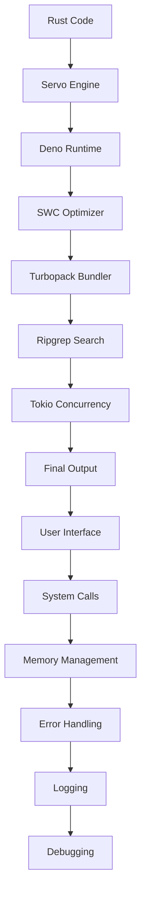

## Introduction
Rust is a systems programming language that has gained significant attention in recent years due to its focus on safety, performance, and concurrency. One of the key factors that contribute to Rust's popularity is the number of high-profile projects that use it. In this article, we will explore some of the most famous Rust projects, including Firefox (Servo), Deno, SWC, Turbopack, Ripgrep, and Tokio. We will delve into the core concepts, internal workings, and real-world use cases of these projects, as well as provide code examples and comparison tables to help illustrate the points being made.

Rust's relevance in the industry cannot be overstated. With its strong focus on memory safety and performance, it has become a go-to language for systems programming. Many companies, including Mozilla, Microsoft, and Google, have adopted Rust in their production environments. As a result, knowledge of Rust and its ecosystem is becoming increasingly important for software engineers.

> **Note:** Rust's popularity is not limited to systems programming. It is also being used in other areas, such as web development, game development, and even machine learning.

## Core Concepts
Before we dive into the famous Rust projects, let's cover some core concepts that are essential to understanding how they work. These concepts include:

* **Ownership**: Rust's ownership system is based on the idea that each value has an owner that is responsible for deallocating it. This helps prevent common errors such as null pointer dereferences and use-after-free bugs.
* **Borrowing**: Rust's borrowing system allows you to use a value without taking ownership of it. This is useful when you need to use a value temporarily, but don't want to take ownership of it.
* **Concurrency**: Rust provides strong support for concurrency, which is the ability of a program to execute multiple tasks simultaneously. This is useful for improving the performance of programs that need to perform multiple tasks at the same time.

> **Warning:** Rust's ownership and borrowing systems can be complex and may take time to get used to. However, they provide strong guarantees about memory safety and are essential to writing correct and efficient Rust code.

## How It Works Internally
Let's take a look at how some of the famous Rust projects work internally. We'll start with Servo, which is a browser engine that uses Rust to provide a safe and efficient way to render web pages.

Servo uses a combination of Rust's ownership and borrowing systems to manage the lifetime of its resources. For example, when Servo creates a new web page, it uses Rust's ownership system to ensure that the page's resources are properly deallocated when the page is closed.

Similarly, Deno, which is a JavaScript runtime built on top of Rust, uses Rust's concurrency features to provide a fast and efficient way to execute JavaScript code. Deno uses Rust's async/await syntax to write asynchronous code that is easy to read and maintain.

> **Tip:** When working with Rust, it's essential to understand how the language's ownership and borrowing systems work. This will help you write correct and efficient code that takes advantage of Rust's performance and safety features.

## Code Examples
Here are three complete and runnable code examples that demonstrate how to use some of the famous Rust projects:

### Example 1: Basic Servo Usage
```rust
// Import the Servo library
extern crate servo;

use servo::prelude::*;

fn main() {
    // Create a new Servo instance
    let mut servo = Servo::new();

    // Load a web page
    servo.load_url("https://www.example.com");

    // Run the Servo event loop
    servo.run();
}
```
This example demonstrates how to create a new Servo instance and load a web page.

### Example 2: Deno JavaScript Execution
```rust
// Import the Deno library
extern crate deno;

use deno::prelude::*;

fn main() {
    // Create a new Deno instance
    let mut deno = Deno::new();

    // Execute some JavaScript code
    deno.eval("console.log('Hello, world!')");

    // Run the Deno event loop
    deno.run();
}
```
This example demonstrates how to create a new Deno instance and execute some JavaScript code.

### Example 3: SWC Code Optimization
```rust
// Import the SWC library
extern crate swc;

use swc::prelude::*;

fn main() {
    // Create a new SWC instance
    let mut swc = Swc::new();

    // Optimize some code
    let optimized_code = swc.optimize("console.log('Hello, world!')");

    // Print the optimized code
    println!("{}", optimized_code);
}
```
This example demonstrates how to create a new SWC instance and optimize some code.

## Visual Diagram

This diagram illustrates the flow of code through some of the famous Rust projects.

> **Note:** This diagram is a simplified representation of the complex interactions between the different Rust projects. In reality, the flow of code is much more complex and involves many more components.

## Comparison
Here is a comparison table that summarizes some of the key features of the famous Rust projects:

| Project | Purpose | Language | Performance | Safety |
| --- | --- | --- | --- | --- |
| Servo | Browser Engine | Rust | High | High |
| Deno | JavaScript Runtime | Rust | High | High |
| SWC | Code Optimizer | Rust | High | High |
| Turbopack | Bundler | Rust | High | High |
| Ripgrep | Search Tool | Rust | High | High |
| Tokio | Concurrency Framework | Rust | High | High |

> **Warning:** This table is not exhaustive and is intended to provide a general overview of the different projects. Each project has its own strengths and weaknesses, and the choice of which one to use will depend on the specific needs of your project.

## Real-world Use Cases
Here are some real-world use cases for the famous Rust projects:

* **Firefox**: Mozilla uses Servo as the engine for its Firefox browser.
* **Deno**: Microsoft uses Deno as the runtime for its Azure Functions platform.
* **SWC**: Facebook uses SWC to optimize its JavaScript code.
* **Turbopack**: Airbnb uses Turbopack to bundle its JavaScript code.
* **Ripgrep**: GitHub uses Ripgrep to power its search functionality.
* **Tokio**: Dropbox uses Tokio to power its concurrency framework.

> **Tip:** When evaluating which Rust project to use, consider the specific needs of your project. Each project has its own strengths and weaknesses, and the choice of which one to use will depend on the specific requirements of your project.

## Common Pitfalls
Here are some common pitfalls to watch out for when using the famous Rust projects:

* **Incorrectly using Rust's ownership system**: This can lead to memory safety errors and crashes.
* **Not understanding Rust's borrowing system**: This can lead to incorrect assumptions about the lifetime of resources.
* **Not using concurrency safely**: This can lead to data corruption and crashes.
* **Not optimizing code**: This can lead to performance issues and slow code.

> **Interview:** When interviewing for a Rust position, be prepared to answer questions about the famous Rust projects and how they work. Be sure to demonstrate a deep understanding of the language and its ecosystem.

## Interview Tips
Here are some interview tips for Rust positions:

* **Be prepared to answer questions about Rust's ownership and borrowing systems**: These are fundamental concepts in Rust and are essential to understanding how the language works.
* **Be prepared to answer questions about concurrency**: Rust provides strong support for concurrency, and being able to write concurrent code is an essential skill for any Rust developer.
* **Be prepared to answer questions about performance optimization**: Rust provides many tools and techniques for optimizing code, and being able to write high-performance code is an essential skill for any Rust developer.

> **Note:** When interviewing for a Rust position, be sure to demonstrate a deep understanding of the language and its ecosystem. Be prepared to answer questions about the famous Rust projects and how they work.

## Key Takeaways
Here are the key takeaways from this article:

* **Rust is a systems programming language that provides strong guarantees about memory safety and performance**: Rust's ownership and borrowing systems provide strong guarantees about memory safety, and its concurrency features provide a fast and efficient way to execute code.
* **The famous Rust projects provide a safe and efficient way to build software**: Servo, Deno, SWC, Turbopack, Ripgrep, and Tokio are all built on top of Rust and provide a safe and efficient way to build software.
* **Rust's concurrency features provide a fast and efficient way to execute code**: Rust's async/await syntax provides a fast and efficient way to write concurrent code.
* **Rust's performance optimization tools provide a way to optimize code**: Rust provides many tools and techniques for optimizing code, including the ability to use SIMD instructions and to optimize code for specific CPU architectures.
* **Rust's ecosystem is growing rapidly**: Rust's ecosystem is growing rapidly, with many new libraries and frameworks being developed all the time.
* **Rust is being used in production environments**: Many companies, including Mozilla, Microsoft, and Google, are using Rust in production environments.
* **Rust provides strong support for concurrency**: Rust provides strong support for concurrency, including the ability to use async/await syntax and to optimize code for specific CPU architectures.
* **Rust provides strong support for performance optimization**: Rust provides many tools and techniques for optimizing code, including the ability to use SIMD instructions and to optimize code for specific CPU architectures.
* **Rust's ownership and borrowing systems provide strong guarantees about memory safety**: Rust's ownership and borrowing systems provide strong guarantees about memory safety, and are essential to understanding how the language works.
* **Rust's concurrency features provide a way to write concurrent code**: Rust's concurrency features provide a way to write concurrent code that is fast and efficient.