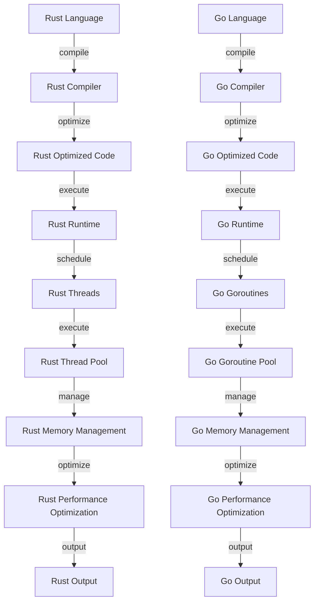

## Introduction
Rust and Go are two popular programming languages known for their focus on performance, reliability, and simplicity. While both languages share some similarities, they have distinct design philosophies and use cases. In this article, we will delve into the world of Rust and Go, exploring their core concepts, internal mechanics, and performance characteristics. We will also examine real-world examples, common pitfalls, and interview tips to help you decide which language is best for your next project.

Rust is a **systems programming language** that prioritizes **memory safety** and **performance**. It achieves this through its unique ownership system and borrow checker, which ensure that memory is managed safely and efficiently. Go, on the other hand, is a **concurrent programming language** that focuses on **simplicity** and **ease of use**. It provides a lightweight goroutine scheduling system and a simple concurrency model, making it ideal for building scalable and concurrent systems.

> **Note:** Both Rust and Go are designed to be **compiled languages**, which means they can provide better performance and reliability compared to interpreted languages like Python or JavaScript.

## Core Concepts
To understand the performance and simplicity trade-offs between Rust and Go, it's essential to grasp their core concepts. Rust's **ownership system** is based on the idea that each value has a single owner that is responsible for deallocating it. This approach ensures that memory is managed safely and efficiently, preventing common errors like null pointer dereferences and data races. Go's **goroutine scheduling system**, on the other hand, provides a lightweight way to manage concurrent tasks. Goroutines are scheduled cooperatively, which means they yield control to other goroutines voluntarily, reducing the overhead of context switching.

> **Tip:** When working with Rust, it's crucial to understand the **borrow checker**, which ensures that references to values are valid and do not outlive the values themselves. In Go, it's essential to understand the **channel** concept, which provides a safe and efficient way to communicate between goroutines.

## How It Works Internally
To appreciate the performance differences between Rust and Go, let's take a look at their internal mechanics. Rust's **compiler** is designed to optimize code for performance, using techniques like **dead code elimination** and **loop unrolling**. The Rust **standard library** provides a set of optimized data structures and algorithms, including **vectors**, **hash maps**, and **sort** functions. Go's **compiler**, on the other hand, is designed to optimize code for simplicity and ease of use, using techniques like **inlining** and **constant folding**. The Go **runtime** provides a set of built-in functions for managing concurrency, including **goroutine scheduling** and **channel communication**.

> **Warning:** When working with Rust, it's essential to avoid **panics**, which can occur when the borrow checker or ownership system detects an error. In Go, it's crucial to avoid **deadlocks**, which can occur when goroutines are blocked indefinitely, waiting for each other to release resources.

## Code Examples
Here are three complete and runnable code examples that demonstrate the performance and simplicity trade-offs between Rust and Go:

### Example 1: Basic Hello World (Rust)
```rust
// Define a main function that prints "Hello, World!" to the console
fn main() {
    println!("Hello, World!");
}
```
This example demonstrates the simplicity of Rust's syntax and the ease of use of its **println!** macro.

### Example 2: Concurrent Hello World (Go)
```go
// Define a main function that starts two goroutines to print "Hello, World!" to the console
package main

import (
    "fmt"
    "time"
)

func helloWorld() {
    fmt.Println("Hello, World!")
}

func main() {
    go helloWorld()
    time.Sleep(1 * time.Second)
    fmt.Println("Main goroutine finished")
}
```
This example demonstrates the simplicity of Go's concurrency model and the ease of use of its **goroutine** concept.

### Example 3: Advanced Concurrency (Rust)
```rust
// Define a main function that starts two threads to print "Hello, World!" to the console
use std::thread;

fn hello_world() {
    println!("Hello, World!");
}

fn main() {
    let handle = thread::spawn(hello_world);
    handle.join().unwrap();
    println!("Main thread finished");
}
```
This example demonstrates the performance and reliability of Rust's concurrency model, using **thread** and **join** functions to manage concurrent tasks.

## Visual Diagram

This diagram illustrates the internal mechanics of Rust and Go, highlighting their respective compilation, optimization, and execution pipelines.

## Comparison
Here is a comparison table that summarizes the performance and simplicity trade-offs between Rust and Go:

| Approach | Time Complexity | Space Complexity | Pros | Cons | Best For |
| --- | --- | --- | --- | --- | --- |
| Rust | O(1) | O(1) | Performance, reliability, memory safety | Steep learning curve, verbose syntax | Systems programming, concurrent systems |
| Go | O(1) | O(1) | Simplicity, ease of use, concurrency | Limited performance, limited control | Concurrent systems, network programming |
| C++ | O(1) | O(1) | Performance, control, flexibility | Complex syntax, error-prone | Systems programming, game development |
| Java | O(1) | O(1) | Simplicity, ease of use, platform independence | Limited performance, verbose syntax | Enterprise software development, Android app development |

## Real-world Use Cases
Here are three real-world examples of Rust and Go in production:

* **Rust:** The **Firefox** browser uses Rust to implement its **Quantum** engine, which provides a fast and secure rendering pipeline. Rust's performance and reliability features make it an ideal choice for building high-performance systems.
* **Go:** The **Docker** containerization platform uses Go to implement its **daemon** and **client** components. Go's simplicity and concurrency features make it an ideal choice for building scalable and concurrent systems.
* **Rust:** The **Dropbox** file synchronization service uses Rust to implement its **file system** and **networking** components. Rust's performance and reliability features make it an ideal choice for building high-performance and secure systems.

## Common Pitfalls
Here are four common mistakes to avoid when working with Rust and Go:

* **Rust:** Avoid using **raw pointers** and **unsafe** code blocks, which can compromise memory safety and performance.
* **Go:** Avoid using **goroutine** leaks, which can occur when goroutines are not properly cleaned up, leading to memory leaks and performance issues.
* **Rust:** Avoid using **unbounded recursion**, which can lead to stack overflows and performance issues.
* **Go:** Avoid using **channel** deadlocks, which can occur when goroutines are blocked indefinitely, waiting for each other to release resources.

## Interview Tips
Here are three common interview questions for Rust and Go, along with weak and strong answers:

* **Question:** What is the difference between Rust's **ownership system** and Go's **goroutine scheduling system**?
* **Weak answer:** "Rust's ownership system is like Go's goroutine scheduling system, but with more complexity."
* **Strong answer:** "Rust's ownership system is designed to provide memory safety and performance, while Go's goroutine scheduling system is designed to provide simplicity and concurrency. Rust's ownership system uses a borrow checker to ensure that memory is managed safely and efficiently, while Go's goroutine scheduling system uses a lightweight scheduling algorithm to manage concurrent tasks."
* **Question:** How do you optimize the performance of a Rust program?
* **Weak answer:** "I use **cargo** to build and run the program, and I try to avoid using **unsafe** code blocks."
* **Strong answer:** "I use **cargo** to build and run the program, and I optimize the performance by using **loop unrolling**, **dead code elimination**, and **inline functions**. I also avoid using **raw pointers** and **unbounded recursion**, which can compromise performance and memory safety."
* **Question:** How do you handle concurrency in a Go program?
* **Weak answer:** "I use **goroutines** and **channels** to manage concurrent tasks, but I'm not sure how to avoid deadlocks."
* **Strong answer:** "I use **goroutines** and **channels** to manage concurrent tasks, and I avoid deadlocks by using **select** statements and **timeouts**. I also use **mutexes** and **semaphores** to synchronize access to shared resources, and I avoid using **channel** leaks, which can lead to memory leaks and performance issues."

## Key Takeaways
Here are ten key takeaways to remember when working with Rust and Go:

* **Rust's ownership system** provides memory safety and performance, but can be complex to learn.
* **Go's goroutine scheduling system** provides simplicity and concurrency, but can be limited in performance.
* **Rust's performance** is optimized through **loop unrolling**, **dead code elimination**, and **inline functions**.
* **Go's concurrency** is managed through **goroutines**, **channels**, and **select** statements.
* **Rust's memory safety** is ensured through **borrow checking** and **ownership**.
* **Go's memory management** is handled through **garbage collection** and **channel** communication.
* **Rust's learning curve** is steep, but provides a powerful and flexible programming language.
* **Go's learning curve** is gentle, but provides a simple and easy-to-use programming language.
* **Rust's use cases** include systems programming, concurrent systems, and high-performance applications.
* **Go's use cases** include concurrent systems, network programming, and cloud computing.