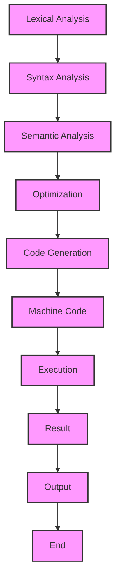

## Introduction
Rust is a **systems programming language** that prioritizes **safety** and **performance**. It aims to give developers fine-grained control over memory management and performance, while also providing a high-level, expressive syntax. Rust's focus on safety and performance makes it an attractive choice for systems programming, where reliability and efficiency are crucial. 
> **Note:** Rust is designed to replace C and C++ in systems programming, offering a more modern and safe alternative.

Rust's real-world relevance can be seen in its adoption by companies such as **Microsoft**, **Amazon**, and **Google**. For example, Microsoft uses Rust in its **Windows** operating system, and Amazon uses it in its **AWS** cloud infrastructure. 
> **Tip:** Rust's focus on safety and performance makes it a great choice for building **operating systems**, **file systems**, and **network protocols**.

Every engineer should know Rust because it offers a unique combination of **safety**, **performance**, and **concurrency** features that make it an ideal choice for building **reliable** and **efficient** systems. 
> **Warning:** Rust has a steep learning curve, but the benefits of using it far outweigh the costs.

## Core Concepts
Rust's core concepts include **ownership**, **borrowing**, and **lifetimes**. **Ownership** refers to the idea that each value in Rust has an owner that is responsible for deallocating the value's memory when it is no longer needed. **Borrowing** allows values to be used without taking ownership of them, and **lifetimes** specify the scope for which a value is valid.
> **Interview:** Be prepared to explain the difference between **move semantics** and **borrowing** in Rust.

Rust also has a strong focus on **concurrency**, which allows developers to write efficient and safe concurrent code using **threads** and **async/await**. 
> **Note:** Rust's **async/await** syntax is designed to make concurrent programming easier and more intuitive.

## How It Works Internally
Rust's compiler, **rustc**, uses a combination of **LLVM** and **Cranelift** to generate machine code. The **LLVM** compiler infrastructure provides a framework for building compilers, and **Cranelift** is a Rust-specific backend that generates machine code for various platforms.
> **Tip:** Rust's **Cranelift** backend is designed to optimize performance and generate efficient machine code.

Here is a step-by-step breakdown of how Rust works internally:
1. **Lexical analysis**: The **rustc** compiler performs lexical analysis on the source code, breaking it into tokens.
2. **Syntax analysis**: The **rustc** compiler performs syntax analysis on the tokens, parsing the source code into an abstract syntax tree (AST).
3. **Semantic analysis**: The **rustc** compiler performs semantic analysis on the AST, checking for type errors and other semantic issues.
4. **Optimization**: The **rustc** compiler performs optimization on the AST, applying various optimization techniques to improve performance.
5. **Code generation**: The **rustc** compiler generates machine code for the optimized AST using the **Cranelift** backend.

## Code Examples
### Example 1: Basic Usage
```rust
// This is a basic "Hello, World!" program in Rust
fn main() {
    println!("Hello, World!"); // Print "Hello, World!" to the console
}
```
This example demonstrates basic usage of Rust, including the **main** function and the **println!** macro.

### Example 2: Real-World Pattern
```rust
// This example demonstrates a real-world pattern in Rust: using a struct to represent a point in 2D space
struct Point {
    x: f64, // The x-coordinate of the point
    y: f64, // The y-coordinate of the point
}

impl Point {
    // This method calculates the distance between two points
    fn distance(&self, other: &Point) -> f64 {
        ((self.x - other.x).powi(2) + (self.y - other.y).powi(2)).sqrt()
    }
}

fn main() {
    let p1 = Point { x: 1.0, y: 2.0 }; // Create a point at (1, 2)
    let p2 = Point { x: 4.0, y: 6.0 }; // Create a point at (4, 6)
    println!("The distance between the two points is: {}", p1.distance(&p2)); // Print the distance between the two points
}
```
This example demonstrates a real-world pattern in Rust, including the use of **structs** and **impl** blocks to define methods on those structs.

### Example 3: Advanced Usage
```rust
// This example demonstrates advanced usage of Rust: using async/await to perform concurrent I/O operations
use std::io;
use std::net::TcpStream;

async fn handle_client(stream: TcpStream) -> io::Result<()> {
    // Read data from the client
    let mut buffer = [0; 512];
    stream.read(&mut buffer)?;
    println!("Received data from client: {}", String::from_utf8_lossy(&buffer));

    // Write data back to the client
    stream.write(b"Hello, client!")?;
    Ok(())
}

#[tokio::main]
async fn main() -> io::Result<()> {
    // Create a TCP listener
    let listener = std::net::TcpListener::bind("127.0.0.1:8080")?;
    println!("Server listening on port 8080...");

    // Accept incoming connections and handle them concurrently
    loop {
        let (stream, _) = listener.accept().await?;
        tokio::spawn(handle_client(stream));
    }
}
```
This example demonstrates advanced usage of Rust, including the use of **async/await** to perform concurrent I/O operations.

## Visual Diagram

This diagram illustrates the steps involved in the Rust compilation process, from **lexical analysis** to **execution**.

## Comparison
| Language | Safety Features | Performance | Concurrency Support |
| --- | --- | --- | --- |
| Rust | Ownership, borrowing, lifetimes | High | Strong support for async/await and threads |
| C++ | None | High | Limited support for concurrency |
| Java | Garbage collection | Medium | Strong support for concurrency |
| Python | Garbage collection | Low | Limited support for concurrency |
> **Note:** This comparison is not exhaustive, but it highlights the key differences between Rust and other popular programming languages.

## Real-world Use Cases
1. **Microsoft**: Microsoft uses Rust in its **Windows** operating system to build **safe** and **efficient** system components.
2. **Amazon**: Amazon uses Rust in its **AWS** cloud infrastructure to build **scalable** and **reliable** cloud services.
3. **Google**: Google uses Rust in its **Fuchsia** operating system to build **secure** and **efficient** system components.

## Common Pitfalls
1. **Ownership issues**: Rust's ownership system can be tricky to navigate, especially for developers without experience with systems programming.
2. **Borrowing issues**: Rust's borrowing system can be confusing, especially when dealing with **lifetimes** and **borrow checks**.
3. **Concurrency issues**: Rust's concurrency features can be difficult to use correctly, especially when dealing with **async/await** and **threads**.
4. **Error handling**: Rust's error handling system can be verbose, especially when dealing with **Result** and **Option** types.

## Interview Tips
1. **Explain the difference between move semantics and borrowing**: Be prepared to explain the difference between **move semantics** and **borrowing** in Rust, including the implications for **ownership** and **lifetimes**.
2. **Describe a scenario where you would use async/await**: Be prepared to describe a scenario where you would use **async/await** in Rust, including the benefits and challenges of using **concurrent** programming.
3. **Explain how Rust's ownership system works**: Be prepared to explain how Rust's **ownership** system works, including the role of **lifetimes** and **borrow checks**.

## Key Takeaways
* Rust is a **systems programming language** that prioritizes **safety** and **performance**.
* Rust's **ownership** system is designed to prevent **null pointer dereferences** and **data corruption**.
* Rust's **borrowing** system is designed to allow for **efficient** and **safe** use of **shared** data.
* Rust's **concurrency** features are designed to make **concurrent** programming **safe** and **efficient**.
* Rust's **error handling** system is designed to make **error handling** **explicit** and **safe**.
* Rust is used in **real-world** systems, including **Microsoft Windows** and **Amazon AWS**.
> **Warning:** Rust has a steep learning curve, but the benefits of using it far outweigh the costs.