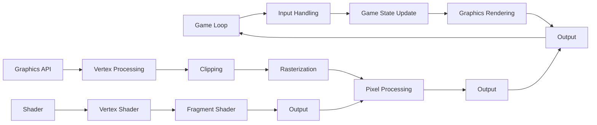

## Introduction
**Game Engines and Graphics** are crucial components of the gaming industry, enabling developers to create immersive and engaging experiences for players. A game engine is a software framework that provides the necessary tools and infrastructure to build and run games, while graphics refer to the visual aspects of the game, including 2D and 3D rendering, lighting, and special effects. In this section, we will explore the importance of game engines and graphics, their real-world relevance, and why every engineer should have a solid understanding of these concepts.

Game engines and graphics are not limited to the gaming industry; they are also used in various fields such as film, architecture, and education. For instance, game engines like **Unreal Engine** and **Unity** are used to create interactive simulations, virtual reality experiences, and architectural visualizations. The demand for skilled game engine and graphics developers is on the rise, making it an exciting and rewarding career path for software engineers.

> **Note:** The global game engine market is expected to reach $5.5 billion by 2025, growing at a CAGR of 14.1% from 2020 to 2025.

## Core Concepts
To understand game engines and graphics, we need to familiarize ourselves with some key concepts:

* **Game Loop**: The game loop is the main loop that runs the game, handling user input, updating game state, and rendering graphics.
* **Rendering Pipeline**: The rendering pipeline is the process of converting 3D models and scenes into 2D images that can be displayed on the screen.
* **Graphics API**: A graphics API is a set of functions and protocols that allow developers to access and manipulate graphics hardware.
* **Shader**: A shader is a small program that runs on the graphics processing unit (GPU) to perform tasks such as lighting, texture mapping, and vertex transformation.

Mental models and analogies can help us better understand these concepts. For example, the game loop can be thought of as a continuous cycle of input, processing, and output, similar to a manufacturing production line. The rendering pipeline can be visualized as a series of stages, each responsible for a specific task, such as vertex processing, clipping, and rasterization.

## How It Works Internally
Let's take a closer look at how game engines and graphics work internally. The game engine is responsible for managing the game loop, handling user input, and updating game state. The graphics engine, on the other hand, is responsible for rendering the game world, including 2D and 3D models, lighting, and special effects.

The rendering pipeline involves several stages, including:

1. **Vertex Processing**: The vertex processing stage is responsible for transforming 3D models into screen space.
2. **Clipping**: The clipping stage is responsible for removing objects that are outside the view frustum.
3. **Rasterization**: The rasterization stage is responsible for converting 3D models into 2D pixels.
4. **Pixel Processing**: The pixel processing stage is responsible for applying textures, lighting, and special effects to the pixels.

The graphics API provides a set of functions and protocols that allow developers to access and manipulate graphics hardware. The most common graphics APIs are **OpenGL**, **DirectX**, and **Vulkan**.

> **Warning:** Using outdated or deprecated graphics APIs can lead to performance issues and compatibility problems.

## Code Examples
Here are three complete and runnable code examples that demonstrate the basics of game engines and graphics:

### Example 1: Basic Game Loop
```rust
use std::time::Duration;
use std::thread;

fn main() {
    let mut game_loop = GameLoop::new();
    game_loop.run();
}

struct GameLoop {
    running: bool,
}

impl GameLoop {
    fn new() -> Self {
        GameLoop { running: true }
    }

    fn run(&mut self) {
        while self.running {
            // Handle user input
            // Update game state
            // Render graphics
            thread::sleep(Duration::from_millis(16));
        }
    }
}
```

### Example 2: 3D Rendering with OpenGL
```rust
use glutin::event::{Event, WindowEvent};
use glutin::window::WindowBuilder;
use glutin::ContextBuilder;
use glutin::GlProfile;

fn main() {
    let window = WindowBuilder::new()
        .with_title("3D Rendering Example")
        .build()
        .unwrap();

    let context = ContextBuilder::new()
        .with_gl_profile(GlProfile::Core)
        .build_windowed(window)
        .unwrap();

    context.make_current().unwrap();

    let mut vertex_buffer = Vec::new();
    let mut index_buffer = Vec::new();

    // Create 3D mesh
    vertex_buffer.push(0.0, 0.0, 0.0);
    vertex_buffer.push(1.0, 0.0, 0.0);
    vertex_buffer.push(1.0, 1.0, 0.0);
    vertex_buffer.push(0.0, 1.0, 0.0);

    index_buffer.push(0, 1, 2);
    index_buffer.push(2, 3, 0);

    // Render 3D mesh
    loop {
        context.clear_color(0.0, 0.0, 0.0, 1.0);
        context.clear(gl::COLOR_BUFFER_BIT);

        // Draw 3D mesh
        gl::DrawElements(gl::TRIANGLES, index_buffer.len() as i32, gl::UNSIGNED_INT, std::ptr::null());

        context.swap_buffers().unwrap();
    }
}
```

### Example 3: Advanced Graphics with Vulkan
```rust
use vulkan::instance::Instance;
use vulkan::device::Device;
use vulkan::physical_device::PhysicalDevice;
use vulkan::command_buffer::CommandBuffer;

fn main() {
    // Create Vulkan instance
    let instance = Instance::new().unwrap();

    // Create physical device
    let physical_device = instance
        .enumerate_physical_devices()
        .unwrap()
        .into_iter()
        .next()
        .unwrap();

    // Create logical device
    let device = Device::new(physical_device, &[]).unwrap();

    // Create command buffer
    let command_buffer = CommandBuffer::new(device).unwrap();

    // Create graphics pipeline
    let pipeline = device
        .create_graphics_pipelines(
            &[
                vulkan::pipeline::GraphicsPipelineCreateInfo::new(
                    &vulkan::pipeline::PipelineShaderStageCreateInfo::new(
                        vulkan::pipeline::ShaderStage::VERTEX,
                        &vulkan::shader::ShaderModule::new(device, &[]).unwrap(),
                    ),
                    &vulkan::pipeline::PipelineVertexInputStateCreateInfo::new(),
                    &vulkan::pipeline::PipelineInputAssemblyStateCreateInfo::new(),
                ),
            ],
        )
        .unwrap()
        .into_iter()
        .next()
        .unwrap();

    // Render graphics
    loop {
        // Acquire image
        let image = device.acquire_next_image(physical_device, &[]).unwrap();

        // Record command buffer
        command_buffer.begin().unwrap();
        command_buffer.bind_pipeline(pipeline).unwrap();
        command_buffer.draw(3, 1, 0, 0).unwrap();
        command_buffer.end().unwrap();

        // Submit command buffer
        device.submit(&[command_buffer], &[]).unwrap();
    }
}
```

## Visual Diagram

The diagram illustrates the game loop, graphics rendering pipeline, and shader stages. The game loop handles user input, updates game state, and renders graphics, while the graphics rendering pipeline involves vertex processing, clipping, rasterization, and pixel processing. The shader stages include vertex and fragment shaders.

> **Tip:** Using a graphics debugger like **RenderDoc** or **GPU Debugging** can help you optimize and debug your graphics rendering pipeline.

## Comparison
| Approach | Time Complexity | Space Complexity | Pros | Cons | Best For |
| --- | --- | --- | --- | --- | --- |
| OpenGL | O(n) | O(n) | Easy to learn, cross-platform | Outdated, limited features | Simple 2D and 3D graphics |
| DirectX | O(n) | O(n) | High-performance, feature-rich | Windows-only, complex | Complex 3D graphics and games |
| Vulkan | O(n) | O(n) | High-performance, cross-platform | Steep learning curve, complex | Complex 3D graphics and games |
| WebGL | O(n) | O(n) | Cross-platform, web-based | Limited features, performance issues | Simple 2D and 3D graphics in web browsers |

## Real-world Use Cases
Here are three real-world examples of game engines and graphics in production:

1. **Unreal Engine**: **Epic Games** uses Unreal Engine to develop high-performance, visually stunning games like **Fortnite** and **Gears of War**.
2. **Unity**: **Unity** is used by **Ubisoft** to develop games like **Assassin's Creed** and **Far Cry**, as well as by **Disney** to create interactive experiences like **Disney Infinity**.
3. **Vulkan**: **Google** uses Vulkan to develop high-performance, cross-platform graphics applications like **Google Earth** and **Google Maps**.

> **Interview:** What are the differences between OpenGL and Vulkan? How would you choose between them for a game development project?

## Common Pitfalls
Here are four common mistakes that game engine and graphics developers make:

1. **Incorrect Vertex Buffer Format**: Using an incorrect vertex buffer format can lead to rendering issues and performance problems.
2. **Inefficient Shader Code**: Writing inefficient shader code can lead to performance issues and battery drain on mobile devices.
3. **Insufficient Graphics Resource Management**: Failing to manage graphics resources properly can lead to memory leaks and performance issues.
4. **Inadequate Error Handling**: Failing to handle errors properly can lead to crashes and unexpected behavior.

> **Warning:** Using deprecated graphics APIs or outdated graphics drivers can lead to compatibility issues and performance problems.

## Interview Tips
Here are three common interview questions for game engine and graphics developers, along with sample answers:

1. **What is the difference between a game engine and a graphics engine?**
	* Weak answer: "A game engine is for games, and a graphics engine is for graphics."
	* Strong answer: "A game engine is a software framework that provides the necessary tools and infrastructure to build and run games, while a graphics engine is a component of the game engine that handles graphics rendering and related tasks."
2. **How would you optimize a graphics rendering pipeline for performance?**
	* Weak answer: "I would use a faster graphics card."
	* Strong answer: "I would analyze the pipeline, identify bottlenecks, and apply optimizations such as reducing vertex count, using level of detail, and optimizing shader code."
3. **What is the role of a shader in the graphics pipeline?**
	* Weak answer: "A shader is a program that runs on the GPU."
	* Strong answer: "A shader is a small program that runs on the GPU to perform tasks such as lighting, texture mapping, and vertex transformation, and is used to customize the appearance of 3D models and scenes."

## Key Takeaways
Here are ten key takeaways for game engine and graphics developers:

* **Understand the game loop and graphics rendering pipeline**: The game loop and graphics rendering pipeline are the foundation of game development and graphics programming.
* **Choose the right graphics API**: The choice of graphics API depends on the project requirements, performance needs, and target platform.
* **Optimize graphics rendering for performance**: Optimizing graphics rendering for performance is crucial for achieving smooth and responsive gameplay.
* **Use shaders to customize appearance**: Shaders are used to customize the appearance of 3D models and scenes, and are an essential part of graphics programming.
* **Manage graphics resources properly**: Managing graphics resources properly is essential for avoiding memory leaks and performance issues.
* **Handle errors and exceptions**: Handling errors and exceptions is crucial for ensuring robust and reliable game development and graphics programming.
* **Stay up-to-date with industry trends and developments**: Staying up-to-date with industry trends and developments is essential for game engine and graphics developers to stay competitive and deliver high-quality products.
* **Use graphics debuggers and tools**: Using graphics debuggers and tools is essential for optimizing and debugging graphics rendering pipelines.
* **Test and iterate**: Testing and iterating are essential for ensuring that game development and graphics programming projects meet the required standards and quality.
* **Collaborate with other developers and teams**: Collaborating with other developers and teams is essential for delivering high-quality game development and graphics programming projects.

> **Tip:** Joining online communities and forums, such as **GameDev.net** and **Stack Overflow**, can help you stay up-to-date with industry trends and developments, and connect with other game engine and graphics developers.