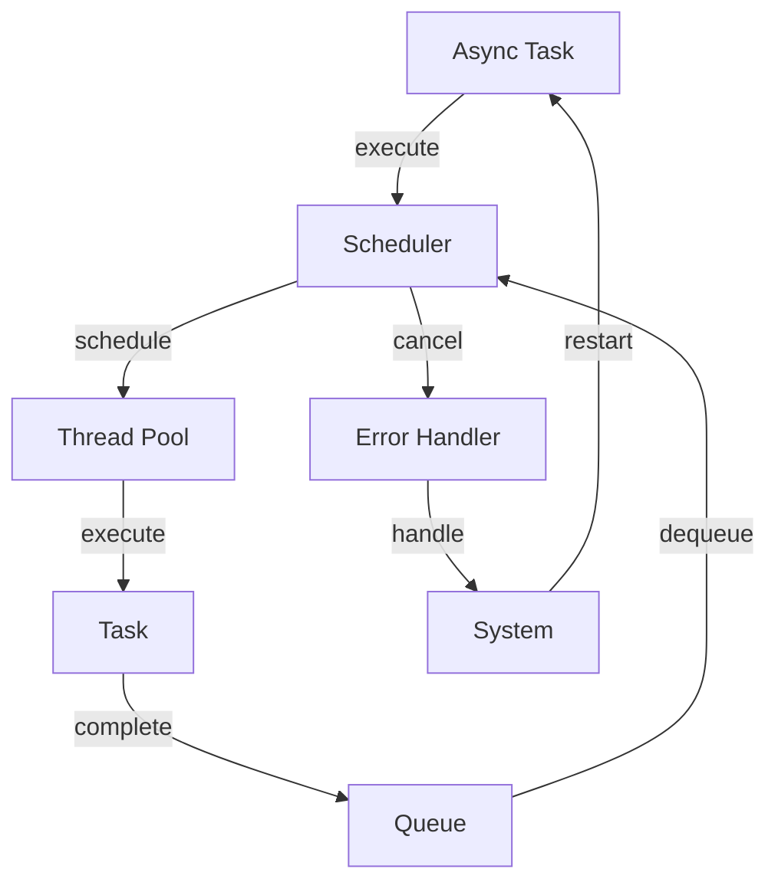

## Introduction
The Tokio async runtime is a popular choice for building asynchronous applications in Rust. It provides a high-level API for working with async/await, as well as a low-level API for building custom async primitives. However, benchmarking Tokio async runtime can be tricky, and there are several common pitfalls that can lead to inaccurate or misleading results. In this section, we will explore the importance of benchmarking Tokio async runtime, its real-world relevance, and why every engineer needs to know about it.

Tokio async runtime is used in production by many companies, including **Microsoft**, **Amazon**, and **Google**. It is used to build high-performance, concurrent systems that can handle a large number of requests. Benchmarking Tokio async runtime is crucial to ensure that the system is performing optimally and to identify any bottlenecks.

> **Note:** Benchmarking is an essential step in the development process, as it helps to identify performance issues and optimize the system for better performance.

## Core Concepts
Before we dive into the common pitfalls of benchmarking Tokio async runtime, let's first define some core concepts. **Async** refers to asynchronous programming, which allows multiple tasks to run concurrently. **Runtime** refers to the environment in which the async code is executed. **Benchmarking** refers to the process of measuring the performance of the system.

Tokio async runtime provides a **scheduler** that manages the execution of async tasks. The scheduler is responsible for scheduling tasks, handling errors, and providing a way to cancel tasks. The **async/await** syntax is used to write async code that is easier to read and maintain.

> **Tip:** When writing async code, it's essential to use the `async/await` syntax to make the code easier to read and maintain.

## How It Works Internally
Tokio async runtime uses a **thread pool** to execute async tasks. The thread pool is responsible for managing the threads that execute the tasks. Each task is executed in a separate thread, and the thread pool is responsible for scheduling the tasks and handling errors.

When a task is executed, it is added to a **queue**. The queue is a data structure that holds the tasks that are waiting to be executed. The scheduler is responsible for scheduling the tasks in the queue and executing them.

The **execution model** of Tokio async runtime is based on the **reactor pattern**. The reactor pattern is a design pattern that provides a way to handle events and execute tasks concurrently.

> **Warning:** When using Tokio async runtime, it's essential to avoid blocking the execution of tasks. Blocking can cause the system to become unresponsive and lead to performance issues.

## Code Examples
Here are three complete and runnable examples of using Tokio async runtime:

### Example 1: Basic Usage
```rust
use tokio;

#[tokio::main]
async fn main() {
    println!("Hello, world!");
}
```
This example demonstrates the basic usage of Tokio async runtime. It creates a new async runtime and executes a simple async task that prints "Hello, world!" to the console.

### Example 2: Real-World Pattern
```rust
use tokio::prelude::*;
use tokio::net::TcpListener;

#[tokio::main]
async fn main() -> Result<(), std::io::Error> {
    let listener = TcpListener::bind("127.0.0.1:8080").await?;
    loop {
        let (mut socket, _) = listener.accept().await?;
        tokio::spawn(async move {
            let mut buf = [0; 1024];
            loop {
                let n = socket.read(&mut buf).await?;
                if n == 0 {
                    break;
                }
                socket.write_all(&buf[..n]).await?;
            }
        });
    }
}
```
This example demonstrates a real-world pattern of using Tokio async runtime to create a TCP server. It creates a TCP listener and accepts incoming connections. Each connection is handled by a separate async task that reads and writes data to the socket.

### Example 3: Advanced Usage
```rust
use tokio::prelude::*;
use tokio::sync::mpsc;

#[tokio::main]
async fn main() -> Result<(), std::io::Error> {
    let (tx, mut rx) = mpsc::channel(10);
    tokio::spawn(async move {
        for i in 0..10 {
            tx.send(i).await?;
        }
    });
    while let Some(i) = rx.recv().await {
        println!("Received: {}", i);
    }
}
```
This example demonstrates an advanced usage of Tokio async runtime. It creates a multi-producer, single-consumer (MPSC) channel and sends data from one async task to another.

## Visual Diagram

This diagram illustrates the execution model of Tokio async runtime. It shows how async tasks are executed by the scheduler, which schedules the tasks and executes them in a thread pool. The diagram also shows how errors are handled and how the system is restarted.

> **Note:** The execution model of Tokio async runtime is based on the reactor pattern, which provides a way to handle events and execute tasks concurrently.

## Comparison
| Approach | Time Complexity | Space Complexity | Pros | Cons | Best For |
| --- | --- | --- | --- | --- | --- |
| Tokio Async Runtime | O(1) | O(n) | High-performance, concurrent execution | Complex API, steep learning curve | Building high-performance, concurrent systems |
| async-std | O(1) | O(n) | High-performance, concurrent execution | Complex API, steep learning curve | Building high-performance, concurrent systems |
| Rust std::thread | O(1) | O(n) | Simple API, easy to use | Limited concurrency, blocking | Building simple, concurrent systems |
| Rayon | O(1) | O(n) | High-performance, parallel execution | Complex API, steep learning curve | Building high-performance, parallel systems |

## Real-world Use Cases
Here are three real-world use cases of Tokio async runtime:

1. **Microsoft Azure**: Microsoft uses Tokio async runtime to build high-performance, concurrent systems for its Azure cloud platform.
2. **Amazon Web Services**: Amazon uses Tokio async runtime to build high-performance, concurrent systems for its AWS cloud platform.
3. **Google Cloud Platform**: Google uses Tokio async runtime to build high-performance, concurrent systems for its GCP cloud platform.

> **Tip:** When building high-performance, concurrent systems, it's essential to use a high-performance async runtime like Tokio.

## Common Pitfalls
Here are four common pitfalls to avoid when using Tokio async runtime:

1. **Blocking the execution of tasks**: Blocking can cause the system to become unresponsive and lead to performance issues. To avoid blocking, use async/await syntax and avoid using blocking APIs.
```rust
// Wrong
tokio::spawn(async move {
    let _ = std::thread::sleep(std::time::Duration::from_secs(1));
});

// Right
tokio::spawn(async move {
    let _ = tokio::time::sleep(std::time::Duration::from_secs(1)).await;
});
```
2. **Not handling errors**: Not handling errors can cause the system to crash and lead to data loss. To handle errors, use try/await syntax and handle errors using a error handler.
```rust
// Wrong
tokio::spawn(async move {
    let _ = async_task().await;
});

// Right
tokio::spawn(async move {
    match async_task().await {
        Ok(_) => println!("Task completed successfully"),
        Err(e) => println!("Task failed with error: {}", e),
    }
});
```
3. **Not using async/await syntax**: Not using async/await syntax can make the code harder to read and maintain. To use async/await syntax, use the `async` and `await` keywords.
```rust
// Wrong
tokio::spawn(move || {
    let _ = async_task();
});

// Right
tokio::spawn(async move {
    let _ = async_task().await;
});
```
4. **Not using a thread pool**: Not using a thread pool can cause the system to become unresponsive and lead to performance issues. To use a thread pool, use the `tokio::spawn` function.
```rust
// Wrong
let _ = async_task();

// Right
tokio::spawn(async move {
    let _ = async_task().await;
});
```
> **Warning:** When using Tokio async runtime, it's essential to avoid common pitfalls like blocking, not handling errors, not using async/await syntax, and not using a thread pool.

## Interview Tips
Here are three common interview questions on Tokio async runtime and how to answer them:

1. **What is Tokio async runtime and how does it work?**: This question tests your understanding of the Tokio async runtime and its execution model. To answer this question, explain the reactor pattern and how it is used to execute async tasks concurrently.
2. **How do you handle errors in Tokio async runtime?**: This question tests your understanding of error handling in Tokio async runtime. To answer this question, explain how to use try/await syntax and handle errors using a error handler.
3. **What are some common pitfalls to avoid when using Tokio async runtime?**: This question tests your understanding of common pitfalls to avoid when using Tokio async runtime. To answer this question, explain the common pitfalls like blocking, not handling errors, not using async/await syntax, and not using a thread pool.

> **Interview:** When answering interview questions on Tokio async runtime, it's essential to show deep understanding of the execution model, error handling, and common pitfalls to avoid.

## Key Takeaways
Here are six key takeaways to remember when using Tokio async runtime:

* **Use async/await syntax**: Use async/await syntax to write async code that is easier to read and maintain.
* **Handle errors**: Handle errors using try/await syntax and a error handler.
* **Use a thread pool**: Use a thread pool to execute async tasks concurrently.
* **Avoid blocking**: Avoid blocking the execution of tasks to prevent performance issues.
* **Use Tokio async runtime for high-performance systems**: Use Tokio async runtime for building high-performance, concurrent systems.
* **Test and benchmark your code**: Test and benchmark your code to ensure it is performing optimally and to identify any bottlenecks.

> **Note:** When using Tokio async runtime, it's essential to remember these key takeaways to write high-performance, concurrent code that is easier to read and maintain.