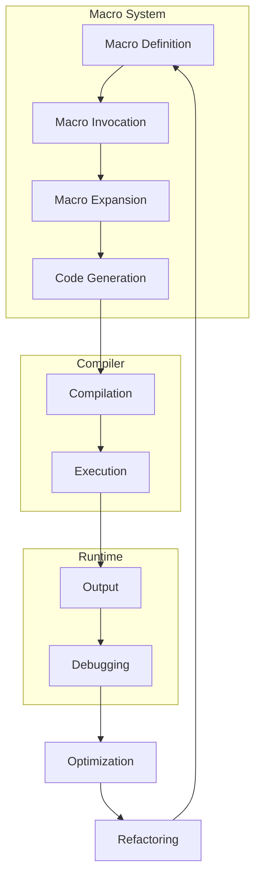

## Introduction
Refactoring macro systems is a crucial step in optimizing high-performance applications. Macros, in the context of programming, are essentially shortcuts that allow developers to generate code at compile-time. However, as the complexity of an application grows, so does the complexity of its macro system. This is where refactoring comes into play. Refactoring involves restructuring existing code without changing its external behavior, making it more maintainable, efficient, and scalable. In this study, we will delve into the world of refactoring macro systems, focusing on declarative and procedural approaches, and explore how they can be applied to high-performance applications, particularly in the Rust programming language.

> **Note:** Refactoring macro systems is not just about improving code readability; it also plays a significant role in enhancing the overall performance of an application. By optimizing macros, developers can significantly reduce compilation time and improve the efficiency of their code.

## Core Concepts
To understand the process of refactoring macro systems, it's essential to grasp the core concepts involved. These include:

- **Macros:** Pieces of code that generate other code at compile-time. In Rust, macros are defined using the `macro` keyword and are typically invoked with an exclamation mark (`!`).
- **Declarative Programming:** A programming paradigm that focuses on what the program should accomplish, rather than how it should accomplish it. Declarative macros in Rust are defined using the `macro_rules!` macro.
- **Procedural Programming:** A paradigm that focuses on the steps the program should take to achieve a specific goal. Procedural macros in Rust are defined using functions that generate code at compile-time.

> **Warning:** While macros can significantly enhance the expressiveness and efficiency of code, they can also introduce complexity and make debugging more challenging. It's crucial to use macros judiciously and ensure they are well-documented.

## How It Works Internally
When a macro is invoked in Rust, the compiler replaces the macro invocation with the expanded code generated by the macro. This process is known as macro expansion. The expanded code is then compiled along with the rest of the program.

Here's a high-level overview of how macro expansion works internally:

1. **Macro Definition:** The macro is defined using the `macro` or `macro_rules!` keywords.
2. **Macro Invocation:** The macro is invoked in the code using the macro name followed by an exclamation mark (`!`).
3. **Macro Expansion:** The compiler expands the macro invocation into the generated code.
4. **Compilation:** The expanded code is then compiled along with the rest of the program.

> **Tip:** To optimize macro expansion, it's essential to minimize the number of macro invocations and use techniques like memoization to cache frequently expanded macros.

## Code Examples
Here are three complete and runnable examples that demonstrate the refactoring of macro systems:

### Example 1: Basic Declarative Macro
```rust
// Define a declarative macro to generate a function
macro_rules! greet {
    ($name:expr) => {
        println!("Hello, {}!", $name);
    };
}

fn main() {
    // Invoke the macro
    greet!("Alice");
}
```

### Example 2: Procedural Macro
```rust
// Define a procedural macro to generate a function
use proc_macro::TokenStream;
use quote::quote;

#[proc_macro]
pub fn greet(input: TokenStream) -> TokenStream {
    let name = input.to_string();
    let expanded = quote! {
        println!("Hello, #name!");
    };
    expanded.into()
}

fn main() {
    // Invoke the macro
    greet!("Bob");
}
```

### Example 3: Advanced Macro Refactoring
```rust
// Define a macro to generate a struct and its implementation
macro_rules! person {
    ($name:expr, $age:expr) => {
        struct Person {
            name: String,
            age: u32,
        }

        impl Person {
            fn new(name: String, age: u32) -> Person {
                Person { name, age }
            }

            fn greet(&self) {
                println!("Hello, my name is {} and I'm {} years old!", self.name, self.age);
            }
        }
    };
}

fn main() {
    // Invoke the macro
    person!("Charlie", 30);
    let person = Person::new("Charlie".to_string(), 30);
    person.greet();
}
```

## Visual Diagram

This diagram illustrates the macro system's workflow, from definition to execution, and highlights the key stages involved in refactoring.

> **Interview:** When asked about the benefits of refactoring macro systems, a strong answer would emphasize the importance of maintaining code readability, reducing compilation time, and improving overall application performance.

## Comparison
The following table compares different approaches to refactoring macro systems:

| Approach | Time Complexity | Space Complexity | Pros | Cons | Best For |
| --- | --- | --- | --- | --- | --- |
| Declarative Macros | O(1) | O(1) | Easy to define, concise code | Limited expressiveness | Simple macros |
| Procedural Macros | O(n) | O(n) | Highly expressive, flexible | Complex to define, verbose code | Complex macros |
| Hybrid Approach | O(n) | O(n) | Balances expressiveness and conciseness | Requires careful design | Large-scale applications |
| Manual Refactoring | O(n) | O(1) | High control, precise optimization | Time-consuming, error-prone | Critical performance bottlenecks |

## Real-world Use Cases
Several companies and systems have successfully refactored their macro systems to achieve significant performance improvements:

1. **Rust's Standard Library:** The Rust team has extensively refactored the standard library's macro system to improve compilation time and reduce code bloat.
2. **Serde:** The Serde serialization framework uses procedural macros to generate efficient serialization code, achieving high performance and low overhead.
3. **Diesel:** The Diesel ORM library employs declarative macros to generate database queries, providing a concise and expressive API.

> **Tip:** When refactoring macro systems, it's essential to use tools like the Rust compiler's `--verbose` flag to analyze and optimize macro expansion.

## Common Pitfalls
Here are four specific mistakes to avoid when refactoring macro systems:

1. **Over-Engineering:** Avoid creating overly complex macros that are difficult to maintain and debug.
2. **Under-Optimization:** Failing to optimize macro expansion can lead to significant performance degradation.
3. **Incorrect Expansion:** Incorrectly expanding macros can result in compilation errors or unexpected behavior.
4. **Insufficient Testing:** Failing to thoroughly test refactored macros can lead to bugs and regressions.

> **Warning:** When using procedural macros, it's crucial to handle errors and exceptions properly to avoid runtime errors.

## Interview Tips
Here are three common interview questions related to refactoring macro systems, along with weak and strong answer examples:

1. **What are the benefits of refactoring macro systems?**
	* Weak answer: "It makes the code look nicer."
	* Strong answer: "Refactoring macro systems improves code readability, reduces compilation time, and enhances overall application performance."
2. **How do you optimize macro expansion?**
	* Weak answer: "I use a lot of macros."
	* Strong answer: "I use techniques like memoization, minimize macro invocations, and optimize macro definitions to reduce expansion time."
3. **What are some common pitfalls when refactoring macro systems?**
	* Weak answer: "I'm not sure."
	* Strong answer: "Common pitfalls include over-engineering, under-optimization, incorrect expansion, and insufficient testing. I always strive to avoid these mistakes when refactoring macro systems."

## Key Takeaways
Here are ten key takeaways to remember when refactoring macro systems:

* Refactoring macro systems is crucial for optimizing high-performance applications.
* Declarative and procedural macros have different use cases and trade-offs.
* Macro expansion can be optimized using techniques like memoization and minimizing invocations.
* Incorrect macro expansion can lead to compilation errors or unexpected behavior.
* Thorough testing is essential to ensure refactored macros work correctly.
* Over-engineering and under-optimization are common pitfalls to avoid.
* The Rust compiler's `--verbose` flag can help analyze and optimize macro expansion.
* Procedural macros can be used to generate efficient serialization code.
* Declarative macros can be used to generate concise and expressive APIs.
* Refactoring macro systems requires careful design and attention to detail to achieve optimal performance and maintainability.