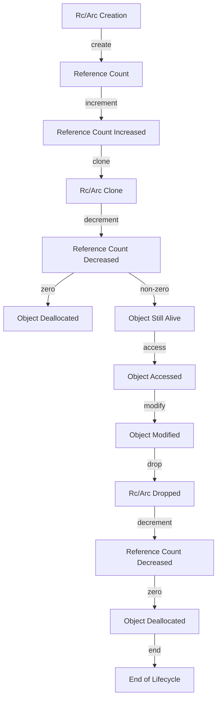

## Introduction
Smart pointers in Rust are a type of abstraction that provides automatic memory management for dynamically allocated objects. They are essential for writing safe and efficient code in Rust. The two most commonly used smart pointers in Rust are **Rc** (Reference Counting) and **Arc** (Atomic Reference Counting). In this article, we will dive deep into the internal workings of these smart pointers, exploring how they work, their advantages, and their use cases.

> **Note:** Smart pointers are a fundamental concept in Rust, and understanding how they work is crucial for any Rust developer.

## Core Concepts
To understand how smart pointers work, we need to grasp the following key concepts:
- **Reference Counting:** A mechanism for keeping track of the number of references to an object. When the reference count reaches zero, the object is deallocated.
- **Ownership:** In Rust, each value has an owner that is responsible for deallocating the value when it is no longer needed.
- **Borrowing:** Borrowing allows you to use a value without taking ownership of it. There are two types of borrowing in Rust: immutable borrowing and mutable borrowing.

> **Warning:** Using smart pointers incorrectly can lead to memory leaks or crashes. It is essential to understand the ownership and borrowing rules in Rust to use smart pointers effectively.

## How It Works Internally
Let's take a closer look at how **Rc** and **Arc** work internally:
- **Rc:** When you create an **Rc** instance, it increments the reference count of the underlying object. When the **Rc** instance goes out of scope, it decrements the reference count. If the reference count reaches zero, the object is deallocated. **Rc** is not thread-safe, meaning it cannot be safely shared between threads.
- **Arc:** **Arc** works similarly to **Rc**, but it uses atomic operations to update the reference count, making it thread-safe. This means you can safely share **Arc** instances between threads.

> **Tip:** Use **Rc** when you need to share data between multiple parts of your program, but you don't need to share it between threads. Use **Arc** when you need to share data between threads.

## Code Examples
Here are three complete and runnable examples of using **Rc** and **Arc** in Rust:
### Example 1: Basic **Rc** Usage
```rust
use std::rc::Rc;

fn main() {
    let rc = Rc::new(5);
    println!("Reference count: {}", Rc::strong_count(&rc));
    {
        let rc_clone = Rc::clone(&rc);
        println!("Reference count: {}", Rc::strong_count(&rc));
    }
    println!("Reference count: {}", Rc::strong_count(&rc));
}
```
### Example 2: Sharing Data with **Arc**
```rust
use std::sync::{Arc, Mutex};
use std::thread;

fn main() {
    let counter = Arc::new(Mutex::new(0));
    let mut handles = vec![];

    for _ in 0..10 {
        let counter_clone = Arc::clone(&counter);
        let handle = thread::spawn(move || {
            let mut num = counter_clone.lock().unwrap();
            *num += 1;
        });
        handles.push(handle);
    }

    for handle in handles {
        handle.join().unwrap();
    }

    println!("Final count: {}", *counter.lock().unwrap());
}
```
### Example 3: Using **Rc** with a Struct
```rust
use std::rc::Rc;

#[derive(Debug)]
struct Person {
    name: String,
    age: u32,
}

fn main() {
    let person = Rc::new(Person {
        name: String::from("John"),
        age: 30,
    });

    println!("{:?}", person);
    {
        let person_clone = Rc::clone(&person);
        println!("{:?}", person_clone);
    }
}
```
## Visual Diagram

The diagram illustrates the lifecycle of an **Rc** or **Arc** instance, from creation to deallocation.

## Comparison
Here's a comparison of **Rc**, **Arc**, and raw pointers:
| Approach | Time Complexity | Space Complexity | Pros | Cons | Best For |
|----------|----------------|-----------------|------|------|----------|
| **Rc** | O(1) | O(1) | Easy to use, flexible | Not thread-safe | Single-threaded programs |
| **Arc** | O(1) | O(1) | Thread-safe, flexible | Slightly slower than **Rc** | Multi-threaded programs |
| Raw Pointer | O(1) | O(1) | Low-level control | Error-prone, manual memory management | Performance-critical code |

## Real-world Use Cases
Here are three real-world use cases for **Rc** and **Arc**:
- **Graph algorithms:** When implementing graph algorithms, you often need to share nodes between multiple parts of the graph. **Rc** or **Arc** can be used to manage the node references.
- **Caching:** When implementing a cache, you need to share data between multiple threads. **Arc** can be used to manage the cache entries.
- **Database connections:** When connecting to a database, you often need to share the connection between multiple parts of the program. **Arc** can be used to manage the connection.

> **Interview:** Be prepared to explain the difference between **Rc** and **Arc**, and when to use each.

## Common Pitfalls
Here are four common pitfalls to watch out for when using **Rc** and **Arc**:
- **Reference cycles:** When using **Rc**, you need to be careful not to create reference cycles, which can prevent the objects from being deallocated.
- **Thread safety:** When using **Rc**, you need to be careful not to share it between threads, as it is not thread-safe.
- **Performance:** When using **Arc**, you need to be aware of the performance overhead of the atomic operations.
- **Memory leaks:** When using **Rc** or **Arc**, you need to be careful not to create memory leaks by forgetting to drop the instances.

## Interview Tips
Here are three common interview questions related to **Rc** and **Arc**:
- **What is the difference between **Rc** and **Arc****?** A strong answer would explain the difference in thread safety and performance.
- **How do you use **Rc** to manage a graph?** A strong answer would explain how to use **Rc** to manage node references and avoid reference cycles.
- **Why would you use **Arc** instead of **Rc****?** A strong answer would explain the need for thread safety and the performance trade-offs.

## Key Takeaways
Here are ten key takeaways to remember:
* **Rc** is not thread-safe, while **Arc** is thread-safe.
* **Rc** is faster than **Arc**, but **Arc** is more flexible.
* **Rc** and **Arc** have a time complexity of O(1) and a space complexity of O(1).
* **Rc** and **Arc** can be used to manage references to objects.
* **Rc** and **Arc** can help prevent memory leaks.
* **Rc** and **Arc** can help improve performance by reducing the number of copies.
* **Rc** and **Arc** can be used to implement graph algorithms and caching.
* **Rc** and **Arc** can be used to manage database connections.
* **Rc** and **Arc** can be used to implement concurrent data structures.
* **Rc** and **Arc** are essential for writing safe and efficient code in Rust.