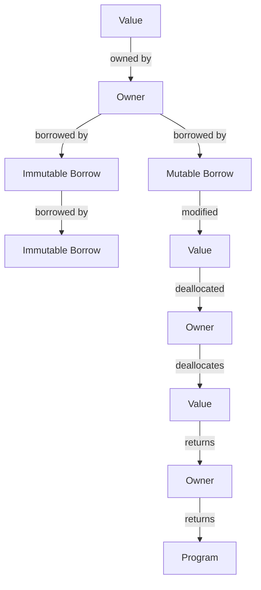

## Introduction
The **Borrow Checker** is a fundamental component of the Rust programming language. It is responsible for enforcing the rules of ownership and borrowing, which are the core of Rust's memory safety guarantees. In this section, we will explore why the Borrow Checker is essential, its real-world relevance, and why every engineer needs to understand its mechanics.

Rust's ownership system is based on the concept of **ownership**, which states that each value in Rust has an owner that is responsible for deallocating it. The **Borrow Checker** ensures that the ownership rules are enforced at compile-time, preventing common errors such as null pointer dereferences and data corruption. The Borrow Checker is a complex system that involves a deep understanding of Rust's syntax, semantics, and type system.

> **Note:** The Borrow Checker is not a runtime component, but rather a compile-time check that ensures the correctness of Rust code.

## Core Concepts
To understand the Borrow Checker, we need to define some key concepts:

* **Ownership**: Each value in Rust has an owner that is responsible for deallocating it.
* **Borrowing**: Borrowing allows you to use a value without taking ownership of it.
* **Mutable borrowing**: Mutable borrowing allows you to modify a value without taking ownership of it.
* **Immutable borrowing**: Immutable borrowing allows you to read a value without taking ownership of it.

The Borrow Checker enforces the following rules:

* You can have multiple immutable borrows of a value.
* You can have one mutable borrow of a value.
* You cannot have both an immutable and a mutable borrow of a value at the same time.

> **Warning:** Violating these rules can result in compile-time errors or runtime errors.

## How It Works Internally
The Borrow Checker works by analyzing the Rust code and enforcing the ownership and borrowing rules. Here is a step-by-step breakdown of how it works:

1. **Syntax analysis**: The Rust compiler analyzes the syntax of the code and identifies the ownership and borrowing patterns.
2. **Semantic analysis**: The compiler performs semantic analysis to ensure that the ownership and borrowing patterns are correct.
3. **Type checking**: The compiler checks the types of the values and ensures that they are compatible with the ownership and borrowing rules.
4. **Borrow checking**: The compiler checks the borrowing rules and ensures that they are enforced correctly.

The Borrow Checker uses a complex algorithm to enforce the borrowing rules. The algorithm involves a graph-based approach that analyzes the ownership and borrowing relationships between values.

> **Tip:** Understanding the internal mechanics of the Borrow Checker can help you write more efficient and effective Rust code.

## Code Examples
Here are three complete and runnable examples that demonstrate the Borrow Checker in action:

### Example 1: Basic Borrowing
```rust
fn main() {
    let s = String::from("hello");
    let len = calculate_length(&s);
    println!("The length of '{}' is {}.", s, len);
}

fn calculate_length(s: &String) -> usize {
    s.len()
}
```
This example demonstrates basic borrowing. The `calculate_length` function takes a reference to a `String` and returns its length.

### Example 2: Mutable Borrowing
```rust
fn main() {
    let mut s = String::from("hello");
    change(&mut s);
    println!("{}", s);
}

fn change(s: &mut String) {
    s.push_str(" world");
}
```
This example demonstrates mutable borrowing. The `change` function takes a mutable reference to a `String` and appends a new string to it.

### Example 3: Advanced Borrowing
```rust
fn main() {
    let mut s = String::from("hello");
    let r1 = &s;
    let r2 = &s;
    println!("{} {}", r1, r2);
    let mut r3 = &mut s;
    r3.push_str(" world");
    println!("{}", r3);
}
```
This example demonstrates advanced borrowing. The `main` function takes multiple references to a `String` and demonstrates the rules of borrowing.

## Visual Diagram

This diagram illustrates the ownership and borrowing relationships between values. The `Value` is owned by an `Owner`, which can borrow it immutably or mutably. The `Immutable Borrow` can be borrowed multiple times, while the `Mutable Borrow` can only be borrowed once.

> **Note:** This diagram simplifies the complex relationships between values and owners.

## Comparison
| Approach | Time Complexity | Space Complexity | Pros | Cons | Best For |
| --- | --- | --- | --- | --- | --- |
| Ownership | O(1) | O(1) | Memory safety, performance | Steep learning curve | Systems programming |
| Borrowing | O(1) | O(1) | Flexibility, convenience | Complexity | Application development |
| Mutable Borrowing | O(1) | O(1) | Performance, flexibility | Complexity | Systems programming |
| Immutable Borrowing | O(1) | O(1) | Safety, convenience | Limited flexibility | Application development |

## Real-world Use Cases
Here are three real-world examples of the Borrow Checker in action:

* **Dropbox**: Dropbox uses Rust to build its file synchronization engine, which relies heavily on the Borrow Checker to ensure memory safety and performance.
* **Firefox**: Mozilla uses Rust to build its Firefox browser, which uses the Borrow Checker to ensure memory safety and performance in its rendering engine.
* **Amazon**: Amazon uses Rust to build its Amazon Web Services (AWS) Lambda platform, which relies on the Borrow Checker to ensure memory safety and performance in its serverless computing environment.

## Common Pitfalls
Here are four common mistakes that engineers make when working with the Borrow Checker:

* **Returning a reference to a local variable**: This can result in a dangling reference, which can cause runtime errors.
* **Borrowing a value that is already borrowed**: This can result in a compile-time error, as the Borrow Checker enforces the rules of borrowing.
* **Mutating a value while it is borrowed**: This can result in a compile-time error, as the Borrow Checker enforces the rules of borrowing.
* **Using a value after it has been dropped**: This can result in a runtime error, as the value is no longer valid.

> **Warning:** These mistakes can be avoided by understanding the rules of the Borrow Checker and following best practices.

## Interview Tips
Here are three common interview questions related to the Borrow Checker:

* **What is the difference between ownership and borrowing in Rust?**: A strong answer should explain the concepts of ownership and borrowing, and how they relate to each other.
* **How does the Borrow Checker work in Rust?**: A strong answer should explain the internal mechanics of the Borrow Checker, including its algorithm and data structures.
* **What are some common pitfalls when working with the Borrow Checker in Rust?**: A strong answer should explain the common mistakes that engineers make when working with the Borrow Checker, and how to avoid them.

> **Interview:** The Borrow Checker is a fundamental component of Rust, and understanding its mechanics is essential for any Rust engineer.

## Key Takeaways
Here are ten key takeaways from this section:

* The Borrow Checker is a fundamental component of Rust that enforces the rules of ownership and borrowing.
* Ownership is the concept that each value in Rust has an owner that is responsible for deallocating it.
* Borrowing allows you to use a value without taking ownership of it.
* The Borrow Checker enforces the rules of borrowing, including the rules of mutable and immutable borrowing.
* The Borrow Checker uses a complex algorithm to enforce the borrowing rules.
* Understanding the internal mechanics of the Borrow Checker can help you write more efficient and effective Rust code.
* The Borrow Checker is not a runtime component, but rather a compile-time check.
* The Borrow Checker can help prevent common errors such as null pointer dereferences and data corruption.
* The Borrow Checker is essential for systems programming and application development.
* Understanding the Borrow Checker is essential for any Rust engineer.

> **Note:** The Borrow Checker is a complex system that requires a deep understanding of Rust's syntax, semantics, and type system.