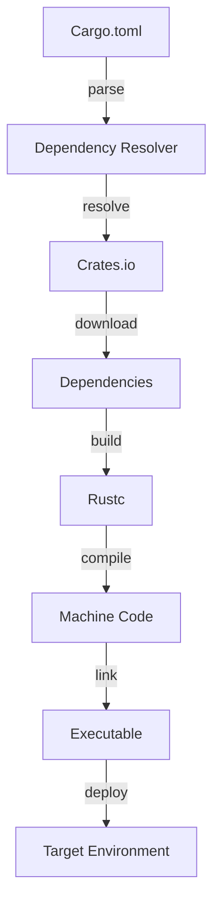

## Introduction
**Cargo** is the package manager for **Rust**, a systems programming language that prioritizes safety and performance. Cargo plays a crucial role in the Rust ecosystem, as it simplifies the process of managing dependencies, building, and deploying Rust applications. In this study guide, we will delve into the lifecycle and mechanics of Cargo, exploring its core concepts, internal workings, and best practices for using it effectively.

> **Note:** Cargo is not just a package manager; it's also a build system, which means it can handle the entire development workflow, from dependency management to compilation and deployment.

Cargo's importance cannot be overstated, as it has become an essential tool for Rust developers. Its simplicity and flexibility have made it a favorite among developers, and its adoption has contributed significantly to the growth of the Rust community. In real-world scenarios, Cargo is used by companies like **Microsoft**, **Google**, and **Amazon** to manage and deploy their Rust applications.

## Core Concepts
To understand Cargo, we need to familiarize ourselves with some key concepts:

* **Cargo.toml**: The configuration file for Cargo, which contains information about the project, its dependencies, and build settings.
* **Dependencies**: Libraries or crates that are required by the project to function correctly.
* **Crates**: Reusable pieces of code that can be published and shared with the Rust community.
* **Manifest**: A file that contains metadata about the project, including its dependencies and build settings.

> **Tip:** When creating a new Rust project, it's essential to initialize it with Cargo using the `cargo new` command, which generates a default `Cargo.toml` file.

## How It Works Internally
Cargo's internal mechanics involve the following steps:

1. **Dependency resolution**: Cargo resolves the dependencies specified in the `Cargo.toml` file and downloads them from the **Crates.io** registry.
2. **Build**: Cargo builds the project using the `rustc` compiler, which compiles the Rust code into machine code.
3. **Linking**: Cargo links the compiled code with the dependencies, creating an executable file.
4. **Deployment**: Cargo can deploy the executable file to a target environment, such as a server or a mobile device.

> **Warning:** Cargo's build process can be slow for large projects, especially if there are many dependencies to resolve. To mitigate this, Cargo provides a **--release** flag, which enables optimization and caching to speed up the build process.

## Code Examples
Here are three complete and runnable code examples that demonstrate the usage of Cargo:

### Example 1: Basic Usage
```rust
// src/main.rs
fn main() {
    println!("Hello, world!");
}
```

```toml
// Cargo.toml
[package]
name = "hello_world"
version = "0.1.0"
edition = "2021"

[dependencies]
```

This example creates a simple "Hello, world!" program using Cargo. The `Cargo.toml` file specifies the project's metadata, and the `src/main.rs` file contains the Rust code.

### Example 2: Real-World Pattern
```rust
// src/main.rs
use serde::{Serialize, Deserialize};

#[derive(Serialize, Deserialize)]
struct Person {
    name: String,
    age: u32,
}

fn main() {
    let person = Person {
        name: "John Doe".to_string(),
        age: 30,
    };

    let json = serde_json::to_string(&person).unwrap();
    println!("{}", json);
}
```

```toml
// Cargo.toml
[package]
name = "serde_example"
version = "0.1.0"
edition = "2021"

[dependencies]
serde = { version = "1.0", features = ["derive"] }
serde_json = "1.0"
```

This example demonstrates the use of the **Serde** library to serialize and deserialize a **Person** struct. The `Cargo.toml` file specifies the dependencies required for the project.

### Example 3: Advanced Usage
```rust
// src/main.rs
use std::env;

fn main() {
    let args: Vec<String> = env::args().collect();

    if args.len() > 1 {
        println!("Hello, {}!", args[1]);
    } else {
        println!("Hello, world!");
    }
}
```

```toml
// Cargo.toml
[package]
name = "hello_args"
version = "0.1.0"
edition = "2021"

[dependencies]

[profile.release]
codegen-units = 1
```

This example creates a program that accepts command-line arguments using the **std::env** module. The `Cargo.toml` file specifies the project's metadata and build settings.

## Visual Diagram


This diagram illustrates the internal mechanics of Cargo, from parsing the `Cargo.toml` file to deploying the executable file to a target environment.

## Comparison
| Approach | Time Complexity | Space Complexity | Pros | Cons | Best For |
| --- | --- | --- | --- | --- | --- |
| Cargo | O(n) | O(n) | Simple, flexible, and efficient | Can be slow for large projects | Small to medium-sized projects |
| Maven | O(n^2) | O(n^2) | Mature and widely adopted | Complex and verbose | Large-scale projects with multiple dependencies |
| Gradle | O(n) | O(n) | Fast and flexible | Steep learning curve | Large-scale projects with complex build requirements |
| Bazel | O(n) | O(n) | Fast and scalable | Complex and difficult to set up | Large-scale projects with multiple languages and dependencies |

## Real-world Use Cases
Here are three production examples of using Cargo in real-world scenarios:

* **Microsoft**: Uses Cargo to manage and deploy its **Rust**-based **Azure** cloud infrastructure.
* **Google**: Employs Cargo to build and deploy its **Rust**-based **Fuchsia** operating system.
* **Amazon**: Utilizes Cargo to manage and deploy its **Rust**-based **AWS** cloud services.

## Common Pitfalls
Here are four specific mistakes to avoid when using Cargo:

* **Incorrect dependency versions**: Failing to specify the correct version of a dependency can lead to compatibility issues and build failures.
* **Insufficient testing**: Not writing sufficient tests for the project can result in bugs and errors that are difficult to detect.
* **Inadequate error handling**: Failing to handle errors properly can lead to crashes and unexpected behavior.
* **Inconsistent build settings**: Not using consistent build settings across different environments can result in unexpected behavior and build failures.

> **Interview:** When asked about common pitfalls when using Cargo, a strong answer would include a discussion of the importance of specifying correct dependency versions, writing sufficient tests, handling errors properly, and using consistent build settings.

## Interview Tips
Here are three common interview questions related to Cargo, along with weak and strong answer examples:

* **Question 1:** What is the purpose of the `Cargo.toml` file?
	+ Weak answer: "It's used to specify the project's metadata."
	+ Strong answer: "The `Cargo.toml` file is used to specify the project's metadata, dependencies, and build settings. It's essential for managing the project's dependencies and build process."
* **Question 2:** How does Cargo handle dependencies?
	+ Weak answer: "It downloads them from the internet."
	+ Strong answer: "Cargo handles dependencies by resolving them from the `Cargo.toml` file and downloading them from the **Crates.io** registry. It also provides features like dependency caching and optimization to improve build performance."
* **Question 3:** What is the difference between `cargo build` and `cargo run`?
	+ Weak answer: "One builds the project, and the other runs it."
	+ Strong answer: "The `cargo build` command builds the project and generates an executable file, while the `cargo run` command builds and runs the project in one step. The `cargo run` command also provides features like automatic rebuilding and rerunning the project when changes are made to the code."

## Key Takeaways
Here are ten key takeaways to remember when using Cargo:

* Cargo is a package manager and build system for Rust.
* The `Cargo.toml` file specifies the project's metadata, dependencies, and build settings.
* Cargo resolves dependencies from the `Cargo.toml` file and downloads them from the **Crates.io** registry.
* Cargo provides features like dependency caching and optimization to improve build performance.
* The `cargo build` command builds the project and generates an executable file.
* The `cargo run` command builds and runs the project in one step.
* Cargo provides a **--release** flag to enable optimization and caching for faster build times.
* Cargo has a steep learning curve, but it's worth the investment for large-scale projects.
* Cargo is widely adopted in the Rust community and is used by companies like **Microsoft**, **Google**, and **Amazon**.
* Cargo has a large ecosystem of libraries and tools available, including **Serde**, **tokio**, and **async-std**.