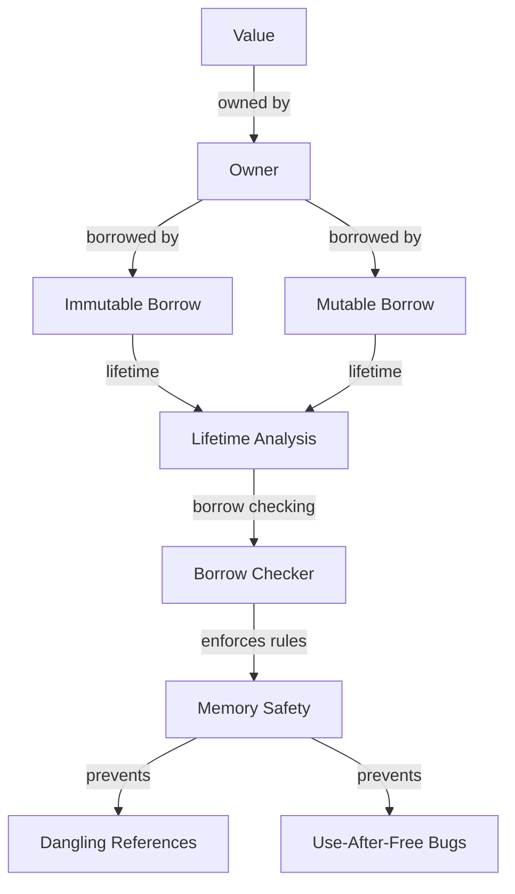

## Introduction
The **Borrow Checker** is a fundamental component of the Rust programming language, ensuring memory safety and preventing **dangling references**. In Rust, every value has an **owner** that is responsible for deallocating the value when it is no longer needed. However, sometimes we need to use a value without taking ownership of it, which is where borrowing comes in. The Borrow Checker enforces the rules of borrowing, preventing common errors like dangling references and use-after-free bugs. In this section, we will explore the Borrow Checker, its importance, and real-world relevance.

> **Note:** The Borrow Checker is a key feature that sets Rust apart from other programming languages, providing memory safety guarantees without the need for a garbage collector.

In production, the Borrow Checker is crucial for building reliable and efficient software systems. For example, the **Firefox** browser uses Rust to build its **Quantum** engine, which relies heavily on the Borrow Checker to ensure memory safety and performance.

## Core Concepts
To understand the Borrow Checker, we need to grasp the following core concepts:

* **Ownership**: Every value in Rust has an owner that is responsible for deallocating the value when it is no longer needed.
* **Borrowing**: Using a value without taking ownership of it. There are two types of borrowing: **immutable borrowing** (`&T`) and **mutable borrowing** (`&mut T`).
* **Lifetimes**: The scope for which a reference to a value is valid.

> **Warning:** Failing to understand these concepts can lead to common errors like dangling references and use-after-free bugs.

Key terminology includes:

* **Borrow Checker**: The component of the Rust compiler that enforces the rules of borrowing.
* **Reference**: A pointer to a value that does not own the value.
* **Dangling reference**: A reference to a value that has already been dropped.

## How It Works Internally
The Borrow Checker works by analyzing the code and enforcing the following rules:

1. **Each value has at most one owner**: The owner is responsible for deallocating the value when it is no longer needed.
2. **You can have multiple immutable borrows**: Multiple references to a value can exist simultaneously, as long as they are immutable.
3. **You can have at most one mutable borrow**: Only one mutable reference to a value can exist at a time.

The Borrow Checker uses a combination of **lifetime analysis** and **borrow checking** to enforce these rules. Lifetime analysis determines the scope for which a reference to a value is valid, while borrow checking ensures that the rules of borrowing are enforced.

> **Tip:** Understanding the Borrow Checker's internal mechanics can help you write more efficient and safe code.

## Code Examples
Here are three complete and runnable examples that demonstrate the Borrow Checker in action:

### Example 1: Basic Borrowing
```rust
fn main() {
    let s = String::from("hello"); // s owns the string
    let len = calculate_length(&s); // borrowing s
    println!("The length of '{}' is {}.", s, len);
}

fn calculate_length(s: &String) -> usize {
    s.len()
}
```
In this example, we borrow the `String` `s` using an immutable reference (`&String`).

### Example 2: Mutable Borrowing
```rust
fn main() {
    let mut s = String::from("hello"); // s owns the string
    let r1 = &s; // borrowing s
    let r2 = &mut s; // error: cannot borrow `s` as mutable because it is also borrowed as immutable
    println!("{}", r1);
}
```
In this example, we attempt to borrow `s` as both immutable and mutable, which results in a compile-time error.

### Example 3: Lifetime Analysis
```rust
fn main() {
    let s;
    {
        let x = String::from("hello");
        s = &x; // borrowing x
    } // x is dropped here
    println!("{}", s); // error: `x` does not live long enough
}
```
In this example, we attempt to borrow `x` and use the reference after `x` has been dropped, which results in a compile-time error.

## Visual Diagram

This diagram illustrates the Borrow Checker's internal mechanics, showing how it enforces the rules of borrowing and prevents common errors.

> **Note:** The Borrow Checker is a critical component of the Rust compiler, ensuring memory safety and preventing common errors.

## Comparison
Here is a comparison of different approaches to memory safety:

| Approach | Time Complexity | Space Complexity | Pros | Cons | Best For |
| --- | --- | --- | --- | --- | --- |
| Garbage Collection | O(n) | O(n) | Easy to implement, automatic memory management | Performance overhead, pause times | High-level languages like Java, Python |
| Manual Memory Management | O(1) | O(1) | Low overhead, fine-grained control | Error-prone, time-consuming | Low-level languages like C, C++ |
| Borrow Checker | O(1) | O(1) | Memory safety guarantees, performance | Steep learning curve, restrictive | Systems programming languages like Rust |
| Smart Pointers | O(1) | O(1) | Automatic memory management, safe | Performance overhead, limited control | High-level languages like C++, Java |

> **Warning:** Choosing the wrong approach can lead to performance issues, memory safety problems, or both.

## Real-world Use Cases
Here are three production examples of the Borrow Checker in action:

1. **Firefox**: The Firefox browser uses Rust to build its Quantum engine, which relies heavily on the Borrow Checker to ensure memory safety and performance.
2. **Dropbox**: Dropbox uses Rust to build its file synchronization engine, which uses the Borrow Checker to prevent common errors like dangling references and use-after-free bugs.
3. **Microsoft**: Microsoft uses Rust to build its Azure IoT Edge platform, which relies on the Borrow Checker to ensure memory safety and performance in resource-constrained environments.

## Common Pitfalls
Here are four specific mistakes that engineers make when using the Borrow Checker:

1. **Dangling references**: Attempting to use a reference to a value that has already been dropped.
2. **Use-after-free bugs**: Using a value after it has been freed.
3. **Mutable borrowing**: Attempting to borrow a value as mutable when it is already borrowed as immutable.
4. **Lifetime analysis**: Failing to understand the lifetime of a reference and using it outside of its valid scope.

> **Tip:** Understanding these common pitfalls can help you avoid them and write more efficient and safe code.

## Interview Tips
Here are three common interview questions on the Borrow Checker, along with weak and strong answers:

1. **What is the purpose of the Borrow Checker?**
	* Weak answer: "It's a feature of the Rust compiler that checks for borrowing."
	* Strong answer: "The Borrow Checker is a critical component of the Rust compiler that enforces the rules of borrowing, preventing common errors like dangling references and use-after-free bugs."
2. **How does the Borrow Checker work internally?**
	* Weak answer: "It's a complex algorithm that checks for borrowing."
	* Strong answer: "The Borrow Checker uses a combination of lifetime analysis and borrow checking to enforce the rules of borrowing, ensuring memory safety and preventing common errors."
3. **What are some common pitfalls when using the Borrow Checker?**
	* Weak answer: "I'm not sure, but I'll try to avoid them."
	* Strong answer: "Some common pitfalls include dangling references, use-after-free bugs, mutable borrowing, and lifetime analysis. Understanding these pitfalls can help you avoid them and write more efficient and safe code."

## Key Takeaways
Here are six key takeaways to remember:

* The Borrow Checker is a critical component of the Rust compiler that enforces the rules of borrowing.
* The Borrow Checker uses a combination of lifetime analysis and borrow checking to enforce the rules of borrowing.
* Dangling references and use-after-free bugs are common errors that the Borrow Checker prevents.
* Mutable borrowing can be error-prone and should be used with caution.
* Lifetime analysis is crucial for understanding the valid scope of a reference.
* The Borrow Checker is a key feature that sets Rust apart from other programming languages, providing memory safety guarantees without the need for a garbage collector.

> **Interview:** When asked about the Borrow Checker, be sure to emphasize its importance in preventing common errors and ensuring memory safety, and provide specific examples of how it works internally.