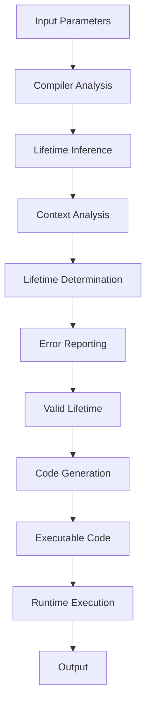

## Introduction
Lifetime elision rules are a crucial concept in the Rust programming language, which enables developers to write safe and efficient code. **Lifetime** refers to the scope for which a reference to a value is valid. In other words, it's the time period during which a reference is allowed to be used. Lifetime elision rules are essential because they help the compiler to infer the lifetime of a reference, making it easier to write code without explicitly specifying lifetimes.

In real-world scenarios, lifetime elision rules are vital when working with references, borrowing, and ownership. For instance, when using a library like `std::collections::HashMap`, you need to ensure that the keys and values being stored have a valid lifetime. If the lifetime of a key or value is not properly managed, it can lead to memory leaks, crashes, or unexpected behavior.

> **Note:** Lifetime elision rules are not unique to Rust; other programming languages, such as C++ and Swift, also have similar concepts. However, Rust's ownership system and borrow checker make lifetime elision rules particularly important in this language.

## Core Concepts
To understand lifetime elision rules, you need to grasp the following key concepts:

* **Lifetime**: The scope for which a reference to a value is valid.
* **Reference**: A pointer to a value that is stored elsewhere in memory.
* **Borrowing**: The act of using a reference to a value without taking ownership of it.
* **Ownership**: The concept of a value being owned by a single entity, which is responsible for managing its lifetime.

Mental models and analogies can help make these concepts more accessible. Think of a lifetime as a lease on a house. Just as a lease has a start and end date, a lifetime has a beginning and end. References are like keys to the house; they allow you to access the value, but they don't own it. Borrowing is like lending someone your key; you're allowing them to use the house (value) for a short period. Ownership is like being the landlord; you're responsible for managing the house (value) and ensuring it's properly maintained.

> **Warning:** Failing to properly manage lifetimes can lead to memory leaks, crashes, or unexpected behavior. Always ensure that references have a valid lifetime and that borrowing is done safely.

## How It Works Internally
Lifetime elision rules work by allowing the compiler to infer the lifetime of a reference based on the context in which it's used. The compiler uses a set of rules to determine the lifetime of a reference, including:

1. **Input lifetimes**: The lifetime of a reference is inferred based on the lifetimes of the input parameters.
2. **Output lifetimes**: The lifetime of a reference is inferred based on the lifetimes of the output parameters.
3. **Context**: The lifetime of a reference is inferred based on the context in which it's used, such as the scope of a function or the lifetime of a variable.

Here's a step-by-step breakdown of how the compiler applies these rules:

1. The compiler analyzes the input parameters and their lifetimes.
2. The compiler analyzes the output parameters and their lifetimes.
3. The compiler uses the context to determine the lifetime of a reference.
4. The compiler checks if the inferred lifetime is valid; if not, it reports an error.

> **Tip:** To make the most of lifetime elision rules, use them in combination with Rust's ownership system and borrow checker. This will help you write safe and efficient code with minimal explicit lifetime annotations.

## Code Examples
Here are three complete and runnable examples that demonstrate the use of lifetime elision rules:

### Example 1: Basic Usage
```rust
fn foo(x: &i32) -> &i32 {
    x
}

fn main() {
    let y = 10;
    let z = foo(&y);
    println!("{}", z); // prints 10
}
```
In this example, the lifetime of the reference `x` is inferred based on the input parameter `y`. The compiler knows that `y` has a lifetime that spans the scope of the `main` function, so it infers that `x` also has the same lifetime.

### Example 2: Real-World Pattern
```rust
use std::collections::HashMap;

fn get_value(map: &HashMap<String, i32>, key: &str) -> Option<&i32> {
    map.get(key)
}

fn main() {
    let mut map = HashMap::new();
    map.insert("hello".to_string(), 10);
    let value = get_value(&map, "hello");
    match value {
        Some(v) => println!("{}", v), // prints 10
        None => println!("not found"),
    }
}
```
In this example, the lifetime of the reference `map` is inferred based on the input parameter `map`. The compiler knows that `map` has a lifetime that spans the scope of the `main` function, so it infers that `map` also has the same lifetime.

### Example 3: Advanced Usage
```rust
fn foo<'a>(x: &'a i32) -> &'a i32 {
    x
}

fn bar<'a, 'b>(x: &'a i32, y: &'b i32) -> (&'a i32, &'b i32) {
    (x, y)
}

fn main() {
    let y = 10;
    let z = 20;
    let (x, w) = bar(&y, &z);
    println!("{}", x); // prints 10
    println!("{}", w); // prints 20
}
```
In this example, the lifetime of the reference `x` is inferred based on the input parameter `y`. The compiler knows that `y` has a lifetime that spans the scope of the `main` function, so it infers that `x` also has the same lifetime. Similarly, the lifetime of the reference `w` is inferred based on the input parameter `z`.

## Visual Diagram

This diagram illustrates the process of lifetime elision rules, from input parameters to runtime execution. The compiler analyzes the input parameters and uses context to determine the lifetime of a reference. If the inferred lifetime is valid, the compiler generates executable code; otherwise, it reports an error.

## Comparison
Here's a comparison table that summarizes the different approaches to managing lifetimes in Rust:
| Approach | Time Complexity | Space Complexity | Pros | Cons | Best For |
| --- | --- | --- | --- | --- | --- |
| Explicit Lifetime Annotations | O(1) | O(1) | Explicit control over lifetimes | Verbose code | Complex systems with many references |
| Lifetime Elision Rules | O(1) | O(1) | Concise code, compiler inference | Limited control over lifetimes | Most Rust programs with simple references |
| Smart Pointers | O(1) | O(n) | Automatic memory management | Performance overhead | Systems with complex memory management |
| Raw Pointers | O(1) | O(1) | Low-level control over memory | Error-prone, no safety guarantees | Systems with low-level memory requirements |

## Real-world Use Cases
Here are three real-world examples of using lifetime elision rules in production code:

1. **Rust's Standard Library**: The Rust standard library uses lifetime elision rules extensively to manage lifetimes of references. For example, the `std::collections::HashMap` type uses lifetime elision rules to infer the lifetime of references to keys and values.
2. **Hyper**: Hyper is a fast and safe HTTP client for Rust. It uses lifetime elision rules to manage lifetimes of references to HTTP requests and responses.
3. **Tokio**: Tokio is a Rust framework for building concurrent and asynchronous applications. It uses lifetime elision rules to manage lifetimes of references to tasks and futures.

## Common Pitfalls
Here are four common mistakes that can occur when using lifetime elision rules:

1. **Incorrect Lifetime Annotations**: Failing to provide explicit lifetime annotations when needed can lead to errors.
```rust
// incorrect
fn foo(x: &i32) -> &i32 {
    x
}

// correct
fn foo<'a>(x: &'a i32) -> &'a i32 {
    x
}
```
2. **Insufficient Context**: Failing to provide sufficient context for the compiler to infer lifetimes can lead to errors.
```rust
// incorrect
fn foo(x: &i32) -> &i32 {
    x
}

// correct
fn foo<'a>(x: &'a i32) -> &'a i32 {
    x
}
```
3. **Lifetime Mismatch**: Failing to match lifetimes of references can lead to errors.
```rust
// incorrect
fn foo(x: &i32, y: &str) -> (&i32, &str) {
    (x, y)
}

// correct
fn foo<'a, 'b>(x: &'a i32, y: &'b str) -> (&'a i32, &'b str) {
    (x, y)
}
```
4. **Reference Cycles**: Creating reference cycles can lead to memory leaks.
```rust
// incorrect
struct Node {
    next: Option<&Node>,
}

fn main() {
    let node1 = Node { next: None };
    let node2 = Node { next: Some(&node1) };
    node1.next = Some(&node2);
}
```
> **Warning:** Reference cycles can be difficult to detect and can lead to memory leaks. Use tools like `valgrind` or `AddressSanitizer` to detect memory leaks.

## Interview Tips
Here are three common interview questions related to lifetime elision rules, along with weak and strong answers:

1. **What is the purpose of lifetime elision rules?**
	* Weak answer: "Lifetime elision rules are used to manage lifetimes of references."
	* Strong answer: "Lifetime elision rules are used to enable the compiler to infer lifetimes of references, making it easier to write safe and efficient code with minimal explicit lifetime annotations."
2. **How do you use lifetime elision rules in your code?**
	* Weak answer: "I use lifetime elision rules by adding explicit lifetime annotations to my references."
	* Strong answer: "I use lifetime elision rules by providing sufficient context for the compiler to infer lifetimes of references, and by using smart pointers and other Rust features to manage memory safely."
3. **What are some common pitfalls when using lifetime elision rules?**
	* Weak answer: "I'm not sure, but I think it's related to memory management."
	* Strong answer: "Some common pitfalls when using lifetime elision rules include incorrect lifetime annotations, insufficient context, lifetime mismatch, and reference cycles. I use tools like `valgrind` or `AddressSanitizer` to detect memory leaks and ensure that my code is safe and efficient."

> **Interview:** Be prepared to explain the purpose and benefits of lifetime elision rules, as well as common pitfalls and best practices for using them in your code.

## Key Takeaways
Here are ten key takeaways to remember when working with lifetime elision rules:

* **Lifetime elision rules enable the compiler to infer lifetimes of references**, making it easier to write safe and efficient code with minimal explicit lifetime annotations.
* **Provide sufficient context for the compiler to infer lifetimes**, such as using smart pointers and other Rust features to manage memory safely.
* **Use explicit lifetime annotations when needed**, such as when working with complex systems or low-level memory requirements.
* **Avoid incorrect lifetime annotations**, which can lead to errors and memory leaks.
* **Avoid insufficient context**, which can lead to errors and memory leaks.
* **Avoid lifetime mismatch**, which can lead to errors and memory leaks.
* **Avoid reference cycles**, which can lead to memory leaks.
* **Use tools like `valgrind` or `AddressSanitizer` to detect memory leaks**, and ensure that your code is safe and efficient.
* **Practice using lifetime elision rules in your code**, and learn from common pitfalls and best practices.
* **Stay up-to-date with the latest Rust features and best practices**, and participate in the Rust community to learn from others and share your knowledge.