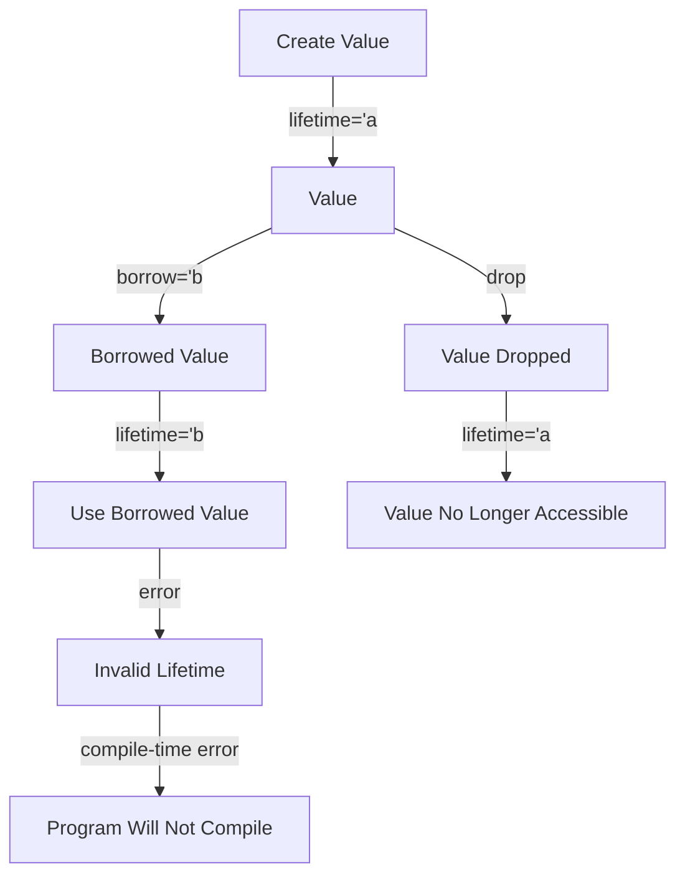

## Introduction
**Lifetime** in Rust is a fundamental concept that deals with the duration for which a value is valid. Understanding lifetimes is crucial for writing safe and efficient Rust code. In this section, we will explore what lifetimes are, why they matter, and their real-world relevance. 
> **Note:** Lifetimes are not a new concept, but they are a crucial aspect of Rust's ownership system, which ensures memory safety without the need for a garbage collector.

In real-world applications, lifetimes are essential for preventing common programming errors such as **dangling pointers** or **wild pointers**. For instance, in a web server, a request handler may need to access a database connection that is valid only for the duration of the request. If the database connection is dropped before the request is completed, the program will crash. Rust's lifetime system helps prevent such errors by ensuring that the database connection remains valid for the entire duration of the request.

## Core Concepts
The core concept of lifetime in Rust revolves around the idea of **borrowing** and **ownership**. When a value is created, it has a specific lifetime, which is the duration for which the value is valid. The lifetime of a value is determined by the scope in which it is created. 
> **Tip:** Think of lifetime as a lease on a value. The lease is valid for a specific duration, and when the lease expires, the value is no longer accessible.

The key terminology related to lifetime in Rust includes:

* **'static**: A lifetime that represents the entire duration of the program.
* **'a**: A lifetime parameter that represents an arbitrary lifetime.
* **&'a T**: A reference to a value of type T with lifetime 'a.

## How It Works Internally
When a value is created, Rust assigns a unique identifier to it, which is used to track the value's lifetime. The lifetime of a value is determined by the scope in which it is created. When a value is borrowed, the borrow checker ensures that the borrowed value remains valid for the duration of the borrow. 
> **Warning:** If a value is borrowed for a longer duration than its lifetime, the program will not compile.

Here is a step-by-step breakdown of how lifetimes work internally:

1. A value is created with a specific lifetime.
2. The value is borrowed, and the borrow checker ensures that the borrowed value remains valid for the duration of the borrow.
3. If the borrowed value is used outside its lifetime, the program will not compile.

## Code Examples
### Example 1: Basic Lifetime
```rust
fn main() {
    let s = String::from("hello"); // s has a lifetime of the main function
    let len = calculate_length(&s); // len has a lifetime of the main function
    println!("The length of '{}' is {}.", s, len);
}

fn calculate_length(s: &String) -> usize {
    s.len()
}
```
In this example, the string `s` has a lifetime of the `main` function, and the reference `&s` has the same lifetime.

### Example 2: Lifetime Parameters
```rust
fn main() {
    let s = String::from("hello"); // s has a lifetime of the main function
    let len = calculate_length(&s); // len has a lifetime of the main function
    println!("The length of '{}' is {}.", s, len);
}

fn calculate_length<'a>(s: &'a String) -> usize {
    s.len()
}
```
In this example, the `calculate_length` function takes a reference to a string with an arbitrary lifetime `'a`.

### Example 3: Advanced Lifetime
```rust
fn main() {
    let s = String::from("hello"); // s has a lifetime of the main function
    let len = calculate_length(&s); // len has a lifetime of the main function
    println!("The length of '{}' is {}.", s, len);
}

fn calculate_length<'a, 'b>(s: &'a String, t: &'b String) -> usize {
    s.len() + t.len()
}
```
In this example, the `calculate_length` function takes two references to strings with different lifetimes `'a` and `'b`.

## Visual Diagram

This diagram illustrates the lifetime of a value and how it is affected by borrowing.

## Comparison
| Approach | Time Complexity | Space Complexity | Pros | Cons | Best For |
|----------|----------------|-----------------|------|------|----------|
| **'static** | O(1) | O(1) | Global lifetime, easy to use | Limited flexibility | Global constants |
| **'a** | O(1) | O(1) | Flexible lifetime, easy to use | Error-prone if not used correctly | Local variables |
| **&'a T** | O(1) | O(1) | Reference to value with lifetime 'a | Error-prone if not used correctly | Borrowing values |
| **std::rc::Rc** | O(1) | O(n) | Reference counting, flexible lifetime | Heavy overhead, not suitable for large datasets | Shared ownership |

## Real-world Use Cases
1. **Web Server**: In a web server, each request has a unique lifetime, and the server needs to ensure that the request handler has access to the request data for the entire duration of the request.
2. **Database Connection**: A database connection has a specific lifetime, and the program needs to ensure that the connection remains valid for the entire duration of the database transaction.
3. **File I/O**: When reading or writing to a file, the file handle has a specific lifetime, and the program needs to ensure that the file handle remains valid for the entire duration of the file operation.

## Common Pitfalls
1. **Dangling References**: A reference to a value that is no longer valid.
```rust
fn main() {
    let s = String::from("hello");
    let len = calculate_length(&s);
    drop(s); // s is dropped, but len still references it
    println!("The length of '{}' is {}.", len);
}

fn calculate_length(s: &String) -> usize {
    s.len()
}
```
> **Warning:** This code will not compile because `len` still references `s` after `s` has been dropped.

2. **Invalid Lifetime**: A value is used outside its lifetime.
```rust
fn main() {
    let s = String::from("hello");
    let len = calculate_length(&s);
    println!("The length of '{}' is {}.", len);
}

fn calculate_length(s: &String) -> &'static String {
    s
}
```
> **Warning:** This code will not compile because `calculate_length` returns a reference to `s` with a lifetime of `'static`, but `s` has a lifetime of the `main` function.

3. **Reference Cycle**: A cycle of references that prevents values from being dropped.
```rust
fn main() {
    let s = String::from("hello");
    let t = String::from("world");
    let s_ref = &s;
    let t_ref = &t;
    s_ref.as_str();
    t_ref.as_str();
}

fn calculate_length(s: &String, t: &String) -> usize {
    s.len() + t.len()
}
```
> **Warning:** This code will create a reference cycle that prevents `s` and `t` from being dropped.

4. **Borrow Checker Errors**: The borrow checker prevents values from being borrowed multiple times.
```rust
fn main() {
    let s = String::from("hello");
    let len = calculate_length(&s);
    let len2 = calculate_length(&s);
    println!("The length of '{}' is {}.", len);
    println!("The length of '{}' is {}.", len2);
}

fn calculate_length(s: &String) -> usize {
    s.len()
}
```
> **Warning:** This code will not compile because `s` is borrowed multiple times.

## Interview Tips
1. **What is lifetime in Rust?**: A lifetime is the duration for which a value is valid.
> **Interview:** The interviewer wants to assess your understanding of Rust's ownership system and lifetime concept.

2. **How does Rust's borrow checker work?**: The borrow checker ensures that a value is not borrowed multiple times and that the borrowed value remains valid for the duration of the borrow.
> **Interview:** The interviewer wants to assess your understanding of Rust's borrow checker and its role in preventing common programming errors.

3. **What is the difference between 'static and 'a?**: `'static` represents a global lifetime, while `'a` represents an arbitrary lifetime.
> **Interview:** The interviewer wants to assess your understanding of Rust's lifetime parameters and their usage.

## Key Takeaways
* **Lifetime**: The duration for which a value is valid.
* **'static**: A global lifetime that represents the entire duration of the program.
* **'a**: An arbitrary lifetime that represents a specific duration.
* **&'a T**: A reference to a value of type T with lifetime 'a.
* **Borrow Checker**: Ensures that a value is not borrowed multiple times and that the borrowed value remains valid for the duration of the borrow.
* **Reference Cycle**: A cycle of references that prevents values from being dropped.
* **Dangling References**: A reference to a value that is no longer valid.
* **Invalid Lifetime**: A value is used outside its lifetime.
* **Time Complexity**: O(1) for lifetime operations.
* **Space Complexity**: O(1) for lifetime operations.
* **Rust's Ownership System**: Ensures memory safety without the need for a garbage collector.