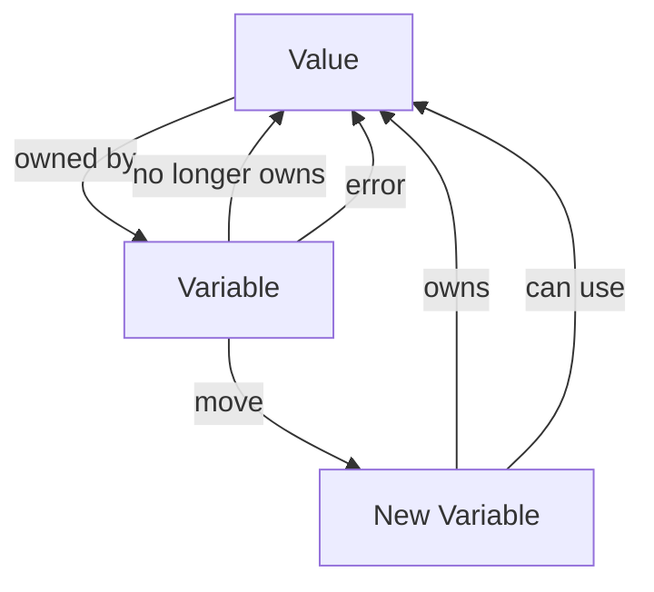

## Introduction
**Move semantics** is a concept in Rust programming language that enables the transfer of ownership of values between variables. This concept is crucial in Rust as it helps to manage memory and prevent common programming errors such as null pointer dereferences and use-after-free bugs. Move semantics is a key feature that sets Rust apart from other programming languages and makes it a popular choice for systems programming. In this section, we will explore what move semantics is, why it matters, and its real-world relevance.

Move semantics is essential in Rust because it allows the language to enforce memory safety at compile-time. By transferring ownership of values between variables, Rust ensures that each value has a single owner at any given time, preventing multiple variables from accessing the same memory location simultaneously. This feature makes Rust a reliable choice for building systems that require low-level memory management, such as operating systems, file systems, and network protocols.

> **Note:** Move semantics is not unique to Rust, but it is a fundamental concept in the language that sets it apart from other programming languages.

## Core Concepts
To understand move semantics, we need to grasp some key concepts:

* **Ownership**: In Rust, each value has an owner that is responsible for deallocating the value's memory when it is no longer needed.
* **Move**: A move operation transfers ownership of a value from one variable to another.
* **Copy**: A copy operation creates a new instance of a value and leaves the original value unchanged.
* **Clone**: A clone operation creates a deep copy of a value, recursively copying all its components.

These concepts are essential in understanding how move semantics works in Rust. By default, Rust uses move semantics for most types, which means that when a value is assigned to a new variable, the ownership of the value is transferred to the new variable.

## How It Works Internally
When a value is moved from one variable to another, Rust performs the following steps:

1. The compiler checks if the value is movable. If the value is not movable, the compiler will prevent the move operation.
2. The compiler checks if the destination variable is initialized. If the destination variable is not initialized, the compiler will prevent the move operation.
3. The compiler generates code to transfer the ownership of the value to the destination variable.
4. The compiler updates the memory layout to reflect the new ownership.

Here's an example of how move semantics works internally:
```rust
let s = String::from("hello"); // s owns the string
let t = s; // ownership of the string is transferred to t
println!("{}", s); // error: use of moved value: `s`
```
In this example, the ownership of the string is transferred from `s` to `t` when `t` is assigned the value of `s`. After the move operation, `s` is no longer the owner of the string, and any attempt to use `s` will result in a compile-time error.

## Code Examples
Here are three complete and runnable examples that demonstrate move semantics in Rust:

Example 1: Basic Move Semantics
```rust
fn main() {
    let s = String::from("hello");
    let t = s; // ownership of the string is transferred to t
    println!("{}", t); // prints "hello"
    // println!("{}", s); // error: use of moved value: `s`
}
```
Example 2: Move Semantics with Structs
```rust
struct Person {
    name: String,
    age: u32,
}

fn main() {
    let person = Person {
        name: String::from("John"),
        age: 30,
    };
    let new_person = person; // ownership of the person is transferred to new_person
    println!("{}", new_person.name); // prints "John"
    // println!("{}", person.name); // error: use of moved value: `person`
}
```
Example 3: Move Semantics with Vectors
```rust
fn main() {
    let v = vec![1, 2, 3];
    let new_v = v; // ownership of the vector is transferred to new_v
    println!("{:?}", new_v); // prints "[1, 2, 3]"
    // println!("{:?}", v); // error: use of moved value: `v`
}
```
> **Tip:** Use the `std::mem::swap` function to swap the values of two variables without using a temporary variable.

## Visual Diagram

This diagram illustrates the move semantics process, where the ownership of a value is transferred from one variable to another.

## Comparison
Here's a comparison table that shows the differences between move semantics, copy semantics, and clone semantics:

| Approach | Time Complexity | Space Complexity | Pros | Cons | Best For |
| --- | --- | --- | --- | --- | --- |
| Move Semantics | O(1) | O(1) | Efficient, no extra memory allocation | Can be error-prone if not used correctly | Systems programming, performance-critical code |
| Copy Semantics | O(n) | O(n) | Easy to use, no need to worry about ownership | Can be slow and memory-intensive | High-level programming, scripting |
| Clone Semantics | O(n) | O(n) | Creates a deep copy of a value | Can be slow and memory-intensive | When a deep copy is necessary |

> **Warning:** Using move semantics incorrectly can lead to errors and bugs in your code.

## Real-world Use Cases
Here are three real-world use cases that demonstrate the importance of move semantics:

1. **Operating Systems**: Move semantics is used in operating systems to manage memory and prevent common programming errors.
2. **File Systems**: Move semantics is used in file systems to manage file ownership and prevent data corruption.
3. **Network Protocols**: Move semantics is used in network protocols to manage packet ownership and prevent data corruption.

> **Interview:** Can you explain the difference between move semantics, copy semantics, and clone semantics? How would you use move semantics in a real-world scenario?

## Common Pitfalls
Here are four common pitfalls to watch out for when using move semantics:

1. **Use of Moved Value**: Attempting to use a value after it has been moved will result in a compile-time error.
2. **Incorrect Ownership**: Incorrectly assigning ownership of a value can lead to errors and bugs.
3. **Deep Copying**: Deep copying a value can be slow and memory-intensive.
4. **Clone vs Copy**: Confusing clone and copy semantics can lead to errors and bugs.

Here's an example of the wrong way to use move semantics:
```rust
let s = String::from("hello");
let t = s; // ownership of the string is transferred to t
println!("{}", s); // error: use of moved value: `s`
```
And here's the correct way to use move semantics:
```rust
let s = String::from("hello");
let t = s; // ownership of the string is transferred to t
println!("{}", t); // prints "hello"
```
## Interview Tips
Here are three common interview questions related to move semantics:

1. **What is move semantics?**: Explain the concept of move semantics and how it works in Rust.
2. **How does move semantics differ from copy semantics?**: Explain the differences between move semantics and copy semantics.
3. **Can you give an example of how to use move semantics in a real-world scenario?**: Provide an example of how to use move semantics in a real-world scenario, such as in an operating system or file system.

> **Tip:** Practice explaining move semantics and its applications to improve your interview skills.

## Key Takeaways
Here are six key takeaways to remember about move semantics:

* **Move semantics is a fundamental concept in Rust**: Move semantics is a key feature of the Rust programming language that enables the transfer of ownership of values between variables.
* **Move semantics is efficient**: Move semantics is an efficient way to manage memory and prevent common programming errors.
* **Move semantics can be error-prone**: Move semantics can be error-prone if not used correctly, so it's essential to understand how it works.
* **Move semantics is used in systems programming**: Move semantics is commonly used in systems programming to manage memory and prevent common programming errors.
* **Move semantics differs from copy semantics**: Move semantics differs from copy semantics in that it transfers ownership of a value, whereas copy semantics creates a new instance of a value.
* **Move semantics is a key feature of Rust**: Move semantics is a key feature of the Rust programming language that sets it apart from other programming languages.