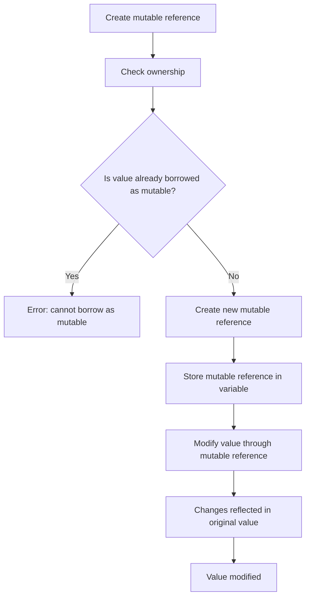

## Introduction
In the world of Rust programming, **ownership** and **borrowing** are two fundamental concepts that help ensure memory safety. One crucial aspect of borrowing is the concept of **mutable references**, which allows you to modify the value of a variable while still maintaining the ownership rules. In this section, we'll delve into the world of mutable references, exploring what they are, why they matter, and their real-world relevance.

Mutable references are essential in Rust because they enable you to modify data without taking ownership of it. This is particularly useful when working with complex data structures or when you need to modify data that's owned by another part of your program. However, Rust's ownership system imposes a restriction on mutable references: you can only have one mutable reference to a value at a time. This rule helps prevent data races and ensures that your program remains safe and predictable.

> **Note:** The concept of mutable references is closely tied to the idea of **borrowing**, which allows you to use a value without taking ownership of it. In Rust, you can borrow a value as either immutable (`&`) or mutable (`&mut`).

## Core Concepts
To understand mutable references, you need to grasp a few key concepts:

* **Ownership**: In Rust, every value has an owner that's responsible for deallocating the value when it's no longer needed.
* **Borrowing**: Borrowing allows you to use a value without taking ownership of it. There are two types of borrowing: immutable (`&`) and mutable (`&mut`).
* **Mutable reference**: A mutable reference (`&mut`) allows you to modify the value of a variable while still maintaining the ownership rules.

The key terminology to remember is:

* **`&`**: Immutable reference
* **`&mut`**: Mutable reference
* **`*`**: Dereference operator (used to access the value behind a reference)

> **Warning:** Be careful when using mutable references, as they can lead to data races if not used properly. Always ensure that you're following the rules of ownership and borrowing.

## How It Works Internally
When you create a mutable reference to a value, Rust's ownership system ensures that the reference is the only one that can modify the value. Here's a step-by-step breakdown of what happens when you use a mutable reference:

1. You create a mutable reference to a value using the `&mut` keyword.
2. Rust's ownership system checks that the value is not already borrowed as mutable.
3. If the check passes, Rust creates a new mutable reference to the value.
4. The mutable reference is stored in a variable, which becomes the new owner of the reference.
5. When you modify the value through the mutable reference, Rust ensures that the changes are reflected in the original value.

> **Tip:** To avoid data races, always use mutable references in a way that ensures only one mutable reference exists at a time.

## Code Examples
Here are three complete and runnable code examples that demonstrate the use of mutable references:

### Example 1: Basic Mutable Reference
```rust
fn main() {
    let mut x = 5;
    let mut_ref = &mut x;
    *mut_ref = 10;
    println!("x: {}", x); // prints "x: 10"
}
```
This example creates a mutable reference to a variable `x` and modifies its value using the dereference operator (`*`).

### Example 2: Real-World Pattern
```rust
struct Person {
    name: String,
    age: u32,
}

fn main() {
    let mut person = Person {
        name: String::from("John"),
        age: 30,
    };
    let mut_ref = &mut person;
    mut_ref.name = String::from("Jane");
    println!("person: {:?}", person); // prints "person: Person { name: \"Jane\", age: 30 }"
}
```
This example creates a mutable reference to a `Person` struct and modifies its `name` field using the mutable reference.

### Example 3: Advanced Usage
```rust
fn modify_value(mut_ref: &mut u32) {
    *mut_ref = 20;
}

fn main() {
    let mut x = 5;
    let mut_ref = &mut x;
    modify_value(mut_ref);
    println!("x: {}", x); // prints "x: 20"
}
```
This example creates a mutable reference to a variable `x` and passes it to a function that modifies the value using the mutable reference.

## Visual Diagram

This diagram illustrates the process of creating a mutable reference and modifying a value through it.

> **Note:** The diagram shows the ownership check and the creation of a new mutable reference. It also highlights the importance of ensuring that only one mutable reference exists at a time.

## Comparison
Here's a comparison table that shows the differences between immutable and mutable references:

| Type | Time Complexity | Space Complexity | Pros | Cons | Best For |
| --- | --- | --- | --- | --- | --- |
| Immutable Reference (`&`) | O(1) | O(1) | Fast, safe, and predictable | Cannot modify value | Reading data, iterating over collections |
| Mutable Reference (`&mut`) | O(1) | O(1) | Allows modification of value | Can lead to data races if not used properly | Modifying data, updating complex data structures |
| Ownership | O(1) | O(1) | Ensures memory safety | Requires explicit management | Returning values from functions, storing data in variables |

> **Warning:** Be careful when choosing between immutable and mutable references, as the wrong choice can lead to data races or performance issues.

## Real-world Use Cases
Here are three real-world examples of using mutable references:

1. **Google's Rust-based compiler**: Google uses Rust to build a high-performance compiler. In this context, mutable references are used to optimize the compilation process and ensure that the compiled code is correct and efficient.
2. **Microsoft's Azure IoT**: Microsoft uses Rust to build secure and reliable IoT devices. In this context, mutable references are used to manage device state and ensure that the devices can communicate securely with the cloud.
3. **Dropbox's file synchronization**: Dropbox uses Rust to build a fast and reliable file synchronization system. In this context, mutable references are used to manage file metadata and ensure that files are synchronized correctly across devices.

> **Tip:** When working with mutable references, always consider the performance implications and ensure that you're using the most efficient data structures and algorithms.

## Common Pitfalls
Here are four common mistakes to watch out for when using mutable references:

1. **Data races**: When multiple mutable references exist at the same time, it can lead to data races and unexpected behavior.
```rust
let mut x = 5;
let mut_ref1 = &mut x;
let mut_ref2 = &mut x; // Error: cannot borrow as mutable
```
2. **Inconsistent state**: When using mutable references to modify complex data structures, it's easy to introduce inconsistent state.
```rust
struct Person {
    name: String,
    age: u32,
}

let mut person = Person {
    name: String::from("John"),
    age: 30,
};
let mut_ref = &mut person;
mut_ref.name = String::from("Jane");
mut_ref.age = 20; // Inconsistent state: age is not updated correctly
```
3. **Dangling references**: When using mutable references, it's easy to create dangling references that point to invalid memory locations.
```rust
let mut x = 5;
let mut_ref = &mut x;
drop(x); // Error: cannot use x after it's been dropped
*mut_ref = 10; // Dangling reference: mut_ref points to invalid memory location
```
4. **Lifetimes**: When using mutable references, it's essential to manage lifetimes correctly to avoid errors.
```rust
let mut x = 5;
let mut_ref = &mut x;
{
    let mut y = 10;
    let mut_ref2 = &mut y;
    *mut_ref = *mut_ref2; // Error: cannot move out of mut_ref2
}
```
> **Warning:** Always be mindful of lifetimes and ownership when using mutable references to avoid common pitfalls.

## Interview Tips
Here are three common interview questions related to mutable references:

1. **What is the difference between an immutable reference and a mutable reference?**
	* Weak answer: "An immutable reference is read-only, while a mutable reference is read-write."
	* Strong answer: "An immutable reference (`&`) allows you to read the value of a variable, while a mutable reference (`&mut`) allows you to modify the value. However, Rust's ownership system ensures that only one mutable reference can exist at a time to prevent data races."
2. **How do you manage mutable references in a multithreaded environment?**
	* Weak answer: "You can use locks or mutexes to synchronize access to mutable references."
	* Strong answer: "In Rust, you can use `std::sync` primitives like `Mutex` or `RwLock` to manage mutable references in a multithreaded environment. However, you should also consider using `std::cell` primitives like `Cell` or `RefCell` to manage interior mutability and avoid the need for explicit synchronization."
3. **What are some common pitfalls when using mutable references?**
	* Weak answer: "Data races and inconsistent state are common pitfalls."
	* Strong answer: "Data races, inconsistent state, dangling references, and lifetime issues are common pitfalls when using mutable references. To avoid these pitfalls, you should always follow Rust's ownership rules, use `std::sync` and `std::cell` primitives judiciously, and manage lifetimes correctly."

> **Tip:** When answering interview questions related to mutable references, always demonstrate a deep understanding of Rust's ownership system and the importance of managing mutable references correctly.

## Key Takeaways
Here are six key takeaways to remember when working with mutable references:

* **Mutable references are powerful but require careful management**: Always follow Rust's ownership rules and manage lifetimes correctly to avoid common pitfalls.
* **Only one mutable reference can exist at a time**: This rule helps prevent data races and ensures that your program remains safe and predictable.
* **Use `std::sync` and `std::cell` primitives judiciously**: These primitives can help you manage mutable references in a multithreaded environment and avoid the need for explicit synchronization.
* **Manage lifetimes correctly**: Always consider the lifetimes of variables and references to avoid dangling references and lifetime issues.
* **Use immutable references when possible**: Immutable references are faster and safer than mutable references, so use them when possible to improve performance and reduce the risk of errors.
* **Be mindful of performance implications**: When using mutable references, always consider the performance implications and use the most efficient data structures and algorithms to minimize overhead.

> **Note:** By following these key takeaways and demonstrating a deep understanding of mutable references, you'll be well on your way to becoming a proficient Rust developer.