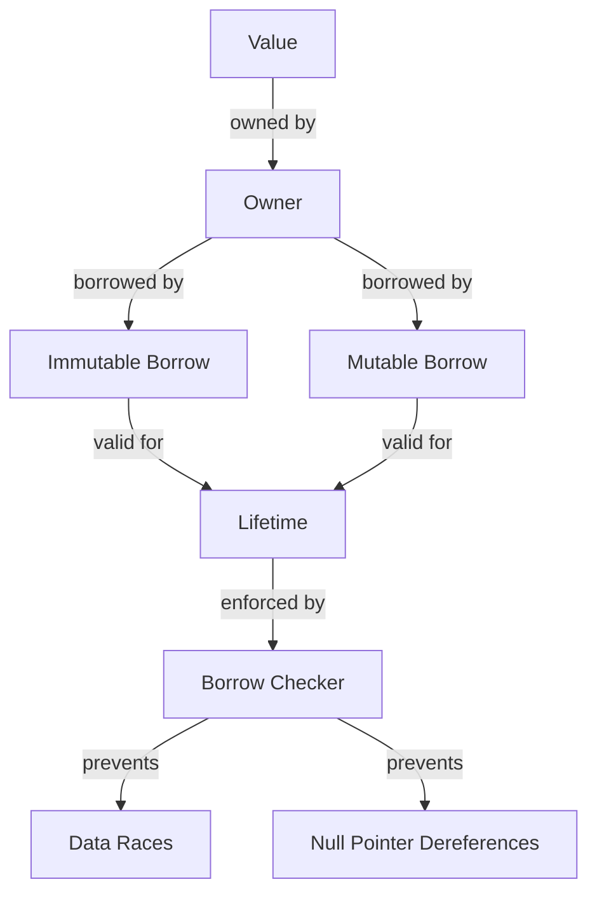

## Introduction
The **Borrow Checker** is a fundamental concept in the **Rust** programming language, ensuring memory safety and preventing common errors like null pointer dereferences and data races. It's a crucial aspect of Rust's ownership system, which governs how values are created, used, and destroyed. In this section, we'll explore the Borrow Checker's purpose, its real-world relevance, and why every engineer needs to understand it. 
> **Note:** The Borrow Checker is not a runtime mechanism but rather a compile-time check, which means it won't impact your program's performance.

## Core Concepts
To grasp the Borrow Checker, we need to understand the following key concepts:
- **Ownership**: Each value in Rust has an owner that's responsible for deallocating the value when it's no longer needed.
- **Borrowing**: You can borrow a value from its owner, allowing you to use the value without taking ownership of it.
- **Mutable Borrowing**: You can also borrow a value mutably, which allows you to modify the value.
- **Immutable Borrowing**: You can borrow a value immutably, which only allows you to read the value.
- **Lifetimes**: Rust uses lifetimes to track the scope of references, ensuring that references to values are valid for as long as the value exists.
> **Tip:** Think of lifetimes as a way to specify the scope of a reference, similar to how you would specify the scope of a variable.

## How It Works Internally
The Borrow Checker works by analyzing the code and enforcing the following rules:
1. Each value has at most one owner.
2. You can have multiple immutable borrows of a value.
3. You can have at most one mutable borrow of a value.
4. You cannot have a mutable borrow and an immutable borrow of the same value at the same time.
The Borrow Checker uses a complex algorithm to enforce these rules, which involves analyzing the control flow of the program and tracking the lifetimes of values.
> **Warning:** If you try to violate these rules, the Borrow Checker will prevent your code from compiling, which can be frustrating at first, but it's a safety net that helps prevent common errors.

## Code Examples
### Example 1: Basic Borrowing
```rust
fn main() {
    let s = String::from("hello");  // s is the owner of the string
    let len = calculate_length(&s);  // borrow s immutably
    println!("The length of '{}' is {}.", s, len);
}

fn calculate_length(s: &String) -> usize {
    s.len()
}
```
This example demonstrates how to borrow a value immutably using a reference (`&`).

### Example 2: Mutable Borrowing
```rust
fn main() {
    let mut s = String::from("hello");  // s is the owner of the string
    change(&mut s);  // borrow s mutably
    println!("{}", s);
}

fn change(s: &mut String) {
    s.push_str(", world");
}
```
This example shows how to borrow a value mutably using a mutable reference (`&mut`).

### Example 3: Lifetime Parameters
```rust
fn main() {
    let s: &'static str = "hello";  // s has a static lifetime
    let t = String::from("world");  // t has a non-static lifetime
    println!("{}", s);
    println!("{}", t);
}

fn foo<'a>(x: &'a str) -> &'a str {
    x
}
```
This example demonstrates how to use lifetime parameters to specify the lifetime of a reference.
> **Interview:** Be prepared to explain the difference between a static lifetime and a non-static lifetime, as well as how to use lifetime parameters to specify the lifetime of a reference.

## Visual Diagram

This diagram illustrates the relationships between values, owners, borrows, lifetimes, and the Borrow Checker.

## Comparison
| Approach | Time Complexity | Space Complexity | Pros | Cons | Best For |
| --- | --- | --- | --- | --- | --- |
| Ownership System | O(1) | O(1) | Memory-safe, efficient | Steep learning curve | Systems programming, high-performance applications |
| Garbage Collection | O(n) | O(n) | Easy to use, flexible | Performance overhead | High-level programming, rapid development |
| Manual Memory Management | O(1) | O(1) | Efficient, flexible | Error-prone, time-consuming | Low-level programming, embedded systems |
| Smart Pointers | O(1) | O(1) | Memory-safe, efficient | Complexity overhead | High-level programming, modern applications |

## Real-world Use Cases
1. **Firefox**: Mozilla's web browser uses Rust to build its rendering engine, which requires a high level of memory safety and performance.
2. **Dropbox**: The cloud storage company uses Rust to build its file synchronization engine, which requires a high level of reliability and performance.
3. **Microsoft**: The company uses Rust to build its Azure cloud infrastructure, which requires a high level of security and performance.
> **Note:** These companies chose Rust for its memory safety features, which are ensured by the Borrow Checker.

## Common Pitfalls
1. **Dangling References**: Returning a reference to a local variable, which is no longer valid after the function returns.
```rust
fn foo() -> &str {
    let s = String::from("hello");
    &s  // dangling reference
}
```
2. **Mutable Borrowing**: Trying to borrow a value mutably while it's already borrowed immutably.
```rust
fn main() {
    let mut s = String::from("hello");
    let len = s.len();  // immutable borrow
    s.push_str(", world");  // mutable borrow
}
```
3. **Lifetime Mismatch**: Using a reference with a lifetime that's not compatible with the function's lifetime parameters.
```rust
fn foo<'a>(x: &'a str) -> &'a str {
    let s = String::from("hello");
    &s  // lifetime mismatch
}
```
4. **Borrow Checker Errors**: Ignoring or misinterpreting errors reported by the Borrow Checker.
> **Warning:** Don't try to outsmart the Borrow Checker; it's there to help you write safe and efficient code.

## Interview Tips
1. **What is the Borrow Checker?**: Explain the Borrow Checker's purpose, how it works, and its benefits.
2. **How do you handle Borrow Checker errors?**: Describe the common errors, how to identify them, and how to fix them.
3. **Can you explain the difference between ownership and borrowing?**: Discuss the concepts, their relationships, and how to use them effectively.
> **Tip:** Be prepared to write code examples to demonstrate your understanding of the Borrow Checker and its concepts.

## Key Takeaways
* The Borrow Checker is a compile-time mechanism that ensures memory safety and prevents common errors.
* Ownership and borrowing are fundamental concepts in Rust, which govern how values are created, used, and destroyed.
* Lifetimes are used to track the scope of references, ensuring that references to values are valid for as long as the value exists.
* The Borrow Checker enforces rules to prevent data races, null pointer dereferences, and other common errors.
* Rust's ownership system provides a high level of memory safety and efficiency, making it suitable for systems programming and high-performance applications.
* Garbage collection, manual memory management, and smart pointers are alternative approaches to memory management, each with their pros and cons.
* The Borrow Checker is a safety net that helps prevent common errors, but it's not a replacement for careful programming and testing.
> **Note:** Mastering the Borrow Checker and its concepts is essential for writing efficient, safe, and reliable Rust code.