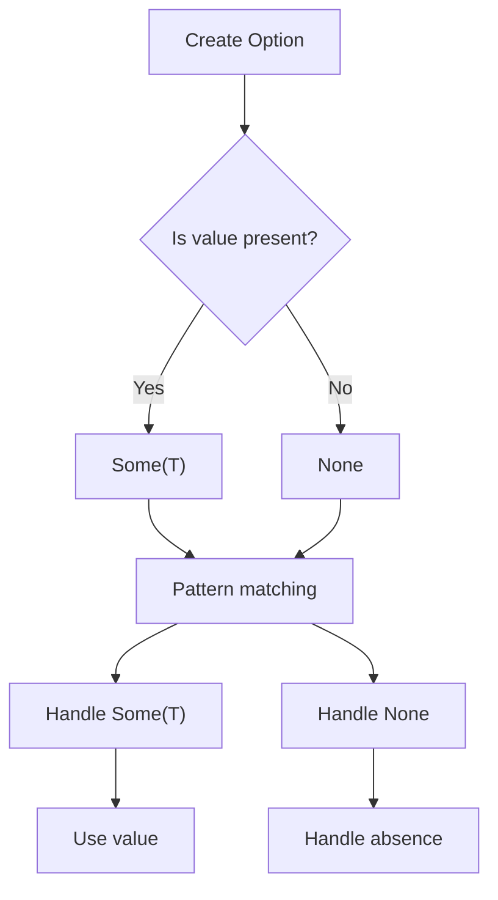

## Introduction
The `Option<T>` enum in Rust is a fundamental concept that every engineer should understand. It represents a value that may or may not be present, which is a common occurrence in real-world programming scenarios. **Option<T>** is used to handle cases where a value might be absent, and it provides a safe and expressive way to handle these situations. For example, when working with databases, a query might return a result that may or may not be present. In such cases, **Option<T>** can be used to handle the absence of a value in a safe and idiomatic way.

Real-world relevance of **Option<T>** can be seen in various Rust libraries and frameworks, such as the standard library's `std::fs::File::open` function, which returns an **Option** indicating whether the file was successfully opened. Understanding **Option<T>** is essential for every Rust engineer, as it helps to write robust and error-free code.

## Core Concepts
The **Option<T>** enum has two variants: **Some(T)** and **None**. **Some(T)** represents a value of type **T** that is present, while **None** represents the absence of a value. The **Option<T>** enum is defined as follows:
```rust
enum Option<T> {
    Some(T),
    None,
}
```
A key concept related to **Option<T>** is pattern matching, which allows you to handle the different variants of the enum in a concise and expressive way. Pattern matching is a fundamental concept in Rust, and **Option<T>** is one of the most common use cases for it.

## How It Works Internally
When you create an **Option<T>**, you can use the **Some** or **None** constructor to create a value of the respective variant. For example:
```rust
let some_value: Option<i32> = Some(42);
let none_value: Option<i32> = None;
```
Internally, the **Option<T>** enum is represented as an enum with two variants, which are stored in memory as a single byte. The **Some** variant stores the value of type **T**, while the **None** variant stores no value.

When you use pattern matching to handle an **Option<T>**, the Rust compiler generates code that checks the variant of the enum and executes the corresponding branch. For example:
```rust
match some_value {
    Some(x) => println!("The value is: {}", x),
    None => println!("No value is present"),
}
```
The time complexity of pattern matching on an **Option<T>** is O(1), as it involves a simple check of the variant.

## Code Examples
Here are three complete and runnable examples of using **Option<T>**:

### Example 1: Basic Usage
```rust
fn main() {
    let some_value: Option<i32> = Some(42);
    match some_value {
        Some(x) => println!("The value is: {}", x),
        None => println!("No value is present"),
    }
}
```
This example demonstrates the basic usage of **Option<T>**, where we create a value of type **Option<i32>** and use pattern matching to handle the different variants.

### Example 2: Real-World Pattern
```rust
fn divide(x: i32, y: i32) -> Option<i32> {
    if y == 0 {
        None
    } else {
        Some(x / y)
    }
}

fn main() {
    let result = divide(42, 2);
    match result {
        Some(x) => println!("The result is: {}", x),
        None => println!("Cannot divide by zero"),
    }
}
```
This example demonstrates a real-world pattern of using **Option<T>** to handle errors. In this case, we define a function `divide` that returns an **Option<i32>** indicating whether the division was successful.

### Example 3: Advanced Usage
```rust
fn main() {
    let values: Vec<Option<i32>> = vec![Some(1), None, Some(3), None, Some(5)];
    for value in values {
        match value {
            Some(x) => println!("The value is: {}", x),
            None => println!("No value is present"),
        }
    }
}
```
This example demonstrates an advanced usage of **Option<T>**, where we create a vector of values of type **Option<i32>** and use pattern matching to handle the different variants.

## Visual Diagram

The visual diagram illustrates the flow of creating an **Option<T>** and handling the different variants using pattern matching.

## Comparison
| Approach | Time Complexity | Space Complexity | Pros | Cons | Best For |
| --- | --- | --- | --- | --- | --- |
| **Option<T>** | O(1) | O(1) | Safe and expressive way to handle absence of values | Verbose syntax | Handling errors and absence of values |
| **Result<T, E>** | O(1) | O(1) | Provides a way to handle errors with more information | More complex syntax | Handling errors with more information |
| **panic!** | O(1) | O(1) | Simple way to handle errors | Unrecoverable errors | Debugging and testing |
| **unwrap** | O(1) | O(1) | Simple way to handle **Option<T>** | Panics if value is absent | Quick prototyping and testing |

## Real-world Use Cases
Here are three real-world use cases of **Option<T>**:

* **Database queries**: When working with databases, a query might return a result that may or may not be present. **Option<T>** can be used to handle the absence of a value in a safe and idiomatic way.
* **File I/O**: When working with files, a file might not exist or might not be readable. **Option<T>** can be used to handle the absence of a file in a safe and idiomatic way.
* **Network requests**: When working with network requests, a response might not be received or might not be valid. **Option<T>** can be used to handle the absence of a response in a safe and idiomatic way.

## Common Pitfalls
Here are four common pitfalls when using **Option<T>**:

* **Not handling **None****: Failing to handle the **None** variant can lead to runtime errors.
```rust
// Wrong
let value: Option<i32> = None;
let x = value.unwrap(); // Panics if value is None

// Right
let value: Option<i32> = None;
match value {
    Some(x) => println!("The value is: {}", x),
    None => println!("No value is present"),
}
```
* **Using **unwrap****: Using **unwrap** can lead to runtime errors if the value is absent.
```rust
// Wrong
let value: Option<i32> = None;
let x = value.unwrap(); // Panics if value is None

// Right
let value: Option<i32> = None;
match value {
    Some(x) => println!("The value is: {}", x),
    None => println!("No value is present"),
}
```
* **Not checking for **None****: Failing to check for **None** can lead to runtime errors.
```rust
// Wrong
let value: Option<i32> = None;
let x = *value.as_ref().unwrap(); // Panics if value is None

// Right
let value: Option<i32> = None;
match value {
    Some(x) => println!("The value is: {}", x),
    None => println!("No value is present"),
}
```
* **Using **expect****: Using **expect** can lead to runtime errors if the value is absent.
```rust
// Wrong
let value: Option<i32> = None;
let x = value.expect("Value is absent"); // Panics if value is None

// Right
let value: Option<i32> = None;
match value {
    Some(x) => println!("The value is: {}", x),
    None => println!("No value is present"),
}
```
> **Warning:** Not handling **None** or using **unwrap** can lead to runtime errors.

## Interview Tips
Here are three common interview questions related to **Option<T>**:

* **What is the purpose of **Option<T>****?**: The interviewer wants to know if you understand the purpose of **Option<T>** and how it is used to handle absence of values.
```rust
// Answer
Option<T> is used to handle the absence of values in a safe and idiomatic way. It provides a way to represent a value that may or may not be present.
```
* **How do you handle **None****?**: The interviewer wants to know if you understand how to handle the **None** variant.
```rust
// Answer
I handle **None** by using pattern matching to check for the presence of a value. If the value is absent, I handle it accordingly.
```
* **What is the difference between **Option<T>** and **Result<T, E>****?**: The interviewer wants to know if you understand the difference between **Option<T>** and **Result<T, E>**.
```rust
// Answer
**Option<T>** is used to handle the absence of values, while **Result<T, E>** is used to handle errors with more information.
```
> **Interview:** Be prepared to explain the purpose of **Option<T>**, how to handle **None**, and the difference between **Option<T>** and **Result<T, E>**.

## Key Takeaways
Here are ten key takeaways related to **Option<T>**:

* **Option<T>** is used to handle the absence of values in a safe and idiomatic way.
* **Option<T>** has two variants: **Some(T)** and **None**.
* Pattern matching is used to handle the different variants of **Option<T>**.
* **unwrap** and **expect** can lead to runtime errors if the value is absent.
* **Option<T>** is used to handle errors with less information.
* **Result<T, E>** is used to handle errors with more information.
* **Option<T>** has a time complexity of O(1) and a space complexity of O(1).
* **Option<T>** is used in real-world scenarios such as database queries, file I/O, and network requests.
* **Option<T>** is a fundamental concept in Rust and is used extensively in the standard library and other crates.
* **Option<T>** is a safe and expressive way to handle absence of values, but it can be verbose and requires careful handling of **None**.