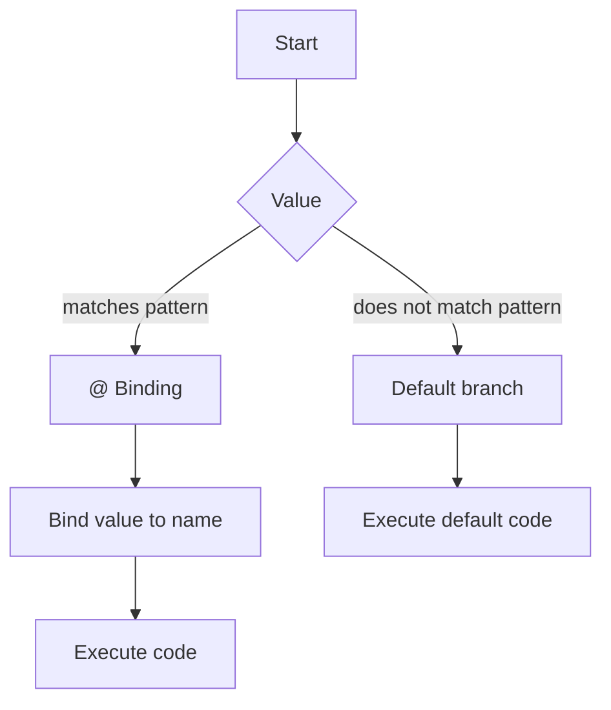

## Introduction
**Pattern matching** is a fundamental concept in Rust programming that allows developers to specify multiple alternatives for how to handle a piece of data. One of the key features of pattern matching is the use of **`@` bindings**, which enable you to bind a value to a name while also testing it against a pattern. In this section, we'll explore why `@` bindings are important, their real-world relevance, and why every engineer needs to know about them.

Pattern matching is essential in Rust because it provides a way to handle different scenarios in a clean and concise manner. By using `@` bindings, you can simplify your code and make it more readable. For instance, when working with **enums**, `@` bindings can help you handle different variants in a more elegant way.

> **Note:** `@` bindings are not unique to Rust and can be found in other programming languages, such as Haskell and Scala. However, Rust's pattern matching system is particularly powerful and flexible.

## Core Concepts
To understand `@` bindings, you need to grasp the basics of pattern matching in Rust. A **pattern** is a way to specify the structure of a value, and it can be used to bind values to names. There are several types of patterns in Rust, including:

* **Literal patterns**: match a specific value
* **Identifier patterns**: bind a value to a name
* **Struct patterns**: match the structure of a struct
* **Enum patterns**: match the structure of an enum

`@` bindings are used in conjunction with these patterns to bind a value to a name while also testing it against a pattern.

> **Tip:** When using `@` bindings, it's essential to understand the order in which patterns are matched. Rust uses a **first-match** strategy, which means that the first pattern that matches the value is used.

## How It Works Internally
When you use an `@` binding in a pattern, Rust performs the following steps:

1. **Pattern matching**: Rust checks if the value matches the pattern. If it does, the value is bound to the name specified in the `@` binding.
2. **Binding**: If the pattern matches, the value is bound to the name. This binding is scoped to the current block.
3. **Execution**: The code inside the block is executed, and the bound value can be used.

Here's an example of how `@` bindings work internally:
```rust
let x = 5;
match x {
    1..=10 @ y => println!("x is between 1 and 10: {}", y),
    _ => println!("x is not between 1 and 10"),
}
```
In this example, the `@` binding is used to bind the value of `x` to the name `y` while also testing it against the pattern `1..=10`.

## Code Examples
### Example 1: Basic `@` Binding
```rust
fn main() {
    let x = 5;
    match x {
        1..=10 @ y => println!("x is between 1 and 10: {}", y),
        _ => println!("x is not between 1 and 10"),
    }
}
```
This example demonstrates a basic `@` binding. The value of `x` is bound to the name `y` while also being tested against the pattern `1..=10`.

### Example 2: `@` Binding with Structs
```rust
struct Point {
    x: i32,
    y: i32,
}

fn main() {
    let point = Point { x: 5, y: 10 };
    match point {
        Point { x: 1..=10 @ x_value, y: 1..=10 @ y_value } => {
            println!("Point is between (1, 1) and (10, 10): ({}, {})", x_value, y_value);
        }
        _ => println!("Point is not between (1, 1) and (10, 10)"),
    }
}
```
This example demonstrates an `@` binding with a struct. The `x` and `y` fields of the `Point` struct are bound to the names `x_value` and `y_value` while also being tested against the patterns `1..=10`.

### Example 3: `@` Binding with Enums
```rust
enum Color {
    Red,
    Green,
    Blue,
}

fn main() {
    let color = Color::Green;
    match color {
        Color::Red @ red_color => println!("Color is red: {:?}", red_color),
        Color::Green @ green_color => println!("Color is green: {:?}", green_color),
        Color::Blue @ blue_color => println!("Color is blue: {:?}", blue_color),
    }
}
```
This example demonstrates an `@` binding with an enum. The value of the `color` enum is bound to a name while also being tested against a specific variant.

## Visual Diagram

This diagram illustrates the process of pattern matching with `@` bindings. The value is first tested against a pattern, and if it matches, the value is bound to a name. If the value does not match the pattern, the default branch is executed.

## Comparison
| Pattern | Time Complexity | Space Complexity | Pros | Cons |
| --- | --- | --- | --- | --- |
| Literal pattern | O(1) | O(1) | Simple to use | Limited flexibility |
| Identifier pattern | O(1) | O(1) | Flexible and concise | Can be confusing if not used carefully |
| Struct pattern | O(n) | O(n) | Powerful and expressive | Can be verbose |
| Enum pattern | O(1) | O(1) | Simple and efficient | Limited to enums |

## Real-world Use Cases
1. **Parsing JSON data**: When parsing JSON data, you can use `@` bindings to bind the parsed values to names while also testing them against specific patterns.
2. **Handling errors**: `@` bindings can be used to handle errors in a more elegant way. For example, you can bind an error value to a name while also testing it against a specific error type.
3. **Validating user input**: When validating user input, `@` bindings can be used to bind the input values to names while also testing them against specific patterns.

## Common Pitfalls
1. **Using `@` bindings with mutable values**: When using `@` bindings with mutable values, you need to be careful not to modify the value accidentally.
```rust
let mut x = 5;
match x {
    1..=10 @ y => {
        y = 10; // Error: cannot assign to `y` because it is borrowed
    }
    _ => {}
}
```
2. **Using `@` bindings with non-matching patterns**: When using `@` bindings with non-matching patterns, you need to make sure that the pattern is correct.
```rust
let x = 5;
match x {
    1..=10 @ y => {
        println!("x is between 1 and 10: {}", y);
    }
    _ => {}
}
```
In this example, the pattern `1..=10` does not match the value `5`, so the `@` binding will not be executed.

## Interview Tips
1. **What is the purpose of `@` bindings in Rust?**: The purpose of `@` bindings is to bind a value to a name while also testing it against a pattern.
2. **How do you use `@` bindings with structs?**: You can use `@` bindings with structs by specifying the struct pattern and binding the fields to names.
3. **What is the time complexity of using `@` bindings?**: The time complexity of using `@` bindings depends on the pattern being used. For example, using `@` bindings with literal patterns has a time complexity of O(1), while using `@` bindings with struct patterns has a time complexity of O(n).

## Key Takeaways
* `@` bindings are used to bind a value to a name while also testing it against a pattern.
* `@` bindings can be used with literal patterns, identifier patterns, struct patterns, and enum patterns.
* The time complexity of using `@` bindings depends on the pattern being used.
* `@` bindings can be used to simplify code and make it more readable.
* When using `@` bindings, you need to be careful not to modify the value accidentally.
* `@` bindings can be used to handle errors and validate user input in a more elegant way.
* The space complexity of using `@` bindings depends on the pattern being used.
* `@` bindings can be used with mutable values, but you need to be careful not to modify the value accidentally.
* `@` bindings can be used with non-matching patterns, but you need to make sure that the pattern is correct.