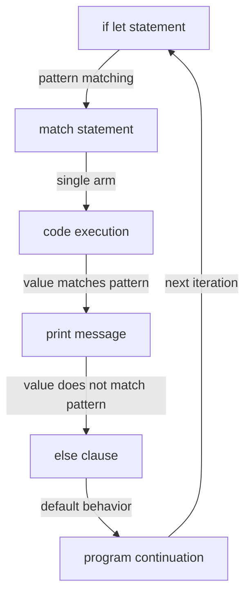

## Introduction
The `if let` statement in Rust is a concise way to perform single-pattern matching, allowing developers to simplify their code and reduce boilerplate. This statement is particularly useful when working with `Option` or `Result` types, which are commonly used in Rust to handle errors and optional values. In this section, we will explore the `if let` statement, its syntax, and its real-world relevance.

Rust's `if let` statement is an essential tool for any Rust developer, as it enables them to write more expressive and efficient code. By using `if let`, developers can avoid the need for explicit `match` statements or `if` statements with complex conditionals, making their code more readable and maintainable.

> **Note:** The `if let` statement is a shorthand for a `match` statement with a single arm. It allows developers to specify a pattern to match against, and if the pattern matches, the code inside the `if let` block will be executed.

## Core Concepts
To understand the `if let` statement, we need to grasp the concept of pattern matching in Rust. Pattern matching is a way to specify a set of conditions that a value must meet, and if the conditions are met, a specific block of code will be executed.

In the context of `if let`, the pattern is specified after the `let` keyword, and the value to be matched is specified after the `if` keyword. The syntax for `if let` is as follows:
```rust
if let pattern = value {
    // code to execute if the pattern matches
}
```
The `pattern` can be any valid Rust pattern, such as a literal value, a variable, or a struct.

> **Tip:** When using `if let`, it's essential to specify the correct pattern to match against. If the pattern is too general, it may match more values than intended, while a pattern that is too specific may not match any values at all.

## How It Works Internally
When the Rust compiler encounters an `if let` statement, it will generate code that checks if the value matches the specified pattern. If the pattern matches, the code inside the `if let` block will be executed.

Under the hood, the `if let` statement is translated into a `match` statement with a single arm. The `match` statement is a more general construct that allows developers to specify multiple patterns to match against, and the `if let` statement is a shorthand for a `match` statement with a single arm.

The time complexity of `if let` is O(1), as it only requires a single comparison to determine if the pattern matches. The space complexity is also O(1), as it does not require any additional memory allocation.

## Code Examples
### Example 1: Basic Usage
```rust
let x = Some(5);
if let Some(y) = x {
    println!("The value is: {}", y);
}
```
In this example, we use `if let` to match against the `Some` variant of the `Option` enum. If the value is `Some`, we print the inner value.

### Example 2: Real-World Pattern
```rust
let person = Person {
    name: "John".to_string(),
    age: 30,
};
if let Person { name, age: 30, .. } = person {
    println!("The person's name is: {}", name);
}
```
In this example, we use `if let` to match against a struct pattern. We only match if the `age` field is 30, and we ignore the other fields using the `..` pattern.

### Example 3: Advanced Usage
```rust
let numbers = vec![1, 2, 3, 4, 5];
for num in numbers {
    if let Some(_) = num.checked_div(0) {
        println!("The number can be divided by 0");
    } else {
        println!("The number cannot be divided by 0");
    }
}
```
In this example, we use `if let` to match against the `Some` variant of the `Option` enum returned by the `checked_div` method. If the division is valid, we print a message indicating that the number can be divided by 0.

## Visual Diagram

This diagram illustrates the flow of the `if let` statement, from the pattern matching to the code execution and the handling of the value matching or not matching the pattern.

## Comparison
| Approach | Time Complexity | Space Complexity | Pros | Cons | Best For |
| --- | --- | --- | --- | --- | --- |
| `if let` | O(1) | O(1) | concise, expressive | limited to single-pattern matching | simple error handling, optional values |
| `match` | O(1) | O(1) | flexible, powerful | more verbose than `if let` | complex error handling, multiple patterns |
| `if` statement | O(1) | O(1) | simple, familiar | less expressive than `if let` or `match` | simple conditionals, no pattern matching |

## Real-world Use Cases
1. **Error Handling**: `if let` is commonly used to handle errors in Rust, particularly when working with `Result` types. For example, the `std::fs::File` type returns a `Result` when attempting to open a file, and `if let` can be used to handle the error case.
2. **Optional Values**: `if let` is also used to handle optional values, such as those returned by the `std::collections::HashMap` type. For example, when retrieving a value from a hash map, `if let` can be used to handle the case where the key is not present.
3. **Parsing**: `if let` can be used to parse data from a string or other input source. For example, when parsing a JSON string, `if let` can be used to handle the case where the input is not valid JSON.

## Common Pitfalls
1. **Incorrect Pattern**: Using an incorrect pattern can lead to unexpected behavior or errors. For example, using a pattern that is too general can match more values than intended.
```rust
// incorrect pattern
if let _ = x {
    // code will always execute, regardless of x's value
}
```
2. **Missing `..` Pattern**: Failing to use the `..` pattern when matching against a struct can lead to errors or unexpected behavior.
```rust
// missing .. pattern
if let Person { name } = person {
    // will not compile, as age field is not accounted for
}
```
3. **Using `if let` with Complex Conditionals**: Using `if let` with complex conditionals can lead to difficult-to-read code and unexpected behavior.
```rust
// complex conditional
if let Some(x) = x && x > 5 {
    // code will not compile, as && is not a valid pattern
}
```
4. **Not Handling `None` Case**: Failing to handle the `None` case when using `if let` with `Option` types can lead to errors or unexpected behavior.
```rust
// not handling None case
if let Some(x) = x {
    // code will panic if x is None
}
```

## Interview Tips
1. **What is the difference between `if let` and `match`?**: The interviewer is looking for a clear explanation of the difference between the two constructs, including the use cases for each.
2. **How do you handle errors in Rust?**: The interviewer is looking for a discussion of error handling strategies in Rust, including the use of `if let` and `match` to handle errors.
3. **What are some common pitfalls when using `if let`?**: The interviewer is looking for a discussion of common mistakes made when using `if let`, including incorrect patterns and missing `..` patterns.

## Key Takeaways
* `if let` is a concise way to perform single-pattern matching in Rust.
* `if let` is translated into a `match` statement with a single arm by the Rust compiler.
* The time complexity of `if let` is O(1), and the space complexity is also O(1).
* `if let` is commonly used to handle errors and optional values in Rust.
* Using `if let` with complex conditionals can lead to difficult-to-read code and unexpected behavior.
* Failing to handle the `None` case when using `if let` with `Option` types can lead to errors or unexpected behavior.
* `if let` is a shorthand for a `match` statement with a single arm, and it allows developers to write more expressive and efficient code.