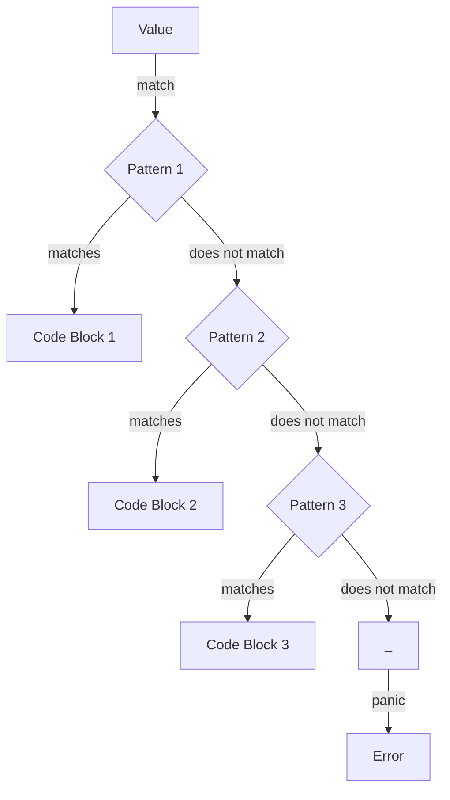

## Introduction
The **match expression** is a fundamental concept in Rust programming that enables exhaustive pattern matching. It allows developers to specify multiple patterns to match against a value, and execute different blocks of code depending on which pattern matches. This feature is essential for writing robust, error-free code, as it ensures that all possible cases are handled. In real-world scenarios, match expressions are used extensively in error handling, parsing, and data processing. Every engineer needs to understand how to use match expressions effectively to write efficient, maintainable code.

> **Note:** The match expression is not unique to Rust and can be found in other programming languages, such as Scala and Haskell. However, Rust's implementation is particularly powerful due to its focus on memory safety and performance.

## Core Concepts
To understand match expressions, it's essential to grasp the following key concepts:
* **Pattern matching**: The process of checking a value against multiple patterns to determine which one matches.
* **Exhaustive pattern matching**: Ensuring that all possible cases are handled, either by providing a catch-all pattern or by covering all possible values.
* **Arm**: A single pattern-match combination in a match expression.
* **Binding**: The process of assigning a value to a variable in a pattern.

Mental models for match expressions include thinking of them as a series of if-else statements, where each condition is a pattern, or as a lookup table, where the value is used to index into a list of possible matches.

## How It Works Internally
When a match expression is executed, Rust performs the following steps:
1. Evaluates the expression on the left-hand side of the match keyword.
2. Compares the resulting value against each pattern in the match expression, in order.
3. If a pattern matches, executes the corresponding block of code.
4. If no pattern matches, the program will panic at runtime, unless a catch-all pattern is provided.

The internal mechanics of match expressions involve the use of a **dispatch table**, which is a data structure that maps values to code pointers. When a match expression is compiled, Rust generates a dispatch table that contains the patterns and their corresponding code pointers.

## Code Examples
### Example 1: Basic Usage
```rust
fn describe_color(color: i32) -> String {
    match color {
        1 => String::from("Red"),
        2 => String::from("Green"),
        3 => String::from("Blue"),
        _ => String::from("Unknown"),
    }
}

fn main() {
    println!("{}", describe_color(1)); // prints "Red"
    println!("{}", describe_color(2)); // prints "Green"
    println!("{}", describe_color(3)); // prints "Blue"
    println!("{}", describe_color(4)); // prints "Unknown"
}
```
This example demonstrates a basic match expression that maps integers to color names.

### Example 2: Real-world Pattern
```rust
enum IpAddr {
    V4(u8, u8, u8, u8),
    V6(String),
}

fn describe_ip_addr(ip_addr: IpAddr) -> String {
    match ip_addr {
        IpAddr::V4(a, b, c, d) => format!("{}:{}:{}:{}", a, b, c, d),
        IpAddr::V6(addr) => format!("IPv6: {}", addr),
    }
}

fn main() {
    let ip_addr = IpAddr::V4(192, 168, 0, 1);
    println!("{}", describe_ip_addr(ip_addr)); // prints "192:168:0:1"
    let ip_addr = IpAddr::V6(String::from("2001:0db8:85a3:0000:0000:8a2e:0370:7334"));
    println!("{}", describe_ip_addr(ip_addr)); // prints "IPv6: 2001:0db8:85a3:0000:0000:8a2e:0370:7334"
}
```
This example demonstrates a more complex match expression that handles an enum value.

### Example 3: Advanced Usage
```rust
fn fibonacci(n: u32) -> u32 {
    match n {
        0 => 0,
        1 => 1,
        _ => fibonacci(n - 1) + fibonacci(n - 2),
    }
}

fn main() {
    println!("{}", fibonacci(10)); // prints "55"
}
```
This example demonstrates a recursive match expression that calculates the nth Fibonacci number.

> **Warning:** This example has a time complexity of O(2^n), which makes it inefficient for large values of n. A more efficient solution would use memoization or dynamic programming.

## Visual Diagram

This diagram illustrates the basic flow of a match expression.

## Comparison
| Approach | Time Complexity | Space Complexity | Pros | Cons | Best For |
|----------|----------------|-----------------|------|------|----------|
| Match Expression | O(1) | O(1) | Exhaustive pattern matching, concise code | Can be verbose for complex patterns | Simple to medium-complexity pattern matching |
| If-Else Statements | O(n) | O(1) | Flexible, easy to read | Verbose, error-prone | Simple to medium-complexity conditional logic |
| Lookup Table | O(1) | O(n) | Fast lookup, efficient | Limited flexibility, large memory footprint | High-performance, high-frequency lookup scenarios |
| Recursive Functions | O(2^n) | O(n) | Elegant, easy to implement | Inefficient for large inputs, stack overflow risk | Small-input, recursive problem domains |

## Real-world Use Cases
* **Error Handling**: Google's Rust-based error handling library, `failure`, uses match expressions to provide a flexible and expressive way to handle errors.
* **Data Processing**: Apache Arrow, a cross-language development platform for in-memory data processing, uses match expressions to handle different data types and formats.
* **Network Programming**: The Rust-based networking library, `tokio`, uses match expressions to handle different network protocols and events.

## Common Pitfalls
* **Inexhaustive Pattern Matching**: Failing to handle all possible cases, leading to runtime errors.
* **Unreachable Code**: Writing code that is never executed due to pattern matching.
* **Pattern Shadowing**: Accidentally hiding variables or values with the same name as a pattern.
* **Incorrect Pattern Ordering**: Writing patterns in the wrong order, leading to unexpected behavior.

> **Tip:** Use the `#[warn(non_exhaustive_patterns)]` attribute to catch inexhaustive pattern matching at compile-time.

## Interview Tips
* **What is the purpose of the match expression in Rust?**: A strong answer would discuss the importance of exhaustive pattern matching and the benefits of using match expressions.
* **How do you handle errors in Rust using match expressions?**: A strong answer would demonstrate a clear understanding of error handling and pattern matching.
* **Can you give an example of a complex match expression?**: A strong answer would provide a well-structured and readable example of a complex match expression.

> **Interview:** Be prepared to write match expressions on a whiteboard or in a coding challenge. Practice writing concise, readable, and efficient match expressions.

## Key Takeaways
* **Exhaustive pattern matching is essential**: Ensure that all possible cases are handled to avoid runtime errors.
* **Match expressions are concise and expressive**: Use match expressions to write elegant and efficient code.
* **Pattern ordering matters**: Write patterns in the correct order to avoid unexpected behavior.
* **Use the `#[warn(non_exhaustive_patterns)]` attribute**: Catch inexhaustive pattern matching at compile-time.
* **Practice writing complex match expressions**: Develop your skills in writing efficient and readable match expressions.
* **Understand the internal mechanics**: Familiarize yourself with the dispatch table and how match expressions are executed.
* **Use match expressions for error handling**: Leverage match expressions to handle errors in a flexible and expressive way.
* **Apply match expressions to real-world problems**: Use match expressions to solve complex problems in data processing, network programming, and other domains.