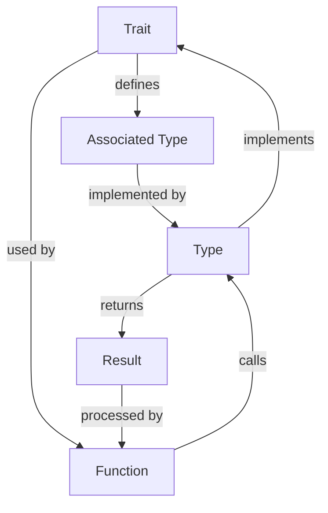

## Introduction
Associated types in traits are a fundamental concept in Rust programming language. They allow traits to define associated types, which are types that are related to the trait but are not part of the trait itself. This concept is crucial for building flexible and reusable code. In this section, we will explore the importance of associated types in traits, their real-world relevance, and why every engineer needs to know about them.

Associated types in traits are essential because they enable traits to define a relationship between types without requiring the types to be part of the trait itself. This allows for more flexibility and reusability in coding. For instance, a trait can define an associated type that represents a specific data structure, such as a vector or a hash map, without requiring the trait to be tied to a specific implementation of that data structure.

> **Note:** Associated types in traits are a powerful tool for building generic and reusable code. They allow traits to define relationships between types without requiring the types to be part of the trait itself.

## Core Concepts
In this section, we will delve into the core concepts of associated types in traits. We will explore the precise definitions, mental models, and key terminology related to this topic.

An associated type is a type that is defined within a trait. It is a type that is related to the trait but is not part of the trait itself. Associated types are defined using the `type` keyword followed by the name of the type.

```rust
trait MyTrait {
    type AssociatedType;
}
```

> **Tip:** When defining an associated type, it is essential to use a descriptive name that indicates the purpose of the type.

A mental model for associated types is to think of them as a way to define a contract between types. The trait defines the contract, and the associated type represents the type that must implement that contract.

Key terminology related to associated types includes:

* **Associated type**: A type that is defined within a trait.
* **Trait**: A collection of methods that can be implemented by a type.
* **Implementor**: A type that implements a trait.

## How It Works Internally
In this section, we will explore the under-the-hood mechanics of associated types in traits. We will discuss the step-by-step process of how associated types are defined, implemented, and used.

When a trait defines an associated type, the compiler generates an implicit implementation of that type for each type that implements the trait. The implicit implementation is based on the definition of the associated type within the trait.

```rust
trait MyTrait {
    type AssociatedType;
}

struct MyType;

impl MyTrait for MyType {
    type AssociatedType = i32;
}
```

In this example, the compiler generates an implicit implementation of the `AssociatedType` type for `MyType`, which is `i32`.

> **Warning:** When defining an associated type, it is essential to ensure that the type is correctly implemented for each type that implements the trait. Failure to do so can result in compilation errors.

## Code Examples
In this section, we will explore three complete and runnable code examples that demonstrate the use of associated types in traits.

### Example 1: Basic Usage

```rust
trait MyTrait {
    type AssociatedType;
}

struct MyType;

impl MyTrait for MyType {
    type AssociatedType = i32;
}

fn main() {
    let my_type: MyType = MyType;
    let associated_type: <MyType as MyTrait>::AssociatedType = 10;
    println!("{}", associated_type);
}
```

This example demonstrates the basic usage of associated types in traits. The `MyTrait` trait defines an associated type `AssociatedType`, which is implemented by `MyType` as `i32`.

### Example 2: Real-World Pattern

```rust
trait Database {
    type Query;
    type Result;
}

struct MySQL;

impl Database for MySQL {
    type Query = String;
    type Result = Vec<String>;
}

fn execute_query<D: Database>(database: D, query: D::Query) -> D::Result {
    // Execute the query on the database
    vec!["result1".to_string(), "result2".to_string()]
}

fn main() {
    let mysql: MySQL = MySQL;
    let query: <MySQL as Database>::Query = "SELECT * FROM table".to_string();
    let result: <MySQL as Database>::Result = execute_query(mysql, query);
    println!("{:?}", result);
}
```

This example demonstrates a real-world pattern of using associated types in traits. The `Database` trait defines associated types `Query` and `Result`, which are implemented by `MySQL` as `String` and `Vec<String>`, respectively.

### Example 3: Advanced Usage

```rust
trait Graph {
    type Node;
    type Edge;
}

struct DirectedGraph;

impl Graph for DirectedGraph {
    type Node = i32;
    type Edge = (i32, i32);
}

fn add_edge<G: Graph>(graph: G, node1: G::Node, node2: G::Node) -> G::Edge {
    // Add an edge between the two nodes
    (node1, node2)
}

fn main() {
    let directed_graph: DirectedGraph = DirectedGraph;
    let node1: <DirectedGraph as Graph>::Node = 1;
    let node2: <DirectedGraph as Graph>::Node = 2;
    let edge: <DirectedGraph as Graph>::Edge = add_edge(directed_graph, node1, node2);
    println!("{:?}", edge);
}
```

This example demonstrates an advanced usage of associated types in traits. The `Graph` trait defines associated types `Node` and `Edge`, which are implemented by `DirectedGraph` as `i32` and `(i32, i32)`, respectively.

## Visual Diagram

This diagram illustrates the relationship between a trait, an associated type, and a type that implements the trait. The trait defines the associated type, which is implemented by the type. The function uses the trait and calls the type, which returns a result that is processed by the function.

> **Tip:** When designing a system that uses associated types in traits, it is essential to consider the relationships between the trait, the associated type, and the type that implements the trait.

## Comparison
| Approach | Time Complexity | Space Complexity | Pros | Cons | Best For |
| --- | --- | --- | --- | --- | --- |
| Associated Types | O(1) | O(1) | Flexible, reusable | Steep learning curve | Building generic and reusable code |
| Enum | O(1) | O(1) | Simple, efficient | Limited flexibility | Defining a fixed set of values |
| Trait Object | O(1) | O(1) | Dynamic dispatch | Slow performance | Working with dynamic data |
| Type Alias | O(1) | O(1) | Simple, readable | Limited functionality | Defining a type alias |

This table compares different approaches to defining associated types in traits. The associated types approach offers flexibility and reusability but has a steep learning curve. The enum approach is simple and efficient but limited in flexibility. The trait object approach offers dynamic dispatch but has slow performance. The type alias approach is simple and readable but limited in functionality.

## Real-world Use Cases
Associated types in traits are used in various real-world systems, including:

* **Rust Standard Library**: The Rust standard library uses associated types in traits to define generic and reusable code.
* **Tokio**: Tokio, a popular Rust framework for building asynchronous applications, uses associated types in traits to define asynchronous tasks and futures.
* **Diesel**: Diesel, a popular Rust ORM (Object-Relational Mapping) library, uses associated types in traits to define database tables and queries.

## Common Pitfalls
When working with associated types in traits, there are several common pitfalls to avoid:

* **Incorrect implementation**: Failing to correctly implement an associated type for a type that implements a trait can result in compilation errors.
* **Type mismatch**: Using an incorrect type for an associated type can result in type mismatches and compilation errors.
* **Lack of documentation**: Failing to document an associated type can make it difficult for other developers to understand its purpose and usage.
* **Overly complex design**: Using associated types in traits can lead to overly complex design if not used carefully.

> **Warning:** When working with associated types in traits, it is essential to carefully consider the design and implementation to avoid common pitfalls.

## Interview Tips
When interviewing for a Rust developer position, you may be asked questions related to associated types in traits. Here are some tips to help you prepare:

* **Define associated types**: Be prepared to define and explain associated types in traits, including their purpose and usage.
* **Implement associated types**: Be prepared to implement associated types for a type that implements a trait.
* **Use associated types in code**: Be prepared to write code that uses associated types in traits, including defining traits, implementing associated types, and using associated types in functions.

Some common interview questions related to associated types in traits include:

* **What is an associated type in a trait?**: This question tests your understanding of associated types in traits and their purpose.
* **How do you implement an associated type for a type that implements a trait?**: This question tests your ability to implement associated types for a type that implements a trait.
* **Can you write a code example that uses associated types in traits?**: This question tests your ability to write code that uses associated types in traits.

## Key Takeaways
Here are some key takeaways to remember when working with associated types in traits:

* **Associated types are defined within a trait**: Associated types are defined within a trait using the `type` keyword.
* **Associated types are implemented by a type**: A type that implements a trait must implement the associated type.
* **Associated types can be used in functions**: Associated types can be used in functions that use the trait.
* **Associated types have a time complexity of O(1)**: Associated types have a time complexity of O(1) because they are defined at compile-time.
* **Associated types have a space complexity of O(1)**: Associated types have a space complexity of O(1) because they do not allocate any additional memory.
* **Associated types are flexible and reusable**: Associated types are flexible and reusable because they can be defined and implemented for any type that implements a trait.
* **Associated types can be complex to design and implement**: Associated types can be complex to design and implement, especially for large and complex systems.
* **Associated types require careful consideration of the design and implementation**: Associated types require careful consideration of the design and implementation to avoid common pitfalls and ensure correct usage.