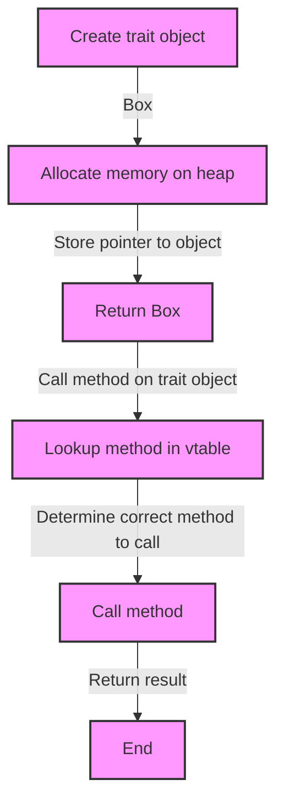

## Introduction
**Box<dyn Trait>** is a fundamental concept in Rust programming, allowing for heap-allocated trait objects. This feature enables developers to write more flexible and generic code, which is essential for large-scale applications. In this section, we will delve into the world of trait objects, exploring what they are, why they matter, and their real-world relevance.

Trait objects are a way to use traits as types, enabling the creation of generic code that can work with different types that implement the same trait. This is particularly useful when working with complex systems, where multiple types may need to be handled in a uniform manner. For instance, a web framework might use trait objects to handle different types of requests, such as GET, POST, and PUT, all of which implement a common trait.

> **Note:** Trait objects are not the same as trait bounds, which are used to constrain generic types. While trait bounds ensure that a type implements a specific trait, trait objects allow for the creation of values that can be used with any type that implements the trait.

In real-world applications, trait objects are used extensively in frameworks and libraries, such as the Rust standard library. For example, the `std::io::Read` trait is used to read data from various sources, including files, sockets, and stdin. By using trait objects, developers can write code that works with any type that implements the `Read` trait, without having to write separate code for each type.

## Core Concepts
To understand trait objects, it's essential to grasp the following core concepts:

* **Traits:** A trait is a set of methods that a type can implement. Traits define a common interface that can be used by multiple types.
* **Trait objects:** A trait object is a value that implements a trait. Trait objects are created using the `Box<dyn Trait>` syntax, where `Trait` is the name of the trait.
* **Dynamic dispatch:** Dynamic dispatch is the process of resolving the correct method to call at runtime, rather than at compile time. This is necessary because trait objects can be used with any type that implements the trait, and the correct method to call depends on the type of the object.

> **Warning:** Dynamic dispatch can have a performance impact, as it requires a lookup at runtime to determine the correct method to call. However, this impact is usually negligible, and the benefits of using trait objects often outweigh the costs.

Key terminology includes:

* **Trait bound:** A trait bound is a constraint on a generic type, ensuring that it implements a specific trait.
* **Trait object type:** A trait object type is a type that represents a value that implements a trait.

## How It Works Internally
When a trait object is created using `Box<dyn Trait>`, the following steps occur:

1. The trait object is allocated on the heap, and a pointer to the object is stored in a `Box`.
2. The `Box` is returned, and the trait object is stored on the heap.
3. When a method is called on the trait object, the following steps occur:
	* The trait object is looked up in a table, known as a vtable, which contains pointers to the methods implemented by the object.
	* The correct method to call is determined by looking up the method in the vtable.
	* The method is called, and the result is returned.

The time complexity of creating a trait object is O(1), as it simply involves allocating memory on the heap and storing a pointer to the object. The space complexity is O(1) as well, as the size of the trait object is fixed.

## Code Examples
### Example 1: Basic Usage
```rust
// Define a trait
trait Animal {
    fn sound(&self);
}

// Implement the trait for a type
struct Dog;

impl Animal for Dog {
    fn sound(&self) {
        println!("Woof!");
    }
}

// Create a trait object
fn main() {
    let dog = Box::new(Dog);
    let animal: Box<dyn Animal> = dog;
    animal.sound(); // Output: Woof!
}
```
This example demonstrates the basic usage of trait objects. We define a trait `Animal`, implement it for a type `Dog`, and create a trait object using `Box<dyn Animal>`.

### Example 2: Real-World Pattern
```rust
// Define a trait for a logger
trait Logger {
    fn log(&self, message: &str);
}

// Implement the trait for a type
struct ConsoleLogger;

impl Logger for ConsoleLogger {
    fn log(&self, message: &str) {
        println!("{}", message);
    }
}

// Define a function that takes a trait object
fn log_message(logger: &Box<dyn Logger>, message: &str) {
    logger.log(message);
}

// Use the function with a trait object
fn main() {
    let logger = Box::new(ConsoleLogger);
    log_message(&logger, "Hello, world!"); // Output: Hello, world!
}
```
This example demonstrates a real-world pattern using trait objects. We define a trait `Logger`, implement it for a type `ConsoleLogger`, and define a function that takes a trait object. We can then use the function with any type that implements the `Logger` trait.

### Example 3: Advanced Usage
```rust
// Define a trait for a parser
trait Parser {
    fn parse(&self, input: &str) -> Result<(), String>;
}

// Implement the trait for a type
struct JsonParser;

impl Parser for JsonParser {
    fn parse(&self, input: &str) -> Result<(), String> {
        // Parse JSON input
        Ok(())
    }
}

// Define a function that takes a trait object
fn parse_input(parser: &Box<dyn Parser>, input: &str) -> Result<(), String> {
    parser.parse(input)
}

// Use the function with a trait object
fn main() {
    let parser = Box::new(JsonParser);
    let result = parse_input(&parser, "{\"key\": \"value\"}");
    match result {
        Ok(_) => println!("Parsed successfully"),
        Err(err) => println!("Error: {}", err),
    }
}
```
This example demonstrates advanced usage of trait objects. We define a trait `Parser`, implement it for a type `JsonParser`, and define a function that takes a trait object. We can then use the function with any type that implements the `Parser` trait.

## Visual Diagram

This diagram illustrates the process of creating a trait object and calling a method on it. The diagram shows the allocation of memory on the heap, the storage of a pointer to the object, and the lookup of the correct method to call in the vtable.

## Comparison
| Approach | Time Complexity | Space Complexity | Pros | Cons | Best For |
| --- | --- | --- | --- | --- | --- |
| Trait objects | O(1) | O(1) | Flexible, generic code | Dynamic dispatch overhead | Large-scale applications |
| Trait bounds | O(1) | O(1) | Compile-time checking, no dynamic dispatch overhead | Less flexible, less generic code | Small-scale applications |
| Enum | O(1) | O(1) | Compile-time checking, no dynamic dispatch overhead | Less flexible, less generic code | Small-scale applications |
| Struct | O(1) | O(1) | Compile-time checking, no dynamic dispatch overhead | Less flexible, less generic code | Small-scale applications |

> **Tip:** When deciding between trait objects and trait bounds, consider the trade-off between flexibility and performance. Trait objects provide more flexibility, but may incur a dynamic dispatch overhead. Trait bounds provide compile-time checking and no dynamic dispatch overhead, but may be less flexible.

## Real-world Use Cases
1. **Rust standard library:** The Rust standard library uses trait objects extensively to provide a flexible and generic API.
2. **Tokio:** Tokio is a Rust framework for building concurrent and asynchronous applications. It uses trait objects to provide a flexible and generic API for working with different types of asynchronous tasks.
3. **Serde:** Serde is a Rust library for serializing and deserializing data. It uses trait objects to provide a flexible and generic API for working with different types of data.

## Common Pitfalls
1. **Incorrect usage of trait objects:** One common pitfall is using trait objects incorrectly, such as trying to use a trait object as a trait bound.
```rust
// Incorrect usage
fn foo<T: dyn Animal>(t: T) {
    // ...
}

// Correct usage
fn foo(t: Box<dyn Animal>) {
    // ...
}
```
2. **Dynamic dispatch overhead:** Another common pitfall is ignoring the dynamic dispatch overhead associated with trait objects.
```rust
// Example of dynamic dispatch overhead
fn foo(t: Box<dyn Animal>) {
    // ...
    t.sound(); // Dynamic dispatch overhead
}
```
3. **Incorrect implementation of traits:** A common pitfall is implementing traits incorrectly, such as forgetting to implement a required method.
```rust
// Incorrect implementation
struct Dog;

impl Animal for Dog {
    // Forgot to implement sound method
}

// Correct implementation
struct Dog;

impl Animal for Dog {
    fn sound(&self) {
        println!("Woof!");
    }
}
```
4. **Incorrect usage of trait bounds:** A common pitfall is using trait bounds incorrectly, such as using a trait bound as a trait object.
```rust
// Incorrect usage
fn foo<T: Animal>(t: T) {
    // ...
}

// Correct usage
fn foo(t: Box<dyn Animal>) {
    // ...
}
```
> **Interview:** When asked about trait objects, be prepared to explain the trade-off between flexibility and performance, and provide examples of when to use trait objects and when to use trait bounds.

## Interview Tips
1. **Define trait objects:** Be prepared to define trait objects and explain their purpose.
2. **Explain dynamic dispatch:** Be prepared to explain dynamic dispatch and its associated overhead.
3. **Provide examples:** Be prepared to provide examples of when to use trait objects and when to use trait bounds.
4. **Discuss trade-offs:** Be prepared to discuss the trade-offs between flexibility and performance when using trait objects.

## Key Takeaways
* **Trait objects provide flexibility:** Trait objects provide a way to write generic code that can work with different types that implement the same trait.
* **Dynamic dispatch overhead:** Trait objects incur a dynamic dispatch overhead, which can impact performance.
* **Trait bounds provide compile-time checking:** Trait bounds provide compile-time checking and no dynamic dispatch overhead, but may be less flexible.
* **Use trait objects for large-scale applications:** Trait objects are suitable for large-scale applications where flexibility is essential.
* **Use trait bounds for small-scale applications:** Trait bounds are suitable for small-scale applications where compile-time checking is sufficient.
* **Implement traits correctly:** Implement traits correctly, including all required methods.
* **Use trait objects correctly:** Use trait objects correctly, including using `Box<dyn Trait>` syntax.
* **Consider trade-offs:** Consider the trade-offs between flexibility and performance when using trait objects.