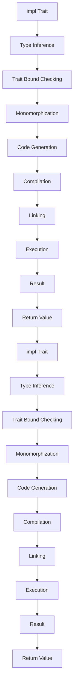

## Introduction
The `impl Trait` syntax in Rust is a way to specify a trait bound for a function parameter or return type without explicitly naming the trait. This feature is useful when working with generic functions and traits, as it allows for more concise and expressive code. In this section, we will explore the basics of `impl Trait` and its real-world relevance.

`impl Trait` is used to specify a trait bound for a function parameter or return type. It is a shorthand way of saying "this function takes a type that implements the following trait". For example, instead of writing `fn foo<T: Trait>(t: T)`, you can write `fn foo(t: impl Trait)`. This syntax is more concise and easier to read, especially when working with complex trait bounds.

> **Note:** The `impl Trait` syntax is not limited to function parameters and return types. It can also be used in other contexts, such as in type aliases and trait definitions.

In real-world applications, `impl Trait` is used extensively in libraries and frameworks that rely heavily on generics and traits. For example, the Rust standard library uses `impl Trait` to define functions like `std::iter::IntoIterator::into_iter`, which takes a type that implements the `IntoIterator` trait.

## Core Concepts
To understand how `impl Trait` works, it's essential to grasp the following core concepts:

* **Trait bounds**: A trait bound is a constraint on a type that specifies which traits it must implement. Trait bounds are used to ensure that a type can be used in a particular context.
* **Type inference**: Type inference is the process by which the Rust compiler determines the types of variables and expressions based on the context in which they are used. Type inference is essential for using `impl Trait` effectively.
* **Trait objects**: A trait object is a value that implements a trait. Trait objects are used to represent values that implement a particular trait, without knowing the exact type of the value at compile time.

> **Tip:** When working with `impl Trait`, it's essential to understand how type inference works in Rust. The compiler will often infer the types of variables and expressions based on the context, which can help simplify your code.

## How It Works Internally
When you use `impl Trait` in a function parameter or return type, the Rust compiler performs the following steps:

1. **Type inference**: The compiler infers the type of the function parameter or return type based on the context.
2. **Trait bound checking**: The compiler checks if the inferred type implements the specified trait.
3. **Monomorphization**: If the trait bound check passes, the compiler generates a monomorphized version of the function, which is a version of the function that is specialized for the inferred type.

> **Warning:** When using `impl Trait`, it's essential to ensure that the trait bound is correct. If the trait bound is incorrect, the compiler will generate an error.

## Code Examples
Here are three complete and runnable examples that demonstrate the use of `impl Trait` in function parameters and return types:

### Example 1: Basic usage
```rust
trait Print {
    fn print(&self);
}

struct Foo;

impl Print for Foo {
    fn print(&self) {
        println!("Foo");
    }
}

fn print_value(t: impl Print) {
    t.print();
}

fn main() {
    let foo = Foo;
    print_value(foo);
}
```
This example demonstrates the basic usage of `impl Trait` in a function parameter.

### Example 2: Real-world pattern
```rust
trait Iterator {
    type Item;
    fn next(&mut self) -> Option<Self::Item>;
}

struct MyIterator {
    count: i32,
}

impl Iterator for MyIterator {
    type Item = i32;
    fn next(&mut self) -> Option<Self::Item> {
        if self.count < 5 {
            self.count += 1;
            Some(self.count)
        } else {
            None
        }
    }
}

fn iterate_over_values(t: impl Iterator<Item = i32>) {
    while let Some(value) = t.next() {
        println!("{}", value);
    }
}

fn main() {
    let mut my_iterator = MyIterator { count: 0 };
    iterate_over_values(&mut my_iterator);
}
```
This example demonstrates the use of `impl Trait` in a real-world pattern, where a function takes an iterator as a parameter.

### Example 3: Advanced usage
```rust
trait Add<RHS> {
    type Output;
    fn add(self, rhs: RHS) -> Self::Output;
}

struct Point {
    x: i32,
    y: i32,
}

impl Add<Point> for Point {
    type Output = Point;
    fn add(self, rhs: Point) -> Self::Output {
        Point {
            x: self.x + rhs.x,
            y: self.y + rhs.y,
        }
    }
}

fn add_values<T: Add<T>>(t: T, rhs: T) -> T::Output {
    t.add(rhs)
}

fn main() {
    let point1 = Point { x: 1, y: 2 };
    let point2 = Point { x: 3, y: 4 };
    let result = add_values(point1, point2);
    println!("Result: ({}, {})", result.x, result.y);
}
```
This example demonstrates the advanced usage of `impl Trait` in a function return type.

## Visual Diagram

This diagram illustrates the process of using `impl Trait` in a function parameter or return type.

> **Note:** The diagram shows the high-level process of using `impl Trait`. The actual process may vary depending on the specific use case and the Rust compiler's implementation.

## Comparison
Here is a comparison of the `impl Trait` syntax with other approaches:

| Approach | Time Complexity | Space Complexity | Pros | Cons | Best For |
| --- | --- | --- | --- | --- | --- |
| `impl Trait` | O(1) | O(1) | Concise syntax, easy to read | Limited expressiveness | Simple trait bounds |
| `T: Trait` | O(1) | O(1) | More expressive, flexible | Verbose syntax | Complex trait bounds |
| `TraitObject` | O(n) | O(n) | Dynamic dispatch, flexible | Slow performance | Dynamic trait objects |

> **Tip:** When deciding which approach to use, consider the trade-offs between conciseness, expressiveness, and performance.

## Real-world Use Cases
Here are three real-world use cases for `impl Trait`:

1. **Rust standard library**: The Rust standard library uses `impl Trait` extensively in functions like `std::iter::IntoIterator::into_iter`.
2. **Tokio**: Tokio, a popular Rust framework for building asynchronous applications, uses `impl Trait` to define functions like `tokio::prelude::Stream::for_each`.
3. **Serde**: Serde, a popular Rust library for serializing and deserializing data, uses `impl Trait` to define functions like `serde::Serialize::serialize`.

> **Interview:** When asked about `impl Trait` in an interview, be prepared to explain its syntax, semantics, and use cases. Provide examples of how it is used in real-world applications.

## Common Pitfalls
Here are four common pitfalls to watch out for when using `impl Trait`:

1. **Incorrect trait bounds**: Make sure the trait bound is correct. If the trait bound is incorrect, the compiler will generate an error.
2. **Type inference errors**: Be aware of type inference errors, which can occur when the compiler infers the wrong type.
3. **Monomorphization errors**: Be aware of monomorphization errors, which can occur when the compiler generates multiple versions of a function.
4. **Performance issues**: Be aware of performance issues, which can occur when using `impl Trait` with complex trait bounds.

> **Warning:** When using `impl Trait`, make sure to test your code thoroughly to avoid common pitfalls.

## Interview Tips
Here are three common interview questions related to `impl Trait`:

1. **What is `impl Trait`?**: Explain the syntax and semantics of `impl Trait`.
2. **How does `impl Trait` work internally?**: Explain the process of type inference, trait bound checking, and monomorphization.
3. **What are the benefits and drawbacks of using `impl Trait`?**: Discuss the trade-offs between conciseness, expressiveness, and performance.

> **Tip:** When answering interview questions, be prepared to provide examples and explain the trade-offs between different approaches.

## Key Takeaways
Here are ten key takeaways to remember when using `impl Trait`:

* `impl Trait` is a shorthand way of specifying a trait bound for a function parameter or return type.
* `impl Trait` is more concise and easier to read than explicit trait bounds.
* `impl Trait` is limited in expressiveness compared to explicit trait bounds.
* Type inference is essential for using `impl Trait` effectively.
* Trait objects are used to represent values that implement a particular trait.
* Monomorphization is the process of generating multiple versions of a function for different types.
* Performance issues can occur when using `impl Trait` with complex trait bounds.
* `impl Trait` is used extensively in the Rust standard library and popular Rust frameworks and libraries.
* `impl Trait` is a powerful tool for building generic and flexible code.
* `impl Trait` requires careful consideration of trade-offs between conciseness, expressiveness, and performance.