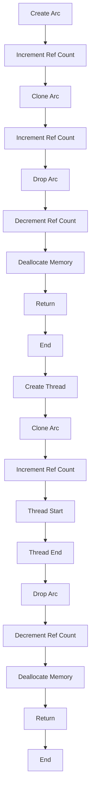

## Introduction
The **Arc** (Atomic Reference Counting) type in Rust is a thread-safe reference counting pointer. It's similar to **Rc**, but **Arc** is safe to share between threads. **Arc** is used when you need to share data between multiple threads and want to ensure that the data remains valid for as long as any thread is using it. This is particularly useful in concurrent programming, where multiple threads may be accessing the same data simultaneously.

> **Note:** In concurrent programming, it's essential to manage memory safely to prevent data corruption and crashes. **Arc** helps achieve this by providing a thread-safe way to share data between threads.

## Core Concepts
To understand **Arc**, you need to grasp the following concepts:

* **Reference counting**: A technique used to manage memory by counting the number of references to a value. When the count reaches zero, the value is deallocated.
* **Atomicity**: The ability to perform operations on a value in a way that is thread-safe, ensuring that the operation is executed as a single, indivisible unit.
* **Thread safety**: The ability of code to execute safely in a multithreaded environment, without fear of data corruption or other concurrency-related issues.

> **Tip:** When working with **Arc**, it's essential to understand how reference counting works, as it can help you write more efficient and safe code.

## How It Works Internally
Here's a step-by-step breakdown of how **Arc** works internally:

1. When you create an **Arc** instance, it allocates memory for the value and initializes the reference count to 1.
2. When you clone an **Arc** instance, it increments the reference count and returns a new **Arc** instance that points to the same value.
3. When an **Arc** instance is dropped, it decrements the reference count. If the count reaches zero, the value is deallocated.

> **Warning:** If you're not careful, you can create a reference cycle with **Arc**, which can lead to memory leaks. A reference cycle occurs when two or more **Arc** instances reference each other, preventing the reference count from reaching zero.

## Code Examples
Here are three complete and runnable examples that demonstrate the usage of **Arc**:

### Example 1: Basic Usage
```rust
use std::sync::{Arc, Mutex};
use std::thread;

fn main() {
    let counter = Arc::new(Mutex::new(0));
    let mut handles = vec![];

    for _ in 0..10 {
        let counter_clone = Arc::clone(&counter);
        let handle = thread::spawn(move || {
            let mut num = counter_clone.lock().unwrap();
            *num += 1;
        });
        handles.push(handle);
    }

    for handle in handles {
        handle.join().unwrap();
    }

    println!("Final count: {}", *counter.lock().unwrap());
}
```
This example demonstrates how to use **Arc** to share a **Mutex** between multiple threads.

### Example 2: Real-World Pattern
```rust
use std::sync::{Arc, RwLock};
use std::thread;

struct Cache {
    data: RwLock<String>,
}

impl Cache {
    fn new(data: String) -> Self {
        Cache {
            data: RwLock::new(data),
        }
    }

    fn get(&self) -> String {
        self.data.read().unwrap().clone()
    }

    fn set(&self, data: String) {
        *self.data.write().unwrap() = data;
    }
}

fn main() {
    let cache = Arc::new(Cache::new("Initial data".to_string()));
    let mut handles = vec![];

    for _ in 0..10 {
        let cache_clone = Arc::clone(&cache);
        let handle = thread::spawn(move || {
            let data = cache_clone.get();
            println!("Thread {}: {}", std::thread::current().id(), data);
        });
        handles.push(handle);
    }

    for handle in handles {
        handle.join().unwrap();
    }

    cache.set("New data".to_string());
    println!("Final data: {}", cache.get());
}
```
This example demonstrates how to use **Arc** to share a cache between multiple threads.

### Example 3: Advanced Usage
```rust
use std::sync::{Arc, Condvar, Mutex};
use std::thread;

struct Worker {
    id: u32,
    condvar: Arc<(Condvar, Mutex<bool>)>,
}

impl Worker {
    fn new(id: u32, condvar: Arc<(Condvar, Mutex<bool>)>) -> Self {
        Worker { id, condvar }
    }

    fn run(&self) {
        let (condvar, mutex) = &*self.condvar;
        let mut started = condvar.wait(mutex.lock().unwrap()).unwrap();
        while *started {
            println!("Worker {}: Working...", self.id);
            *started = false;
            condvar.notify_one();
        }
    }
}

fn main() {
    let condvar = Arc::new((Condvar::new(), Mutex::new(true)));
    let mut handles = vec![];

    for i in 0..10 {
        let condvar_clone = Arc::clone(&condvar);
        let handle = thread::spawn(move || {
            let worker = Worker::new(i, condvar_clone);
            worker.run();
        });
        handles.push(handle);
    }

    for handle in handles {
        handle.join().unwrap();
    }
}
```
This example demonstrates how to use **Arc** to share a condition variable between multiple threads.

## Visual Diagram

This diagram illustrates the internal workings of **Arc**, including the creation, cloning, and dropping of **Arc** instances, as well as the threading aspect.

> **Tip:** The diagram shows how **Arc** uses reference counting to manage memory, and how it ensures thread safety by using atomic operations.

## Comparison
| Approach | Time Complexity | Space Complexity | Pros | Cons | Best For |
| --- | --- | --- | --- | --- | --- |
| **Arc** | O(1) | O(1) | Thread-safe, efficient, and easy to use | Can lead to reference cycles | Sharing data between threads |
| **Rc** | O(1) | O(1) | Efficient and easy to use | Not thread-safe | Sharing data between threads in a single-threaded environment |
| **Box** | O(1) | O(1) | Simple and easy to use | Not thread-safe, no reference counting | Managing memory in a single-threaded environment |
| **Mutex** | O(1) | O(1) | Thread-safe, can be used with **Arc** | Can lead to deadlocks | Protecting shared data between threads |

> **Warning:** When choosing an approach, consider the trade-offs between thread safety, efficiency, and ease of use.

## Real-world Use Cases
Here are three real-world examples of using **Arc**:

1. **Redis**: Redis uses **Arc** to manage its internal data structures, ensuring thread safety and efficiency.
2. **Rust stdlib**: The Rust standard library uses **Arc** to implement its thread-safe data structures, such as **HashMap** and **Vec**.
3. **Apache Kafka**: Apache Kafka uses **Arc** to manage its internal data structures, ensuring thread safety and efficiency in its distributed environment.

> **Interview:** When asked about **Arc**, be prepared to explain its internal workings, its advantages and disadvantages, and its real-world use cases.

## Common Pitfalls
Here are four common mistakes to watch out for when using **Arc**:

1. **Reference cycles**: Creating a reference cycle with **Arc** can lead to memory leaks.
```rust
let a = Arc::new(());
let b = Arc::new(());
let c = Arc::clone(&a);
let d = Arc::clone(&b);
a.do_something(c);
b.do_something(d);
```
Instead, use **Weak** to break the cycle:
```rust
let a = Arc::new(());
let b = Arc::new(());
let c = Arc::downgrade(&a);
let d = Arc::downgrade(&b);
a.do_something(c);
b.do_something(d);
```
2. **Deadlocks**: Using **Arc** with **Mutex** can lead to deadlocks.
```rust
let a = Arc::new(Mutex::new(()));
let b = Arc::new(Mutex::new(()));
let c = Arc::clone(&a);
let d = Arc::clone(&b);
a.lock().unwrap();
b.lock().unwrap();
```
Instead, use **try_lock** to avoid deadlocks:
```rust
let a = Arc::new(Mutex::new(()));
let b = Arc::new(Mutex::new(()));
let c = Arc::clone(&a);
let d = Arc::clone(&b);
if let Ok(_) = a.try_lock() {
    if let Ok(_) = b.try_lock() {
        // ...
    }
}
```
3. **Incorrect usage**: Using **Arc** incorrectly can lead to unexpected behavior.
```rust
let a = Arc::new(());
let b = Arc::clone(&a);
let c = Arc::clone(&b);
```
Instead, use **Arc** correctly:
```rust
let a = Arc::new(());
let b = Arc::clone(&a);
let c = Arc::clone(&a);
```
4. **Performance issues**: Using **Arc** can lead to performance issues if not used carefully.
```rust
let a = Arc::new(());
for _ in 0..1000000 {
    let b = Arc::clone(&a);
}
```
Instead, use **Arc** with care:
```rust
let a = Arc::new(());
let mut handles = vec![];
for _ in 0..1000000 {
    let b = Arc::clone(&a);
    let handle = thread::spawn(move || {
        // ...
    });
    handles.push(handle);
}
```
> **Tip:** Always use **Arc** with care and attention to its internal workings to avoid common pitfalls.

## Interview Tips
Here are three common interview questions related to **Arc**:

1. **What is **Arc** and how does it work?**
	* Weak answer: **Arc** is a type of smart pointer that manages memory.
	* Strong answer: **Arc** is a thread-safe reference counting pointer that uses atomic operations to manage memory. It's similar to **Rc**, but **Arc** is safe to share between threads.
2. **How do you use **Arc** to share data between threads?**
	* Weak answer: You can use **Arc** to share data between threads by cloning the **Arc** instance and passing it to each thread.
	* Strong answer: You can use **Arc** to share data between threads by creating an **Arc** instance and cloning it for each thread. You can then use the cloned **Arc** instances to access the shared data.
3. **What are some common pitfalls when using **Arc**?**
	* Weak answer: Some common pitfalls when using **Arc** include creating reference cycles and using **Arc** incorrectly.
	* Strong answer: Some common pitfalls when using **Arc** include creating reference cycles, using **Arc** with **Mutex** incorrectly, and not using **Arc** with care to avoid performance issues.

> **Note:** When answering interview questions, be prepared to explain the internal workings of **Arc**, its advantages and disadvantages, and its real-world use cases.

## Key Takeaways
Here are six key takeaways to remember when using **Arc**:

* **Arc** is a thread-safe reference counting pointer that uses atomic operations to manage memory.
* **Arc** is similar to **Rc**, but **Arc** is safe to share between threads.
* **Arc** can be used to share data between threads by cloning the **Arc** instance and passing it to each thread.
* **Arc** can lead to reference cycles if not used carefully.
* **Arc** can be used with **Mutex** to protect shared data between threads.
* **Arc** can lead to performance issues if not used with care.

> **Tip:** Always use **Arc** with care and attention to its internal workings to avoid common pitfalls and ensure efficient and safe code.