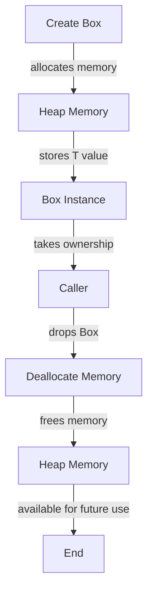

## Introduction
The `Box<T>` type in Rust is a smart pointer that provides heap allocation for any type `T`. It is a crucial component of Rust's ownership system, allowing for dynamic memory allocation while maintaining memory safety. In this section, we will delve into the world of `Box<T>`, exploring its importance, real-world relevance, and why every engineer needs to understand it. 
> **Note:** The `Box<T>` type is not just a simple wrapper around a heap-allocated value; it is a fundamental building block of Rust's memory management system.

In production environments, `Box<T>` is used extensively in various scenarios, such as:
- Dynamic data structures: When the size of a data structure is unknown at compile time, `Box<T>` provides a way to allocate memory on the heap.
- Recursive data structures: `Box<T>` enables the creation of recursive data structures, such as trees and graphs, by allowing a node to own a child node.
- Trait objects: `Box<T>` is used to create trait objects, which are values that implement a specific trait.

## Core Concepts
To understand `Box<T>`, it is essential to grasp the following core concepts:
- **Heap allocation**: Memory allocation on the heap, which is a region of memory where data can be stored dynamically.
- **Smart pointer**: A type that provides additional functionality and safety features beyond a raw pointer.
- **Ownership**: The concept of owning a value, which determines the lifetime and responsibilities associated with that value.
- **Borrowing**: The act of using a value without taking ownership of it, which can be either immutable or mutable.

> **Warning:** Using `Box<T>` incorrectly can lead to memory leaks or crashes, so it is crucial to understand the ownership and borrowing rules in Rust.

## How It Works Internally
When a `Box<T>` is created, the following steps occur:
1. Memory is allocated on the heap for the `T` value.
2. The `T` value is copied or moved into the allocated memory.
3. A `Box<T>` instance is created, which contains a pointer to the allocated memory.
4. The `Box<T>` instance is returned, and the caller takes ownership of it.

When a `Box<T>` is dropped, the following steps occur:
1. The `T` value is dropped, which may involve running its destructor.
2. The allocated memory is deallocated, freeing it for future use.

> **Tip:** To optimize performance, Rust provides various methods for working with `Box<T>`, such as `Box::new` and `Box::into_raw`.

## Code Examples
### Example 1: Basic Usage
```rust
fn main() {
    // Create a Box<i32> instance
    let boxed_int = Box::new(10);
    
    // Print the value of the Box<i32>
    println!("Value: {}", *boxed_int);
}
```
### Example 2: Recursive Data Structure
```rust
// Define a recursive data structure: a tree node
enum TreeNode {
    Leaf(i32),
    Node(Box<TreeNode>, Box<TreeNode>),
}

fn main() {
    // Create a tree with two leaf nodes
    let tree = TreeNode::Node(
        Box::new(TreeNode::Leaf(10)),
        Box::new(TreeNode::Leaf(20)),
    );
    
    // Print the values of the tree
    match tree {
        TreeNode::Leaf(value) => println!("Leaf: {}", value),
        TreeNode::Node(left, right) => {
            println!("Node:");
            match *left {
                TreeNode::Leaf(value) => println!("  Left: {}", value),
                _ => println!("  Left: Node"),
            }
            match *right {
                TreeNode::Leaf(value) => println!("  Right: {}", value),
                _ => println!("  Right: Node"),
            }
        }
    }
}
```
### Example 3: Trait Object
```rust
// Define a trait
trait Animal {
    fn sound(&self);
}

// Implement the trait for a struct
struct Dog;
impl Animal for Dog {
    fn sound(&self) {
        println!("Woof!");
    }
}

fn main() {
    // Create a trait object
    let animal: Box<dyn Animal> = Box::new(Dog);
    
    // Call the sound method on the trait object
    animal.sound();
}
```
## Visual Diagram

The diagram illustrates the creation and lifetime of a `Box<T>` instance, from memory allocation to deallocation.

## Comparison
| Approach | Time Complexity | Space Complexity | Pros | Cons | Best For |
| --- | --- | --- | --- | --- | --- |
| `Box<T>` | O(1) allocation, O(n) deallocation | O(n) | Provides dynamic memory allocation, supports recursive data structures | May introduce performance overhead due to indirection | Dynamic data structures, recursive data structures |
| `Rc<T>` | O(1) allocation, O(n) deallocation | O(n) | Provides reference counting, supports shared ownership | May introduce performance overhead due to reference counting | Shared data structures, concurrent programming |
| `Arc<T>` | O(1) allocation, O(n) deallocation | O(n) | Provides atomic reference counting, supports concurrent programming | May introduce performance overhead due to atomic operations | Concurrent programming, parallel processing |
| `Vec<T>` | O(n) allocation, O(n) deallocation | O(n) | Provides dynamic array, supports growable storage | May introduce performance overhead due to reallocation | Dynamic arrays, growable storage |

## Real-world Use Cases
1. **Redis**: Redis uses a variant of `Box<T>` to manage its internal data structures, providing dynamic memory allocation and efficient storage.
2. **Rust's standard library**: The Rust standard library uses `Box<T>` extensively to provide dynamic memory allocation and support for recursive data structures.
3. **Apache Kafka**: Apache Kafka uses `Box<T>`-like constructs to manage its internal data structures, providing efficient and scalable storage for message queues.

## Common Pitfalls
1. **Forgetting to drop `Box<T>`**: Failing to drop a `Box<T>` instance can lead to memory leaks.
```rust
// Wrong
fn main() {
    let boxed_int = Box::new(10);
    // Forget to drop boxed_int
}

// Right
fn main() {
    let boxed_int = Box::new(10);
    drop(boxed_int);
}
```
2. **Using `Box<T>` unnecessarily**: Using `Box<T>` when not necessary can introduce performance overhead.
```rust
// Wrong
fn main() {
    let boxed_int = Box::new(10);
    let value = *boxed_int;
}

// Right
fn main() {
    let value = 10;
}
```
3. **Not handling `Box<T>` errors**: Failing to handle errors when working with `Box<T>` can lead to crashes or unexpected behavior.
```rust
// Wrong
fn main() {
    let boxed_int = Box::new(10);
    // Forget to handle errors
}

// Right
fn main() {
    let boxed_int = Box::new(10);
    // Handle errors
    if let Err(error) = boxed_int {
        println!("Error: {}", error);
    }
}
```
4. **Using `Box<T>` with mutable references**: Using `Box<T>` with mutable references can lead to unexpected behavior or crashes.
```rust
// Wrong
fn main() {
    let mut boxed_int = Box::new(10);
    let mut_ref = &mut *boxed_int;
    // Use mut_ref
}

// Right
fn main() {
    let mut boxed_int = Box::new(10);
    let mut_ref = boxed_int.as_mut();
    // Use mut_ref
}
```
> **Warning:** Using `Box<T>` incorrectly can lead to memory leaks, crashes, or unexpected behavior.

## Interview Tips
1. **What is the purpose of `Box<T>`?**: The interviewer wants to assess your understanding of `Box<T>` and its role in Rust's memory management system.
```rust
// Weak answer
Box<T> is a smart pointer that provides dynamic memory allocation.

// Strong answer
Box<T> is a smart pointer that provides dynamic memory allocation, supports recursive data structures, and enables trait objects. It is a crucial component of Rust's ownership system, allowing for efficient and safe memory management.
```
2. **How does `Box<T>` work internally?**: The interviewer wants to evaluate your knowledge of the internal mechanics of `Box<T>`.
```rust
// Weak answer
Box<T> works by allocating memory on the heap and storing the T value.

// Strong answer
Box<T> works by allocating memory on the heap using the `alloc` function, storing the T value in the allocated memory, and creating a Box<T> instance that contains a pointer to the allocated memory. When the Box<T> instance is dropped, the allocated memory is deallocated using the `dealloc` function.
```
3. **What are the advantages and disadvantages of using `Box<T>`?**: The interviewer wants to assess your understanding of the trade-offs involved in using `Box<T>`.
```rust
// Weak answer
The advantages of using Box<T> are dynamic memory allocation and support for recursive data structures. The disadvantages are performance overhead and memory leaks.

// Strong answer
The advantages of using Box<T> are dynamic memory allocation, support for recursive data structures, and enablement of trait objects. The disadvantages are performance overhead due to indirection, potential memory leaks if not dropped correctly, and increased complexity due to the need to manage ownership and borrowing.
```
> **Interview:** Be prepared to explain the internal mechanics of `Box<T>`, its advantages and disadvantages, and how to use it correctly in various scenarios.

## Key Takeaways
* `Box<T>` is a smart pointer that provides dynamic memory allocation and supports recursive data structures.
* `Box<T>` is a crucial component of Rust's ownership system, allowing for efficient and safe memory management.
* The time complexity of allocating and deallocating memory using `Box<T>` is O(1) and O(n), respectively.
* The space complexity of using `Box<T>` is O(n), where n is the size of the allocated memory.
* `Box<T>` provides a way to create trait objects, which are values that implement a specific trait.
* Using `Box<T>` incorrectly can lead to memory leaks, crashes, or unexpected behavior.
* The `Box<T>` type is not just a simple wrapper around a heap-allocated value; it is a fundamental building block of Rust's memory management system.
* `Box<T>` is used extensively in production environments, including Redis, Rust's standard library, and Apache Kafka.
* To optimize performance, Rust provides various methods for working with `Box<T>`, such as `Box::new` and `Box::into_raw`.