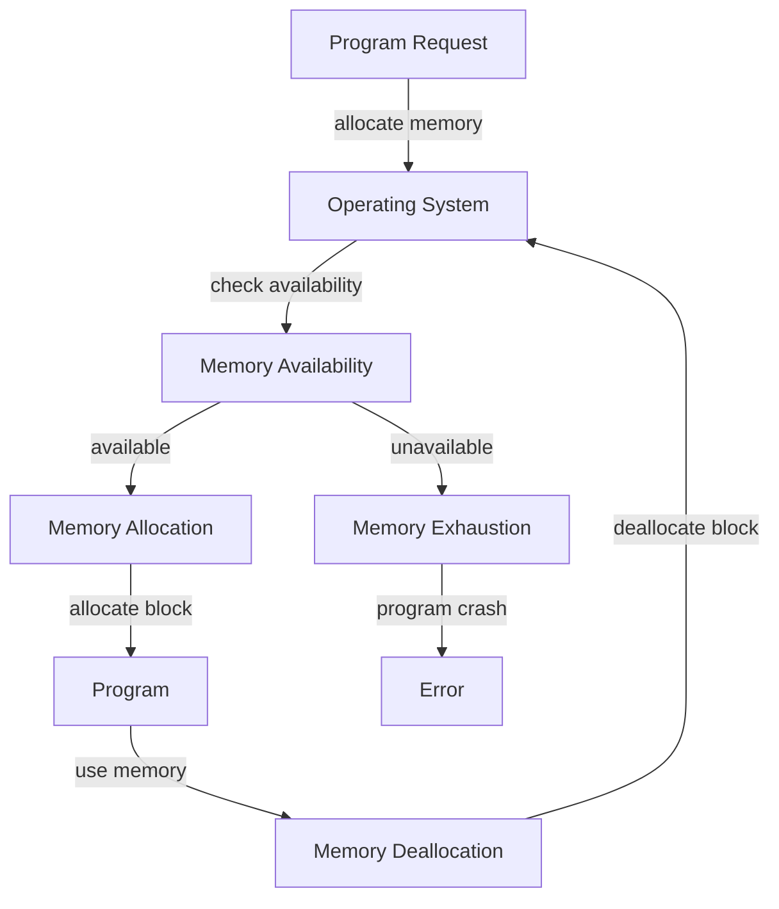

## Introduction
Memory layout is a fundamental concept in computer science that refers to the way a program's memory is organized and managed. It is essential to understand the differences between the **stack** and the **heap**, as they play a crucial role in determining the performance, scalability, and reliability of a program. In this section, we will delve into the world of memory layout, exploring the reasons behind its importance, its real-world relevance, and why every engineer should have a deep understanding of this topic.

> **Note:** Memory layout is a critical aspect of system programming, as it directly affects the efficiency and correctness of a program. A good understanding of memory layout can help engineers write more efficient, scalable, and reliable code.

## Core Concepts
To grasp the concept of memory layout, it is essential to understand the following key terms:
* **Stack**: A region of memory where data is stored in a Last-In-First-Out (LIFO) order. The stack is used to store local variables, function parameters, and return addresses.
* **Heap**: A region of memory where data is stored in a random order. The heap is used to store dynamic memory allocations, such as objects and arrays.
* **Memory allocation**: The process of assigning a block of memory to a program or a variable.
* **Memory deallocation**: The process of freeing a block of memory that is no longer needed.

> **Tip:** A good mental model to understand the stack and heap is to think of a stack of plates and a heap of boxes. The stack is like a stack of plates, where plates are added and removed from the top, whereas the heap is like a heap of boxes, where boxes are added and removed randomly.

## How It Works Internally
When a program is executed, the operating system allocates a block of memory to the program. This block of memory is divided into several regions, including the stack, heap, and code segment. The stack and heap are managed by the program itself, while the code segment is managed by the operating system.

Here is a step-by-step breakdown of how memory allocation works:
1. The program requests a block of memory from the operating system.
2. The operating system checks if the requested block of memory is available.
3. If the block of memory is available, the operating system allocates it to the program.
4. The program uses the allocated block of memory to store data.
5. When the program is finished using the block of memory, it requests the operating system to deallocate it.

> **Warning:** Memory leaks can occur if a program fails to deallocate a block of memory that is no longer needed. This can lead to memory exhaustion and program crashes.

## Code Examples
### Example 1: Basic Stack Allocation
```rust
fn main() {
    let x: i32 = 10; // allocate memory for x on the stack
    println!("The value of x is: {}", x);
}
```
In this example, the variable `x` is allocated on the stack, and its value is printed to the console.

### Example 2: Dynamic Heap Allocation
```rust
fn main() {
    let mut vec: Vec<i32> = Vec::new(); // allocate memory for vec on the heap
    vec.push(10); // allocate memory for the element on the heap
    println!("The value of vec is: {:?}", vec);
}
```
In this example, a vector `vec` is allocated on the heap, and an element is pushed onto it. The vector's value is then printed to the console.

### Example 3: Advanced Memory Management
```rust
use std::rc::Rc;

fn main() {
    let rc: Rc<i32> = Rc::new(10); // allocate memory for the Rc on the heap
    let rc_clone = Rc::clone(&rc); // increment the reference count
    println!("The value of rc is: {}", *rc);
    println!("The value of rc_clone is: {}", *rc_clone);
}
```
In this example, a reference-counted integer `rc` is allocated on the heap, and its reference count is incremented when it is cloned. The values of `rc` and `rc_clone` are then printed to the console.

## Visual Diagram

This diagram illustrates the memory allocation process, from the program's request to the operating system's allocation and deallocation of memory.

## Comparison
| Approach | Time Complexity | Space Complexity | Pros | Cons | Best For |
|----------|----------------|-----------------|------|------|----------|
| Stack Allocation | O(1) | O(1) | Fast and efficient, minimal overhead | Limited size, not suitable for large data structures | Small, fixed-size data structures |
| Heap Allocation | O(log n) | O(n) | Can handle large data structures, dynamic allocation | Slower and more complex, memory fragmentation | Large, dynamic data structures |
| Reference Counting | O(1) | O(n) | Efficient and simple, minimal overhead | Not suitable for cyclic data structures, reference counting overhead | Simple, acyclic data structures |
| Garbage Collection | O(n) | O(n) | Handles cyclic data structures, minimal manual memory management | Slow and complex, pause-the-world garbage collection | Complex, cyclic data structures |

## Real-world Use Cases
1. **Web Browsers**: Web browsers use a combination of stack and heap allocation to manage memory for web pages, scripts, and plugins.
2. **Databases**: Databases use heap allocation to manage memory for data storage and retrieval.
3. **Operating Systems**: Operating systems use a combination of stack and heap allocation to manage memory for system processes and applications.

> **Interview:** Can you explain the differences between stack and heap allocation? How would you implement a memory allocation algorithm in a programming language?

## Common Pitfalls
1. **Memory Leaks**: Failing to deallocate memory that is no longer needed can lead to memory leaks and program crashes.
2. **Memory Fragmentation**: Repeatedly allocating and deallocating memory can lead to memory fragmentation, reducing the efficiency of memory allocation.
3. **Dangling Pointers**: Failing to update pointers after memory deallocation can lead to dangling pointers and program crashes.
4. **Use-After-Free**: Accessing memory after it has been deallocated can lead to use-after-free bugs and program crashes.

> **Warning:** Memory-related bugs can be difficult to debug and fix, as they may not always produce immediate errors.

## Interview Tips
1. **Stack vs Heap**: Be prepared to explain the differences between stack and heap allocation, including their advantages and disadvantages.
2. **Memory Allocation Algorithms**: Be prepared to implement a simple memory allocation algorithm, such as a first-fit or best-fit algorithm.
3. **Memory Management**: Be prepared to discuss memory management strategies, including reference counting and garbage collection.

> **Tip:** Practice implementing memory allocation algorithms and memory management strategies to improve your understanding of memory layout and management.

## Key Takeaways
* **Stack allocation is fast and efficient**, but limited in size and not suitable for large data structures.
* **Heap allocation is dynamic and flexible**, but slower and more complex, with potential for memory fragmentation.
* **Reference counting is efficient and simple**, but not suitable for cyclic data structures.
* **Garbage collection is complex and slow**, but handles cyclic data structures and minimizes manual memory management.
* **Memory leaks and fragmentation can occur** if memory is not properly managed.
* **Dangling pointers and use-after-free bugs can occur** if pointers are not properly updated after memory deallocation.
* **Memory allocation algorithms can be implemented** using a variety of strategies, including first-fit, best-fit, and worst-fit algorithms.