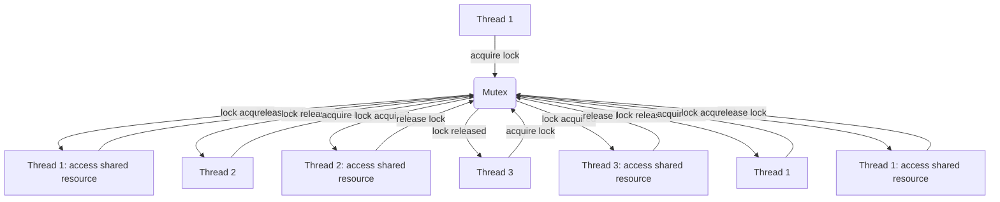

## Introduction
A **Mutex** (short for "mutual exclusion") is a synchronization primitive that allows only one thread to access a shared resource at a time. It is a crucial component in concurrent programming, where multiple threads or processes need to share data or resources. In Rust, `Mutex<T>` is a type of smart pointer that provides thread-safe interior mutability, meaning that it allows multiple threads to safely access and modify the same data.

In real-world scenarios, mutexes are used in various applications, such as operating systems, databases, and web servers, where multiple threads or processes need to access shared resources. For example, a web server may use a mutex to synchronize access to a shared database connection pool.

> **Note:** Mutexes are essential in concurrent programming because they prevent data corruption and ensure that shared resources are accessed in a thread-safe manner.

## Core Concepts
To understand how `Mutex<T>` works, it is essential to grasp the following core concepts:

* **Locking**: The process of acquiring exclusive access to a shared resource.
* **Unlocking**: The process of releasing exclusive access to a shared resource.
* **Blocking**: The behavior of a thread that is waiting for a mutex to be unlocked.
* **Starvation**: A situation where a thread is unable to acquire a mutex due to other threads holding it for an extended period.

> **Tip:** When using mutexes, it is essential to minimize the time spent holding the lock to avoid blocking other threads and prevent starvation.

## How It Works Internally
A `Mutex<T>` in Rust consists of a lock and a value of type `T`. When a thread attempts to acquire the mutex, it will block until the lock is released by another thread. The lock is implemented using a combination of atomic operations and a wait queue.

Here is a step-by-step breakdown of how `Mutex<T>` works internally:

1. A thread attempts to acquire the mutex by calling `lock()`.
2. If the mutex is already locked, the thread will block and wait for the lock to be released.
3. When the lock is released, the waiting thread will be notified and will attempt to acquire the lock again.
4. Once the lock is acquired, the thread can access and modify the value of type `T`.
5. When the thread is finished with the value, it will release the lock by calling `unlock()`.

## Code Examples
Here are three complete and runnable examples that demonstrate how to use `Mutex<T>` in Rust:

### Example 1: Basic Usage
```rust
use std::sync::{Arc, Mutex};
use std::thread;

fn main() {
    let counter = Arc::new(Mutex::new(0));
    let mut handles = vec![];

    for _ in 0..10 {
        let counter_clone = Arc::clone(&counter);
        let handle = thread::spawn(move || {
            let mut num = counter_clone.lock().unwrap();
            *num += 1;
        });
        handles.push(handle);
    }

    for handle in handles {
        handle.join().unwrap();
    }

    println!("Final counter value: {}", *counter.lock().unwrap());
}
```
This example demonstrates how to use `Mutex<T>` to synchronize access to a shared counter variable.

### Example 2: Real-World Pattern
```rust
use std::sync::{Arc, Mutex};
use std::thread;

struct BankAccount {
    balance: f64,
}

impl BankAccount {
    fn new() -> BankAccount {
        BankAccount { balance: 0.0 }
    }

    fn deposit(&mut self, amount: f64) {
        self.balance += amount;
    }

    fn withdraw(&mut self, amount: f64) -> bool {
        if self.balance >= amount {
            self.balance -= amount;
            true
        } else {
            false
        }
    }
}

fn main() {
    let account = Arc::new(Mutex::new(BankAccount::new()));
    let mut handles = vec![];

    for _ in 0..10 {
        let account_clone = Arc::clone(&account);
        let handle = thread::spawn(move || {
            let mut account_lock = account_clone.lock().unwrap();
            account_lock.deposit(10.0);
            account_lock.withdraw(5.0);
        });
        handles.push(handle);
    }

    for handle in handles {
        handle.join().unwrap();
    }

    println!("Final account balance: {}", account.lock().unwrap().balance);
}
```
This example demonstrates how to use `Mutex<T>` to synchronize access to a shared `BankAccount` struct.

### Example 3: Advanced Usage
```rust
use std::sync::{Arc, Mutex};
use std::thread;

struct Graph {
    nodes: Vec<String>,
    edges: Vec<(String, String)>,
}

impl Graph {
    fn new() -> Graph {
        Graph {
            nodes: vec![],
            edges: vec![],
        }
    }

    fn add_node(&mut self, node: String) {
        self.nodes.push(node);
    }

    fn add_edge(&mut self, node1: String, node2: String) {
        self.edges.push((node1, node2));
    }
}

fn main() {
    let graph = Arc::new(Mutex::new(Graph::new()));
    let mut handles = vec![];

    for _ in 0..10 {
        let graph_clone = Arc::clone(&graph);
        let handle = thread::spawn(move || {
            let mut graph_lock = graph_clone.lock().unwrap();
            graph_lock.add_node("Node1".to_string());
            graph_lock.add_edge("Node1".to_string(), "Node2".to_string());
        });
        handles.push(handle);
    }

    for handle in handles {
        handle.join().unwrap();
    }

    println!("Final graph nodes: {:?}", graph.lock().unwrap().nodes);
    println!("Final graph edges: {:?}", graph.lock().unwrap().edges);
}
```
This example demonstrates how to use `Mutex<T>` to synchronize access to a shared `Graph` struct.

## Visual Diagram

This diagram illustrates the process of multiple threads acquiring and releasing a mutex to access a shared resource.

## Comparison
Here is a comparison of different synchronization primitives in Rust:

| Approach | Time Complexity | Space Complexity | Pros | Cons | Best For |
| --- | --- | --- | --- | --- | --- |
| Mutex | O(1) | O(1) | Thread-safe, easy to use | Blocking, overhead | Shared resources, critical sections |
| RwLock | O(1) | O(1) | Multiple readers, single writer | Complex implementation | Read-heavy, write-light scenarios |
| Atomic | O(1) | O(1) | Lock-free, high-performance | Limited functionality, complex usage | Low-level, performance-critical code |
| Channel | O(1) | O(1) | Asynchronous communication, easy to use | Blocking, overhead | Inter-thread communication, data transfer |

## Real-world Use Cases
Here are three real-world use cases of `Mutex<T>`:

1. **Database Connection Pooling**: A web server may use a mutex to synchronize access to a shared database connection pool. This ensures that only one thread can acquire a connection at a time, preventing data corruption and improving performance.
2. **File System Access**: An operating system may use a mutex to synchronize access to a shared file system. This ensures that only one thread can read or write to a file at a time, preventing data corruption and improving performance.
3. **Network Communication**: A network protocol implementation may use a mutex to synchronize access to a shared socket or connection. This ensures that only one thread can send or receive data at a time, preventing data corruption and improving performance.

> **Warning:** Using mutexes incorrectly can lead to deadlocks, livelocks, or starvation. It is essential to use mutexes judiciously and minimize the time spent holding the lock.

## Common Pitfalls
Here are four common pitfalls when using `Mutex<T>`:

1. **Deadlock**: A situation where two or more threads are blocked indefinitely, each waiting for the other to release a mutex.
2. **Livelock**: A situation where two or more threads are unable to proceed because they are too busy responding to each other's actions.
3. **Starvation**: A situation where a thread is unable to acquire a mutex due to other threads holding it for an extended period.
4. **Mutex Overhead**: Using mutexes can introduce significant overhead due to the blocking and waiting involved.

> **Tip:** To avoid these pitfalls, it is essential to use mutexes judiciously, minimize the time spent holding the lock, and use other synchronization primitives when possible.

## Interview Tips
Here are three common interview questions related to `Mutex<T>`:

1. **What is a mutex, and how does it work?**
	* Weak answer: A mutex is a lock that allows only one thread to access a shared resource.
	* Strong answer: A mutex is a synchronization primitive that allows only one thread to access a shared resource at a time. It works by blocking threads that attempt to acquire the mutex while it is already locked.
2. **How do you avoid deadlocks when using mutexes?**
	* Weak answer: You can avoid deadlocks by using a single mutex for all shared resources.
	* Strong answer: You can avoid deadlocks by using a lock hierarchy, where threads always acquire mutexes in a consistent order. You can also use a timeout or a deadlock detection mechanism to detect and recover from deadlocks.
3. **What are the trade-offs between using a mutex and a RwLock?**
	* Weak answer: A mutex is better than a RwLock because it is simpler to use.
	* Strong answer: A mutex is better than a RwLock when you need to protect a shared resource that is written frequently. A RwLock is better than a mutex when you need to protect a shared resource that is read frequently and written infrequently.

> **Interview:** Be prepared to answer questions about the basics of mutexes, how to use them correctly, and how to avoid common pitfalls.

## Key Takeaways
Here are the key takeaways from this chapter:

* **Mutexes are essential for thread-safe programming**: Mutexes provide a way to synchronize access to shared resources in a multi-threaded environment.
* **Mutexes can introduce overhead**: Using mutexes can introduce significant overhead due to the blocking and waiting involved.
* **Use mutexes judiciously**: Use mutexes only when necessary, and minimize the time spent holding the lock.
* **Avoid deadlocks and livelocks**: Use a lock hierarchy, timeout, or deadlock detection mechanism to avoid deadlocks and livelocks.
* **Consider using RwLock or other synchronization primitives**: Depending on the use case, RwLock or other synchronization primitives may be more suitable than a mutex.
* **Minimize the time spent holding the lock**: Minimize the time spent holding the lock to avoid blocking other threads and prevent starvation.
* **Use atomic operations when possible**: Use atomic operations when possible to avoid the need for mutexes.
* **Test and profile your code**: Test and profile your code to ensure that it is correct and performs well in a multi-threaded environment.