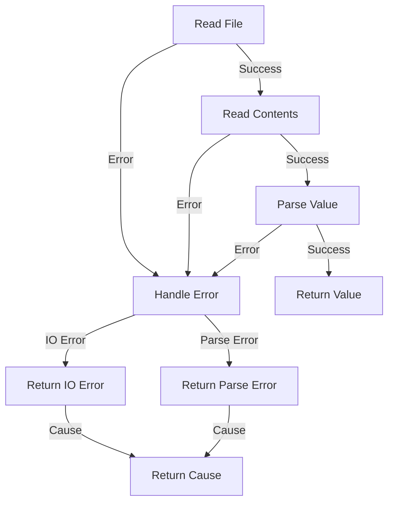

## Introduction
**Error handling** is a critical aspect of software development, and **Rust** provides a robust and expressive way to handle errors. One of the key features of Rust's error handling system is the ability to combine multiple error types into a single error type. This allows developers to write more concise and expressive code, while also providing better error messages and debugging information. In this section, we will explore the concept of combining multiple error types in Rust, and how it can be used to write more robust and maintainable code.

> **Note:** Error handling is an essential part of software development, as it allows developers to anticipate and handle unexpected events or errors that may occur during the execution of their code.

## Core Concepts
The core concept of combining multiple error types in Rust is based on the idea of **error traits**. An error trait is a trait that defines a set of methods that an error type must implement in order to be considered an error. The most common error trait in Rust is the **`std::error::Error`** trait, which provides a set of methods for working with errors, such as **`description`**, **`cause`**, and **`source`**.

> **Tip:** When working with errors in Rust, it's essential to understand the concept of error traits and how they can be used to define custom error types.

In addition to error traits, Rust also provides a number of **error types**, such as **`std::io::Error`**, **`std::fmt::Error`**, and **`std::num::ParseIntError`**, which can be used to represent specific types of errors. These error types can be combined using the **`std::result::Result`** type, which provides a way to represent a value that may or may not be present, along with an error message if the value is not present.

## How It Works Internally
When combining multiple error types in Rust, the **`std::result::Result`** type is used to represent a value that may or may not be present, along with an error message if the value is not present. The **`Result`** type is a **sum type**, which means that it can represent one of two possible values: **`Ok(value)`** or **`Err(error)`**.

> **Warning:** When working with the **`Result`** type, it's essential to handle both the **`Ok`** and **`Err`** cases, in order to avoid panicking or crashing the program.

The **`Result`** type provides a number of methods for working with errors, such as **`unwrap`**, **`expect`**, and **`map_err`**, which can be used to handle errors in a concise and expressive way. The **`unwrap`** method returns the value inside the **`Ok`** variant, or panics if the value is not present. The **`expect`** method returns the value inside the **`Ok`** variant, or panics with a custom error message if the value is not present. The **`map_err`** method maps the error value to a new error value, using a closure.

## Code Examples
### Example 1: Basic Error Handling
```rust
use std::fs::File;
use std::io::Read;

fn read_file(path: &str) -> std::io::Result<String> {
    let mut file = File::open(path)?;
    let mut contents = String::new();
    file.read_to_string(&mut contents)?;
    Ok(contents)
}

fn main() {
    match read_file("example.txt") {
        Ok(contents) => println!("{}", contents),
        Err(error) => println!("Error: {}", error),
    }
}
```
This example demonstrates basic error handling using the **`std::io::Result`** type.

### Example 2: Combining Multiple Error Types
```rust
use std::fs::File;
use std::io::Read;
use std::num::ParseIntError;

enum Error {
    IoError(std::io::Error),
    ParseError(ParseIntError),
}

fn read_file(path: &str) -> Result<String, Error> {
    let mut file = File::open(path).map_err(Error::IoError)?;
    let mut contents = String::new();
    file.read_to_string(&mut contents).map_err(Error::IoError)?;
    let value: i32 = contents.parse().map_err(Error::ParseError)?;
    Ok(format!("Value: {}", value))
}

fn main() {
    match read_file("example.txt") {
        Ok(contents) => println!("{}", contents),
        Err(error) => match error {
            Error::IoError(error) => println!("IO Error: {}", error),
            Error::ParseError(error) => println!("Parse Error: {}", error),
        },
    }
}
```
This example demonstrates combining multiple error types using an **`enum`** and the **`map_err`** method.

### Example 3: Advanced Error Handling
```rust
use std::fs::File;
use std::io::Read;
use std::num::ParseIntError;

struct Error {
    message: String,
    cause: Option<Box<dyn std::error::Error>>,
}

impl std::error::Error for Error {
    fn description(&self) -> &str {
        &self.message
    }

    fn cause(&self) -> Option<&dyn std::error::Error> {
        self.cause.as_ref().map(|cause| cause.as_ref())
    }
}

impl std::fmt::Display for Error {
    fn fmt(&self, f: &mut std::fmt::Formatter) -> std::fmt::Result {
        write!(f, "{}", self.message)
    }
}

fn read_file(path: &str) -> Result<String, Error> {
    let mut file = File::open(path).map_err(|error| Error {
        message: format!("IO Error: {}", error),
        cause: Some(Box::new(error)),
    })?;
    let mut contents = String::new();
    file.read_to_string(&mut contents).map_err(|error| Error {
        message: format!("IO Error: {}", error),
        cause: Some(Box::new(error)),
    })?;
    let value: i32 = contents.parse().map_err(|error| Error {
        message: format!("Parse Error: {}", error),
        cause: Some(Box::new(error)),
    })?;
    Ok(format!("Value: {}", value))
}

fn main() {
    match read_file("example.txt") {
        Ok(contents) => println!("{}", contents),
        Err(error) => println!("Error: {}", error),
    }
}
```
This example demonstrates advanced error handling using a custom **`Error`** struct and the **`std::error::Error`** trait.

## Visual Diagram

This diagram illustrates the flow of error handling in the **`read_file`** function.

## Comparison
| Approach | Time Complexity | Space Complexity | Pros | Cons | Best For |
| --- | --- | --- | --- | --- | --- |
| **`Result`** | O(1) | O(1) | Concise and expressive | Error-prone if not handled properly | Simple error handling |
| **`Option`** | O(1) | O(1) | Simple and easy to use | Limited error information | Optional values |
| **`Error`** | O(1) | O(1) | Customizable and flexible | Verbose and complex | Advanced error handling |
| **`Try`** | O(1) | O(1) | Concise and expressive | Limited error information | Simple error handling with try-catch |

> **Interview:** Can you explain the difference between **`Result`** and **`Option`** in Rust? How would you use each in a real-world scenario?

## Real-world Use Cases
1. **Dropbox**: Dropbox uses Rust for its file synchronization service, which involves handling errors in a robust and reliable way.
2. **Google**: Google uses Rust for its **`Fuchsia`** operating system, which requires advanced error handling mechanisms.
3. **Microsoft**: Microsoft uses Rust for its **`Azure`** cloud platform, which involves handling errors in a scalable and efficient way.

## Common Pitfalls
1. **Not handling errors properly**: Failing to handle errors properly can lead to crashes or unexpected behavior.
2. **Using **`unwrap`** instead of **`expect`****: Using **`unwrap`** instead of **`expect`** can lead to panics with unhelpful error messages.
3. **Not using **`map_err`****: Not using **`map_err`** can lead to verbose and complex error handling code.
4. **Not documenting errors**: Not documenting errors can lead to confusion and difficulty in debugging.

> **Tip:** Always handle errors properly, and use **`expect`** instead of **`unwrap`** to provide helpful error messages.

## Interview Tips
1. **Be prepared to explain error handling concepts**: Be prepared to explain the difference between **`Result`** and **`Option`**, and how to use each in a real-world scenario.
2. **Use examples to illustrate error handling**: Use examples to illustrate how to handle errors in a robust and reliable way.
3. **Emphasize the importance of error handling**: Emphasize the importance of error handling in software development, and how it can impact the reliability and maintainability of code.

## Key Takeaways
* Error handling is an essential part of software development.
* Rust provides a robust and expressive way to handle errors using the **`Result`** type.
* Combining multiple error types can be achieved using an **`enum`** and the **`map_err`** method.
* Advanced error handling can be achieved using a custom **`Error`** struct and the **`std::error::Error`** trait.
* Error handling should always be handled properly to avoid crashes or unexpected behavior.
* Using **`expect`** instead of **`unwrap`** can provide helpful error messages.
* Documenting errors is essential to avoid confusion and difficulty in debugging.