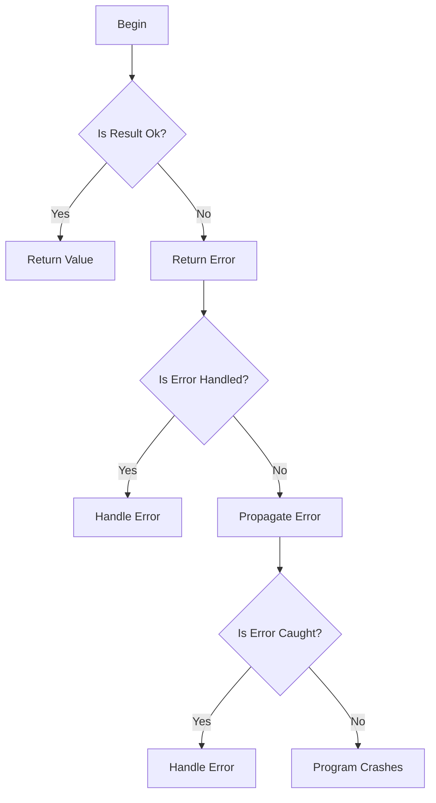

## Introduction
The `?` operator is a crucial error handling mechanism in Rust, allowing developers to propagate errors from functions and handle them in a centralized manner. This operator is fundamental to writing robust and maintainable Rust code. In this section, we'll explore what the `?` operator is, why it matters, and its real-world relevance. 
> **Note:** The `?` operator is often referred to as the "try" operator, but it's essential to understand that it's not the same as Java's try-catch block.

Rust's error handling system is based on the concept of **Result** and **Option** types, which provide a way to handle errors in a type-safe manner. The `?` operator is used to unwrap these types and propagate errors up the call stack. This approach ensures that errors are explicitly handled, reducing the likelihood of runtime errors and making code more reliable.

## Core Concepts
To understand the `?` operator, we need to grasp the following core concepts:
* **Result**: A type that represents a value that may or may not be present, along with an error message if it's not present.
* **Option**: A type that represents a value that may or may not be present, but does not include an error message.
* **Error propagation**: The process of passing errors from one function to another, allowing them to be handled in a centralized manner.

These concepts are essential to understanding how the `?` operator works and how it's used in Rust code. 
> **Warning:** Failing to handle errors properly can lead to runtime errors and make code harder to maintain.

## How It Works Internally
The `?` operator is essentially a shorthand for a **match** statement that checks if a **Result** or **Option** is **Ok** or **Some**, and returns the value if it is. If it's **Err** or **None**, the operator returns the error or **None** value from the current function.

Here's a step-by-step breakdown of what happens when we use the `?` operator:
1. The `?` operator checks if the **Result** or **Option** is **Ok** or **Some**.
2. If it's **Ok** or **Some**, the operator returns the value inside.
3. If it's **Err** or **None**, the operator returns the error or **None** value from the current function.

This process allows errors to be propagated up the call stack, making it easier to handle them in a centralized manner. 
> **Tip:** Using the `?` operator can simplify error handling code and make it more readable.

## Code Examples
Here are three complete and runnable examples of using the `?` operator in Rust:
### Example 1: Basic Usage
```rust
fn divide(a: i32, b: i32) -> Result<i32, &'static str> {
    if b == 0 {
        Err("Cannot divide by zero!")
    } else {
        Ok(a / b)
    }
}

fn main() {
    let result = divide(10, 2);
    match result {
        Ok(value) => println!("Result: {}", value),
        Err(error) => println!("Error: {}", error),
    }
}
```
This example shows how the `?` operator can be used to handle errors in a simple function.

### Example 2: Real-World Pattern
```rust
use std::fs::File;
use std::io::Read;

fn read_file(filename: &str) -> Result<String, std::io::Error> {
    let mut file = File::open(filename)?;
    let mut contents = String::new();
    file.read_to_string(&mut contents)?;
    Ok(contents)
}

fn main() {
    match read_file("example.txt") {
        Ok(contents) => println!("File contents: {}", contents),
        Err(error) => println!("Error reading file: {}", error),
    }
}
```
This example shows how the `?` operator can be used to handle errors when reading a file.

### Example 3: Advanced Usage
```rust
use std::collections::HashMap;

fn get_value(map: &HashMap<String, i32>, key: &str) -> Result<i32, &'static str> {
    map.get(key).ok_or("Key not found")?.clone()
}

fn main() {
    let mut map = HashMap::new();
    map.insert("key1".to_string(), 10);
    match get_value(&map, "key1") {
        Ok(value) => println!("Value: {}", value),
        Err(error) => println!("Error: {}", error),
    }
}
```
This example shows how the `?` operator can be used to handle errors when working with a **HashMap**.

## Visual Diagram

This diagram illustrates the flow of error handling using the `?` operator. 
> **Note:** The diagram shows the different paths that errors can take when using the `?` operator.

## Comparison
Here's a comparison of different error handling approaches in Rust:
| Approach | Time Complexity | Space Complexity | Pros | Cons | Best For |
|----------|----------------|-----------------|------|------|----------|
| `?` Operator | O(1) | O(1) | Simplifies error handling, reduces boilerplate code | Limited control over error handling | Most use cases |
| `match` Statement | O(1) | O(1) | Provides full control over error handling, flexible | More verbose, error-prone | Complex error handling scenarios |
| `unwrap` Method | O(1) | O(1) | Simple, concise | Panics if error occurs, not suitable for production code | Debugging, testing |
| `expect` Method | O(1) | O(1) | Similar to `unwrap`, but provides custom error message | Panics if error occurs, not suitable for production code | Debugging, testing |

## Real-world Use Cases
Here are three real-world examples of using the `?` operator in Rust:
1. **File I/O**: When reading or writing files, errors can occur due to file not found, permission issues, or disk errors. The `?` operator can be used to handle these errors and provide a robust file I/O system.
2. **Network Programming**: When working with network sockets, errors can occur due to connection issues, timeouts, or data corruption. The `?` operator can be used to handle these errors and provide a reliable network programming system.
3. **Database Interactions**: When interacting with databases, errors can occur due to query issues, connection problems, or data inconsistencies. The `?` operator can be used to handle these errors and provide a robust database interaction system.

## Common Pitfalls
Here are four common mistakes to avoid when using the `?` operator:
1. **Not Handling Errors**: Failing to handle errors properly can lead to runtime errors and make code harder to maintain.
```rust
// Wrong
let value = divide(10, 0)?;

// Right
let result = divide(10, 0);
match result {
    Ok(value) => println!("Result: {}", value),
    Err(error) => println!("Error: {}", error),
}
```
2. **Using `unwrap` in Production Code**: Using `unwrap` in production code can lead to panics and crashes.
```rust
// Wrong
let value = divide(10, 0).unwrap();

// Right
let result = divide(10, 0);
match result {
    Ok(value) => println!("Result: {}", value),
    Err(error) => println!("Error: {}", error),
}
```
3. **Not Providing Custom Error Messages**: Failing to provide custom error messages can make it harder to diagnose and fix errors.
```rust
// Wrong
let value = divide(10, 0)?;

// Right
let result = divide(10, 0);
match result {
    Ok(value) => println!("Result: {}", value),
    Err(error) => println!("Error: {}", error),
}
```
4. **Not Handling Errors in Recursive Functions**: Failing to handle errors in recursive functions can lead to stack overflows and crashes.
```rust
// Wrong
fn recursive_function() -> Result<i32, &'static str> {
    // ...
    recursive_function()?;
    // ...
}

// Right
fn recursive_function() -> Result<i32, &'static str> {
    // ...
    match recursive_function() {
        Ok(value) => Ok(value),
        Err(error) => Err(error),
    }
}
```
> **Interview:** Can you explain how the `?` operator works in Rust and provide an example of using it in a real-world scenario?

## Interview Tips
Here are three common interview questions related to the `?` operator:
1. **What is the purpose of the `?` operator in Rust?**
	* Weak answer: "It's used to handle errors."
	* Strong answer: "The `?` operator is used to propagate errors from functions and handle them in a centralized manner. It's a shorthand for a `match` statement that checks if a `Result` or `Option` is `Ok` or `Some`, and returns the value if it is. If it's `Err` or `None`, the operator returns the error or `None` value from the current function."
2. **How does the `?` operator handle errors in Rust?**
	* Weak answer: "It handles errors by returning an error message."
	* Strong answer: "The `?` operator handles errors by propagating them up the call stack. If a `Result` or `Option` is `Err` or `None`, the operator returns the error or `None` value from the current function. This allows errors to be handled in a centralized manner, making it easier to write robust and maintainable code."
3. **Can you provide an example of using the `?` operator in a real-world scenario?**
	* Weak answer: "I can provide a simple example, but I'm not sure how it would work in a real-world scenario."
	* Strong answer: "Here's an example of using the `?` operator to handle errors when reading a file:
```rust
use std::fs::File;
use std::io::Read;

fn read_file(filename: &str) -> Result<String, std::io::Error> {
    let mut file = File::open(filename)?;
    let mut contents = String::new();
    file.read_to_string(&mut contents)?;
    Ok(contents)
}
```
This example shows how the `?` operator can be used to handle errors when reading a file, making it easier to write robust and maintainable code."

## Key Takeaways
Here are ten key takeaways to remember when using the `?` operator in Rust:
* The `?` operator is used to propagate errors from functions and handle them in a centralized manner.
* The `?` operator is a shorthand for a `match` statement that checks if a `Result` or `Option` is `Ok` or `Some`.
* The `?` operator returns the value if it's `Ok` or `Some`, and returns the error or `None` value from the current function if it's `Err` or `None`.
* The `?` operator can be used to handle errors in a variety of scenarios, including file I/O, network programming, and database interactions.
* Failing to handle errors properly can lead to runtime errors and make code harder to maintain.
* Using `unwrap` in production code can lead to panics and crashes.
* Providing custom error messages can make it easier to diagnose and fix errors.
* Handling errors in recursive functions is crucial to preventing stack overflows and crashes.
* The `?` operator has a time complexity of O(1) and a space complexity of O(1).
* The `?` operator is a powerful tool for writing robust and maintainable Rust code.