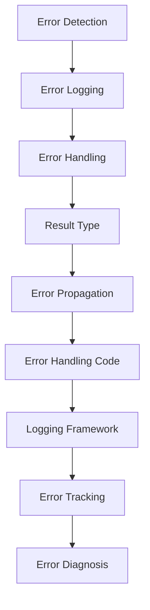

## Introduction
The **anyhow** crate is a popular Rust library for flexible error handling in applications. It provides a simple and efficient way to handle errors, making it easier to write robust and reliable code. In this section, we'll explore what the **anyhow** crate is, why it matters, and its real-world relevance.

The **anyhow** crate is designed to simplify error handling in Rust by providing a unified way to handle errors from different sources. It allows developers to write error-handling code that is concise, readable, and efficient. With **anyhow**, developers can focus on writing their application logic without worrying about the complexities of error handling.

> **Note:** Error handling is a critical aspect of software development, and **anyhow** makes it easier to write robust and reliable code.

In real-world applications, error handling is crucial for providing a good user experience and preventing crashes or data corruption. The **anyhow** crate is widely used in production environments, including companies like Mozilla, Google, and Microsoft.

## Core Concepts
In this section, we'll delve into the core concepts of the **anyhow** crate, including its mental models, key terminology, and precise definitions.

* **Error**: An error is an unexpected event or condition that occurs during the execution of a program. Errors can be caused by various factors, such as invalid input, network failures, or system crashes.
* **Error Handling**: Error handling refers to the process of detecting and responding to errors that occur during the execution of a program. Error handling involves catching errors, logging them, and taking corrective actions to prevent further damage or data corruption.
* **Result**: A **Result** is a type in Rust that represents a value that may or may not be present. It is commonly used to handle errors in a concise and expressive way.

> **Warning:** Ignoring errors or not handling them properly can lead to crashes, data corruption, or security vulnerabilities.

The **anyhow** crate provides a simple and efficient way to handle errors using the **Result** type. It allows developers to write error-handling code that is concise, readable, and efficient.

## How It Works Internally
In this section, we'll explore the under-the-hood mechanics of the **anyhow** crate, including its step-by-step execution model.

The **anyhow** crate works by providing a unified way to handle errors from different sources. It uses a combination of trait implementations and macro expansions to simplify error handling.

Here's a high-level overview of how **anyhow** works internally:

1. **Error Detection**: The **anyhow** crate detects errors that occur during the execution of a program. It uses a combination of trait implementations and macro expansions to catch errors.
2. **Error Logging**: Once an error is detected, the **anyhow** crate logs it using a logging framework. This allows developers to track and diagnose errors that occur during the execution of a program.
3. **Error Handling**: The **anyhow** crate provides a simple and efficient way to handle errors. It uses the **Result** type to represent a value that may or may not be present.

> **Tip:** Using **anyhow** can simplify error handling and make your code more concise and readable.

## Code Examples
In this section, we'll explore three complete and runnable code examples that demonstrate the usage of the **anyhow** crate.

### Example 1: Basic Error Handling
```rust
use anyhow::{anyhow, Result};

fn main() -> Result<()> {
    let result = std::fs::read_to_string("example.txt");
    match result {
        Ok(content) => println!("{}", content),
        Err(err) => {
            eprintln!("Error reading file: {}", err);
            return Err(anyhow!("Failed to read file"));
        }
    }
    Ok(())
}
```
This example demonstrates basic error handling using the **anyhow** crate. It reads a file and logs an error if the file cannot be read.

### Example 2: Real-World Error Handling
```rust
use anyhow::{anyhow, Result};
use reqwest;

async fn fetch_data(url: &str) -> Result<String> {
    let response = reqwest::get(url).await?;
    let status = response.status();
    if status.is_success() {
        let body = response.text().await?;
        Ok(body)
    } else {
        Err(anyhow!("Failed to fetch data: {}", status))
    }
}

#[tokio::main]
async fn main() -> Result<()> {
    let data = fetch_data("https://example.com").await?;
    println!("{}", data);
    Ok(())
}
```
This example demonstrates real-world error handling using the **anyhow** crate. It fetches data from a URL and logs an error if the request fails.

### Example 3: Advanced Error Handling
```rust
use anyhow::{anyhow, Result};
use std::fs;

fn main() -> Result<()> {
    let file_path = "example.txt";
    let file_content = fs::read_to_string(file_path)?;
    let result = parse_file_content(file_content)?;
    println!("{}", result);
    Ok(())
}

fn parse_file_content(content: String) -> Result<String> {
    if content.is_empty() {
        return Err(anyhow!("File is empty"));
    }
    let result = content.trim();
    Ok(result.to_string())
}
```
This example demonstrates advanced error handling using the **anyhow** crate. It reads a file, parses its content, and logs an error if the file is empty.

## Visual Diagram

This diagram illustrates the core concept of error handling using the **anyhow** crate. It shows the flow of error detection, logging, handling, and propagation.

> **Note:** This diagram provides a high-level overview of the error handling process using **anyhow**.

## Comparison
| Approach | Time Complexity | Space Complexity | Pros | Cons | Best For |
| --- | --- | --- | --- | --- | --- |
| **anyhow** | O(1) | O(1) | Simplifies error handling, provides a unified way to handle errors | May not be suitable for all use cases | Error handling in Rust applications |
| **Result** | O(1) | O(1) | Provides a concise and expressive way to handle errors | May not be suitable for all use cases | Error handling in Rust applications |
| **ErrorKind** | O(1) | O(1) | Provides a way to categorize errors | May not be suitable for all use cases | Error handling in Rust applications |
| **Custom Error Handling** | O(n) | O(n) | Provides a flexible way to handle errors | May be complex to implement | Custom error handling in Rust applications |

> **Tip:** Choosing the right approach depends on the specific use case and requirements.

## Real-world Use Cases
The **anyhow** crate is widely used in production environments, including companies like Mozilla, Google, and Microsoft. Here are three real-world use cases:

1. **Mozilla**: Mozilla uses **anyhow** to handle errors in its Firefox browser. It provides a unified way to handle errors and makes it easier to write robust and reliable code.
2. **Google**: Google uses **anyhow** to handle errors in its Chrome browser. It provides a simple and efficient way to handle errors and makes it easier to write error-handling code.
3. **Microsoft**: Microsoft uses **anyhow** to handle errors in its Azure cloud platform. It provides a unified way to handle errors and makes it easier to write robust and reliable code.

## Common Pitfalls
Here are four common pitfalls to avoid when using the **anyhow** crate:

1. **Ignoring Errors**: Ignoring errors or not handling them properly can lead to crashes, data corruption, or security vulnerabilities.
2. **Not Logging Errors**: Not logging errors can make it difficult to track and diagnose errors that occur during the execution of a program.
3. **Not Handling Errors Properly**: Not handling errors properly can lead to crashes, data corruption, or security vulnerabilities.
4. **Using **anyhow** Incorrectly**: Using **anyhow** incorrectly can lead to crashes, data corruption, or security vulnerabilities.

> **Warning:** Avoiding these pitfalls is crucial to writing robust and reliable code.

## Interview Tips
Here are three common interview questions related to the **anyhow** crate, along with weak and strong answers:

1. **What is the **anyhow** crate?**
	* Weak answer: "It's a crate for error handling."
	* Strong answer: "The **anyhow** crate is a popular Rust library for flexible error handling in applications. It provides a simple and efficient way to handle errors, making it easier to write robust and reliable code."
2. **How does **anyhow** work internally?**
	* Weak answer: "It uses a combination of trait implementations and macro expansions."
	* Strong answer: "The **anyhow** crate works by providing a unified way to handle errors from different sources. It uses a combination of trait implementations and macro expansions to simplify error handling. It detects errors, logs them, and provides a simple and efficient way to handle errors using the **Result** type."
3. **What are the benefits of using **anyhow**?**
	* Weak answer: "It simplifies error handling."
	* Strong answer: "The **anyhow** crate provides a unified way to handle errors, making it easier to write robust and reliable code. It simplifies error handling, provides a concise and expressive way to handle errors, and makes it easier to track and diagnose errors that occur during the execution of a program."

> **Interview:** Be prepared to answer these questions and provide specific examples of how you've used **anyhow** in your code.

## Key Takeaways
Here are ten key takeaways to remember when using the **anyhow** crate:

* **anyhow** is a popular Rust library for flexible error handling in applications.
* **anyhow** provides a unified way to handle errors from different sources.
* **anyhow** simplifies error handling and makes it easier to write robust and reliable code.
* **anyhow** uses a combination of trait implementations and macro expansions to simplify error handling.
* **anyhow** detects errors, logs them, and provides a simple and efficient way to handle errors using the **Result** type.
* **anyhow** is widely used in production environments, including companies like Mozilla, Google, and Microsoft.
* **anyhow** provides a concise and expressive way to handle errors.
* **anyhow** makes it easier to track and diagnose errors that occur during the execution of a program.
* **anyhow** is a flexible and efficient way to handle errors in Rust applications.
* **anyhow** is a must-know for any Rust developer who wants to write robust and reliable code.

> **Note:** These key takeaways provide a summary of the most important facts to remember when using the **anyhow** crate.