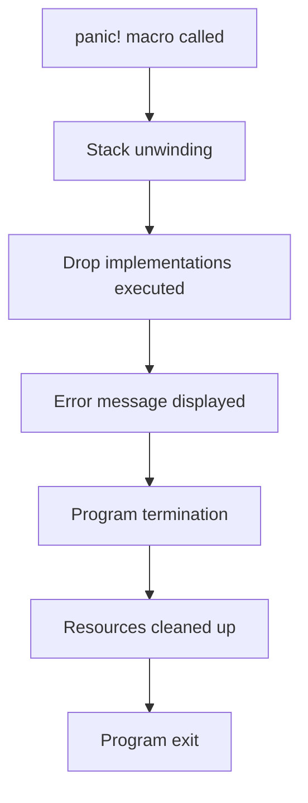

## Introduction
The Rust programming language provides a robust error handling mechanism, which is essential for building reliable and maintainable software systems. One of the key concepts in Rust's error handling is the `panic!` macro, which is used to indicate that a program has encountered an unrecoverable error. In this section, we will explore the concept of `panic!` and unrecoverable errors in Rust, and why they are crucial for writing robust and error-free code. 
> **Note:** Rust's error handling system is designed to help developers catch and handle errors at compile-time, rather than runtime, which can prevent many common programming errors.

Rust's `panic!` macro is a way to explicitly indicate that a program has encountered an error that cannot be recovered from. When a `panic!` occurs, the program will immediately terminate and display an error message. This is in contrast to other programming languages, where errors may be silently ignored or may cause the program to enter an undefined state. 
> **Warning:** Using `panic!` excessively can make your code brittle and prone to crashes, so it's essential to use it judiciously and only when necessary.

## Core Concepts
To understand how `panic!` works, we need to understand some core concepts in Rust's error handling system. The `Result` enum is a fundamental type in Rust that represents a value that may or may not be present. It has two variants: `Ok(value)` and `Err(error)`. The `Option` enum is another important type that represents a value that may or may not be present. It has two variants: `Some(value)` and `None`.
> **Tip:** When working with `Result` and `Option`, it's essential to use pattern matching to handle the different variants, rather than using `unwrap()` or `expect()` methods, which can cause the program to panic if the value is not present.

## How It Works Internally
When a `panic!` occurs, the Rust runtime will unwind the stack and execute any `Drop` implementations that are in scope. This ensures that any resources, such as file handles or network connections, are properly cleaned up before the program terminates. 
> **Interview:** In an interview, you may be asked to explain how Rust's error handling system works, including the `panic!` macro and the `Result` and `Option` enums. Be prepared to provide a detailed explanation of how these concepts work and how they are used in practice.

Here is a step-by-step breakdown of what happens when a `panic!` occurs:

1. The `panic!` macro is called, which will immediately terminate the current thread.
2. The Rust runtime will unwind the stack, executing any `Drop` implementations that are in scope.
3. The program will display an error message, including the message passed to the `panic!` macro.
4. The program will terminate, and any resources will be cleaned up.

## Code Examples
### Example 1: Basic `panic!` Usage
```rust
fn main() {
    panic!("This will cause the program to panic!");
}
```
This code will cause the program to panic and display the error message "This will cause the program to panic!".

### Example 2: Using `Result` to Handle Errors
```rust
fn divide(x: i32, y: i32) -> Result<i32, &'static str> {
    if y == 0 {
        Err("Cannot divide by zero!")
    } else {
        Ok(x / y)
    }
}

fn main() {
    match divide(10, 0) {
        Ok(result) => println!("Result: {}", result),
        Err(error) => println!("Error: {}", error),
    }
}
```
This code uses the `Result` enum to handle errors in a division function. If the divisor is zero, the function returns an `Err` variant with an error message.

### Example 3: Using `Option` to Handle Absent Values
```rust
fn get_username(id: i32) -> Option<String> {
    if id == 1 {
        Some("John".to_string())
    } else {
        None
    }
}

fn main() {
    match get_username(1) {
        Some(username) => println!("Username: {}", username),
        None => println!("No username found!"),
    }
}
```
This code uses the `Option` enum to handle absent values in a function that retrieves a username by ID.

## Visual Diagram

This diagram illustrates the steps that occur when a `panic!` macro is called.

## Comparison
| Approach | Time Complexity | Space Complexity | Pros | Cons | Best For |
| --- | --- | --- | --- | --- | --- |
| `panic!` | O(1) | O(1) | Simple to use, explicit error handling | Can cause program to crash, may not be suitable for all use cases | Critical errors, unrecoverable situations |
| `Result` | O(1) | O(1) | Flexible, allows for explicit error handling | Can be verbose, may require additional error handling code | Error handling, robust code |
| `Option` | O(1) | O(1) | Simple, allows for explicit handling of absent values | May require additional code to handle `None` variant | Handling absent values, robust code |

## Real-world Use Cases
1. **Web servers**: In a web server, a `panic!` macro can be used to handle critical errors, such as a database connection failure.
2. **File systems**: When working with file systems, a `panic!` macro can be used to handle errors, such as a file not found or permission denied.
3. **Network programming**: In network programming, a `panic!` macro can be used to handle errors, such as a connection timeout or a socket error.

## Common Pitfalls
1. **Using `panic!` excessively**: Using `panic!` excessively can make your code brittle and prone to crashes.
2. **Not handling `Result` and `Option` variants**: Not handling `Result` and `Option` variants can cause your program to panic or crash.
3. **Not using `Drop` implementations**: Not using `Drop` implementations can cause resources to leak or not be properly cleaned up.
4. **Not testing error handling code**: Not testing error handling code can cause errors to go undetected and make your program unreliable.

## Interview Tips
1. **Be prepared to explain Rust's error handling system**: Be prepared to explain how Rust's error handling system works, including the `panic!` macro and the `Result` and `Option` enums.
2. **Know how to use `Result` and `Option`**: Know how to use `Result` and `Option` to handle errors and absent values in your code.
3. **Understand the importance of `Drop` implementations**: Understand the importance of `Drop` implementations in cleaning up resources and preventing leaks.

## Key Takeaways
* Rust's error handling system is designed to help developers catch and handle errors at compile-time.
* The `panic!` macro is used to indicate that a program has encountered an unrecoverable error.
* The `Result` and `Option` enums are used to handle errors and absent values in Rust.
* `Drop` implementations are essential for cleaning up resources and preventing leaks.
* Using `panic!` excessively can make your code brittle and prone to crashes.
* Not handling `Result` and `Option` variants can cause your program to panic or crash.
* Not using `Drop` implementations can cause resources to leak or not be properly cleaned up.
* Testing error handling code is crucial for ensuring the reliability of your program.