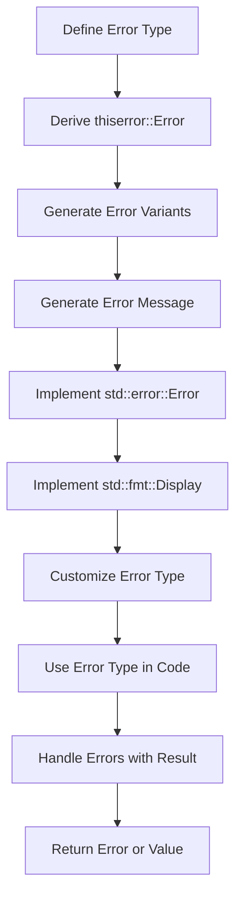

## Introduction
The `thiserror` crate is a Rust library that provides a derive macro for creating custom error types. It allows developers to define error types with a concise and expressive syntax, making error handling in Rust more efficient and readable. In this article, we'll explore the `thiserror` crate, its core concepts, and how it works internally. We'll also provide code examples, a visual diagram, and a comparison table to help you understand the benefits of using `thiserror`.

Error handling is a crucial aspect of software development, and Rust's strong focus on safety and reliability makes it an ideal language for building robust and maintainable systems. The `thiserror` crate is an essential tool for any Rust developer, as it simplifies the process of creating custom error types and provides a standardized way of handling errors.

## Core Concepts
The `thiserror` crate is built around the concept of **error types**, which are custom types that represent errors that can occur in a program. An error type typically includes a set of **error variants**, which are specific types of errors that can occur. For example, a `NetworkError` type might have variants for `ConnectionFailed`, `Timeout`, and `InvalidResponse`.

The `thiserror` crate provides a derive macro, `#[derive(thiserror::Error)]`, which allows developers to define error types with a concise and expressive syntax. The macro automatically generates the necessary boilerplate code for the error type, including implementations of the `std::error::Error` and `std::fmt::Display` traits.

> **Note:** The `thiserror` crate is not a replacement for Rust's built-in error handling mechanisms, but rather a complementary tool that simplifies the process of creating custom error types.

## How It Works Internally
The `thiserror` crate works by using a combination of Rust's derive macro system and the `syn` and `quote` crates to generate the necessary code for the error type. When you derive the `thiserror::Error` trait for an error type, the macro generates the following code:

* An implementation of the `std::error::Error` trait, which provides a way to display the error message and return a reference to the error type.
* An implementation of the `std::fmt::Display` trait, which provides a way to display the error message.
* A set of error variants, which are generated based on the fields and attributes specified in the error type definition.

The `thiserror` crate also provides a set of attributes that can be used to customize the error type, such as `#[error("")]` to specify a custom error message, and `#[from]` to specify a conversion from another error type.

## Code Examples
### Example 1: Basic Error Type
```rust
use thiserror::Error;

#[derive(Error, Debug)]
pub enum MyError {
    #[error("Invalid input")]
    InvalidInput,
    #[error("Network error")]
    NetworkError,
}

fn main() -> Result<(), MyError> {
    // ...
    Err(MyError::InvalidInput)
}
```
This example defines a basic error type `MyError` with two variants: `InvalidInput` and `NetworkError`. The `#[error("")]` attribute is used to specify a custom error message for each variant.

### Example 2: Error Type with Fields
```rust
use thiserror::Error;

#[derive(Error, Debug)]
pub enum MyError {
    #[error("Invalid input: {0}")]
    InvalidInput(String),
    #[error("Network error: {0}")]
    NetworkError(String),
}

fn main() -> Result<(), MyError> {
    // ...
    Err(MyError::InvalidInput("Invalid input".to_string()))
}
```
This example defines an error type `MyError` with two variants, each with a field of type `String`. The `#[error("")]` attribute is used to specify a custom error message that includes the field value.

### Example 3: Error Type with Conversion
```rust
use thiserror::Error;

#[derive(Error, Debug)]
pub enum MyError {
    #[error("Invalid input")]
    InvalidInput,
    #[error("Network error")]
    NetworkError,
}

#[derive(Error, Debug)]
pub enum OtherError {
    #[error("Other error")]
    OtherError,
}

impl From<OtherError> for MyError {
    fn from(_: OtherError) -> Self {
        MyError::InvalidInput
    }
}

fn main() -> Result<(), MyError> {
    // ...
    Err(OtherError::OtherError.into())
}
```
This example defines an error type `MyError` and another error type `OtherError`. The `#[from]` attribute is used to specify a conversion from `OtherError` to `MyError`.

## Visual Diagram

This diagram illustrates the process of defining an error type using the `thiserror` crate. The diagram shows the steps involved in deriving the `thiserror::Error` trait, generating error variants and error messages, implementing the `std::error::Error` and `std::fmt::Display` traits, customizing the error type, and using the error type in code.

## Comparison
| Approach | Time Complexity | Space Complexity | Pros | Cons | Best For |
| --- | --- | --- | --- | --- | --- |
| `thiserror` crate | O(1) | O(1) | Simplifies error type definition, provides customizable error messages | Limited control over error type implementation | Most use cases |
| Manual error type definition | O(n) | O(n) | Provides full control over error type implementation | Error-prone, verbose | Complex error types |
| `std::error::Error` trait | O(1) | O(1) | Provides a standard way of handling errors | Limited customization options | Simple error handling |
| `std::fmt::Display` trait | O(1) | O(1) | Provides a way to display error messages | Limited control over error message format | Simple error messages |

> **Warning:** Manual error type definition can lead to errors and verbose code, while `std::error::Error` and `std::fmt::Display` traits provide limited customization options.

## Real-world Use Cases
* **Tokio**: The Tokio library uses the `thiserror` crate to define custom error types for its async/await framework.
* **async-std**: The async-std library uses the `thiserror` crate to define custom error types for its async/await framework.
* **Rust HTTP client**: The Rust HTTP client library uses the `thiserror` crate to define custom error types for its HTTP client.

## Common Pitfalls
* **Not using the `#[error("")]` attribute**: Failing to use the `#[error("")]` attribute can result in error messages that are not descriptive or informative.
* **Not implementing the `std::error::Error` trait**: Failing to implement the `std::error::Error` trait can result in errors that are not properly handled.
* **Not using the `#[from]` attribute**: Failing to use the `#[from]` attribute can result in conversions between error types that are not properly handled.
* **Not customizing error types**: Failing to customize error types can result in error messages that are not informative or descriptive.

## Interview Tips
* **What is the `thiserror` crate?**: The `thiserror` crate is a Rust library that provides a derive macro for creating custom error types.
* **How do you define an error type using the `thiserror` crate?**: You can define an error type using the `#[derive(thiserror::Error)]` attribute and specifying the error variants and error messages.
* **What are the benefits of using the `thiserror` crate?**: The benefits of using the `thiserror` crate include simplified error type definition, customizable error messages, and improved error handling.

> **Interview:** The `thiserror` crate is an essential tool for any Rust developer, and understanding how to use it is crucial for building robust and maintainable systems.

## Key Takeaways
* The `thiserror` crate provides a derive macro for creating custom error types.
* The `#[error("")]` attribute is used to specify custom error messages.
* The `#[from]` attribute is used to specify conversions between error types.
* The `thiserror` crate simplifies error type definition and provides customizable error messages.
* The `thiserror` crate is an essential tool for any Rust developer.
* Error handling is a crucial aspect of software development, and the `thiserror` crate provides a standardized way of handling errors.
* The `thiserror` crate has a time complexity of O(1) and a space complexity of O(1).
* The `thiserror` crate is widely used in the Rust community, including in popular libraries such as Tokio and async-std.