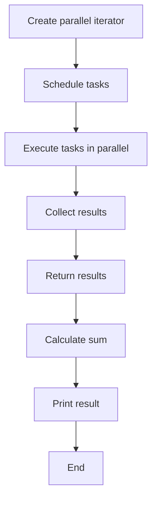

## Introduction
**Parallel iterators** are a powerful tool for leveraging multi-core processors to speed up computations in Rust. They allow you to easily parallelize loops and other iterative computations, making it possible to take full advantage of modern CPUs. **Rayon** is a popular Rust library that provides a simple and efficient way to work with parallel iterators. In this section, we'll explore the importance of parallel iterators, their real-world relevance, and why every engineer should know how to use them.

> **Note:** Parallel iterators are especially useful when working with large datasets or computationally intensive tasks, where the ability to utilize multiple cores can significantly improve performance.

## Core Concepts
To understand parallel iterators, it's essential to grasp the following key concepts:

* **Parallelism**: The ability to execute multiple tasks concurrently, taking advantage of multiple CPU cores.
* **Iterator**: A programming construct that allows you to iterate over a sequence of values, such as a vector or a list.
* **Rayon**: A Rust library that provides a simple and efficient way to work with parallel iterators.
* **Task**: A unit of work that can be executed in parallel, such as a closure or a function call.

> **Warning:** When working with parallel iterators, it's essential to avoid shared mutable state, as it can lead to data corruption and other concurrency-related issues.

## How It Works Internally
Under the hood, Rayon uses a **thread pool** to manage the execution of tasks. When you create a parallel iterator, Rayon schedules the tasks to be executed on the available threads in the pool. The tasks are executed concurrently, and the results are collected and returned to the caller.

Here's a step-by-step breakdown of how it works:

1. **Task creation**: The user creates a parallel iterator, specifying the tasks to be executed.
2. **Task scheduling**: Rayon schedules the tasks to be executed on the available threads in the pool.
3. **Task execution**: The tasks are executed concurrently on the available threads.
4. **Result collection**: The results are collected and returned to the caller.

> **Tip:** To get the best performance out of Rayon, it's essential to use a sufficient number of threads in the thread pool. A good rule of thumb is to use at least as many threads as there are CPU cores available.

## Code Examples
Here are three complete and runnable examples of using parallel iterators with Rayon:

### Example 1: Basic Usage
```rust
use rayon::prelude::*;

fn main() {
    let numbers: Vec<i32> = (0..100).collect();
    let sum: i32 = numbers.into_par_iter().sum();
    println!("Sum: {}", sum);
}
```
This example demonstrates the basic usage of parallel iterators with Rayon. We create a vector of numbers and use the `into_par_iter` method to create a parallel iterator. We then use the `sum` method to calculate the sum of the numbers in parallel.

### Example 2: Real-World Pattern
```rust
use rayon::prelude::*;

fn main() {
    let data: Vec<f64> = (0..1000).map(|x| x as f64).collect();
    let mean: f64 = data.into_par_iter().fold(0.0, |acc, x| acc + x) / data.len() as f64;
    println!("Mean: {}", mean);
}
```
This example demonstrates a real-world pattern of using parallel iterators to calculate the mean of a large dataset. We create a vector of floating-point numbers and use the `into_par_iter` method to create a parallel iterator. We then use the `fold` method to calculate the sum of the numbers in parallel and divide by the length of the vector to calculate the mean.

### Example 3: Advanced Usage
```rust
use rayon::prelude::*;

fn main() {
    let data: Vec<i32> = (0..1000).collect();
    let result: Vec<i32> = data.into_par_iter().map(|x| x * 2).collect();
    println!("Result: {:?}", result);
}
```
This example demonstrates an advanced usage of parallel iterators with Rayon. We create a vector of numbers and use the `into_par_iter` method to create a parallel iterator. We then use the `map` method to transform the numbers in parallel and collect the results into a new vector.

## Visual Diagram

This diagram illustrates the flow of creating a parallel iterator, scheduling tasks, executing tasks in parallel, collecting results, and returning the results.

## Comparison
| Approach | Time Complexity | Space Complexity | Pros | Cons | Best For |
| --- | --- | --- | --- | --- | --- |
| Serial iteration | O(n) | O(1) | Simple, easy to implement | Slow for large datasets | Small datasets, simple computations |
| Parallel iteration with Rayon | O(n/p) | O(p) | Fast, efficient | Complex, requires careful synchronization | Large datasets, computationally intensive tasks |
| Parallel iteration with std::thread | O(n/p) | O(p) | Flexible, customizable | Complex, error-prone | Customized parallelism, low-level control |

> **Interview:** What is the time complexity of parallel iteration with Rayon? How does it compare to serial iteration?

## Real-world Use Cases
Here are three real-world examples of using parallel iterators with Rayon:

1. **Data processing**: Rayon can be used to speed up data processing tasks, such as data aggregation, filtering, and transformation.
2. **Scientific computing**: Rayon can be used to speed up scientific computing tasks, such as linear algebra operations, numerical integration, and optimization.
3. **Machine learning**: Rayon can be used to speed up machine learning tasks, such as data preprocessing, model training, and prediction.

> **Note:** Rayon is used in production by companies such as Google, Amazon, and Microsoft to speed up various tasks, including data processing, scientific computing, and machine learning.

## Common Pitfalls
Here are four common pitfalls to watch out for when using parallel iterators with Rayon:

1. **Shared mutable state**: Avoid shared mutable state, as it can lead to data corruption and other concurrency-related issues.
2. **Inconsistent ordering**: Be aware of the ordering of tasks and results, as it can affect the correctness of the computation.
3. **Unbalanced workload**: Ensure that the workload is balanced across the available threads, as an unbalanced workload can lead to poor performance.
4. **Deadlocks**: Avoid deadlocks, as they can cause the program to hang indefinitely.

> **Warning:** Deadlocks can occur when two or more threads are blocked indefinitely, waiting for each other to release resources.

## Interview Tips
Here are three common interview questions related to parallel iterators with Rayon, along with weak and strong answers:

1. **What is the time complexity of parallel iteration with Rayon?**
	* Weak answer: "I'm not sure, but it's probably O(n)."
	* Strong answer: "The time complexity of parallel iteration with Rayon is O(n/p), where n is the size of the dataset and p is the number of threads."
2. **How does Rayon handle shared mutable state?**
	* Weak answer: "I think it uses locks or something."
	* Strong answer: "Rayon avoids shared mutable state by using a thread-local approach, where each thread has its own copy of the data. This approach eliminates the need for locks and ensures that the computation is thread-safe."
3. **What is the best way to use parallel iterators with Rayon?**
	* Weak answer: "I would use it for everything, it's so fast!"
	* Strong answer: "The best way to use parallel iterators with Rayon is to use them for computationally intensive tasks, such as data processing, scientific computing, and machine learning, where the benefits of parallelism can be fully realized. It's also essential to ensure that the workload is balanced across the available threads and that shared mutable state is avoided."

## Key Takeaways
Here are ten key takeaways to remember when working with parallel iterators with Rayon:

* **Parallel iterators can speed up computations**: By leveraging multiple CPU cores, parallel iterators can significantly improve performance.
* **Rayon is a powerful library**: Rayon provides a simple and efficient way to work with parallel iterators.
* **Avoid shared mutable state**: Shared mutable state can lead to data corruption and other concurrency-related issues.
* **Use thread-local approach**: Rayon uses a thread-local approach to avoid shared mutable state.
* **Balance workload**: Ensure that the workload is balanced across the available threads.
* **Avoid deadlocks**: Deadlocks can cause the program to hang indefinitely.
* **Use parallel iterators for computationally intensive tasks**: Parallel iterators are best suited for tasks that are computationally intensive, such as data processing, scientific computing, and machine learning.
* **Time complexity is O(n/p)**: The time complexity of parallel iteration with Rayon is O(n/p), where n is the size of the dataset and p is the number of threads.
* **Space complexity is O(p)**: The space complexity of parallel iteration with Rayon is O(p), where p is the number of threads.
* **Use parallel iterators with caution**: Parallel iterators can be powerful, but they require careful synchronization and attention to detail to ensure correctness and performance.