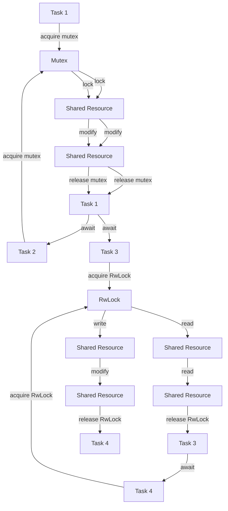

## Introduction
The **Tokio Mutex** and **RwLock** are synchronization primitives in the Tokio library, a popular Rust framework for building asynchronous applications. These primitives are essential for managing concurrent access to shared resources, ensuring that multiple tasks can safely access and modify data without causing data corruption or deadlocks. In this section, we will explore why these primitives matter, their real-world relevance, and why every engineer needs to know how to use them effectively.

> **Note:** In asynchronous programming, synchronization primitives are crucial for preventing data corruption and ensuring the consistency of shared resources.

The Tokio Mutex and RwLock are designed to work seamlessly with the Tokio runtime, providing a way to synchronize access to shared resources in a concurrent and asynchronous environment. By using these primitives, developers can write efficient and scalable code that can handle a large number of concurrent tasks.

## Core Concepts
Before diving into the implementation details, it's essential to understand the core concepts behind the Tokio Mutex and RwLock.

* **Mutex**: A mutex (short for mutual exclusion) is a synchronization primitive that allows only one task to access a shared resource at a time. The mutex is locked when a task acquires it, and other tasks must wait until the mutex is unlocked before they can access the shared resource.
* **RwLock**: A RwLock (short for read-write lock) is a synchronization primitive that allows multiple tasks to read a shared resource simultaneously, but only one task can write to it at a time. The RwLock is locked when a task acquires it for writing, and other tasks must wait until the RwLock is unlocked before they can access the shared resource.
* **Async**: Asynchronous programming is a paradigm that allows tasks to run concurrently, improving the overall performance and responsiveness of an application.

> **Tip:** When using the Tokio Mutex and RwLock, it's essential to understand the trade-offs between synchronization overhead and concurrency. A well-designed synchronization strategy can significantly improve the performance of an application.

## How It Works Internally
The Tokio Mutex and RwLock are implemented using a combination of low-level synchronization primitives and async-friendly abstractions. Here's a high-level overview of how they work:

1. **Mutex**: The Tokio Mutex uses a **spinlock** to synchronize access to a shared resource. When a task tries to acquire the mutex, it will spin (i.e., busy-wait) until the mutex is available.
2. **RwLock**: The Tokio RwLock uses a combination of **spinlocks** and **condition variables** to synchronize access to a shared resource. When a task tries to acquire the RwLock for writing, it will spin until the RwLock is available. When a task tries to acquire the RwLock for reading, it will wait on a condition variable until the RwLock is available.
3. **Async**: The Tokio Mutex and RwLock are designed to work seamlessly with the Tokio runtime, which provides a way to run tasks concurrently using async/await syntax.

> **Warning:** When using the Tokio Mutex and RwLock, it's essential to avoid **deadlocks**, which can occur when two or more tasks are blocked indefinitely, each waiting for the other to release a resource.

## Code Examples
Here are three complete and runnable examples that demonstrate how to use the Tokio Mutex and RwLock:

### Example 1: Basic Mutex Usage
```rust
use tokio::sync::Mutex;
use tokio::task;

#[tokio::main]
async fn main() {
    let mutex = Mutex::new(0);

    let task1 = task::spawn(async move {
        let mut lock = mutex.lock().await;
        *lock += 1;
        println!("Task 1: {}", *lock);
    });

    let task2 = task::spawn(async move {
        let mut lock = mutex.lock().await;
        *lock += 1;
        println!("Task 2: {}", *lock);
    });

    task1.await.unwrap();
    task2.await.unwrap();
}
```

### Example 2: RwLock Usage
```rust
use tokio::sync::RwLock;
use tokio::task;

#[tokio::main]
async fn main() {
    let rwlock = RwLock::new(0);

    let task1 = task::spawn(async move {
        let lock = rwlock.read().await;
        println!("Task 1: {}", *lock);
    });

    let task2 = task::spawn(async move {
        let lock = rwlock.read().await;
        println!("Task 2: {}", *lock);
    });

    let task3 = task::spawn(async move {
        let mut lock = rwlock.write().await;
        *lock += 1;
        println!("Task 3: {}", *lock);
    });

    task1.await.unwrap();
    task2.await.unwrap();
    task3.await.unwrap();
}
```

### Example 3: Advanced Mutex Usage
```rust
use tokio::sync::Mutex;
use tokio::task;
use std::collections::HashMap;

#[tokio::main]
async fn main() {
    let mutex = Mutex::new(HashMap::new());

    let task1 = task::spawn(async move {
        let mut lock = mutex.lock().await;
        lock.insert("key1".to_string(), "value1".to_string());
        println!("Task 1: {:?}", lock);
    });

    let task2 = task::spawn(async move {
        let mut lock = mutex.lock().await;
        lock.insert("key2".to_string(), "value2".to_string());
        println!("Task 2: {:?}", lock);
    });

    task1.await.unwrap();
    task2.await.unwrap();
}
```

## Visual Diagram

The diagram illustrates the flow of tasks acquiring and releasing mutexes and RwLocks, demonstrating how they synchronize access to shared resources.

## Comparison
| Synchronization Primitive | Time Complexity | Space Complexity | Pros | Cons | Best For |
| --- | --- | --- | --- | --- | --- |
| Mutex | O(1) | O(1) | Simple to use, low overhead | Can lead to deadlocks, limited concurrency | Shared resources with low contention |
| RwLock | O(1) | O(1) | Allows multiple readers, high concurrency | More complex to use, higher overhead | Shared resources with high read traffic |
| Spinlock | O(1) | O(1) | Low overhead, simple to use | Can lead to busy-waiting, limited scalability | Shared resources with low contention, low-latency requirements |
| Condition Variable | O(1) | O(1) | Allows efficient waiting, high concurrency | More complex to use, higher overhead | Shared resources with high contention, async programming |

## Real-world Use Cases
Here are three real-world use cases that demonstrate the effectiveness of the Tokio Mutex and RwLock:

1. **Database Connection Pooling**: A database connection pool can use a Tokio Mutex to synchronize access to the pool, ensuring that only one task can acquire a connection at a time.
2. **Caching**: A caching layer can use a Tokio RwLock to synchronize access to the cache, allowing multiple tasks to read from the cache simultaneously while only one task can write to it.
3. **Load Balancing**: A load balancer can use a Tokio Mutex to synchronize access to the load balancing algorithm, ensuring that only one task can update the algorithm at a time.

## Common Pitfalls
Here are four common pitfalls to watch out for when using the Tokio Mutex and RwLock:

1. **Deadlocks**: Deadlocks can occur when two or more tasks are blocked indefinitely, each waiting for the other to release a resource.
2. **Starvation**: Starvation can occur when a task is unable to acquire a resource due to other tasks holding onto it for an extended period.
3. **Livelocks**: Livelocks can occur when two or more tasks are unable to make progress due to constant contention for a resource.
4. **Resource Leaks**: Resource leaks can occur when a task fails to release a resource, causing it to become unavailable to other tasks.

> **Tip:** To avoid these pitfalls, it's essential to use the Tokio Mutex and RwLock correctly, following best practices and guidelines.

## Interview Tips
Here are three common interview questions related to the Tokio Mutex and RwLock, along with weak and strong answers:

1. **What is the difference between a mutex and a RwLock?**
	* Weak answer: "A mutex is used for synchronization, and a RwLock is used for caching."
	* Strong answer: "A mutex is a synchronization primitive that allows only one task to access a shared resource at a time, while a RwLock allows multiple tasks to read from a shared resource simultaneously while only one task can write to it."
2. **How do you avoid deadlocks when using mutexes?**
	* Weak answer: "I use a timeout to avoid deadlocks."
	* Strong answer: "To avoid deadlocks, I ensure that tasks acquire mutexes in a consistent order, use a mutex hierarchy, and avoid nested mutex acquisition."
3. **What is the trade-off between using a mutex and a RwLock?**
	* Weak answer: "A mutex is faster than a RwLock."
	* Strong answer: "The trade-off between using a mutex and a RwLock is between synchronization overhead and concurrency. A mutex provides low overhead but limited concurrency, while a RwLock provides higher concurrency but higher overhead."

## Key Takeaways
Here are ten key takeaways to remember when using the Tokio Mutex and RwLock:

* Use a mutex to synchronize access to a shared resource when only one task can access it at a time.
* Use a RwLock to synchronize access to a shared resource when multiple tasks can read from it simultaneously.
* Avoid deadlocks by acquiring mutexes in a consistent order and using a mutex hierarchy.
* Use a timeout to avoid livelocks when acquiring a mutex or RwLock.
* Ensure that tasks release resources when they are no longer needed to avoid resource leaks.
* Use a mutex or RwLock to synchronize access to a shared resource in an async environment.
* The Tokio Mutex and RwLock are designed to work seamlessly with the Tokio runtime.
* The Tokio Mutex and RwLock provide low overhead and high concurrency.
* The Tokio Mutex and RwLock are essential for building scalable and concurrent applications.
* The Tokio Mutex and RwLock are widely used in production environments, including database connection pooling, caching, and load balancing.