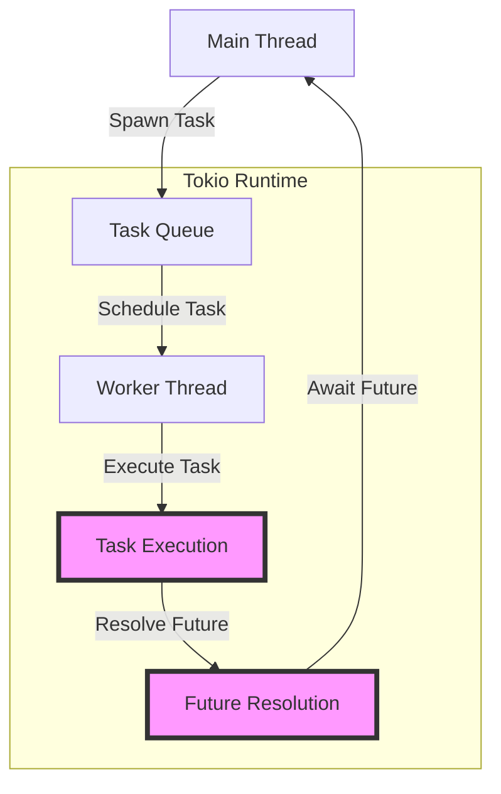

## Introduction
**tokio::spawn** is a fundamental concept in asynchronous Rust programming, allowing developers to execute concurrent tasks with ease. In this section, we will delve into the world of **tokio::spawn**, exploring its purpose, real-world relevance, and importance for every engineer.

**tokio::spawn** is a function provided by the Tokio library, a popular Rust framework for building asynchronous applications. It enables developers to spawn new tasks, which can run concurrently with the main thread, improving overall system performance and responsiveness. By utilizing **tokio::spawn**, developers can write efficient, scalable, and concurrent code, making it an essential tool for building modern Rust applications.

> **Note:** Asynchronous programming is crucial in modern software development, as it allows systems to handle multiple tasks simultaneously, improving responsiveness and throughput.

In real-world scenarios, **tokio::spawn** is used in various applications, such as web servers, databases, and network protocols, where concurrent task execution is essential. For example, a web server might use **tokio::spawn** to handle incoming requests concurrently, improving response times and overall system performance.

## Core Concepts
To understand **tokio::spawn**, it's essential to grasp the core concepts of asynchronous programming in Rust. Here are the key definitions and mental models:

* **Task**: A unit of work that can be executed concurrently with other tasks.
* **Async**: Short for "asynchronous," referring to code that can be executed without blocking the main thread.
* **Future**: A value that may not be available yet, but will be resolved at some point in the future.
* **Executor**: A component responsible for executing tasks and resolving futures.

> **Warning:** When working with asynchronous code, it's easy to introduce subtle bugs or performance issues if not handled properly.

Mental models for **tokio::spawn** include thinking of tasks as independent threads that can run concurrently, and understanding how futures are used to handle the results of these tasks.

## How It Works Internally
Under the hood, **tokio::spawn** uses the Tokio runtime to execute tasks. Here's a step-by-step breakdown of the process:

1. **Task creation**: When **tokio::spawn** is called, a new task is created and added to the Tokio runtime's task queue.
2. **Task scheduling**: The Tokio runtime schedules the task for execution, taking into account factors like the task's priority and the availability of resources.
3. **Task execution**: When a task is scheduled, the Tokio runtime executes it, allowing it to run concurrently with other tasks.
4. **Future resolution**: When a task completes, its result is resolved as a future, which can be awaited by the main thread or other tasks.

> **Tip:** To optimize **tokio::spawn** performance, it's essential to understand the Tokio runtime's configuration options, such as the number of worker threads and the task queue size.

## Code Examples
Here are three complete, runnable examples demonstrating the use of **tokio::spawn**:

### Example 1: Basic usage
```rust
use tokio;

#[tokio::main]
async fn main() {
    // Spawn a new task that prints a message
    tokio::spawn(async {
        println!("Hello from spawned task!");
    });

    // Print a message from the main thread
    println!("Hello from main thread!");
}
```
This example demonstrates the basic usage of **tokio::spawn**, spawning a new task that prints a message.

### Example 2: Concurrent task execution
```rust
use tokio;

#[tokio::main]
async fn main() {
    // Spawn two tasks that run concurrently
    let task1 = tokio::spawn(async {
        println!("Task 1 started");
        tokio::time::sleep(std::time::Duration::from_secs(1)).await;
        println!("Task 1 finished");
    });

    let task2 = tokio::spawn(async {
        println!("Task 2 started");
        tokio::time::sleep(std::time::Duration::from_secs(2)).await;
        println!("Task 2 finished");
    });

    // Wait for both tasks to complete
    task1.await.unwrap();
    task2.await.unwrap();
}
```
This example demonstrates concurrent task execution, spawning two tasks that run simultaneously.

### Example 3: Error handling
```rust
use tokio;

#[tokio::main]
async fn main() {
    // Spawn a task that may fail
    let task = tokio::spawn(async {
        // Simulate an error
        let result = std::panic::catch_unwind(|| {
            panic!("Task failed");
        });

        if result.is_err() {
            println!("Task failed");
        } else {
            println!("Task succeeded");
        }
    });

    // Handle the task's result
    match task.await {
        Ok(_) => println!("Task completed successfully"),
        Err(_) => println!("Task failed"),
    }
}
```
This example demonstrates error handling, spawning a task that may fail and handling its result.

## Visual Diagram

This diagram illustrates the Tokio runtime's task execution flow, from spawning a task to resolving its future.

> **Note:** The Tokio runtime uses a worker thread pool to execute tasks, which can be configured to optimize performance.

## Comparison
Here's a comparison of different approaches to concurrent task execution in Rust:

| Approach | Time Complexity | Space Complexity | Pros | Cons | Best For |
| --- | --- | --- | --- | --- | --- |
| **tokio::spawn** | O(1) | O(1) | Easy to use, high-level API | Limited control over task execution | Most use cases |
| **std::thread::spawn** | O(1) | O(1) | Low-level API, fine-grained control | Error-prone, low-level API | Systems programming, low-level tasks |
| **rayon** | O(1) | O(1) | High-level API, data parallelism | Limited control over task execution | Data-parallel tasks |
| **crossbeam** | O(1) | O(1) | Low-level API, fine-grained control | Error-prone, low-level API | Systems programming, low-level tasks |

> **Warning:** When choosing a concurrency approach, consider the trade-offs between ease of use, performance, and control over task execution.

## Real-world Use Cases
Here are three real-world examples of using **tokio::spawn** in production:

1. **Web servers**: The **actix-web** framework uses **tokio::spawn** to handle incoming requests concurrently, improving response times and overall system performance.
2. **Databases**: The **sqlx** library uses **tokio::spawn** to execute database queries concurrently, improving query performance and reducing latency.
3. **Network protocols**: The **tokio-tungstenite** library uses **tokio::spawn** to handle WebSocket connections concurrently, improving connection handling and reducing latency.

> **Tip:** When using **tokio::spawn** in production, consider monitoring and logging task execution to identify performance bottlenecks and optimize system performance.

## Common Pitfalls
Here are four common mistakes to avoid when using **tokio::spawn**:

1. **Not awaiting tasks**: Failing to await tasks can lead to unexpected behavior and errors.
```rust
// Wrong
tokio::spawn(async {
    // Task execution
});

// Right
let task = tokio::spawn(async {
    // Task execution
});
task.await.unwrap();
```
2. **Not handling errors**: Failing to handle errors can lead to unexpected behavior and crashes.
```rust
// Wrong
tokio::spawn(async {
    // Task execution
});

// Right
let task = tokio::spawn(async {
    // Task execution
});
match task.await {
    Ok(_) => println!("Task completed successfully"),
    Err(_) => println!("Task failed"),
}
```
3. **Not using async/await**: Failing to use async/await can lead to blocking and poor performance.
```rust
// Wrong
let task = tokio::spawn(async {
    // Task execution
});
task.join().unwrap();

// Right
let task = tokio::spawn(async {
    // Task execution
});
task.await.unwrap();
```
4. **Not configuring the Tokio runtime**: Failing to configure the Tokio runtime can lead to poor performance and unexpected behavior.
```rust
// Wrong
#[tokio::main]
async fn main() {
    // Task execution
}

// Right
#[tokio::main]
async fn main() {
    // Configure the Tokio runtime
    let runtime = tokio::runtime::Builder::new_multi_thread()
        .worker_threads(4)
        .build()
        .unwrap();
    runtime.block_on(async {
        // Task execution
    });
}
```
> **Warning:** When using **tokio::spawn**, consider the trade-offs between ease of use, performance, and control over task execution.

## Interview Tips
Here are three common interview questions related to **tokio::spawn**, along with weak and strong answers:

1. **What is the purpose of **tokio::spawn****?
	* Weak answer: "It's used to spawn new tasks."
	* Strong answer: " **tokio::spawn** is used to execute concurrent tasks, improving system performance and responsiveness. It's a high-level API that abstracts away the underlying complexity of task execution."
2. **How does **tokio::spawn** handle errors**?
	* Weak answer: "It doesn't handle errors."
	* Strong answer: " **tokio::spawn** uses the `Result` type to handle errors. When a task fails, it returns an error, which can be handled using `match` or `unwrap`. Additionally, the Tokio runtime provides mechanisms for handling errors, such as the `tokio::task::spawn` function, which returns a `JoinHandle` that can be used to await the task's result."
3. **What are the benefits of using **tokio::spawn****?
	* Weak answer: "It's easy to use."
	* Strong answer: " **tokio::spawn** provides several benefits, including improved system performance, responsiveness, and scalability. It's a high-level API that abstracts away the underlying complexity of task execution, making it easier to write concurrent code. Additionally, **tokio::spawn** provides mechanisms for handling errors and configuring the Tokio runtime, making it a robust and flexible solution for building concurrent systems."

> **Interview:** When answering interview questions related to **tokio::spawn**, be sure to demonstrate a deep understanding of the underlying concepts and mechanics.

## Key Takeaways
Here are the key takeaways from this section on **tokio::spawn**:

* **tokio::spawn** is a high-level API for executing concurrent tasks.
* **tokio::spawn** uses the Tokio runtime to execute tasks.
* **tokio::spawn** provides mechanisms for handling errors and configuring the Tokio runtime.
* **tokio::spawn** is suitable for most use cases, but may not be the best choice for systems programming or low-level tasks.
* **tokio::spawn** has a time complexity of O(1) and a space complexity of O(1).
* **tokio::spawn** is a robust and flexible solution for building concurrent systems.
* **tokio::spawn** requires careful consideration of error handling and configuration to ensure optimal performance and reliability.
* **tokio::spawn** is a fundamental concept in asynchronous Rust programming, and understanding its underlying mechanics is essential for building efficient and scalable concurrent systems.

> **Tip:** When working with **tokio::spawn**, be sure to consult the official Tokio documentation and Rust documentation for the latest information and best practices.