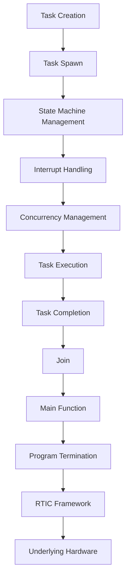

## Introduction
**Embedded Rust** is a subset of the Rust programming language that focuses on developing software for embedded systems, such as microcontrollers and other resource-constrained devices. The **cortex-m** series of microcontrollers, in particular, has gained significant popularity in the embedded systems community due to its high performance and low power consumption. The **RTIC Framework** (Real-Time Interrupt-driven Concurrency) is a popular framework for building concurrent and interrupt-driven systems in Rust.

> **Note:** Embedded Rust provides a unique set of challenges and opportunities for developers, as they must balance performance, power consumption, and reliability while working with limited resources.

In real-world applications, embedded Rust is used in a wide range of industries, including automotive, aerospace, industrial automation, and consumer electronics. For example, companies like **NXP**, **STMicroelectronics**, and **Texas Instruments** use embedded Rust to develop software for their microcontrollers.

> **Warning:** When developing embedded systems, it's essential to consider the constraints of the target platform, including memory, processing power, and power consumption. Failure to do so can result in inefficient, unreliable, or even hazardous systems.

## Core Concepts
The core concepts of embedded Rust include:

* **Concurrency**: The ability to execute multiple tasks simultaneously, which is crucial in embedded systems where interrupts and concurrent execution are common.
* **Interrupts**: Signals that interrupt the normal execution of a program, requiring immediate attention from the system.
* **Real-time systems**: Systems that require predictable and reliable responses to events, often with strict timing constraints.
* **Resource constraints**: The limited availability of memory, processing power, and power consumption in embedded systems.

> **Tip:** When developing embedded systems, it's essential to understand the concept of **stack size**, which refers to the amount of memory allocated for the call stack. A too-small stack size can lead to stack overflows, while a too-large stack size can waste valuable memory.

Key terminology in embedded Rust includes:

* **cortex-m**: A series of microcontrollers from ARM that are widely used in embedded systems.
* **RTIC Framework**: A framework for building concurrent and interrupt-driven systems in Rust.
* **interrupt handler**: A function that handles interrupts and executes the necessary code in response to an interrupt.

## How It Works Internally
The RTIC Framework provides a set of APIs and tools for building concurrent and interrupt-driven systems in Rust. The framework uses a **state machine** approach to manage the execution of tasks and interrupts.

Here's a step-by-step breakdown of how the RTIC Framework works internally:

1. **Task creation**: The developer creates tasks using the `rtic::task` macro, which defines the task's entry point and any relevant parameters.
2. **Interrupt handling**: The developer defines interrupt handlers using the `rtic::interrupt` macro, which specifies the interrupt source and the handler function.
3. **State machine management**: The RTIC Framework manages the execution of tasks and interrupts using a state machine, which ensures that tasks are executed in a predictable and reliable manner.
4. **Concurrency management**: The framework provides a set of APIs for managing concurrency, including `rtic::spawn` for creating new tasks and `rtic::join` for waiting for tasks to complete.

> **Interview:** When asked about the internal workings of the RTIC Framework, a strong answer would describe the state machine approach and how it manages the execution of tasks and interrupts. A weak answer might only mention the framework's APIs and tools without explaining the underlying mechanics.

## Code Examples
### Example 1: Basic Task Creation
```rust
use rtic::task;

#[task]
fn my_task(x: i32) {
    // Task code here
    println!("Task executed with x = {}", x);
}

fn main() {
    // Create and spawn the task
    my_task.spawn(42);
}
```
This example demonstrates the basic creation and execution of a task using the RTIC Framework.

### Example 2: Interrupt Handling
```rust
use rtic::interrupt;

#[interrupt]
fn my_interrupt() {
    // Interrupt handler code here
    println!("Interrupt handled");
}

fn main() {
    // Enable the interrupt
    my_interrupt.enable();
}
```
This example demonstrates the definition and execution of an interrupt handler using the RTIC Framework.

### Example 3: Concurrency Management
```rust
use rtic::task;
use rtic::spawn;
use rtic::join;

#[task]
fn my_task(x: i32) {
    // Task code here
    println!("Task executed with x = {}", x);
}

fn main() {
    // Create and spawn two tasks
    let task1 = my_task.spawn(42);
    let task2 = my_task.spawn(24);

    // Wait for both tasks to complete
    join!(task1, task2);
}
```
This example demonstrates the creation and execution of multiple tasks using the RTIC Framework, as well as the use of `join` to wait for tasks to complete.

## Visual Diagram

This diagram illustrates the flow of task creation, execution, and management using the RTIC Framework.

> **Note:** The diagram shows the high-level flow of task creation, execution, and management using the RTIC Framework. The actual implementation details may vary depending on the specific use case and requirements.

## Comparison
| Approach | Time Complexity | Space Complexity | Pros | Cons | Best For |
| --- | --- | --- | --- | --- | --- |
| RTIC Framework | O(1) | O(1) | Predictable and reliable execution, easy to use | Limited flexibility, may not be suitable for complex systems | Real-time systems, interrupt-driven systems |
| FreeRTOS | O(n) | O(n) | Flexible and customizable, widely used in industry | Steeper learning curve, may require more resources | Complex systems, systems with multiple tasks and interrupts |
| Zephyr | O(n) | O(n) | Highly customizable, supports multiple architectures | Large codebase, may require more resources | Complex systems, systems with multiple tasks and interrupts |
| Bare Metal | O(1) | O(1) | Low-level control, minimal overhead | Difficult to use, may require expertise in low-level programming | Simple systems, systems with minimal requirements |

## Real-world Use Cases
* **NXP**: Uses embedded Rust and the RTIC Framework to develop software for their microcontrollers, which are used in a wide range of applications, including automotive and industrial automation.
* **STMicroelectronics**: Uses embedded Rust to develop software for their microcontrollers, which are used in applications such as consumer electronics and industrial automation.
* **Texas Instruments**: Uses embedded Rust to develop software for their microcontrollers, which are used in applications such as automotive and industrial automation.

> **Tip:** When developing embedded systems, it's essential to consider the specific requirements of the application, including performance, power consumption, and reliability.

## Common Pitfalls
* **Stack overflow**: A too-small stack size can lead to stack overflows, which can cause the system to crash or become unstable.
* **Interrupt handling**: Failing to properly handle interrupts can lead to system crashes or unpredictable behavior.
* **Concurrency management**: Failing to properly manage concurrency can lead to system crashes or unpredictable behavior.
* **Resource constraints**: Failing to consider the resource constraints of the target platform can lead to inefficient or unreliable systems.

> **Warning:** When developing embedded systems, it's essential to test and validate the system thoroughly to ensure that it meets the required specifications and performs as expected.

## Interview Tips
* **What is the RTIC Framework, and how does it work?**: A strong answer would describe the state machine approach and how it manages the execution of tasks and interrupts. A weak answer might only mention the framework's APIs and tools without explaining the underlying mechanics.
* **How do you handle interrupts in embedded systems?**: A strong answer would describe the importance of proper interrupt handling and provide examples of how to handle interrupts using the RTIC Framework. A weak answer might only mention the importance of interrupt handling without providing specific examples.
* **What are some common pitfalls in embedded systems development?**: A strong answer would describe the common pitfalls, including stack overflow, interrupt handling, concurrency management, and resource constraints. A weak answer might only mention one or two pitfalls without providing specific examples.

## Key Takeaways
* **Embedded Rust** is a subset of the Rust programming language that focuses on developing software for embedded systems.
* **The RTIC Framework** provides a set of APIs and tools for building concurrent and interrupt-driven systems in Rust.
* **Concurrency management** is crucial in embedded systems, where interrupts and concurrent execution are common.
* **Resource constraints** must be considered when developing embedded systems, including memory, processing power, and power consumption.
* **Stack size** is an important consideration in embedded systems, as a too-small stack size can lead to stack overflows.
* **Interrupt handling** is critical in embedded systems, where interrupts must be handled promptly and correctly to avoid system crashes or unpredictable behavior.
* **The RTIC Framework** uses a state machine approach to manage the execution of tasks and interrupts.
* **FreeRTOS**, **Zephyr**, and **Bare Metal** are alternative approaches to developing embedded systems, each with their own strengths and weaknesses.