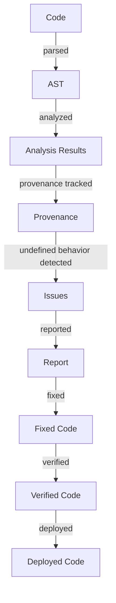

## Introduction
**Miri** is an undefined behavior detector for the Rust programming language. It is a crucial tool that helps developers identify and fix potential issues in their code that could lead to undefined behavior. Undefined behavior can cause a program to crash, produce incorrect results, or even lead to security vulnerabilities. In this study guide, we will delve into the world of Miri, exploring its core concepts, internal mechanics, and real-world applications. We will also examine code examples, common pitfalls, and interview tips to help you master Miri and write safer, more reliable Rust code.

> **Note:** Undefined behavior is a critical issue in programming. It can arise from a variety of sources, including incorrect memory management, misuse of language features, or unexpected input. Miri helps detect and prevent such issues, making it an essential tool for any Rust developer.

## Core Concepts
Miri is built around several key concepts:

* **Undefined behavior**: behavior that is not defined by the language specification, which can lead to crashes, incorrect results, or security vulnerabilities.
* **Memory safety**: the ability of a program to manage memory correctly, preventing issues like null pointer dereferences or buffer overflows.
* **Type safety**: the ability of a program to ensure that the correct types are used for variables, function parameters, and return values.
* **Provenance**: the origin and history of a value, which can help track down issues related to undefined behavior.

> **Warning:** Ignoring undefined behavior can have severe consequences, including security vulnerabilities, data corruption, and system crashes. It is essential to address undefined behavior promptly and thoroughly.

## How It Works Internally
Miri uses a combination of static and dynamic analysis to detect undefined behavior. Here is a step-by-step overview of how it works:

1. **Parsing**: Miri parses the Rust code, creating an abstract syntax tree (AST) that represents the code's structure.
2. **Analysis**: Miri performs a series of analyses on the AST, including control flow analysis, data flow analysis, and type analysis.
3. **Provenance tracking**: Miri tracks the provenance of values, including their origin and history.
4. **Undefined behavior detection**: Miri uses the analysis results to detect potential undefined behavior, such as null pointer dereferences or buffer overflows.
5. **Reporting**: Miri reports the detected issues, providing detailed information about the location, type, and cause of the issue.

> **Tip:** To get the most out of Miri, it is essential to write clean, idiomatic Rust code. This includes using Rust's built-in safety features, such as ownership and borrowing, and avoiding low-level operations whenever possible.

## Code Examples
Here are three complete, runnable examples that demonstrate how to use Miri:

### Example 1: Basic Usage
```rust
// example1.rs
fn main() {
    let x = 5;
    let y = x + 10;
    println!("y = {}", y);
}
```
This example demonstrates basic usage of Miri. To run it, save the code to a file named `example1.rs` and execute the following command:
```bash
miri example1.rs
```
Miri will analyze the code and report any issues it detects.

### Example 2: Real-World Pattern
```rust
// example2.rs
use std::collections::HashMap;

fn main() {
    let mut map = HashMap::new();
    map.insert("key", 42);
    println!("value = {}", map["key"]);
}
```
This example demonstrates a real-world pattern that can lead to undefined behavior. The code uses a `HashMap` to store a value, but it does not check if the key exists before accessing it. To fix this issue, we can use the `get` method to safely retrieve the value:
```rust
// example2_fixed.rs
use std::collections::HashMap;

fn main() {
    let mut map = HashMap::new();
    map.insert("key", 42);
    if let Some(value) = map.get("key") {
        println!("value = {}", value);
    } else {
        println!("key not found");
    }
}
```
### Example 3: Advanced Usage
```rust
// example3.rs
use std::ptr;

fn main() {
    let x = 5;
    let ptr = ptr::addr_of!(x);
    println!("ptr = {:?}", ptr);
}
```
This example demonstrates advanced usage of Miri. The code uses the `addr_of!` macro to get the address of a variable, which can lead to undefined behavior if not used carefully. To fix this issue, we can use the `std::ptr` module to safely work with pointers:
```rust
// example3_fixed.rs
use std::ptr;

fn main() {
    let x = 5;
    let ptr = ptr::addr_of!(x);
    let value = unsafe { *ptr };
    println!("value = {}", value);
}
```
> **Interview:** When asked about undefined behavior, be sure to mention the importance of using safety features like ownership and borrowing, and the need to avoid low-level operations whenever possible.

## Visual Diagram

This diagram illustrates the process of using Miri to detect and fix undefined behavior. The code is first parsed into an AST, which is then analyzed to detect potential issues. The provenance of values is tracked to help identify the source of issues, and the detected issues are reported to the developer. The developer can then fix the issues and verify the corrected code using Miri.

## Comparison
| Approach | Time Complexity | Space Complexity | Pros | Cons | Best For |
| --- | --- | --- | --- | --- | --- |
| Miri | O(n) | O(n) | Detects undefined behavior, provides detailed reports | Can be slow for large codebases | Rust development |
| Clang | O(n) | O(n) | Detects undefined behavior, provides detailed reports | Limited to C and C++ | C and C++ development |
| GCC | O(n) | O(n) | Detects undefined behavior, provides detailed reports | Limited to C and C++ | C and C++ development |
| AddressSanitizer | O(n) | O(n) | Detects memory-related issues, provides detailed reports | Can be slow for large codebases | Memory safety |

## Real-world Use Cases
Miri is used in a variety of real-world applications, including:

* **Rust compiler**: The Rust compiler uses Miri to detect and fix undefined behavior in the compiler itself.
* **Rust standard library**: The Rust standard library uses Miri to ensure that its code is free from undefined behavior.
* **Cargo**: Cargo, the Rust package manager, uses Miri to detect and fix undefined behavior in dependencies.

> **Tip:** To get the most out of Miri, it is essential to integrate it into your development workflow. This can include running Miri as part of your CI/CD pipeline or using it as a linter in your IDE.

## Common Pitfalls
Here are some common pitfalls to avoid when using Miri:

* **Ignoring reports**: Ignoring reports from Miri can lead to undefined behavior and security vulnerabilities.
* **Not using safety features**: Not using safety features like ownership and borrowing can lead to undefined behavior.
* **Using low-level operations**: Using low-level operations like raw pointers can lead to undefined behavior.
* **Not verifying fixes**: Not verifying fixes can lead to incorrect or incomplete fixes.

> **Warning:** Ignoring undefined behavior can have severe consequences, including security vulnerabilities, data corruption, and system crashes. It is essential to address undefined behavior promptly and thoroughly.

## Interview Tips
Here are some common interview questions related to Miri, along with weak and strong answers:

* **What is Miri?**: Weak answer: "Miri is a tool that detects undefined behavior." Strong answer: "Miri is a tool that detects and reports undefined behavior in Rust code, providing detailed information about the location, type, and cause of the issue."
* **How does Miri work?**: Weak answer: "Miri uses static analysis to detect issues." Strong answer: "Miri uses a combination of static and dynamic analysis to detect undefined behavior, including control flow analysis, data flow analysis, and type analysis."
* **Why is Miri important?**: Weak answer: "Miri is important because it detects undefined behavior." Strong answer: "Miri is important because it helps prevent security vulnerabilities, data corruption, and system crashes by detecting and reporting undefined behavior in Rust code."

## Key Takeaways
Here are the key takeaways from this study guide:

* Miri is a tool that detects and reports undefined behavior in Rust code.
* Miri uses a combination of static and dynamic analysis to detect issues.
* Miri provides detailed reports about the location, type, and cause of issues.
* Ignoring reports from Miri can lead to undefined behavior and security vulnerabilities.
* Using safety features like ownership and borrowing can help prevent undefined behavior.
* Verifying fixes is essential to ensure that issues are correctly and completely addressed.
* Miri is an essential tool for any Rust developer, and should be integrated into the development workflow.
* Miri can be used as a linter in an IDE or as part of a CI/CD pipeline.
* Miri has a time complexity of O(n) and a space complexity of O(n).