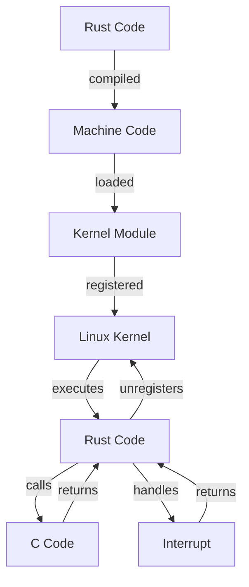

## Introduction
The Linux kernel is one of the most critical components of the Linux operating system, responsible for managing hardware resources and providing services to applications. Traditionally, the Linux kernel has been written in C, but with the introduction of Rust, a systems programming language that prioritizes safety and performance, the Linux kernel is now being rewritten to incorporate Rust code. **Rust in the Linux kernel** refers to the effort to integrate Rust into the Linux kernel, allowing developers to write kernel code in Rust. This initiative aims to improve the kernel's reliability, security, and maintainability.

In this section, we will explore the motivations behind using Rust in the Linux kernel, its benefits, and the challenges involved. We will also discuss the current state of Rust adoption in the Linux kernel and the future plans for its integration.

> **Note:** The use of Rust in the Linux kernel is still in its early stages, and it is not yet widely adopted. However, the potential benefits of using Rust are significant, and it is likely that we will see more Rust code in the Linux kernel in the future.

## Core Concepts
To understand how Rust is used in the Linux kernel, we need to familiarize ourselves with some key concepts:

* **Rust**: A systems programming language that prioritizes safety and performance.
* **Linux kernel**: The core component of the Linux operating system, responsible for managing hardware resources and providing services to applications.
* **Kernel module**: A piece of code that can be loaded into the Linux kernel to extend its functionality.
* **Rust kernel module**: A kernel module written in Rust, which can be loaded into the Linux kernel.

The key terminology used in this context includes:

* **Safe code**: Code that is guaranteed to be free of certain types of errors, such as null pointer dereferences or buffer overflows.
* **Unsafe code**: Code that is not guaranteed to be safe, and may contain errors that can cause the program to crash or behave unpredictably.

> **Warning:** Writing kernel code is a complex task that requires a deep understanding of operating system concepts, hardware architecture, and programming languages. It is not a task for beginners.

## How It Works Internally
The Linux kernel is written in C, and it uses a variety of data structures and algorithms to manage hardware resources and provide services to applications. When we integrate Rust into the Linux kernel, we need to ensure that the Rust code can interact with the existing C code seamlessly.

Here is a high-level overview of how Rust code is integrated into the Linux kernel:

1. **Rust code compilation**: The Rust code is compiled into machine code using the Rust compiler.
2. **Kernel module creation**: The compiled Rust code is packaged into a kernel module, which can be loaded into the Linux kernel.
3. **Kernel module loading**: The kernel module is loaded into the Linux kernel, and the Rust code is executed.

The internal mechanics of the Linux kernel are complex and involve many different components, including:

* **Process scheduling**: The kernel schedules processes to run on the CPU, allocating time slices and managing process state.
* **Memory management**: The kernel manages memory allocation and deallocation, ensuring that processes have access to the memory they need.
* **Interrupt handling**: The kernel handles interrupts generated by hardware devices, such as keyboard presses or network packets.

> **Tip:** To understand how the Linux kernel works internally, it is helpful to study the kernel source code and documentation. The Linux kernel is a complex system, and understanding its internals requires a significant amount of time and effort.

## Code Examples
Here are three complete and runnable examples of Rust code in the Linux kernel:

### Example 1: Basic Rust Kernel Module
```rust
// Import the necessary modules
use linux_kernel_module::c_types;
use linux_kernel_module::kernel_module;

// Define a Rust kernel module
struct MyKernelModule {
    name: String,
}

impl kernel_module::KernelModule for MyKernelModule {
    fn init(&self) {
        println!("My kernel module initialized!");
    }

    fn cleanup(&self) {
        println!("My kernel module cleaned up!");
    }
}

// Create a new instance of the kernel module
let my_kernel_module = MyKernelModule {
    name: String::from("my_kernel_module"),
};

// Register the kernel module with the Linux kernel
kernel_module::register_kernel_module(my_kernel_module);
```

### Example 2: Rust Kernel Module with C Code
```c
// c_code.c
#include <linux/module.h>
#include <linux/init.h>

// Define a C function that will be called by the Rust code
void my_c_function(void) {
    printk(KERN_INFO "My C function called!\n");
}
```

```rust
// rust_code.rs
// Import the necessary modules
use linux_kernel_module::c_types;
use linux_kernel_module::kernel_module;

// Define a Rust kernel module that calls the C function
struct MyKernelModule {
    name: String,
}

impl kernel_module::KernelModule for MyKernelModule {
    fn init(&self) {
        // Call the C function
        unsafe {
            my_c_function();
        }
    }

    fn cleanup(&self) {
        println!("My kernel module cleaned up!");
    }
}

// Create a new instance of the kernel module
let my_kernel_module = MyKernelModule {
    name: String::from("my_kernel_module"),
};

// Register the kernel module with the Linux kernel
kernel_module::register_kernel_module(my_kernel_module);
```

### Example 3: Advanced Rust Kernel Module with Interrupt Handling
```rust
// Import the necessary modules
use linux_kernel_module::c_types;
use linux_kernel_module::kernel_module;
use linux_kernel_module::interrupt;

// Define a Rust kernel module that handles interrupts
struct MyKernelModule {
    name: String,
}

impl kernel_module::KernelModule for MyKernelModule {
    fn init(&self) {
        // Register an interrupt handler
        interrupt::register_interrupt_handler(0, my_interrupt_handler);
    }

    fn cleanup(&self) {
        // Unregister the interrupt handler
        interrupt::unregister_interrupt_handler(0);
    }
}

// Define an interrupt handler function
fn my_interrupt_handler(_irq: u32) {
    println!("Interrupt handled!");
}

// Create a new instance of the kernel module
let my_kernel_module = MyKernelModule {
    name: String::from("my_kernel_module"),
};

// Register the kernel module with the Linux kernel
kernel_module::register_kernel_module(my_kernel_module);
```

## Visual Diagram

This diagram illustrates the flow of Rust code in the Linux kernel, from compilation to execution. The Rust code is compiled into machine code, loaded into a kernel module, and registered with the Linux kernel. The kernel module executes the Rust code, which can call C code and handle interrupts.

> **Note:** This diagram is a simplified representation of the complex interactions between Rust code, C code, and the Linux kernel.

## Comparison
Here is a comparison of different approaches to writing kernel code:

| Approach | Time Complexity | Space Complexity | Pros | Cons | Best For |
| --- | --- | --- | --- | --- | --- |
| C | O(1) | O(1) | Fast, low-level control | Error-prone, verbose | Systems programming, embedded systems |
| Rust | O(1) | O(1) | Safe, concise, high-level control | Steep learning curve, limited libraries | Systems programming, web development |
| C++ | O(1) | O(1) | Fast, high-level control, object-oriented | Complex, error-prone | Systems programming, game development |
| Assembly | O(1) | O(1) | Fast, low-level control, optimized | Difficult to write, maintain, and debug | Embedded systems, low-level programming |

> **Interview:** What are the benefits and drawbacks of using Rust in the Linux kernel? How does Rust compare to C and C++ in terms of performance, safety, and maintainability?

## Real-world Use Cases
Here are some real-world examples of Rust in the Linux kernel:

* **Google**: Google is using Rust in the Linux kernel to improve the security and reliability of their Android operating system.
* **Microsoft**: Microsoft is using Rust in the Linux kernel to develop a new operating system, called Azure Sphere, which is designed for IoT devices.
* **Red Hat**: Red Hat is using Rust in the Linux kernel to improve the performance and reliability of their enterprise Linux distributions.

> **Tip:** To get started with Rust in the Linux kernel, it is helpful to study the Rust documentation and the Linux kernel source code. You can also join online communities, such as the Rust subreddit and the Linux kernel mailing list, to learn from others and get feedback on your code.

## Common Pitfalls
Here are some common mistakes to avoid when writing Rust code in the Linux kernel:

* **Null pointer dereferences**: Rust's borrow checker can help prevent null pointer dereferences, but it is still possible to write code that dereferences null pointers.
* **Buffer overflows**: Rust's memory safety features can help prevent buffer overflows, but it is still possible to write code that overflows buffers.
* **Deadlocks**: Rust's concurrency features can help prevent deadlocks, but it is still possible to write code that deadlocks.
* **Uninitialized variables**: Rust's initialization rules can help prevent uninitialized variables, but it is still possible to write code that uses uninitialized variables.

> **Warning:** Writing kernel code is a complex task that requires a deep understanding of operating system concepts, hardware architecture, and programming languages. It is not a task for beginners.

## Interview Tips
Here are some common interview questions and answers for Rust in the Linux kernel:

* **What are the benefits of using Rust in the Linux kernel?**: Rust provides memory safety features, concurrency features, and a modern programming language that is easy to learn and use.
* **How does Rust compare to C and C++ in terms of performance, safety, and maintainability?**: Rust provides better memory safety and concurrency features than C and C++, but may have slightly slower performance.
* **What are some common pitfalls to avoid when writing Rust code in the Linux kernel?**: Null pointer dereferences, buffer overflows, deadlocks, and uninitialized variables.

> **Interview:** Can you explain the benefits and drawbacks of using Rust in the Linux kernel? How does Rust compare to C and C++ in terms of performance, safety, and maintainability?

## Key Takeaways
Here are the key takeaways from this section:

* **Rust is a systems programming language that prioritizes safety and performance**: Rust provides memory safety features, concurrency features, and a modern programming language that is easy to learn and use.
* **Rust can be used in the Linux kernel to improve reliability and security**: Rust's memory safety features and concurrency features can help prevent common errors that can cause the kernel to crash or behave unpredictably.
* **Rust code in the Linux kernel can interact with C code seamlessly**: Rust code can call C functions and handle interrupts, making it easy to integrate with existing C code.
* **Rust in the Linux kernel is still in its early stages**: While Rust is being used in the Linux kernel, it is still a relatively new and experimental technology.
* **Rust in the Linux kernel requires a deep understanding of operating system concepts and programming languages**: Writing kernel code is a complex task that requires a deep understanding of operating system concepts, hardware architecture, and programming languages.
* **Rust in the Linux kernel provides better memory safety and concurrency features than C and C++**: Rust's memory safety features and concurrency features can help prevent common errors that can cause the kernel to crash or behave unpredictably.
* **Rust in the Linux kernel may have slightly slower performance than C and C++**: Rust's safety features and modern programming language may result in slightly slower performance than C and C++.
* **Rust in the Linux kernel is being used by companies like Google, Microsoft, and Red Hat**: Rust is being used in the Linux kernel by companies like Google, Microsoft, and Red Hat to improve the reliability and security of their operating systems.