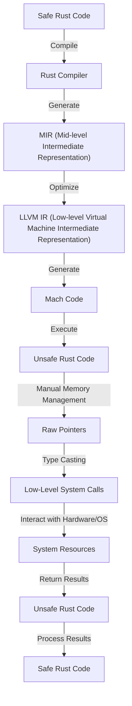

## Introduction
**Unsafe Rust** is a subset of the Rust programming language that allows developers to bypass certain safety guarantees provided by the language. This is necessary when interacting with low-level system resources, such as hardware or operating system APIs, that do not follow Rust's safety rules. Unsafe Rust is used when the benefits of performance, flexibility, or compatibility outweigh the risks of potential safety issues. Real-world relevance can be seen in systems programming, embedded systems, and high-performance applications. Every engineer should understand Unsafe Rust to write efficient and effective code in these domains.

> **Note:** Rust's safety guarantees are based on a concept called **memory safety**, which ensures that all memory accesses are valid and do not lead to undefined behavior. However, in some cases, these guarantees can be too restrictive, and Unsafe Rust provides a way to opt-out of these guarantees.

## Core Concepts
**Unsafe Rust** is based on a set of core concepts that define how to interact with low-level system resources safely. These concepts include:
* **Raw Pointers**: pointers that do not have any safety guarantees, similar to C-style pointers.
* **References**: references to values that can be used to access and modify the values safely.
* **Mutability**: the ability to modify values, which can lead to safety issues if not handled properly.
* **Aliasing**: the ability to have multiple names for the same value, which can lead to safety issues if not handled properly.

> **Tip:** When working with Unsafe Rust, it's essential to understand the trade-offs between safety and performance. While Unsafe Rust provides more flexibility, it also increases the risk of safety issues.

## How It Works Internally
When using Unsafe Rust, the compiler does not perform the same safety checks as it does for safe Rust code. Instead, the developer is responsible for ensuring that the code is safe and correct. This includes:
* **Manual Memory Management**: managing memory manually using raw pointers and references.
* **Type Casting**: casting between different types, which can lead to safety issues if not done correctly.
* **Low-Level System Calls**: making low-level system calls, such as interacting with hardware or operating system APIs.

> **Warning:** Using Unsafe Rust can lead to safety issues, such as **null pointer dereferences**, **use-after-free**, and **data corruption**, if not done correctly.

## Code Examples
### Example 1: Basic Raw Pointer Usage
```rust
fn main() {
    let x = 10;
    let raw_ptr = &x as *const i32;
    unsafe {
        println!("Value: {}", *raw_ptr);
    }
}
```
This example demonstrates the basic usage of raw pointers in Unsafe Rust.

### Example 2: Manual Memory Management
```rust
use std::alloc::{alloc, dealloc, Layout};

fn main() {
    let layout = Layout::new::<i32>();
    let ptr = unsafe { alloc(layout) } as *mut i32;
    unsafe {
        *ptr = 10;
        println!("Value: {}", *ptr);
        dealloc(ptr, layout);
    }
}
```
This example demonstrates manual memory management using raw pointers and the `alloc` and `dealloc` functions.

### Example 3: Type Casting
```rust
fn main() {
    let x: i32 = 10;
    let raw_ptr = &x as *const i32;
    let casted_ptr = raw_ptr as *const u32;
    unsafe {
        println!("Value: {}", *casted_ptr);
    }
}
```
This example demonstrates type casting between different types using raw pointers.

## Visual Diagram

This diagram illustrates the flow of code from Safe Rust to Unsafe Rust and back to Safe Rust.

> **Note:** The diagram shows the flow of code from Safe Rust to Unsafe Rust and back to Safe Rust, highlighting the key components involved in the process.

## Comparison
| Approach | Time Complexity | Space Complexity | Pros | Cons | Best For |
| --- | --- | --- | --- | --- | --- |
| Safe Rust | O(1) | O(1) | Memory Safety, Easy to Use | Performance Overhead | General-purpose Programming |
| Unsafe Rust | O(1) | O(1) | Performance, Flexibility | Safety Issues, Complex | Systems Programming, Embedded Systems |
| C | O(1) | O(1) | Performance, Flexibility | Safety Issues, Complex | Systems Programming, Embedded Systems |
| C++ | O(1) | O(1) | Performance, Flexibility | Safety Issues, Complex | Systems Programming, Embedded Systems |

> **Tip:** When choosing between Safe Rust and Unsafe Rust, consider the trade-offs between safety and performance. Safe Rust is suitable for general-purpose programming, while Unsafe Rust is better suited for systems programming and embedded systems.

## Real-world Use Cases
1. **Operating System Development**: The Rust-based operating system, **Redox**, uses Unsafe Rust to interact with low-level system resources.
2. **Embedded Systems**: The **Rust-embedded** project provides a set of libraries and tools for building embedded systems using Rust, which often requires Unsafe Rust.
3. **High-Performance Applications**: The **Rust-num** project provides a set of numerical libraries for Rust, which uses Unsafe Rust to optimize performance.

## Common Pitfalls
1. **Null Pointer Dereferences**: attempting to access memory through a null pointer can lead to crashes or undefined behavior.
```rust
fn main() {
    let ptr: *const i32 = std::ptr::null();
    unsafe {
        println!("Value: {}", *ptr); // Null pointer dereference
    }
}
```
2. **Use-After-Free**: accessing memory after it has been freed can lead to crashes or undefined behavior.
```rust
fn main() {
    let x = Box::new(10);
    drop(x);
    println!("Value: {}", x); // Use-after-free
}
```
3. **Data Corruption**: modifying data in an unsafe way can lead to data corruption or crashes.
```rust
fn main() {
    let mut x = 10;
    let raw_ptr = &mut x as *mut i32;
    unsafe {
        *raw_ptr = 20; // Data corruption
    }
}
```
4. **Aliasing**: having multiple names for the same value can lead to safety issues if not handled properly.
```rust
fn main() {
    let mut x = 10;
    let raw_ptr1 = &mut x as *mut i32;
    let raw_ptr2 = &mut x as *mut i32;
    unsafe {
        *raw_ptr1 = 20; // Aliasing
        *raw_ptr2 = 30; // Aliasing
    }
}
```

## Interview Tips
1. **What is the purpose of Unsafe Rust?**: The interviewer is looking for an understanding of the trade-offs between safety and performance.
```markdown
Weak answer: "Unsafe Rust is used for performance-critical code."
Strong answer: "Unsafe Rust is used to bypass Rust's safety guarantees when interacting with low-level system resources, but it requires careful consideration of the trade-offs between safety and performance."
```
2. **How do you handle manual memory management in Unsafe Rust?**: The interviewer is looking for an understanding of the `alloc` and `dealloc` functions.
```markdown
Weak answer: "You use the `alloc` function to allocate memory and the `dealloc` function to deallocate memory."
Strong answer: "You use the `alloc` function to allocate memory with a specific layout, and the `dealloc` function to deallocate memory with the same layout, ensuring that the memory is properly aligned and padded."
```
3. **What are some common pitfalls when using Unsafe Rust?**: The interviewer is looking for an understanding of the potential safety issues.
```markdown
Weak answer: "You can get null pointer dereferences or use-after-free errors."
Strong answer: "You can get null pointer dereferences, use-after-free errors, data corruption, or aliasing issues if you don't handle manual memory management, type casting, and low-level system calls carefully."
```

## Key Takeaways
* **Unsafe Rust is used to bypass Rust's safety guarantees** when interacting with low-level system resources.
* **Manual memory management is critical** in Unsafe Rust to avoid safety issues.
* **Type casting and low-level system calls require careful consideration** to avoid safety issues.
* **Null pointer dereferences, use-after-free, data corruption, and aliasing are common pitfalls** in Unsafe Rust.
* **The `alloc` and `dealloc` functions are used for manual memory management** in Unsafe Rust.
* **Rust's safety guarantees are based on memory safety**, which ensures that all memory accesses are valid and do not lead to undefined behavior.
* **Unsafe Rust is suitable for systems programming and embedded systems**, where performance and flexibility are critical.
* **Safe Rust is suitable for general-purpose programming**, where safety and ease of use are critical.