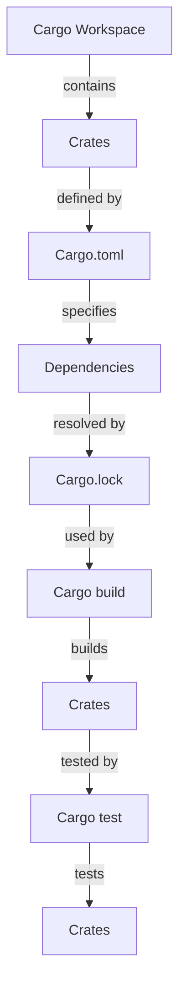

## Introduction
**Cargo Workspaces** are a way to manage multiple Rust projects, known as **crates**, under a single umbrella. This is particularly useful for **monorepos**, where all projects are stored in a single repository. In a monorepo, you can have multiple crates that depend on each other, making it easier to manage and maintain your codebase. Cargo Workspaces provide a way to define and manage these dependencies, making it easier to build, test, and deploy your projects.

In real-world scenarios, Cargo Workspaces are used by companies like **Google**, **Microsoft**, and **AWS** to manage their large-scale Rust projects. For example, the **Rust** project itself uses a monorepo to manage its various crates, including the Rust compiler, the Rust standard library, and other tools.

Every engineer should know about Cargo Workspaces because they provide a flexible way to manage complex projects. By using Cargo Workspaces, you can:

* Manage multiple crates under a single umbrella
* Define and manage dependencies between crates
* Build, test, and deploy your projects with ease
* Improve code reuse and reduce duplication

> **Tip:** When starting a new Rust project, consider using a Cargo Workspace to manage your crates. This will make it easier to manage dependencies and scale your project as it grows.

## Core Concepts
Here are some key concepts to understand when working with Cargo Workspaces:

* **Cargo Workspace**: A directory that contains multiple crates, along with a `Cargo.toml` file that defines the workspace.
* **Cargo.toml**: The configuration file for a Cargo Workspace, which defines the crates, dependencies, and other settings.
* **Crates**: Individual Rust projects that are part of a Cargo Workspace.
* **Dependencies**: Crates that depend on other crates in the workspace.

To illustrate these concepts, let's consider a simple example. Suppose we have a Cargo Workspace called `my_workspace` that contains two crates: `my_crate` and `my_other_crate`. The `Cargo.toml` file for `my_workspace` might look like this:
```toml
[workspace]
members = [
    "my_crate",
    "my_other_crate",
]

[dependencies]
my_crate = { path = "my_crate" }
my_other_crate = { path = "my_other_crate" }
```
In this example, `my_crate` and `my_other_crate` are two separate crates that are part of the `my_workspace` workspace. The `Cargo.toml` file defines the workspace and its dependencies.

> **Note:** The `members` field in the `Cargo.toml` file specifies the crates that are part of the workspace.

## How It Works Internally
When you run `cargo build` or `cargo test` in a Cargo Workspace, Cargo will:

1. Read the `Cargo.toml` file to determine the crates and dependencies.
2. Build each crate in the workspace, using the dependencies specified in the `Cargo.toml` file.
3. Test each crate in the workspace, using the dependencies specified in the `Cargo.toml` file.

Here's a step-by-step breakdown of how Cargo builds a workspace:

1. Cargo reads the `Cargo.toml` file to determine the crates and dependencies.
2. Cargo resolves the dependencies for each crate, using the `Cargo.lock` file.
3. Cargo builds each crate in the workspace, using the dependencies specified in the `Cargo.toml` file.
4. Cargo tests each crate in the workspace, using the dependencies specified in the `Cargo.toml` file.

The time complexity of building a Cargo Workspace is O(n), where n is the number of crates in the workspace. The space complexity is O(n) as well, since Cargo needs to store the dependencies and build artifacts for each crate.

> **Warning:** If you have a large number of crates in your workspace, building and testing can take a significant amount of time. To mitigate this, you can use the `--jobs` flag to parallelize the build process.

## Code Examples
Here are three examples of using Cargo Workspaces:

### Example 1: Basic Workspace
```toml
// Cargo.toml
[workspace]
members = [
    "my_crate",
]

[dependencies]
my_crate = { path = "my_crate" }
```

```rust
// my_crate/lib.rs
pub fn hello() {
    println!("Hello, world!");
}
```

This example defines a simple Cargo Workspace with one crate, `my_crate`. The `Cargo.toml` file defines the workspace and its dependencies.

### Example 2: Workspace with Dependencies
```toml
// Cargo.toml
[workspace]
members = [
    "my_crate",
    "my_other_crate",
]

[dependencies]
my_crate = { path = "my_crate" }
my_other_crate = { path = "my_other_crate" }
```

```rust
// my_crate/lib.rs
pub fn hello() {
    println!("Hello, world!");
}

// my_other_crate/lib.rs
pub fn goodbye() {
    println!("Goodbye, world!");
}
```

This example defines a Cargo Workspace with two crates, `my_crate` and `my_other_crate`. The `Cargo.toml` file defines the workspace and its dependencies.

### Example 3: Advanced Workspace with Submodules
```toml
// Cargo.toml
[workspace]
members = [
    "my_crate",
    "my_other_crate",
    "my_submodule",
]

[dependencies]
my_crate = { path = "my_crate" }
my_other_crate = { path = "my_other_crate" }
my_submodule = { path = "my_submodule" }
```

```rust
// my_crate/lib.rs
pub fn hello() {
    println!("Hello, world!");
}

// my_other_crate/lib.rs
pub fn goodbye() {
    println!("Goodbye, world!");
}

// my_submodule/lib.rs
pub fn hello_again() {
    println!("Hello again, world!");
}
```

This example defines a Cargo Workspace with three crates, `my_crate`, `my_other_crate`, and `my_submodule`. The `Cargo.toml` file defines the workspace and its dependencies.

## Visual Diagram

This diagram shows the relationships between the different components of a Cargo Workspace, including the `Cargo.toml` file, the `Cargo.lock` file, and the crates.

> **Note:** The diagram illustrates the workflow of building and testing a Cargo Workspace.

## Comparison
Here's a comparison of Cargo Workspaces with other tools:

| Approach | Time Complexity | Space Complexity | Pros | Cons | Best For |
| --- | --- | --- | --- | --- | --- |
| Cargo Workspaces | O(n) | O(n) | Easy to manage dependencies, flexible | Can be slow for large workspaces | Small to medium-sized projects |
| Git Submodules | O(1) | O(1) | Fast and lightweight | Difficult to manage dependencies | Small projects with few dependencies |
| Monorepo Tools | O(n) | O(n) | Provides additional features like code review and continuous integration | Can be complex to set up and manage | Large-scale projects with many dependencies |
| Bazel | O(n) | O(n) | Fast and scalable | Steep learning curve | Large-scale projects with complex dependencies |

> **Tip:** When choosing a tool for managing your Rust projects, consider the size and complexity of your project, as well as your team's experience and expertise.

## Real-world Use Cases
Here are three real-world examples of using Cargo Workspaces:

* **Google**: Google uses Cargo Workspaces to manage its large-scale Rust projects, including the Google Cloud Platform.
* **Microsoft**: Microsoft uses Cargo Workspaces to manage its Rust projects, including the Microsoft Azure cloud platform.
* **AWS**: AWS uses Cargo Workspaces to manage its Rust projects, including the AWS Lambda serverless platform.

In each of these cases, Cargo Workspaces provide a flexible and efficient way to manage dependencies and build, test, and deploy large-scale Rust projects.

## Common Pitfalls
Here are four common pitfalls to watch out for when using Cargo Workspaces:

* **Incorrect dependencies**: Make sure to specify the correct dependencies in your `Cargo.toml` file.
* **Circular dependencies**: Avoid defining circular dependencies between crates.
* **Missing dependencies**: Make sure to include all necessary dependencies in your `Cargo.toml` file.
* **Outdated dependencies**: Make sure to keep your dependencies up to date to avoid security vulnerabilities.

Here's an example of the wrong way to define dependencies:
```toml
// Cargo.toml
[dependencies]
my_crate = { path = "my_crate" }
my_other_crate = { path = "my_other_crate" }
my_crate = { path = "my_crate" } // duplicate dependency
```
And here's the right way:
```toml
// Cargo.toml
[dependencies]
my_crate = { path = "my_crate" }
my_other_crate = { path = "my_other_crate" }
```
> **Warning:** Duplicate dependencies can cause errors and slow down your build process.

## Interview Tips
Here are three common interview questions related to Cargo Workspaces, along with sample answers:

* **What is a Cargo Workspace?**
	+ Weak answer: "A Cargo Workspace is a way to manage dependencies between crates."
	+ Strong answer: "A Cargo Workspace is a way to manage multiple crates under a single umbrella, using a `Cargo.toml` file to define the workspace and its dependencies."
* **How do you manage dependencies in a Cargo Workspace?**
	+ Weak answer: "You can use the `dependencies` field in the `Cargo.toml` file to specify dependencies."
	+ Strong answer: "You can use the `dependencies` field in the `Cargo.toml` file to specify dependencies, and also use the `Cargo.lock` file to resolve dependencies and ensure reproducibility."
* **What are some benefits of using a Cargo Workspace?**
	+ Weak answer: "It makes it easier to manage dependencies."
	+ Strong answer: "It provides a flexible and efficient way to manage dependencies, build, test, and deploy large-scale Rust projects, and also improves code reuse and reduces duplication."

> **Interview:** Be prepared to explain the benefits and trade-offs of using Cargo Workspaces, as well as how to manage dependencies and build, test, and deploy projects.

## Key Takeaways
Here are ten key takeaways to remember when working with Cargo Workspaces:

* **Cargo Workspaces are a way to manage multiple crates under a single umbrella**.
* **The `Cargo.toml` file defines the workspace and its dependencies**.
* **Dependencies are resolved using the `Cargo.lock` file**.
* **Cargo Workspaces provide a flexible and efficient way to manage dependencies**.
* **Cargo Workspaces improve code reuse and reduce duplication**.
* **Cargo Workspaces can be slow for large workspaces**.
* **Git Submodules are an alternative to Cargo Workspaces**.
* **Monorepo tools provide additional features like code review and continuous integration**.
* **Bazel is a build tool that can be used with Cargo Workspaces**.
* **Cargo Workspaces are widely used in industry, including by Google, Microsoft, and AWS**.

> **Note:** These key takeaways summarize the main points of this guide and provide a concise summary of the benefits and trade-offs of using Cargo Workspaces.