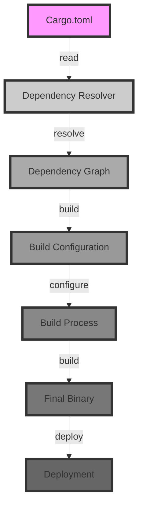

## Introduction
**Cargo.toml** is the configuration file for Rust's package manager, Cargo. It's used to define a Rust project's metadata, dependencies, features, and profiles. Understanding how to effectively use Cargo.toml is crucial for any Rust developer, as it directly impacts the build process, performance, and maintainability of their projects. In this section, we'll explore the importance of Cargo.toml and its real-world relevance.

Cargo.toml is essential because it allows developers to manage their project's dependencies, which is critical in software development. By specifying dependencies in Cargo.toml, developers can easily manage different versions of libraries and ensure that their project is compatible with various environments. This is particularly important in Rust, where the language's focus on memory safety and performance means that even small changes to dependencies can have significant effects on a project's behavior.

> **Note:** Cargo.toml is not just a configuration file; it's also a key part of Rust's ecosystem, enabling features like reproducible builds and easy dependency management.

## Core Concepts
To effectively use Cargo.toml, it's essential to understand several core concepts:

* **Dependencies**: These are external libraries that your project relies on. Dependencies are specified in the `[dependencies]` section of Cargo.toml.
* **Features**: These are optional components of a dependency that can be enabled or disabled. Features are specified in the `[features]` section of Cargo.toml.
* **Profiles**: These define different build configurations for your project, such as debug or release builds. Profiles are specified in the `[profile]` section of Cargo.toml.
* **Target**: This specifies the platform and architecture that your project is being built for. Targets are specified in the `[target]` section of Cargo.toml.

> **Warning:** Failing to properly manage dependencies and features can lead to version conflicts, build errors, and even security vulnerabilities.

## How It Works Internally
When you run `cargo build`, Cargo uses the information in Cargo.toml to manage your project's dependencies and build your project. Here's a step-by-step overview of how it works:

1. Cargo reads the `[dependencies]` section of Cargo.toml to determine which dependencies are required.
2. Cargo checks the `[features]` section to determine which features are enabled for each dependency.
3. Cargo uses the `[profile]` section to determine the build configuration for the current target.
4. Cargo resolves the dependencies and their transitive dependencies, using the specified versions and features.
5. Cargo builds your project, using the resolved dependencies and build configuration.

> **Tip:** You can use `cargo tree` to visualize your project's dependency graph and identify potential issues.

## Code Examples
Here are three complete and runnable examples that demonstrate how to use Cargo.toml:

### Example 1: Basic Dependency Management
```toml
[package]
name = "my_project"
version = "0.1.0"
edition = "2018"

[dependencies]
serde = "1.0.118"
serde_json = "1.0.64"
```
This example specifies two dependencies, `serde` and `serde_json`, with their respective versions.

### Example 2: Feature Management
```toml
[package]
name = "my_project"
version = "0.1.0"
edition = "2018"

[dependencies]
serde = { version = "1.0.118", features = ["derive"] }
serde_json = "1.0.64"

[features]
default = ["serde/derive"]
```
This example enables the `derive` feature for the `serde` dependency and specifies it as the default feature.

### Example 3: Profile Management
```toml
[package]
name = "my_project"
version = "0.1.0"
edition = "2018"

[profile.dev]
opt-level = 0
debug = true

[profile.release]
opt-level = 3
debug = false
```
This example defines two profiles, `dev` and `release`, with different optimization levels and debug settings.

## Visual Diagram

This diagram illustrates the build process, from reading Cargo.toml to deploying the final binary.

> **Interview:** Can you explain how Cargo manages dependencies and features? How does it impact the build process?

## Comparison
| Approach | Time Complexity | Space Complexity | Pros | Cons | Best For |
| --- | --- | --- | --- | --- | --- |
| Manual Dependency Management | O(n) | O(n) | Fine-grained control | Error-prone, time-consuming | Small projects |
| Cargo.toml | O(log n) | O(n) | Easy to use, reproducible builds | Limited control, version conflicts | Large projects, Rust ecosystem |
| Other Package Managers (e.g., npm, pip) | O(n) | O(n) | Mature ecosystems, large communities | Version conflicts, security vulnerabilities | Non-Rust projects |

## Real-world Use Cases
Here are three real-world examples of Cargo.toml in production:

* **Rustlings**: The Rustlings course uses Cargo.toml to manage dependencies and features for its exercises and projects.
* **Tokio**: The Tokio framework uses Cargo.toml to manage its dependencies and features, ensuring reproducible builds and easy maintenance.
* **Diesel**: The Diesel ORM uses Cargo.toml to manage its dependencies and features, providing a flexible and customizable solution for Rust developers.

> **Tip:** Use `cargo publish` to publish your crate to the Rust registry, making it easily discoverable and usable by other developers.

## Common Pitfalls
Here are four common mistakes to avoid when using Cargo.toml:

* **Incorrect Version Specifications**: Using incorrect version specifications can lead to version conflicts and build errors.
```toml
[dependencies]
serde = "1.0.118 " // incorrect version specification
```
* **Missing Features**: Failing to enable required features can lead to build errors or unexpected behavior.
```toml
[dependencies]
serde = "1.0.118" // missing derive feature
```
* **Inconsistent Profiles**: Using inconsistent profiles can lead to build errors or unexpected behavior.
```toml
[profile.dev]
opt-level = 0
debug = true

[profile.release]
opt-level = 0 // inconsistent profile
```
* **Unused Dependencies**: Failing to remove unused dependencies can lead to unnecessary build time and disk space usage.
```toml
[dependencies]
unused_dependency = "1.0.0" // unused dependency
```
> **Warning:** Always review your Cargo.toml file carefully to avoid these common pitfalls.

## Interview Tips
Here are three common interview questions related to Cargo.toml, along with weak and strong answers:

* **Question:** Can you explain how Cargo manages dependencies and features?
	+ Weak answer: Cargo uses a dependency graph to manage dependencies and features.
	+ Strong answer: Cargo uses a dependency resolver to manage dependencies and features, ensuring reproducible builds and easy maintenance.
* **Question:** How do you optimize the build process using Cargo.toml?
	+ Weak answer: I use the `--release` flag to optimize the build process.
	+ Strong answer: I use the `[profile]` section to configure the build process, optimizing for performance and debuggability.
* **Question:** Can you explain the difference between `cargo build` and `cargo test`?
	+ Weak answer: `cargo build` builds the project, while `cargo test` runs the tests.
	+ Strong answer: `cargo build` builds the project, while `cargo test` runs the tests and reports any failures, using the `[test]` section to configure the test environment.

> **Interview:** Can you explain how to use Cargo.toml to manage dependencies and features in a large-scale project?

## Key Takeaways
Here are ten key takeaways to remember when using Cargo.toml:

* **Use `[dependencies]` to specify dependencies**: Use the `[dependencies]` section to specify dependencies and their versions.
* **Use `[features]` to enable features**: Use the `[features]` section to enable features for dependencies.
* **Use `[profile]` to configure builds**: Use the `[profile]` section to configure the build process, optimizing for performance and debuggability.
* **Use `cargo tree` to visualize dependencies**: Use `cargo tree` to visualize the dependency graph and identify potential issues.
* **Use `cargo publish` to publish crates**: Use `cargo publish` to publish crates to the Rust registry, making them easily discoverable and usable by other developers.
* **Avoid incorrect version specifications**: Avoid using incorrect version specifications, which can lead to version conflicts and build errors.
* **Avoid missing features**: Avoid failing to enable required features, which can lead to build errors or unexpected behavior.
* **Avoid inconsistent profiles**: Avoid using inconsistent profiles, which can lead to build errors or unexpected behavior.
* **Remove unused dependencies**: Remove unused dependencies to avoid unnecessary build time and disk space usage.
* **Review Cargo.toml carefully**: Always review your Cargo.toml file carefully to avoid common pitfalls and ensure reproducible builds.