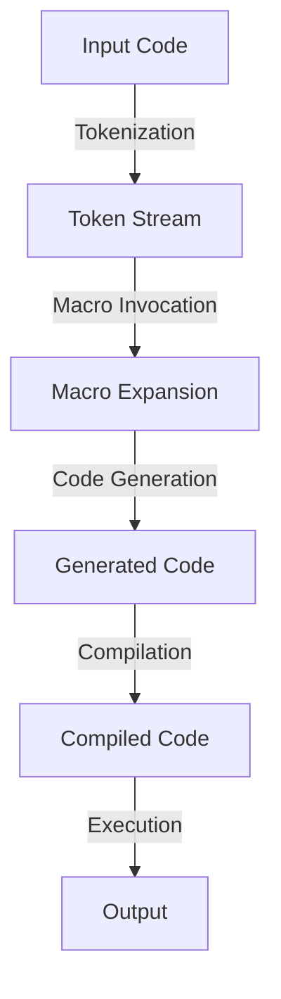

## Introduction
**Macros** are a fundamental concept in the Rust programming language, allowing developers to extend the language itself. They provide a way to generate code at compile-time, making it possible to write more concise and expressive code. In this section, we will explore the world of macros in Rust, focusing on declarative (macro_rules!) and procedural macros.

Rust macros are essential for building libraries and frameworks, as they enable developers to create domain-specific languages (DSLs) and abstract away boilerplate code. They are also useful for optimizing performance-critical code, as they can generate optimized implementations at compile-time.

> **Note:** Macros are not a replacement for regular functions, but rather a way to generate code that can be used in conjunction with regular functions.

## Core Concepts
To understand macros in Rust, we need to cover some key concepts:

* **Declarative macros**: These are defined using the `macro_rules!` syntax and are essentially a way to specify a set of rules for generating code. They are similar to regular expressions, but for code.
* **Procedural macros**: These are defined using a Rust function and are used to generate code at compile-time. They are more powerful than declarative macros, but also more complex.
* **Token stream**: This is the input to a macro, which is a sequence of tokens (e.g., keywords, identifiers, literals).
* **Macro expansion**: This is the process of generating code from a macro invocation.

> **Warning:** Macros can be complex and difficult to debug, so use them judiciously.

## How It Works Internally
Let's dive into the internal mechanics of macros in Rust:

1. **Tokenization**: The input code is tokenized, which means it is broken down into individual tokens (e.g., keywords, identifiers, literals).
2. **Macro invocation**: The macro is invoked, which means the token stream is passed to the macro.
3. **Macro expansion**: The macro generates code based on the token stream and the macro rules.
4. **Code generation**: The generated code is added to the compilation unit.

> **Tip:** To debug macros, use the `cargo expand` command to see the generated code.

## Code Examples
Here are three complete and runnable examples of macros in Rust:

### Example 1: Basic Declarative Macro
```rust
macro_rules! say_hello {
    () => {
        println!("Hello!");
    };
}

fn main() {
    say_hello!();
}
```
This macro simply prints "Hello!" to the console.

### Example 2: Real-world Declarative Macro
```rust
macro_rules! log {
    ($level:expr, $msg:expr) => {
        println!("[{}]: {}", $level, $msg);
    };
}

fn main() {
    log!("INFO", "This is an info message");
    log!("WARNING", "This is a warning message");
    log!("ERROR", "This is an error message");
}
```
This macro generates a logging statement based on the input level and message.

### Example 3: Procedural Macro
```rust
use proc_macro::TokenStream;
use quote::quote;
use syn::{parse_macro_input, DeriveInput};

#[proc_macro_derive(Hello)]
pub fn hello(input: TokenStream) -> TokenStream {
    let input = parse_macro_input!(input as DeriveInput);
    let name = input.ident;

    let expanded = quote! {
        impl #name {
            fn say_hello(&self) {
                println!("Hello, {}!", stringify!(#name));
            }
        }
    };

    TokenStream::from(expanded)
}

#[derive(Hello)]
struct Person;

fn main() {
    let person = Person;
    person.say_hello();
}
```
This procedural macro generates an implementation of the `Hello` trait for the input type.

## Visual Diagram

This diagram illustrates the process of macro expansion and code generation.

## Comparison
| Approach | Time Complexity | Space Complexity | Pros | Cons | Best For |
| --- | --- | --- | --- | --- | --- |
| Declarative Macro | O(1) | O(1) | Simple, easy to use | Limited expressiveness | Small, simple use cases |
| Procedural Macro | O(n) | O(n) | Powerful, flexible | Complex, hard to debug | Large, complex use cases |
| Regular Function | O(n) | O(n) | Easy to use, debug | Less expressive | General-purpose programming |

> **Interview:** Can you explain the difference between declarative and procedural macros in Rust?

## Real-world Use Cases
Here are three production examples of macros in Rust:

1. **Serde**: The Serde library uses macros to generate serialization and deserialization code for Rust data structures.
2. **Diesel**: The Diesel library uses macros to generate database query code for Rust.
3. **Rocket**: The Rocket web framework uses macros to generate boilerplate code for web applications.

> **Tip:** Use macros to abstract away boilerplate code and improve code readability.

## Common Pitfalls
Here are four common mistakes to avoid when using macros in Rust:

1. **Incorrect tokenization**: Make sure to handle tokenization correctly, as incorrect tokenization can lead to syntax errors.
2. **Macro expansion errors**: Make sure to handle macro expansion errors correctly, as these can lead to compiler errors.
3. **Code generation errors**: Make sure to handle code generation errors correctly, as these can lead to runtime errors.
4. **Debugging difficulties**: Make sure to use debugging tools, such as `cargo expand`, to debug macros effectively.

> **Warning:** Macros can be complex and difficult to debug, so use them judiciously.

## Interview Tips
Here are three common interview questions on macros in Rust, along with example answers:

1. **What is the difference between declarative and procedural macros in Rust?**
	* Weak answer: "Declarative macros are simpler, while procedural macros are more powerful."
	* Strong answer: "Declarative macros are defined using the `macro_rules!` syntax and are used for simple, straightforward code generation. Procedural macros, on the other hand, are defined using a Rust function and are used for more complex, flexible code generation."
2. **How do you debug macros in Rust?**
	* Weak answer: "I use `println!` statements to debug macros."
	* Strong answer: "I use a combination of `cargo expand` and `println!` statements to debug macros. `cargo expand` allows me to see the generated code, while `println!` statements allow me to see the output of the macro."
3. **What are some common use cases for macros in Rust?**
	* Weak answer: "Macros are used for everything."
	* Strong answer: "Macros are commonly used for code generation, such as generating boilerplate code for web applications or database queries. They are also used for optimization, such as generating optimized implementations of algorithms."

## Key Takeaways
Here are ten key takeaways on macros in Rust:

* **Macros are a fundamental concept in Rust**: Macros are used to extend the language itself and provide a way to generate code at compile-time.
* **Declarative macros are defined using `macro_rules!`**: Declarative macros are used for simple, straightforward code generation.
* **Procedural macros are defined using a Rust function**: Procedural macros are used for more complex, flexible code generation.
* **Macros can be used for code generation and optimization**: Macros can be used to generate boilerplate code and optimize performance-critical code.
* **Macros can be complex and difficult to debug**: Macros can be challenging to debug, so use them judiciously.
* **`cargo expand` is a useful debugging tool**: `cargo expand` allows you to see the generated code and debug macros effectively.
* **Macros are commonly used in libraries and frameworks**: Macros are used to abstract away boilerplate code and improve code readability.
* **Macros can be used for domain-specific languages (DSLs)**: Macros can be used to create DSLs and abstract away complex logic.
* **Macros have a time complexity of O(1) for declarative macros and O(n) for procedural macros**: The time complexity of macros depends on the type of macro and the input size.
* **Macros have a space complexity of O(1) for declarative macros and O(n) for procedural macros**: The space complexity of macros depends on the type of macro and the input size.